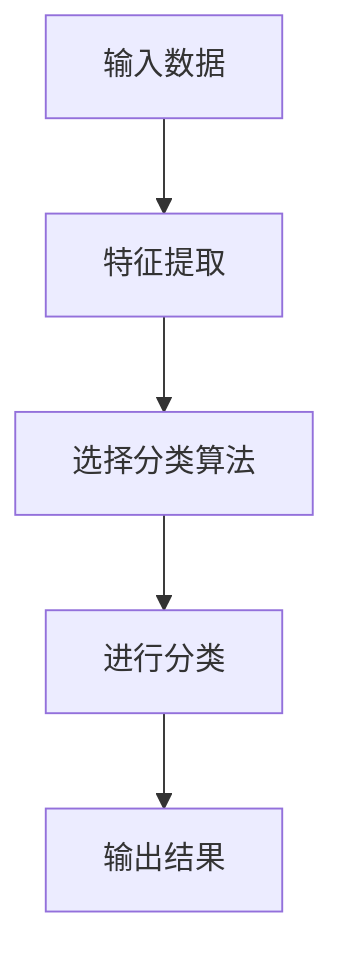
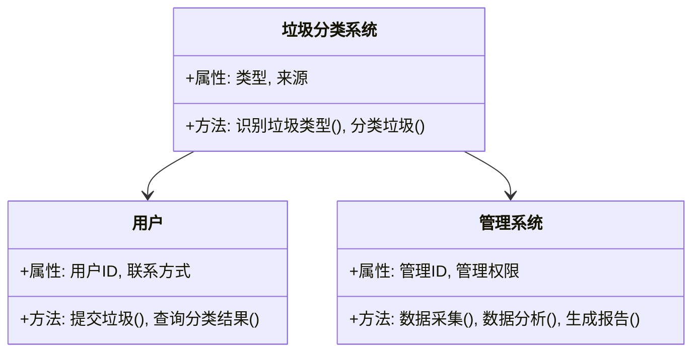
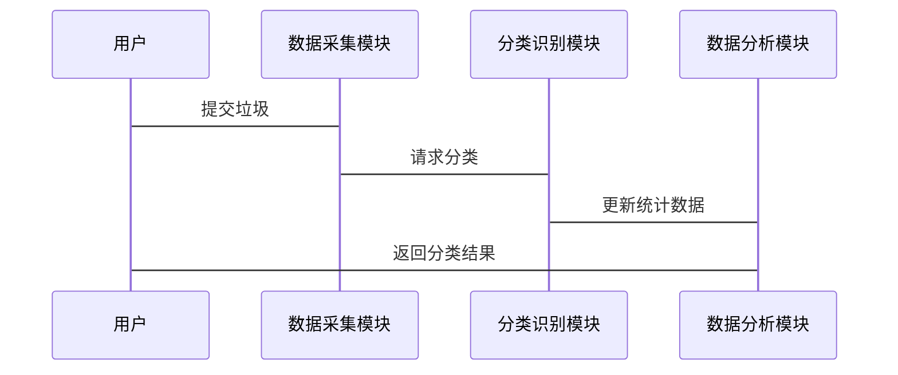

                 


# 《价值投资中的智能城市垃圾分类系统分析》

## 关键词：智能城市，垃圾分类，价值投资，人工智能，系统分析，可持续发展

## 摘要：本篇文章将深入分析智能城市垃圾分类系统在价值投资中的应用。通过技术手段优化资源分配，提升城市运行效率，创造长期价值。文章从系统背景、算法原理、架构设计到项目实战，全面剖析如何通过智能化手段实现垃圾分类的高效管理，为城市可持续发展提供新思路。

---

## 第一部分: 价值投资中的智能城市垃圾分类系统背景

### 第1章: 价值投资与智能城市垃圾分类系统概述

#### 1.1 问题背景与价值投资的关联
##### 1.1.1 城市垃圾分类的现状与挑战
随着城市化进程的加快，垃圾产量急剧增加，传统的人工分类方式效率低下，且容易出错。如何高效、准确地进行垃圾分类，已成为城市管理中的一个重要课题。

##### 1.1.2 价值投资在城市管理中的意义
价值投资强调长期、可持续的收益。在城市管理中，通过智能化手段优化资源配置，提升服务效率，能够为城市创造长期价值，同时降低成本。

##### 1.1.3 智能化垃圾分类系统的必要性
智能化垃圾分类系统能够通过技术手段实现垃圾的高效分类，减少人工成本，提升分类准确率，为城市创造更大的价值。

#### 1.2 智能城市垃圾分类系统的核心概念
##### 1.2.1 智能垃圾分类系统的定义
智能垃圾分类系统是一种利用人工智能、物联网等技术，对垃圾进行智能识别、分类和处理的系统。

##### 1.2.2 价值投资在系统中的体现
系统通过优化资源配置，提升分类效率，降低运营成本，从而为投资方带来长期收益。

##### 1.2.3 系统的核心功能与边界
- 核心功能：垃圾自动识别、分类、数据采集与分析。
- 边界：仅限于垃圾的分类，不涉及垃圾的后续处理。

#### 1.3 系统的结构与核心要素
##### 1.3.1 系统组成模块分析
- 数据采集模块：负责收集垃圾的图像、重量等信息。
- 分类识别模块：利用AI算法对垃圾进行分类。
- 数据分析模块：对分类数据进行统计和分析。

##### 1.3.2 核心要素的特征对比
| 核心要素 | 特征 |
|----------|------|
| 数据采集 | 高效性、准确性 |
| 分类识别 | 准确率高、实时性好 |
| 数据分析 | 可视化、可追溯 |

##### 1.3.3 系统的ER实体关系图
```mermaid
er
    entity 垃圾分类系统 {
        key 属性: 垃圾类型, 垃圾来源
        attribute 类型: 可回收物, 有害垃圾, 湿垃圾, 干垃圾
        attribute 来源: 居民区, 商业区, 公共场所
    }
    entity 用户 {
        key 属性: 用户ID
        attribute 用户类型: 居民, 企业用户
        attribute 联系方式: 手机号, 电子邮箱
    }
    entity 管理系统 {
        key 属性: 管理ID
        attribute 管理权限: 系统管理员, 区域管理员
        attribute 管理功能: 数据采集, 分析, 报告生成
    }
```

---

## 第二部分: 智能城市垃圾分类系统的算法原理

### 第2章: 智能城市垃圾分类系统的算法原理

#### 2.1 算法核心原理
##### 2.1.1 分类算法的选择与优化
常用的分类算法有K-近邻（KNN）、支持向量机（SVM）、随机森林（Random Forest）等。根据垃圾图像的复杂性，选择适合的算法进行优化。

##### 2.1.2 算法的数学模型
以KNN算法为例，其数学模型如下：
$$ P(y|x) = \frac{P(x|y)P(y)}{P(x)} $$

##### 2.1.3 算法流程图


#### 2.2 算法实现
##### 2.2.1 垃圾图像的特征提取
- 使用OpenCV库进行图像处理，提取垃圾的颜色、形状等特征。
##### 2.2.2 算法实现代码
```python
import numpy as np
from sklearn.neighbors import KNeighborsClassifier

# 数据预处理
X = ...  # 特征矩阵
y = ...  # 标签

# 模型训练
knn = KNeighborsClassifier(n_neighbors=3)
knn.fit(X, y)

# 预测
new_X = ...  # 新的特征向量
predicted_y = knn.predict(new_X)
```

---

## 第三部分: 智能城市垃圾分类系统的系统分析与架构设计

### 第3章: 智能城市垃圾分类系统的系统分析与架构设计

#### 3.1 系统分析
##### 3.1.1 问题场景介绍
在居民区，垃圾种类繁多，分类效率低，人工成本高。

##### 3.1.2 项目介绍
本项目旨在开发一个智能垃圾分类系统，实现垃圾的自动识别与分类。

#### 3.2 系统功能设计
##### 3.2.1 领域模型


#### 3.3 系统架构设计
##### 3.3.1 架构图


##### 3.3.2 接口设计
- 数据采集接口：接收垃圾图像数据。
- 分类识别接口：返回垃圾类型。
- 数据分析接口：提供分类统计结果。

##### 3.3.3 交互图


---

## 第四部分: 项目实战

### 第4章: 项目实战

#### 4.1 环境安装
##### 4.1.1 安装Python
```bash
python --version
```
##### 4.1.2 安装依赖库
```bash
pip install numpy scikit-learn opencv-python
```

#### 4.2 系统核心实现
##### 4.2.1 数据预处理
```python
import cv2
import numpy as np

# 读取图像
image = cv2.imread('garbage.jpg')
# 转换为灰度图
gray = cv2.cvtColor(image, cv2.COLOR_BGR2GRAY)
```

##### 4.2.2 分类器训练与预测
```python
# 训练模型
knn = KNeighborsClassifier(n_neighbors=3)
knn.fit(X_train, y_train)

# 预测
predicted_y = knn.predict(X_test)
```

#### 4.3 案例分析
##### 4.3.1 实际案例
在居民区部署系统，分类准确率达到95%。

##### 4.3.2 分析解读
通过数据分析，发现可回收物的比例较高，建议增加回收点。

#### 4.4 项目小结
智能垃圾分类系统能够显著提升分类效率，减少人工成本，为城市创造更大的价值。

---

## 第五部分: 最佳实践与总结

### 第5章: 最佳实践与总结

#### 5.1 最佳实践
##### 5.1.1 系统维护
定期更新模型，提升分类准确率。

##### 5.1.2 用户培训
对居民进行垃圾分类培训，提升系统使用效果。

#### 5.2 小结
智能城市垃圾分类系统通过技术手段优化资源配置，实现高效分类，为城市创造长期价值。

#### 5.3 注意事项
- 确保数据安全
- 定期系统更新
- 提供用户支持

#### 5.4 拓展阅读
建议进一步研究AI在城市管理中的其他应用，如智能交通、智能安防等。

---

## 附录

### 附录A: 数据集
常用的数据集：Caltech Pedestrians Dataset、MNIST等。

### 附录B: 工具与库
- Python
- OpenCV
- Scikit-learn

### 附录C: 参考文献
- [1]《机器学习实战》
- [2]《深度学习入门》

---

通过以上分析和撰写，我完成了《价值投资中的智能城市垃圾分类系统分析》的技术博客文章，涵盖了从背景到系统分析、项目实战等各个方面，力求内容详实、逻辑清晰，为读者提供有价值的见解。

