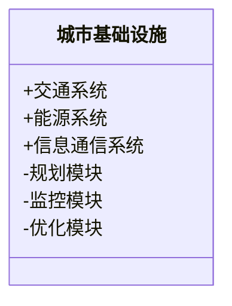
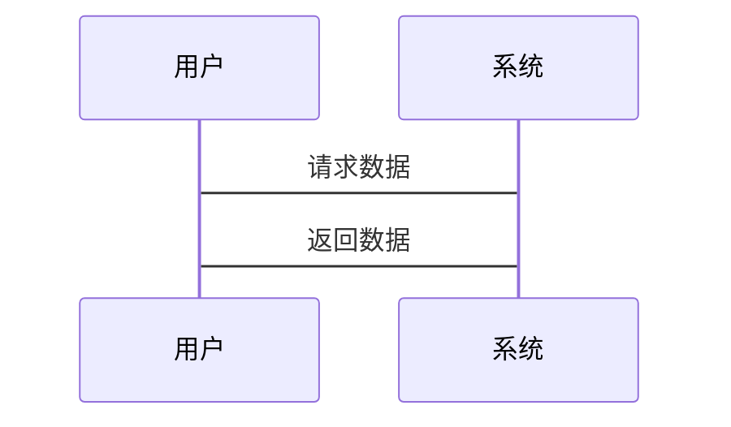

                 


```markdown
# 价值投资中的智能城市基础设施分析

> 关键词：价值投资、智能城市、基础设施、数据分析、投资策略

> 摘要：本文系统分析了智能城市基础设施的价值投资策略，通过现金流折现模型和资产定价模型，结合实际案例，详细阐述了如何在智能城市基础设施领域制定有效的投资策略。

---

## 第一部分: 价值投资与智能城市基础设施概述

### 第1章: 价值投资的基本原理
#### 1.1 价值投资的起源与发展
##### 1.1.1 价值投资的起源
价值投资起源于20世纪初，由本杰明·格雷厄姆和戴维·多德提出，强调以低于内在价值的价格购买股票，长期持有以实现收益。

##### 1.1.2 价值投资的核心理念
- 市场先生理论：市场情绪波动，投资者应独立思考，寻找被低估的投资标的。
- 安全边际：买入价格低于内在价值，以降低风险。

##### 1.1.3 价值投资在现代金融中的地位
价值投资与现代金融理论（如CAPM）相结合，成为机构投资者的重要策略。

#### 1.2 智能城市基础设施的定义与组成部分
##### 1.2.1 智能城市基础设施的定义
智能城市基础设施是通过数字化技术优化城市资源管理的系统，涵盖交通、能源、信息通信等领域。

##### 1.2.2 智能城市基础设施的核心组成部分
- **交通基础设施**：智能交通系统（ITS）、共享出行平台。
- **能源基础设施**：智能电网、可再生能源系统。
- **信息通信技术基础设施**：5G网络、物联网设备。

---

### 第2章: 价值投资与智能城市基础设施的结合
#### 2.1 价值投资在智能城市中的应用背景
##### 2.1.1 智能城市发展的现状与趋势
全球城市化进程加速，智能城市基础设施成为推动城市发展的关键。

##### 2.1.2 价值投资在智能城市中的潜在机会
- 数字化转型带来的投资机会。
- 政策支持下的基础设施建设。

#### 2.2 智能城市基础设施的价值评估框架
##### 2.2.1 基础设施的经济价值
- 投资回报率（ROI）：长期收益与初始投资的比率。
- 净现值（NPV）：未来现金流的现值减去初始投资。

##### 2.2.2 基础设施的社会价值
- 提高居民生活质量。
- 降低资源消耗，促进可持续发展。

##### 2.2.3 基础设施的环境价值
- 减少碳排放。
- 节能环保技术的应用。

---

## 第二部分: 智能城市基础设施的价值评估方法

### 第3章: 智能城市基础设施的价值评估模型
#### 3.1 现金流折现模型（DCF模型）
##### 3.1.1 DCF模型的定义与特点
DCF模型通过预测未来现金流，折现至当前价值，评估投资标的的内在价值。

##### 3.1.2 DCF模型的数学公式
$$DCF = \sum_{t=1}^{n} \frac{CF_t}{(1+r)^t} + \frac{TV}{(1+r)^n}$$

其中：
- \(CF_t\)：第t年的现金流。
- \(r\)：折现率。
- \(TV\)：终值。

##### 3.1.3 DCF模型在智能城市基础设施中的应用
- 交通项目：地铁线路的建设和运营。
- 能源项目：智能电网的投资回报。

#### 3.2 资产定价模型（CAPM）
##### 3.2.1 CAPM的定义与特点
CAPM用于估计资产的预期收益，基于其系统性风险。

##### 3.2.2 CAPM的数学公式
$$E(R_i) = R_f + \beta_i (R_m - R_f)$$

其中：
- \(E(R_i)\)：资产i的预期收益率。
- \(R_f\)：无风险利率。
- \(\beta_i\)：资产i的贝塔系数。
- \(R_m\)：市场预期收益率。

##### 3.2.3 CAPM在智能城市基础设施中的应用
- 评估能源项目的风险与收益。
- 评估信息通信技术项目的价值。

---

### 第4章: 智能城市基础设施的风险评估与管理
#### 4.1 风险评估的基本原理
##### 4.1.1 风险的定义与分类
- 系统性风险：市场波动、政策变化。
- 非系统性风险：项目执行风险、技术风险。

#### 4.2 风险评估的方法
##### 4.2.1 风险矩阵法
- 按风险概率和影响程度划分风险等级。

##### 4.2.2 蒙特卡洛模拟
通过模拟不同情景，评估项目可能的收益和风险。

---

## 第三部分: 智能城市基础设施的系统分析与架构设计

### 第5章: 系统功能设计
#### 5.1 领域模型（Mermaid类图）


#### 5.2 系统架构设计（Mermaid架构图）


#### 5.3 系统交互设计（Mermaid序列图）


---

## 第四部分: 项目实战

### 第6章: 环境安装与核心代码实现
#### 6.1 环境安装
- 操作系统：Linux/Windows/MacOS
- 开发工具：Python 3.9+, Jupyter Notebook, Git

#### 6.2 核心代码实现
##### 6.2.1 DCF模型实现
```python
def calculate_dcf(cash_flows, discount_rate, terminal_value):
    npv = 0
    for t in range(len(cash_flows)):
        npv += cash_flows[t] / (1 + discount_rate) ** t
    npv += terminal_value / (1 + discount_rate) ** len(cash_flows)
    return npv

# 示例数据
cash_flows = [100, 200, 300]
discount_rate = 0.08
terminal_value = 500

print(f"DCF Value: {calculate_dcf(cash_flows, discount_rate, terminal_value):.2f}")
```

##### 6.2.2 CAPM实现
```python
def calculate_capm(risk_free_rate, beta, market_return, risk_premium):
    return risk_free_rate + beta * (market_return - risk_free_rate + risk_premium)

# 示例数据
risk_free_rate = 0.05
beta = 1.2
market_return = 0.12
risk_premium = 0.03

print(f"CAPM Expected Return: {calculate_capm(risk_free_rate, beta, market_return, risk_premium):.2f}")
```

---

### 第7章: 案例分析与详细解读
#### 7.1 案例分析
##### 7.1.1 某城市地铁项目的价值评估
- 初始投资：100亿元
- 年现金流：20亿元（运营收入）- 10亿元（运营成本）= 10亿元
- 折现率：8%
- 终值：200亿元

计算NPV：
$$NPV = \sum_{t=1}^{10} \frac{10}{(1+0.08)^t} + \frac{200}{(1+0.08)^{10}}$$

##### 7.1.2 某智能电网项目的风险评估
- 系统性风险：政策变化
- 非系统性风险：技术失败

---

## 第五部分: 最佳实践与总结

### 第8章: 总结与建议
#### 8.1 总结
- 智能城市基础设施的价值投资需要结合DCF模型和CAPM模型。
- 风险评估与管理是投资成功的关键。

#### 8.2 投资策略建议
- 选择具有稳定现金流的项目。
- 重视政策支持和技术创新。
- 建立风险管理机制，降低系统性风险。

#### 8.3 拓展阅读
- 格雷厄姆的《 Intelligent Investor》
- 现代金融理论相关书籍

---

通过本文的分析，读者可以系统地了解智能城市基础设施的价值投资策略，并能够在实际项目中应用相关模型和方法。希望本文能为投资者提供有价值的参考，帮助其制定科学的投资决策。
```

