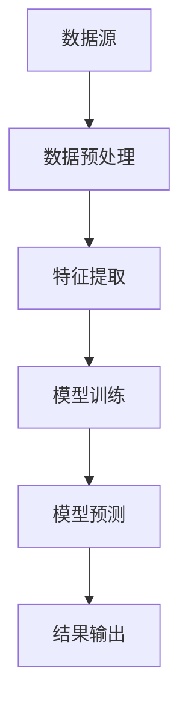
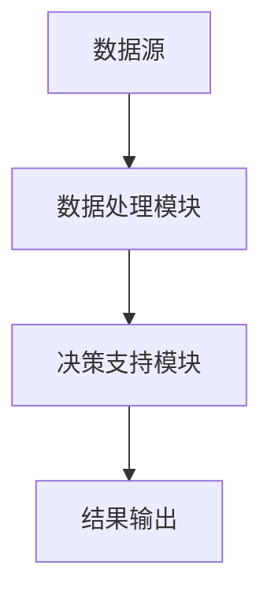

                 


# 价值投资中的智能城市应急响应系统分析

## 关键词：
价值投资、智能城市、应急响应系统、数据分析、系统架构

## 摘要：
本文从价值投资的视角，分析智能城市应急响应系统的构建与优化。通过系统架构设计、数据驱动的算法模型、价值评估模型等技术手段，结合实际案例，探讨如何通过智能化技术提升应急响应系统的效率和价值。文章内容涵盖系统背景、核心算法、架构设计、项目实战等，为价值投资者和技术开发者提供深度分析与实践指导。

---

# 第一部分: 价值投资与智能城市应急响应系统概述

## 第1章: 价值投资的基本概念与应用

### 1.1 价值投资的定义与核心理念

#### 1.1.1 价值投资的起源与发展
价值投资是一种以基本面分析为基础的投资策略，起源于20世纪初，由本杰明·格雷厄姆和戴维·多德提出。其核心理念是通过分析企业的财务状况、行业地位和市场环境，找到被市场低估的投资标的。

#### 1.1.2 价值投资的核心原则
价值投资强调安全边际、长期投资和逆向思维。投资者应寻找具有持续竞争优势、良好财务状况和合理估值的企业。

#### 1.1.3 价值投资在现代金融中的地位
尽管现代金融学发展迅速，价值投资仍被视为一种稳健的投资策略，尤其在复杂市场环境下表现突出。

### 1.2 价值投资在智能城市中的应用

#### 1.2.1 智慧城市的定义与目标
智慧城市是通过信息技术和数据驱动优化城市资源分配和管理效率的新型城市发展模式。其目标包括提高居民生活质量、优化资源配置和降低运营成本。

#### 1.2.2 智慧城市中的价值投资机会
在智慧城市建设中，应急响应系统是关键基础设施。通过价值投资视角，可以分析应急响应系统的经济效益和社会效益，寻找投资机会。

---

## 第2章: 智能城市应急响应系统的基本概念

### 2.1 智能城市应急响应系统的定义

#### 2.1.1 应急响应系统的传统模式
传统应急响应系统依赖人工处理，效率低且响应时间长。

#### 2.1.2 智能化应急响应的特征
智能化应急响应系统利用大数据、人工智能和物联网技术，实现快速响应和精准决策。

#### 2.1.3 智能城市应急响应系统的组成
包括数据采集、分析、决策和执行模块。

### 2.2 智能城市应急响应系统的功能模块

#### 2.2.1 数据采集与处理模块
通过传感器和物联网设备收集实时数据，如温度、湿度、人员密度等。

#### 2.2.2 应急决策支持模块
利用数据分析和机器学习模型，提供决策支持。

#### 2.2.3 系统监控与反馈模块
实时监控系统运行状态，提供反馈和优化建议。

---

## 第3章: 价值投资与智能城市应急响应系统的结合背景

### 3.1 智慧城市建设的现状与趋势

#### 3.1.1 智慧城市的定义与目标
通过技术手段优化城市运行效率，提高居民生活质量。

#### 3.1.2 应急响应系统在智慧城市建设中的重要性
应急响应系统是智慧城市的核心基础设施，直接影响城市的抗风险能力和运行效率。

#### 3.1.3 价值投资在智慧城市建设中的作用
通过价值投资分析，优化应急响应系统的建设和运营，提升其经济效益和社会效益。

### 3.2 价值投资视角下的应急响应系统分析

#### 3.2.1 应急响应系统的经济效益分析
通过优化资源配置和提高效率，降低运营成本，提升投资回报。

#### 3.2.2 应急响应系统的社会效益分析
提高城市应对突发事件的能力，保障居民生命财产安全。

#### 3.2.3 价值投资在应急响应系统优化中的应用
通过价值投资分析，选择最优技术方案和运营模式，提升系统整体价值。

---

# 第二部分: 智能城市应急响应系统的核心分析框架

## 第4章: 智能城市应急响应系统的价值评估模型

### 4.1 价值评估模型的构建逻辑

#### 4.1.1 价值评估的基本原理
通过分析系统的功能、效率和成本，评估其整体价值。

#### 4.1.2 应急响应系统的评估维度
包括功能性、效率、成本和可扩展性。

#### 4.1.3 价值评估模型的数学表达式
$$ V = \sum_{i=1}^{n} w_i \cdot f_i $$
其中，$V$ 表示系统总价值，$w_i$ 表示第 $i$ 个评估维度的权重，$f_i$ 表示第 $i$ 个评估维度的评分。

### 4.2 价值评估模型的数学公式

#### 4.2.1 系统价值的计算公式
$$ V = \sum_{i=1}^{n} w_i \cdot f_i $$
$$ \text{约束条件：} \quad f_i \leq 1, i=1,2,\dots,n $$

#### 4.2.2 优化模型的构建
$$ \max V = \sum_{i=1}^{n} w_i \cdot f_i $$
$$ \text{约束条件：} \quad f_i \leq 1, i=1,2,\dots,n $$

---

## 第5章: 智能城市应急响应系统的算法与数据驱动

### 5.1 数据驱动的算法模型

#### 5.1.1 数据预处理
使用Python的pandas库进行数据清洗和特征提取。

#### 5.1.2 算法实现
使用机器学习算法（如随机森林、支持向量机）进行预测。

#### 5.1.3 算法流程图


---

## 第6章: 智能城市应急响应系统的系统架构设计

### 6.1 系统功能设计

#### 6.1.1 领域模型


### 6.2 系统架构设计

#### 6.2.1 系统架构图


---

## 第7章: 项目实战与价值投资分析

### 7.1 项目实战

#### 7.1.1 环境安装
安装Python、pandas、scikit-learn等库。

#### 7.1.2 核心代码实现
```python
import pandas as pd
from sklearn.ensemble import RandomForestRegressor

# 数据加载
data = pd.read_csv('data.csv')

# 特征工程
features = data.drop('target', axis=1)
target = data['target']

# 模型训练
model = RandomForestRegressor()
model.fit(features, target)

# 预测
predictions = model.predict(features)
```

### 7.2 价值投资分析

#### 7.2.1 投资回报分析
通过模型预测结果，评估系统的投资回报率。

#### 7.2.2 风险评估
分析系统的潜在风险，并制定应对策略。

---

## 第8章: 最佳实践与小结

### 8.1 最佳实践

#### 8.1.1 系统设计注意事项
注重系统的可扩展性和可维护性。

#### 8.1.2 价值投资的注意事项
结合市场环境和政策因素，进行综合分析。

### 8.2 小结

本文从价值投资的角度，分析了智能城市应急响应系统的构建与优化。通过系统架构设计、数据驱动的算法模型和价值评估模型，为投资者和技术开发者提供了深度分析与实践指导。未来的研究可以进一步探索更复杂的投资模型和优化算法。

---

通过以上分析，我们全面探讨了价值投资在智能城市应急响应系统中的应用，为智慧城市建设提供了重要的理论和实践依据。

