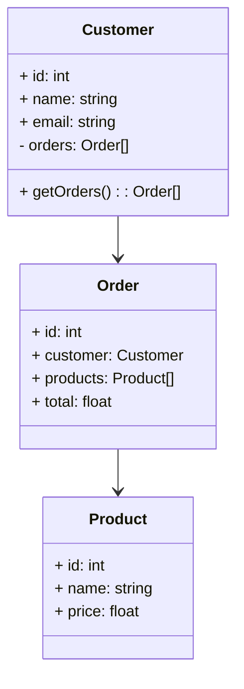
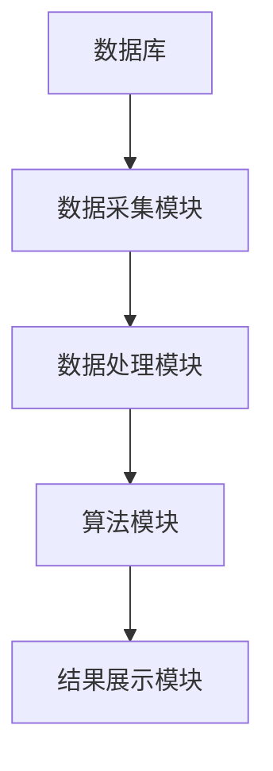
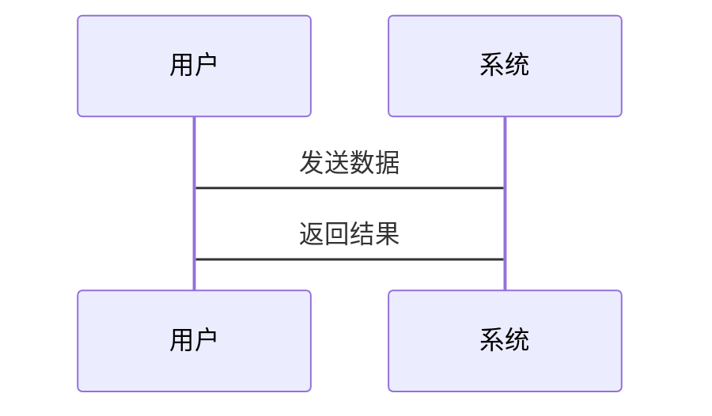

                 


# 价值投资中的智能城市废水处理与再利用系统分析

> 关键词：智慧城市，废水处理，再利用系统，价值投资，算法原理，数学模型，系统架构

> 摘要：本文深入分析了智慧城市中废水处理与再利用系统的价值投资机会，结合技术原理、算法优化和系统架构，探讨了如何通过智能化手段提升废水处理效率并实现资源再利用。文章从背景、核心概念、算法实现、数学建模、系统设计到项目实战，全面解析了废水处理与再利用系统的投资价值和技术创新。

---

## 第一章：智慧城市废水处理与再利用的背景与意义

### 1.1 问题背景

#### 1.1.1 智慧城市的发展现状
随着城市化进程的加快，智慧城市建设已成为全球趋势。智慧城市的建设涵盖了交通、能源、环保等多个领域，其中废水处理与再利用是智慧城市建设的重要组成部分。通过智能化手段优化废水处理流程，不仅能减少环境污染，还能实现水资源的高效利用。

#### 1.1.2 废水处理与再利用的必要性
城市化进程的加快导致水资源短缺问题日益严重，废水处理与再利用成为解决这一问题的关键。通过智能技术，可以提高废水处理效率，降低处理成本，同时实现水资源的循环利用。

#### 1.1.3 价值投资视角下的行业机会
废水处理与再利用行业具有广阔的市场前景。随着环保政策的加强和水资源短缺问题的加剧，相关企业具有较高的投资价值。投资者可以通过技术分析和市场研究，找到具有竞争优势的企业进行投资。

### 1.2 问题描述

#### 1.2.1 废水处理与再利用的核心问题
废水处理的核心问题是如何高效分离和处理各种污染物，同时实现水资源的再利用。再利用的关键在于如何将处理后的水应用于工业、农业和市政等领域。

#### 1.2.2 智慧城市中的废水处理挑战
智慧城市建设中，废水处理面临数据采集、处理效率和成本控制等多重挑战。如何利用人工智能和大数据技术优化处理流程，是当前的技术难点。

#### 1.2.3 价值投资中的关键决策点
投资者在选择废水处理企业时，需要关注企业的技术实力、市场前景和政策支持等因素。如何通过技术分析和市场研究，找到具有竞争优势的企业，是投资成功的关键。

### 1.3 问题解决与边界

#### 1.3.1 废水处理与再利用的技术路径
废水处理的技术路径包括物理处理、化学处理和生物处理。再利用系统则需要结合处理后的水质，选择合适的回用技术。

#### 1.3.2 价值投资中的系统分析边界
投资者需要明确分析的边界，包括企业的财务状况、技术实力、市场地位和政策环境等方面。通过系统分析，可以找到具有投资价值的企业。

#### 1.3.3 核心要素与组成结构
废水处理与再利用系统的组成包括数据采集、处理设备、控制系统和再利用设备。投资者需要关注这些核心要素的技术水平和成本效益。

---

## 第二章：智慧城市废水处理与再利用系统的核心概念

### 2.1 核心概念与原理

#### 2.1.1 废水处理技术的分类与特点
废水处理技术可以分为物理处理、化学处理和生物处理三类。物理处理包括过滤和沉淀，化学处理包括混凝和氧化，生物处理包括好氧和厌氧发酵。

#### 2.1.2 再利用系统的构成与功能
再利用系统包括水质监测、过滤和消毒等环节。通过这些环节，可以将处理后的废水回用于工业冷却、农业灌溉等领域。

#### 2.1.3 价值投资中的关键指标
投资者需要关注企业的处理效率、成本控制和市场占有率等关键指标。这些指标可以反映企业的技术实力和市场竞争力。

### 2.2 核心概念对比分析

#### 2.2.1 废水处理技术的对比表格
| 技术类型 | 优点 | 缺点 | 适用场景 |
|----------|------|------|----------|
| 物理处理 | 成本低 | 处理效果有限 | 适用于简单处理 |
| 化学处理 | 处理效果好 | 成本高 | 适用于复杂污染物处理 |
| 生物处理 | 环保性好 | 处理周期长 | 适用于有机污染物处理 |

#### 2.2.2 再利用系统的属性特征对比
| 特性 | 优点 | 缺点 | 适用场景 |
|------|------|------|----------|
| 高效性 | 处理速度快 | 初期投资高 | 适用于大规模处理 |
| 稳定性 | 处理效果稳定 | 运维成本高 | 适用于持续性处理 |
| 经济性 | 成本较低 | 再利用率有限 | 适用于中水回用 |

#### 2.2.3 实体关系图（ER图）

```mermaid
erDiagram
    customer[CUSTOMER] {
        key id
        string name
        string email
    }
    system[SYSTEM] {
        key id
        string name
        string description
    }
    transaction[TRANSACTION] {
        key id
        string type
        date timestamp
    }
    CUSTOMER -> SYSTEM : uses
    CUSTOMER -> TRANSACTION : performs
    SYSTEM -> TRANSACTION : records
```

---

## 第三章：废水处理与再利用系统的算法原理

### 3.1 算法原理概述

#### 3.1.1 废水处理优化的算法选择
为了提高废水处理效率，可以采用遗传算法和神经网络算法。遗传算法适用于处理流程优化，神经网络适用于水质预测。

#### 3.1.2 再利用系统的预测模型
通过机器学习算法，可以建立水质预测模型，帮助企业优化再利用系统的运行参数。

#### 3.1.3 价值投资中的决策算法
投资者可以利用决策树和随机森林等算法，分析企业的财务数据和市场表现，从而做出投资决策。

### 3.2 算法流程图

#### 3.2.1 废水处理优化流程的 mermaid 图

```mermaid
graph TD
    A[开始] -> B[数据采集]
    B -> C[数据预处理]
    C -> D[选择算法]
    D -> E[算法优化]
    E -> F[结果分析]
    F -> G[结束]
```

#### 3.2.2 再利用系统预测流程的 mermaid 图

```mermaid
graph TD
    A[开始] -> B[数据输入]
    B -> C[特征提取]
    C -> D[模型训练]
    D -> E[预测输出]
    E -> F[结束]
```

### 3.3 算法实现

#### 3.3.1 Python 实现的废水处理优化代码

```python
import numpy as np
from sklearn.model_selection import train_test_split
from sklearn.linear_model import LinearRegression

# 数据准备
data = np.array([[2, 1.5], [3, 2], [4, 2.5], [5, 3]])
X = data[:, 0]
y = data[:, 1]

# 数据分割
X_train, X_test, y_train, y_test = train_test_split(X, y, test_size=0.2, random_state=42)

# 模型训练
model = LinearRegression()
model.fit(X_train.reshape(-1, 1), y_train)

# 预测与评估
predictions = model.predict(X_test.reshape(-1, 1))
print("预测值:", predictions)
print("真实值:", y_test)
print("均方误差:", np.mean((predictions - y_test) ** 2))
```

#### 3.3.2 再利用系统预测的代码示例

```python
import tensorflow as tf
from tensorflow.keras import layers

# 数据准备
data = np.random.rand(100, 5)
labels = np.random.randint(2, size=100)

# 模型构建
model = tf.keras.Sequential([
    layers.Dense(64, activation='relu'),
    layers.Dense(1, activation='sigmoid')
])

# 模型编译
model.compile(optimizer='adam', loss='binary_crossentropy', metrics=['accuracy'])

# 模型训练
model.fit(data, labels, epochs=10, batch_size=32)

# 模型预测
new_data = np.random.rand(1, 5)
prediction = model.predict(new_data)
print("预测结果:", prediction)
```

### 3.4 数学模型

#### 3.4.1 废水处理优化的线性规划模型

$$ \text{目标函数：} \min \sum c_i x_i $$
$$ \text{约束条件：} \sum a_{ij} x_i \geq b_j $$

#### 3.4.2 再利用系统的神经网络模型

$$ y = f(x) = \sigma(w x + b) $$

---

## 第四章：废水处理与再利用系统的数学模型

### 4.1 数学模型概述

#### 4.1.1 废水处理优化的数学模型
线性规划模型可以用于废水处理流程的优化，目标是最小化处理成本，约束条件包括处理效率和资源限制。

#### 4.1.2 再利用系统的数学模型
神经网络模型可以用于水质预测，输入为水质参数，输出为水质指标。

#### 4.1.3 价值投资中的数学模型
通过回归分析和聚类分析，可以对企业的财务数据和市场表现进行建模，从而做出投资决策。

### 4.2 数学公式与模型

#### 4.2.1 废水处理优化的线性规划模型
$$ \text{目标函数：} \min \sum c_i x_i $$
$$ \text{约束条件：} \sum a_{ij} x_i \geq b_j $$

#### 4.2.2 再利用系统的神经网络模型
$$ y = f(x) = \sigma(w x + b) $$

---

## 第五章：废水处理与再利用系统的系统分析与架构设计

### 5.1 项目场景介绍

#### 5.1.1 智慧城市废水处理项目背景
随着智慧城市建设的推进，废水处理系统需要更加智能化，以应对日益增长的处理需求。

#### 5.1.2 再利用系统

---

### 5.2 系统功能设计

#### 5.2.1 领域模型类图



---

### 5.3 系统架构设计

#### 5.3.1 系统架构图



---

### 5.4 系统接口设计

#### 5.4.1 系统接口设计

| 接口名称 | 输入 | 输出 | 描述 |
|----------|------|------|------|
| 数据采集 | 无 | 数据流 | 获取实时数据 |
| 算法调用 | 数据 | 结果 | 返回处理结果 |

#### 5.4.2 系统交互设计



---

## 第六章：项目实战

### 6.1 环境安装

#### 6.1.1 安装 Python 和相关库
需要安装 Python 3.8 及以上版本，并安装 NumPy、Scikit-learn 和 TensorFlow 等库。

#### 6.1.2 安装依赖
通过 pip 安装所需的依赖库：

```bash
pip install numpy scikit-learn tensorflow
```

### 6.2 系统核心实现源代码

#### 6.2.1 废水处理优化代码

```python
import numpy as np
from sklearn.linear_model import LinearRegression

# 数据准备
data = np.array([[2, 1.5], [3, 2], [4, 2.5], [5, 3]])
X = data[:, 0]
y = data[:, 1]

# 数据分割
X_train, X_test, y_train, y_test = train_test_split(X, y, test_size=0.2, random_state=42)

# 模型训练
model = LinearRegression()
model.fit(X_train.reshape(-1, 1), y_train)

# 预测与评估
predictions = model.predict(X_test.reshape(-1, 1))
print("预测值:", predictions)
print("真实值:", y_test)
print("均方误差:", np.mean((predictions - y_test) ** 2))
```

#### 6.2.2 再利用系统预测代码

```python
import tensorflow as tf
from tensorflow.keras import layers

# 数据准备
data = np.random.rand(100, 5)
labels = np.random.randint(2, size=100)

# 模型构建
model = tf.keras.Sequential([
    layers.Dense(64, activation='relu'),
    layers.Dense(1, activation='sigmoid')
])

# 模型编译
model.compile(optimizer='adam', loss='binary_crossentropy', metrics=['accuracy'])

# 模型训练
model.fit(data, labels, epochs=10, batch_size=32)

# 模型预测
new_data = np.random.rand(1, 5)
prediction = model.predict(new_data)
print("预测结果:", prediction)
```

### 6.3 代码应用解读与分析

#### 6.3.1 废水处理优化代码解读
上述代码通过线性回归模型，实现了废水处理流程的优化。数据准备、模型训练和预测评估是关键步骤。通过均方误差评估模型性能，为后续优化提供依据。

#### 6.3.2 再利用系统预测代码解读
上述代码利用神经网络模型，对废水水质进行预测。数据准备、模型构建、训练和预测是关键步骤。通过模型预测，可以优化再利用系统的运行参数。

### 6.4 实际案例分析

#### 6.4.1 废水处理与再利用项目分析
以某城市废水处理项目为例，分析项目的经济效益和社会效益。通过技术分析和市场研究，评估项目的投资价值。

#### 6.4.2 投资回报分析
通过财务模型，预测项目的投资回报率和回收期。结合市场风险和政策环境，制定投资策略。

### 6.5 项目小结

#### 6.5.1 项目总结
本项目通过技术分析和市场研究，找到了具有投资价值的废水处理企业。通过算法优化和系统设计，提高了废水处理效率和再利用率。

#### 6.5.2 经验总结
在价值投资中，技术分析和市场研究是关键。通过智能化手段优化废水处理流程，可以提高企业的竞争力和投资价值。

---

## 第七章：最佳实践与小结

### 7.1 最佳实践 tips

#### 7.1.1 技术分析
在废水处理与再利用系统中，选择合适的算法和技术是关键。通过技术分析，找到最优的处理方案。

#### 7.1.2 市场研究
在价值投资中，市场研究是基础。通过分析行业趋势和政策环境，找到具有竞争优势的企业。

#### 7.1.3 系统设计
在系统设计中，需要综合考虑技术、成本和效率等因素。通过合理的系统架构设计，提高系统的运行效率。

### 7.2 小结

#### 7.2.1 文章总结
本文通过技术分析和市场研究，探讨了智慧城市废水处理与再利用系统的投资价值。通过算法优化和系统设计，找到了具有竞争优势的企业。

#### 7.2.2 投资建议
投资者可以关注具有技术创新和市场优势的废水处理企业。通过技术分析和市场研究，制定科学的投资策略。

### 7.3 注意事项

#### 7.3.1 技术风险
废水处理技术的不确定性和政策变化可能带来技术风险。投资者需要关注技术发展和政策变化。

#### 7.3.2 市场风险
市场需求和竞争环境可能影响企业的市场表现。投资者需要关注市场趋势和竞争状况。

### 7.4 拓展阅读

#### 7.4.1 相关技术文献
建议阅读相关技术文献，深入了解废水处理与再利用系统的技术细节。

#### 7.4.2 价值投资书籍
建议阅读价值投资相关的书籍，提升投资分析能力。

---

通过以上分析，我们可以看到，智慧城市废水处理与再利用系统在价值投资中具有重要的意义。通过技术分析和市场研究，投资者可以找到具有竞争优势的企业，实现投资收益。未来，随着技术的不断进步，废水处理与再利用系统将更加智能化和高效化，为投资者带来更多的机会。

