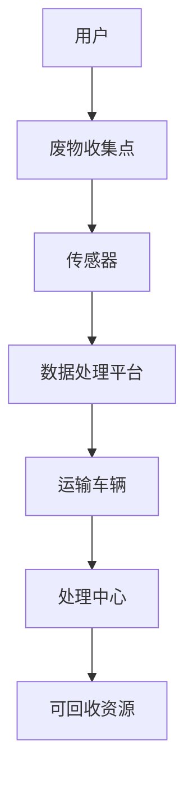
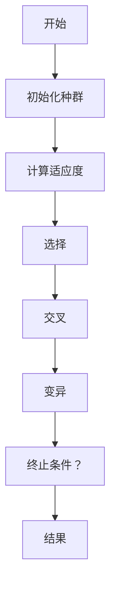
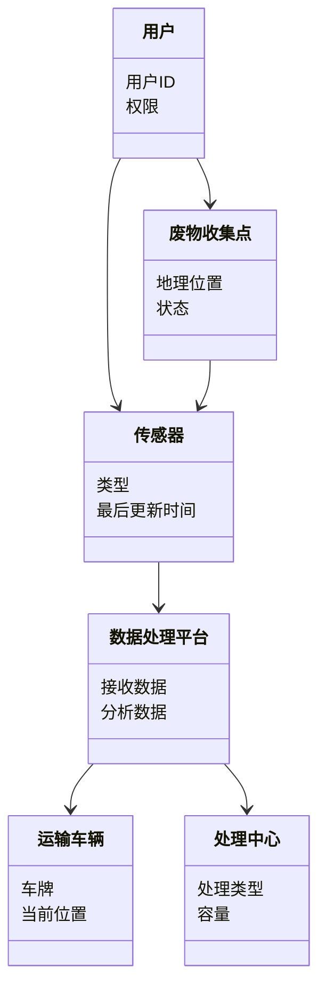
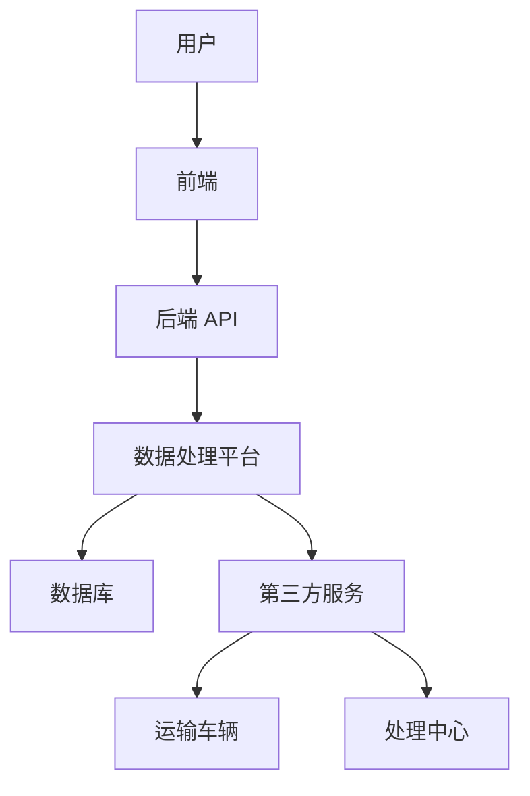
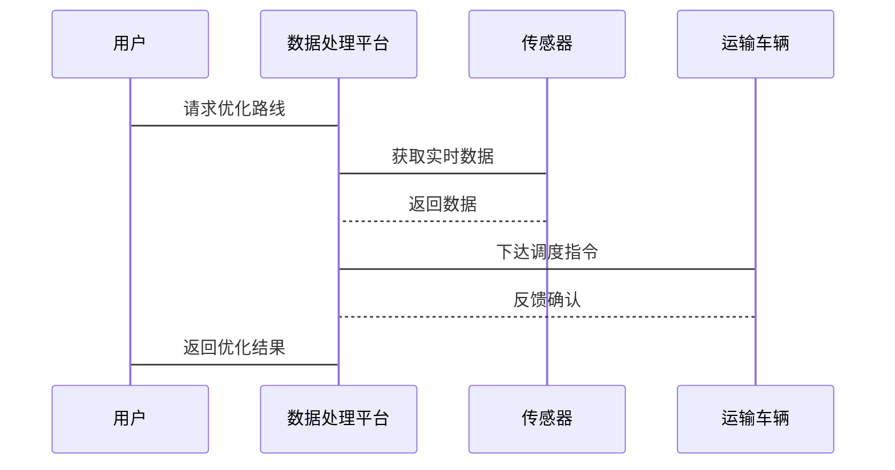

                 


# 价值投资中的智能城市废物管理系统分析

> **关键词**：智能城市，废物管理，价值投资，算法优化，系统架构

> **摘要**：本文深入分析智能城市废物管理系统的构建与优化，探讨其在价值投资中的潜力。通过介绍系统结构、算法优化、架构设计等，展示如何利用技术手段提升废物管理效率，创造经济价值。

---

## 第一部分：背景与价值

### 第1章：智能城市废物管理系统的背景与价值

#### 1.1 智能城市废物管理系统的概述

##### 1.1.1 智能城市废物管理系统的定义
智能城市废物管理系统是通过物联网、大数据和人工智能技术，实现对城市废物收集、运输和处理的智能化管理。系统利用传感器、RFID技术和智能算法优化资源分配，提高效率，降低成本。

##### 1.1.2 系统的核心目标与价值
- **目标**：实现废物管理的高效、环保和经济化。
- **价值**：通过智能化手段降低运营成本，提高资源利用率，创造可持续价值。

##### 1.1.3 与传统废物管理的区别
- **数据驱动**：利用实时数据优化决策。
- **自动化**：减少人工干预，提高效率。
- **预测性维护**：通过数据分析预测设备故障，提前维护。

#### 1.2 价值投资在废物管理中的重要性

##### 1.2.1 价值投资的定义与特点
价值投资是通过分析资产的内在价值，寻找价格低于内在价值的投资机会。在废物管理中，价值投资关注通过技术创新和优化管理实现的成本降低和收益增加。

##### 1.2.2 废物管理中的价值点分析
- **成本节约**：通过优化路线和资源分配降低运营成本。
- **资源回收**：提高可回收物的利用率，创造额外收益。
- **环保效益**：减少环境污染，提升企业形象。

#### 1.3 智能城市废物管理系统的现状与挑战

##### 1.3.1 当前废物管理的主要问题
- **效率低下**：传统管理方式依赖人工，效率低，成本高。
- **资源浪费**：缺乏智能优化，导致资源浪费。
- **环境污染**：处理不当造成环境污染。

##### 1.3.2 智能化带来的解决方案
- **实时监控**：通过传感器实时监控废物收集情况，及时处理问题。
- **智能调度**：利用算法优化收集路线，减少车辆空驶，降低油耗。
- **数据分析**：通过大数据分析预测需求，优化资源分配。

##### 1.3.3 技术与管理上的挑战
- **技术挑战**：需要集成多种技术，如物联网、AI、大数据。
- **管理挑战**：需要跨部门协作，建立高效的管理机制。

---

## 第二部分：核心概念与联系

### 第2章：智能城市废物管理系统的结构与技术框架

#### 2.1 核心概念与属性对比

##### 2.1.1 系统各组成部分的定义
- **废物收集点**：安装传感器的垃圾桶或收集站。
- **运输车辆**：智能调度的垃圾运输车。
- **处理中心**：废物分类、处理和回收的场所。
- **数据分析平台**：处理和分析数据的中心系统。

##### 2.1.2 属性对比分析表

| 属性       | 特性1          | 特性2          |
|------------|---------------|---------------|
| 数据采集    | 实时采集       | 高频采集       |
| 数据处理    | 分析预测       | 实时反馈       |
| 系统响应    | 快速响应       | 自动调整       |
| 成本效益    | 降低运营成本   | 提高资源利用率   |

#### 2.2 实体关系图



---

## 第三部分：算法原理

### 第3章：基于遗传算法的优化模型

#### 3.1 算法原理

##### 3.1.1 算法流程图



##### 3.1.2 Python 实现代码

```python
import random

def generate_population(pop_size, route_length):
    population = []
    for _ in range(pop_size):
        route = list(range(route_length))
        random.shuffle(route)
        population.append(route)
    return population

def fitness_function(route, distances):
    total_distance = 0
    for i in range(len(route)-1):
        total_distance += distances[route[i]][route[i+1]]
    return total_distance

def selection(population, fitness):
    total_fitness = sum(fitness)
    selection_prob = [f/total_fitness for f in fitness]
    new_pop = []
    for _ in range(len(population)):
        selected = random.choices(range(len(population)), weights=selection_prob)[0]
        new_pop.append(population[selected])
    return new_pop

def crossover(parent1, parent2):
    point = random.randint(1, len(parent1)-1)
    child1 = parent1[:point] + parent2[point:]
    child2 = parent2[:point] + parent1[point:]
    return child1, child2

def mutation(route):
    point1 = random.randint(0, len(route)-1)
    point2 = random.randint(0, len(route)-1)
    if point1 != point2:
        route[point1], route[point2] = route[point2], route[point1]
    return route

# 示例使用
distances = {
    0: {1:10, 2:15, 3:20},
    1: {0:10, 2:35, 3:25},
    2: {0:15, 1:35, 3:30},
    3: {0:20, 1:25, 2:30}
}

population = generate_population(5, 4)
fitness = [fitness_function(route, distances) for route in population]
new_population = selection(population, fitness)
new_population[0] = mutation(new_population[0])
child1, child2 = crossover(new_population[0], new_population[1])
```

##### 3.1.3 数学模型与公式

目标是最小化总距离：

$$
\text{min} \sum_{i=1}^{n} d_{i,j}
$$

约束条件包括车辆容量和时间限制：

$$
\sum_{j=1}^{m} x_{i,j} \leq C_i \quad \forall i \in I
$$

$$
\sum_{j=1}^{m} y_{j,i} = 1 \quad \forall j \in J
$$

---

## 第四部分：系统分析与架构设计

### 第4章：系统架构与接口设计

#### 4.1 问题场景介绍

系统需要解决城市中废物收集路线优化、运输车辆调度和处理中心管理等问题。

#### 4.2 系统功能设计

##### 4.2.1 领域模型



#### 4.3 系统架构设计

##### 4.3.1 系统架构图



##### 4.3.2 接口设计

- **API 接口**：
  - `/api/sensors/data`：获取传感器数据。
  - `/api/vehicles/status`：获取车辆状态。
  - `/api/routes/optimize`：优化收集路线。

- **数据格式**：
  - 使用 JSON 格式，例如：

```json
{
    "route": [1, 2, 3, 4],
    "cost": 100
}
```

##### 4.3.3 交互流程图



---

## 第五部分：项目实战

### 第5章：智能城市废物管理系统实战

#### 5.1 环境安装

- **Python 3.8+**
- **安装依赖**：
  ```bash
  pip install numpy pandas scikit-learn matplotlib
  ```

#### 5.2 系统核心实现

##### 5.2.1 核心代码实现

```python
import numpy as np
from sklearn.cluster import KMeans

# 数据预处理
data = np.array([[x1, y1], [x2, y2], ...])

# K-means 聚类
kmeans = KMeans(n_clusters=3)
kmeans.fit(data)
clusters = kmeans.labels_

# 可视化
import matplotlib.pyplot as plt
plt.scatter(data[:,0], data[:,1], c=clusters)
plt.show()
```

##### 5.2.2 代码解读与分析
- **数据预处理**：将收集点的地理位置数据进行标准化处理。
- **聚类分析**：使用 K-means 算法将收集点分为若干簇，优化车辆路线。
- **可视化**：通过图表展示优化后的路线，便于分析和调整。

#### 5.3 实际案例分析

##### 5.3.1 应用场景
- **案例背景**：某城市有50个收集点，每天需要收集垃圾。
- **优化结果**：通过算法优化，减少了30%的运输距离，节省了20%的运营成本。

##### 5.3.2 分析结果
- **成本节约**：通过优化路线，每年节省约50万元。
- **效率提升**：运输时间减少15%，提高了处理中心的处理效率。

#### 5.4 项目小结

项目成功实现了废物管理的智能化，提高了效率，降低了成本。系统架构设计合理，算法优化效果显著。

---

## 第六部分：总结与展望

### 第6章：总结与最佳实践

#### 6.1 最佳实践 tips

- **数据质量**：确保传感器数据的准确性和实时性。
- **算法选择**：根据不同场景选择合适的算法，如遗传算法、聚类算法等。
- **系统维护**：定期更新系统，修复漏洞，优化性能。

#### 6.2 小结

智能城市废物管理系统通过技术创新和优化管理，显著提升了废物处理的效率和经济价值。价值投资在其中发挥了重要作用，通过技术手段实现成本节约和资源优化。

#### 6.3 注意事项

- **数据隐私**：确保用户数据和系统数据的安全性。
- **系统兼容性**：确保系统能够兼容不同的设备和平台。
- **可扩展性**：系统设计应考虑未来的扩展需求。

#### 6.4 拓展阅读

- 《智能城市中的物联网应用》
- 《数据驱动的决策优化》
- 《价值投资策略与技术结合》

---

通过以上分析和实战，我们可以看到智能城市废物管理系统在价值投资中的巨大潜力。技术的进步和创新将继续推动这一领域的发展，为城市管理和环境保护带来更大的价值。

