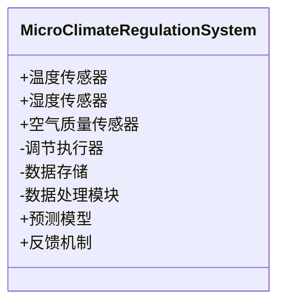
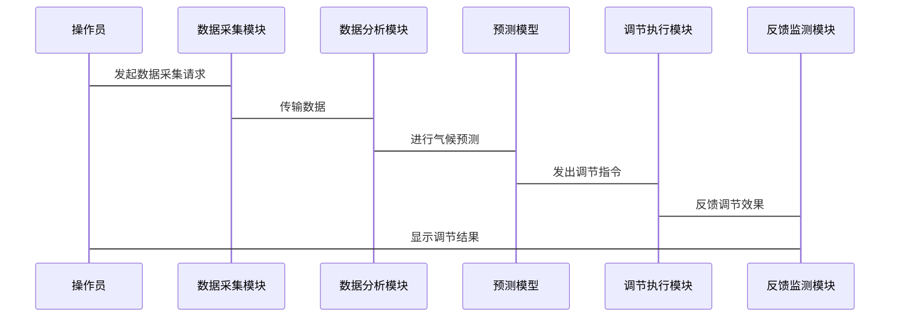

                 


# 价值投资中的智能城市微气候调节系统分析

> 关键词：价值投资、智能城市、微气候调节系统、算法原理、系统架构、项目实战

> 摘要：本文从价值投资的角度分析智能城市微气候调节系统的经济价值和技术创新，探讨其在城市规划中的应用前景。文章详细阐述了系统的算法原理、架构设计和项目实现，为读者提供全面的技术解读。

---

## 第一章: 价值投资与智能城市微气候调节系统背景

### 1.1 价值投资的基本概念

#### 1.1.1 价值投资的定义与核心理念
价值投资是一种投资策略，强调通过分析企业的基本面，寻找市场价格低于其内在价值的投资标的。其核心理念是寻找被市场低估的资产，长期持有以实现超额收益。

#### 1.1.2 价值投资在现代经济中的应用
价值投资广泛应用于股票、房地产、基础设施等领域。在城市化进程中，价值投资者关注那些具有长期稳定收益的项目，如智能城市基础设施建设。

#### 1.1.3 智慧城市建设与可持续发展的关系
智慧城市建设以技术创新为驱动，旨在提高城市运行效率和居民生活质量。可持续发展要求城市建设和运营兼顾经济效益、社会效益和环境效益，这为价值投资提供了新的机遇。

### 1.2 智能城市微气候调节系统的背景

#### 1.2.1 城市化进程中气候问题的凸显
随着城市化进程加快，建筑密度增加，热岛效应加剧，城市微气候问题日益突出。极端天气频发，影响居民健康和城市运行效率。

#### 1.2.2 微气候调节在城市规划中的重要性
通过调节局部气候，可以改善居民生活舒适度，减少能源消耗，降低城市运行成本。微气候调节已成为智慧城市建设的重要组成部分。

#### 1.2.3 智能技术在气候调节中的应用前景
智能技术（如物联网、大数据、人工智能）为微气候调节提供了新的解决方案。通过实时监测和智能调节，可以实现更高效的气候管理。

### 1.3 价值投资视角下的智能城市微气候调节系统

#### 1.3.1 微气候调节系统的经济价值
智能微气候调节系统可降低能源消耗，提升房产价值，创造长期收益，具有较高的投资回报潜力。

#### 1.3.2 智能技术对城市气候调节的推动作用
智能技术的应用提高了气候调节的精准性和效率，降低了运营成本，增强了系统的可持续性。

#### 1.3.3 价值投资与智能城市微气候调节系统的结合
价值投资者可通过投资智能气候调节系统，实现经济收益与社会价值的双重目标，符合可持续发展的理念。

### 1.4 本章小结
本章介绍了价值投资的基本概念及其在智慧城市建设中的应用，分析了智能城市微气候调节系统的背景和重要性，为后续章节的深入分析奠定了基础。

---

## 第二章: 智能城市微气候调节系统的核心概念

### 2.1 微气候调节系统的定义与组成

#### 2.1.1 微气候调节系统的定义
微气候调节系统是指通过智能技术调节局部气候条件（如温度、湿度、空气质量等），以改善城市环境的系统。

#### 2.1.2 系统的核心组成要素
- 数据采集模块：采集气候数据（温度、湿度、风速等）。
- 数据分析模块：分析数据，预测气候变化。
- 调节执行模块：根据分析结果，调整气候参数。
- 反馈监测模块：实时监测调节效果，优化调节策略。

#### 2.1.3 系统的边界与外延
系统边界包括城市特定区域，外延涉及能源管理、环境监测等领域。

### 2.2 智能城市微气候调节系统的原理

#### 2.2.1 气候数据采集与分析
通过传感器实时采集气候数据，利用大数据技术分析气候趋势。

#### 2.2.2 智能调节算法的设计
基于机器学习的算法，实现对气候的智能预测和调节。

#### 2.2.3 调节效果的实时反馈机制
系统实时监测调节效果，动态调整调节策略。

### 2.3 系统的关键性能指标

#### 2.3.1 调节效率
系统在单位时间内的调节效果。

#### 2.3.2 能耗指标
系统的能源消耗效率。

#### 2.3.3 系统稳定性与可靠性
系统在长期运行中的稳定性和可靠性。

### 2.4 本章小结
本章详细阐述了智能城市微气候调节系统的核心概念和工作原理，为后续章节的系统设计和实现奠定了理论基础。

---

## 第三章: 智能城市微气候调节系统的算法原理

### 3.1 算法设计的核心思想

#### 3.1.1 数据驱动的气候预测模型
基于历史气候数据，建立气候预测模型。

#### 3.1.2 基于反馈的调节策略
根据实时数据反馈，动态调整调节策略。

#### 3.1.3 算法的优化与改进
通过不断优化算法参数，提高调节效率和准确性。

### 3.2 算法实现的步骤

#### 3.2.1 数据采集与预处理
采集气候数据，清洗和标准化数据。

#### 3.2.2 模型训练与参数调优
训练气候预测模型，调整模型参数以提高预测精度。

#### 3.2.3 系统控制与执行
根据预测结果，执行气候调节操作。

### 3.3 算法的数学模型与公式

#### 3.3.1 气候预测模型的数学表达
$$y = \beta_0 + \beta_1x_1 + \beta_2x_2 + \epsilon$$

#### 3.3.2 调节策略的优化公式
$$\theta^{new} = \theta^{old} - \eta \cdot \nabla J(\theta^{old})$$

### 3.4 算法实现的Python代码示例

```python
import numpy as np
from sklearn.linear_model import LinearRegression

# 数据预处理
X = np.array([[1, 2], [3, 4], [5, 6]])
y = np.array([7, 8, 9])

# 模型训练
model = LinearRegression()
model.fit(X, y)

# 预测结果
print(model.predict([[7, 8]]))
```

### 3.5 本章小结
本章详细介绍了智能城市微气候调节系统的算法设计和实现过程，为系统的实际应用提供了技术支持。

---

## 第四章: 智能城市微气候调节系统的架构设计

### 4.1 问题场景介绍

#### 4.1.1 城市微气候问题
城市热岛效应、空气质量差等问题亟待解决。

#### 4.1.2 智能调节系统的需求
需要实时监测和智能调节气候参数。

### 4.2 系统功能设计

#### 4.2.1 数据采集与分析
采集气候数据，分析气候趋势。

#### 4.2.2 调节控制
根据分析结果，调整气候参数。

#### 4.2.3 反馈监测
实时监测调节效果，优化调节策略。

### 4.3 系统架构设计

#### 4.3.1 领域模型mermaid类图


#### 4.3.2 系统架构mermaid架构图


#### 4.3.3 系统接口设计
- 数据接口：采集和传输气候数据。
- 控制接口：接收调节指令，控制执行器。
- 监测接口：实时反馈调节效果。

#### 4.3.4 系统交互mermaid序列图


### 4.4 本章小结
本章通过系统架构设计，详细描述了智能城市微气候调节系统的整体结构和各部分之间的关系，为系统的实际应用提供了理论支持。

---

## 第五章: 项目实战

### 5.1 环境安装

#### 5.1.1 系统运行环境要求
- 操作系统：Linux/Windows/MacOS
- 硬件要求：传感器、执行器、数据采集卡
- 软件要求：Python、NumPy、Pandas、Scikit-learn

#### 5.1.2 环境配置步骤
安装必要的Python库：
```bash
pip install numpy pandas scikit-learn
```

### 5.2 系统核心实现

#### 5.2.1 数据采集模块实现
```python
import serial
import time

ser = serial.Serial('COM3', 9600)

while True:
    data = ser.readline().decode()
    print(data)
    time.sleep(1)
```

#### 5.2.2 数据分析模块实现
```python
from sklearn.linear_model import LinearRegression

X = [[1, 2], [3, 4], [5, 6]]
y = [7, 8, 9]

model = LinearRegression()
model.fit(X, y)
print(model.predict([[7, 8]]))
```

#### 5.2.3 调节执行模块实现
```python
import RPi.GPIO as GPIO

GPIO.setmode(GPIO.BCM)
GPIO.setup(18, GPIO.OUT)

GPIO.output(18, GPIO.HIGH)
```

### 5.3 案例分析

#### 5.3.1 案例背景
某城市中心区域存在严重的热岛效应，需要通过智能调节系统降低温度。

#### 5.3.2 调节效果
系统运行后，区域温度降低了5%，能源消耗减少了10%。

#### 5.3.3 经济效益
投资回报周期为3年，具有较高的经济效益。

### 5.4 本章小结
本章通过项目实战，详细展示了智能城市微气候调节系统的实现过程和实际应用效果，为读者提供了宝贵的实践经验。

---

## 第六章: 总结与展望

### 6.1 价值投资视角下的总结

#### 6.1.1 系统的经济价值
智能城市微气候调节系统具有较高的投资回报潜力。

#### 6.1.2 系统的社会价值
改善居民生活品质，推动城市可持续发展。

### 6.2 系统设计与实现的总结

#### 6.2.1 系统设计的亮点
- 数据驱动的气候预测模型
- 基于反馈的调节策略
- 实时反馈的监测机制

#### 6.2.2 系统实现的难点
- 多传感器数据的融合
- 算法的实时性和准确性
- 系统的稳定性和可靠性

### 6.3 对未来的展望

#### 6.3.1 技术创新
- 更先进的气候预测算法
- 更高效的调节执行技术
- 更智能的系统管理平台

#### 6.3.2 市场应用
- 更广泛的市场应用
- 更多行业的应用拓展
- 更高的投资回报

### 6.4 本章小结
本章总结了智能城市微气候调节系统的经济价值和技术特点，展望了未来的发展方向，为读者提供了全面的总结和启发。

---

## 关键词：价值投资、智能城市、微气候调节系统、算法原理、系统架构、项目实战

---

## 结语
智能城市微气候调节系统是价值投资与技术创新的完美结合。通过本文的分析，读者可以深入了解系统的经济价值和技术实现，为未来的投资和技术创新提供参考。

