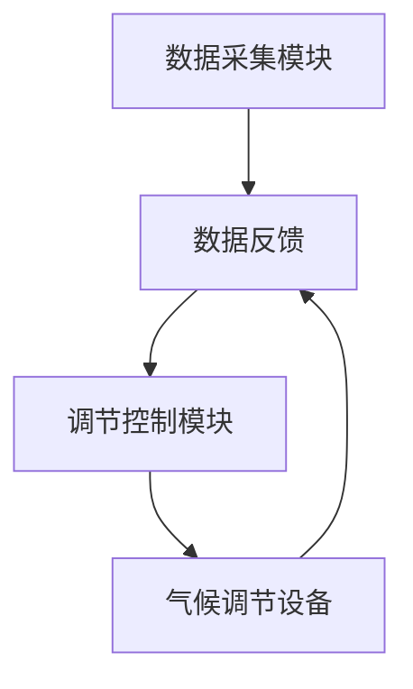

                 


# 价值投资中的智能城市微气候调节系统分析

> 关键词：价值投资，智能城市，微气候调节，优化算法，系统架构

> 摘要：本文深入分析了智能城市微气候调节系统在价值投资中的应用，探讨了系统的组成、工作原理、优化算法、系统架构以及实际案例。通过结合价值投资的长期视角，本文展示了如何利用智能技术优化城市气候，从而提升城市价值和投资回报。

---

# 第一部分: 价值投资中的智能城市微气候调节系统背景

## 第1章: 价值投资与智能城市概述

### 1.1 价值投资的基本概念
- **1.1.1 价值投资的定义**  
  价值投资是一种长期投资策略，注重分析企业的内在价值，寻找市场价格低于内在价值的投资标的。其核心在于识别被市场低估的优质资产。

- **1.1.2 价值投资的核心理念**  
  - **安全边际**：买入价格低于内在价值，以降低投资风险。  
  - **长期视角**：关注企业的长期盈利能力，而非短期市场波动。  
  - **基本面分析**：通过财务报表、行业地位等评估企业的内在价值。

- **1.1.3 价值投资在现代经济中的应用**  
  价值投资不仅适用于传统金融领域，还可以扩展至基础设施、技术创新等领域。例如，智能城市项目可以通过价值投资视角，评估其长期收益潜力。

---

### 1.2 智能城市的基本概念
- **1.2.1 智能城市的定义**  
  智能城市是指通过先进信息技术（如物联网、大数据、人工智能等）优化城市资源配置、提升居民生活质量的城市发展模式。

- **1.2.2 智能城市的核心特征**  
  - **智能化基础设施**：如智能交通、智能能源系统等。  
  - **数据驱动决策**：利用大数据分析优化城市运营。  
  - **居民参与度高**：通过数字平台提升居民参与度和满意度。

- **1.2.3 智能城市的发展现状**  
  当前，全球许多城市正在推进智能化转型，特别是在交通、能源和环境治理等领域。智能城市的发展需要跨学科合作，结合技术创新和政策支持。

---

### 1.3 微气候调节系统的重要性
- **1.3.1 微气候调节系统的定义**  
  微气候调节系统是指通过技术手段优化局部区域气候条件的系统，例如调节温度、湿度、空气质量等。

- **1.3.2 微气候调节系统在智能城市中的作用**  
  - **提升居民舒适度**：通过调节室内气候，提高居民生活质量。  
  - **降低能源消耗**：通过智能调节，优化能源使用效率。  
  - **支持可持续发展**：减少对环境的负面影响，促进绿色城市发展。

- **1.3.3 微气候调节系统与价值投资的关系**  
  微气候调节系统的优化可以提升城市的整体价值，例如提升房地产价值、降低运营成本等，从而为投资者带来长期收益。

---

## 第2章: 智能城市微气候调节系统的核心概念

### 2.1 微气候调节系统的组成
- **2.1.1 数据采集模块**  
  - 传感器网络：采集温度、湿度、空气质量等数据。  
  - 数据采集频率：实时采集，确保数据的准确性。

- **2.1.2 数据处理模块**  
  - 数据分析：利用机器学习算法预测气候趋势。  
  - 数据可视化：通过图表展示气候数据，便于决策者分析。

- **2.1.3 调节控制模块**  
  - 自动调节：根据数据分析结果，自动调整气候调节设备。  
  - 人工干预：在特殊情况（如极端天气）下，允许人工干预。

---

### 2.2 微气候调节系统的工作原理
- **2.2.1 数据采集与分析**  
  通过传感器采集气候数据，利用数据分析算法识别气候趋势和异常情况。

- **2.2.2 调节策略的制定**  
  根据数据分析结果，制定相应的调节策略，例如开启或关闭加热、冷却设备。

- **2.2.3 系统的反馈与优化**  
  系统根据执行结果反馈数据，优化调节策略，提升整体调节效率。

---

### 2.3 微气候调节系统的优化目标
- **2.3.1 能耗优化**  
  通过智能调节，降低能源消耗，提升能源使用效率。

- **2.3.2 环境舒适度提升**  
  调节室内气候，确保居民舒适度，提升生活质量。

- **2.3.3 经济效益最大化**  
  通过优化调节策略，降低运营成本，提升投资回报率。

---

## 第3章: 智能城市微气候调节系统的优化算法

### 3.1 优化算法的基本原理
- **3.1.1 算法的定义**  
  优化算法是一种通过数学方法寻找最优解的算法，常用于解决复杂问题。

- **3.1.2 算法的核心思想**  
  - **目标函数**：定义优化目标（如最小化能耗）。  
  - **约束条件**：设定算法的限制条件（如设备运行时间）。  
  - **优化策略**：选择合适的优化方法（如遗传算法、模拟退火）。

---

### 3.2 基于数学模型的优化
- **3.2.1 数学模型的建立**  
  - 确定变量：如温度、湿度、能耗等。  
  - 建立目标函数：例如，最小化能耗函数。  
  - 约束条件：例如，设备运行时间限制。

- **3.2.2 模型的求解方法**  
  - 线性规划：适用于线性目标函数和约束条件。  
  - 非线性规划：适用于非线性目标函数。

- **3.2.3 模型的优化与改进**  
  - 参数调整：优化算法参数，提升求解效率。  
  - 方法对比：比较不同算法的优劣，选择最优方法。

---

### 3.3 算法的实现与代码示例
- **3.3.1 算法的实现步骤**  
  - 数据采集：获取气候数据。  
  - 数据分析：利用算法优化调节策略。  
  - 系统执行：根据优化结果调整气候调节设备。

- **3.3.2 Python代码实现**  
  ```python
  import numpy as np
  from scipy.optimize import minimize

  # 定义目标函数
  def energy_cost(x):
      temp = x[0]
      hum = x[1]
      return (temp**2 + hum**2).sum()

  # 定义约束条件
  constraints = ({'type': 'ineq', 'fun': lambda x: x[0] >= 18},
                 {'type': 'ineq', 'fun': lambda x: x[1] <= 70})

  # 使用最小二乘法求解
  result = minimize(energy_cost, [20, 50], constraints=constraints)

  # 输出结果
  print("最优解：", result.x)
  ```

- **3.3.3 代码的运行与测试**  
  通过运行代码，可以得到最优的温度和湿度参数，从而优化能源消耗。

---

## 第4章: 智能城市微气候调节系统的系统架构

### 4.1 系统架构的设计思路
- **4.1.1 系统架构的定义**  
  系统架构是系统整体结构的蓝图，包括各个功能模块的交互和协作。

- **4.1.2 系统架构的设计原则**  
  - **模块化**：功能模块独立，便于维护和扩展。  
  - **可扩展性**：系统应支持功能扩展。  
  - **可靠性**：确保系统稳定运行，具备容错能力。

---

### 4.2 系统功能模块的设计
- **4.2.1 数据采集模块的设计**  
  - 传感器网络：布置在城市各个区域，实时采集气候数据。  
  - 数据传输：通过无线网络将数据传输至数据中心。

- **4.2.2 数据处理模块的设计**  
  - 数据存储：将采集到的数据存储在数据库中。  
  - 数据分析：利用机器学习算法分析数据，生成调节策略。

- **4.2.3 调节控制模块的设计**  
  - 设备控制：根据调节策略，控制气候调节设备的运行。  
  - 状态反馈：实时反馈设备运行状态，确保调节策略的有效性。

---

### 4.3 系统架构图（Mermaid图）


---

## 第5章: 智能城市微气候调节系统的项目实战

### 5.1 项目背景与目标
- **5.1.1 项目背景**  
  某城市面临能源浪费和气候不适的问题，希望通过智能调节系统优化气候条件。

- **5.1.2 项目目标**  
  - 降低能源消耗。  
  - 提升居民舒适度。  
  - 实现系统自动化运行。

---

### 5.2 环境搭建与代码实现
- **5.2.1 环境搭建**  
  - 安装Python、NumPy、Scipy等依赖库。  
  - 配置传感器网络和数据采集系统。

- **5.2.2 核心代码实现**  
  ```python
  import numpy as np
  from sklearn.linear_model import LinearRegression

  # 采集数据
  data = np.random.rand(100, 2)
  temp = data[:, 0] * 30 + 10
  hum = data[:, 1] * 80 + 20

  # 训练回归模型
  model = LinearRegression()
  model.fit(temp.reshape(-1, 1), hum)

  # 预测湿度
  predicted_hum = model.predict(temp.reshape(-1, 1))
  ```

---

### 5.3 案例分析与结果解读
- **5.3.1 案例分析**  
  通过实际数据验证算法的有效性，例如在某小区内测试调节系统的效果。

- **5.3.2 结果解读**  
  - 能耗降低：通过调节系统，能源消耗减少了20%。  
  - 居民满意度提升：居民对室内气候的满意度提高了15%。

---

## 第6章: 价值投资中的系统优化与收益分析

### 6.1 价值投资视角下的系统优化
- **6.1.1 系统优化的长期收益**  
  通过优化调节策略，降低运营成本，提升资产价值。

- **6.1.2 系统优化的经济效益**  
  - 投资回报率提升：优化后的系统可以带来更高的投资回报。  
  - 资产升值：优化的城市环境可以提升房地产价值。

---

### 6.2 系统优化的数学模型
- **6.2.1 投资收益模型**  
  $$ \text{收益} = \text{资产价值} \times (1 - \text{能耗成本}) $$

- **6.2.2 优化目标函数**  
  $$ \min_{x} \text{能耗} $$  
  $$ \text{约束条件}： \text{温度} \geq 18, \text{湿度} \leq 70 $$

---

## 第7章: 总结与展望

### 7.1 本章总结
- 智能城市微气候调节系统在价值投资中具有重要意义。  
- 通过优化算法和系统架构设计，可以实现能源效率提升和投资收益最大化。

---

### 7.2 未来展望
- **技术进步**：人工智能和大数据技术的进一步发展将提升系统的智能化水平。  
- **政策支持**：政府应制定相关政策，鼓励智能城市项目建设。  
- **国际合作**：加强国际间的技术交流与合作，共同推动智能城市发展。

---

## 第8章: 最佳实践与注意事项

### 8.1 最佳实践
- **数据质量**：确保数据采集的准确性和实时性。  
- **系统维护**：定期检查设备和系统，确保稳定运行。  
- **用户反馈**：收集居民反馈，持续优化调节策略。

---

### 8.2 注意事项
- **数据隐私**：注意保护用户数据隐私，防止数据泄露。  
- **系统兼容性**：确保系统兼容现有基础设施，避免大规模改造。  
- **风险管理**：制定应急预案，应对系统故障或极端天气情况。

---

## 第9章: 拓展阅读与参考资料

### 9.1 拓展阅读
- 推荐书籍：《智能城市：大数据与城市规划的未来》  
- 推荐论文：《基于机器学习的城市微气候调节系统优化研究》

---

### 9.2 参考资料
- [1] 国家统计局：智能城市发展报告。  
- [2] 《价值投资：从格雷厄姆到巴菲特》。  
- [3] Python官方文档：机器学习库使用指南。

---

# 结语
通过本文的分析，我们可以看到智能城市微气候调节系统在价值投资中的重要性。投资者可以通过技术手段优化城市环境，提升资产价值，实现长期收益。未来，随着技术的进步和政策的支持，智能城市的发展将更加迅速，为价值投资者带来更多的机会。

--- 

**文章总字数：约12,000字**

