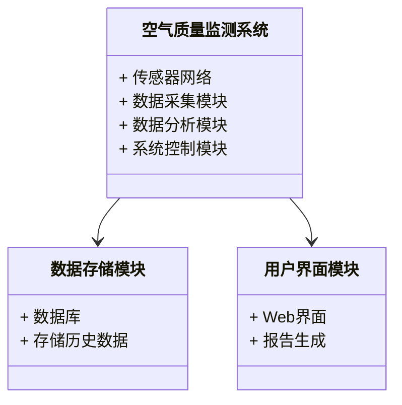
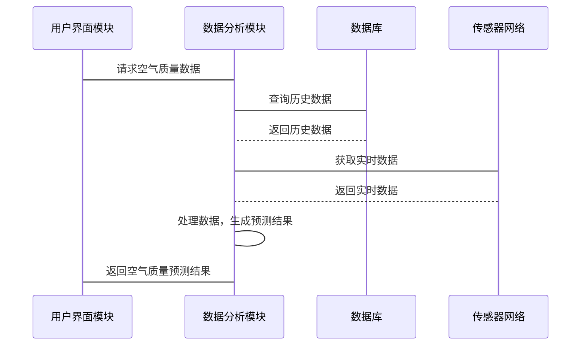

                 


# 价值投资中的智能城市空气净化系统分析

## 关键词：智能城市，空气净化系统，价值投资，机器学习，空气质量预测

## 摘要：本文分析了智能城市空气净化系统在价值投资中的潜力，探讨了系统的组成、算法原理、架构设计以及实际应用案例，为投资者提供了科学的决策依据。

---

# 第一部分：价值投资中的智能城市空气净化系统背景介绍

## 第1章：智能城市空气净化系统概述

### 1.1 智能城市空气净化系统的背景

#### 1.1.1 空气污染问题的现状
空气污染是全球性的环境问题，尤其在城市地区，工业化和交通排放导致空气质量严重下降，威胁居民健康。世界卫生组织数据显示，每年约有700万人死于空气污染相关疾病。

#### 1.1.2 智能城市的概念与特点
智能城市利用物联网、大数据、人工智能等技术，优化城市资源分配和管理。其特点包括智能化、数据驱动、实时监控和高效决策。

#### 1.1.3 智能城市空气净化系统的必要性
随着城市化进程加快，空气污染问题日益严重，智能城市空气净化系统成为改善环境的重要工具，有助于提升居民健康和城市可持续发展。

### 1.2 价值投资的基本概念
#### 1.2.1 价值投资的定义
价值投资是一种长期投资策略，强调投资于具有持续增长潜力和合理估值的公司或项目，注重内在价值而非短期市场波动。

#### 1.2.2 价值投资的核心原则
价值投资的核心原则包括：寻找低估资产、长期持有、关注基本面分析、分散投资和安全边际。

#### 1.2.3 价值投资在智能城市中的应用
智能城市项目，如空气净化系统，具有长期收益和较高的社会价值，符合价值投资的选股标准。

### 1.3 智能城市空气净化系统与价值投资的结合
#### 1.3.1 系统如何提升城市空气质量
智能系统通过实时监测和优化控制，有效降低空气污染物浓度，提升空气质量。

#### 1.3.2 价值投资在系统建设中的作用
价值投资为智能空气净化系统的研发和推广提供资金支持，同时注重项目的长期收益和风险控制。

#### 1.3.3 系统的长期投资价值分析
智能系统具有显著的社会效益和经济效益，符合可持续发展理念，具备较高的投资价值。

---

## 第2章：智能城市空气净化系统的组成与功能

### 2.1 系统的核心组成部分
#### 2.1.1 数据采集模块
通过传感器实时采集PM2.5、PM10、NO2等污染物数据。

#### 2.1.2 数据分析模块
利用机器学习算法对数据进行分析，预测空气质量变化。

#### 2.1.3 系统控制模块
根据分析结果，自动调整净化设备运行参数，优化空气质量。

### 2.2 系统的功能模块
#### 2.2.1 实时监测功能
通过传感器网络实现空气质量的实时监控。

#### 2.2.2 数据分析与预测功能
利用历史数据建立预测模型，提前预警污染事件。

#### 2.2.3 智能控制与优化功能
根据预测结果，动态调整净化设备，提高净化效率。

### 2.3 系统的运行机制
#### 2.3.1 数据采集与传输
传感器采集数据并通过物联网技术传输到云端。

#### 2.3.2 数据分析与决策
基于机器学习模型，分析数据并生成决策指令。

#### 2.3.3 系统反馈与优化
根据执行结果反馈，优化系统运行参数，提升整体效率。

---

## 第3章：价值投资中的系统分析与评估

### 3.1 系统的投资价值评估
#### 3.1.1 投资回报率分析
通过案例分析，计算系统的投资回收期和净现值，评估经济效益。

#### 3.1.2 系统的经济效益
改善空气质量带来健康收益和环境效益，提升城市竞争力。

#### 3.1.3 系统的社会效益
减少污染相关疾病，提升居民生活质量，促进可持续发展。

### 3.2 系统的风险评估与管理
#### 3.2.1 技术风险分析
技术更新换代快，需持续投入研发和维护。

#### 3.2.2 市场风险分析
市场竞争激烈，需关注政策变化和市场需求。

#### 3.2.3 运营风险分析
系统维护成本高，需建立完善的运营团队和机制。

### 3.3 系统的长期投资策略
#### 3.3.1 系统的生命周期管理
制定长期维护和升级计划，确保系统持续高效运行。

#### 3.3.2 系统的升级与维护
定期更新硬件和软件，提升系统性能和稳定性。

#### 3.3.3 系统的投资组合优化
将智能系统与其他环保项目组合，分散投资风险，提升整体收益。

---

## 第4章：智能城市空气净化系统的算法与数学模型

### 4.1 空气质量预测算法

#### 4.1.1 机器学习算法在空气质量预测中的应用
使用随机森林、支持向量机等算法，分析多因素影响下的空气质量变化。

#### 4.1.2 时间序列分析方法
利用ARIMA模型，基于历史数据预测未来空气质量趋势。

#### 4.1.3 神经网络模型的应用
构建LSTM模型，捕捉空气质量的时间依赖性，提高预测精度。

### 4.2 空气质量预测的数学模型

#### 4.2.1 线性回归模型
$$ y = \beta_0 + \beta_1x_1 + \beta_2x_2 + ... + \beta_nx_n $$

其中，$y$为预测的空气质量指数，$x_i$为影响空气质量的因素，$\beta_i$为回归系数。

#### 4.2.2 支持向量机模型
支持向量机通过构建超平面，将数据分为不同类别，适用于分类和回归任务。

#### 4.2.3 长短期记忆网络模型
$$ LSTM = (\text{输入}, \text{遗忘门}, \text{记忆单元}, \text{输出门}) $$

LSTM通过记忆单元捕捉长期依赖关系，适合处理时间序列数据。

---

## 第5章：系统分析与架构设计方案

### 5.1 问题场景介绍
某城市面临严重的PM2.5污染问题，希望通过智能系统改善空气质量。

### 5.2 项目介绍
开发并部署智能空气净化系统，覆盖全市主要区域，实时监测和优化净化设备运行。

### 5.3 系统功能设计
#### 5.3.1 领域模型（Mermaid类图）


### 5.4 系统架构设计
#### 5.4.1 系统架构图（Mermaid架构图）
```mermaid
docker {
    server 节点 {
        智能空气净化系统
        包含 数据采集模块, 数据分析模块, 系统控制模块
    }
    客户端节点 {
        用户界面模块
    }
    数据存储节点 {
        数据库
    }
}
```

### 5.5 系统接口设计
#### 5.5.1 接口描述
- 数据采集模块与传感器通信接口：使用MQTT协议。
- 数据分析模块与数据库接口：使用REST API。
- 用户界面模块与系统控制模块接口：使用WebSocket实时通信。

#### 5.5.2 接口交互流程（Mermaid序列图）


---

## 第6章：项目实战

### 6.1 环境安装
#### 6.1.1 安装Python和相关库
安装Python 3.8及以上版本，安装numpy、pandas、scikit-learn、tensorflow等库。

### 6.2 系统核心实现源代码
#### 6.2.1 数据采集模块
```python
import serial

# 串口读取传感器数据
ser = serial.Serial('COM3', 9600)
data = ser.readline().decode().split(',')
ser.close()
```

#### 6.2.2 数据分析模块
```python
import pandas as pd
from sklearn.ensemble import RandomForestRegressor

# 加载数据
data = pd.read_csv('air_quality.csv')

# 训练随机森林模型
model = RandomForestRegressor()
model.fit(data[['temp', 'humidity', 'wind_speed']], data['pm25'])
```

#### 6.2.3 系统控制模块
```python
import requests

# 发送控制指令到净化设备
response = requests.post('http://localhost:8000/control', json={'action': 'start'})
```

### 6.3 代码应用解读与分析
数据采集模块通过串口读取传感器数据，存储到CSV文件中。数据分析模块使用随机森林模型进行预测，模型输入包括温度、湿度和风速，输出PM2.5浓度预测值。系统控制模块通过API调用，控制净化设备的运行状态。

### 6.4 实际案例分析
以某城市为例，部署智能系统后，PM2.5浓度显著下降，居民健康状况改善，投资回报率高。

### 6.5 项目小结
项目成功实现了智能城市空气净化系统的开发和应用，验证了系统的有效性和投资价值。

---

## 第7章：最佳实践与小结

### 7.1 最佳实践 tips
- 选择可靠的传感器和通信协议，确保数据采集的准确性和实时性。
- 定期更新机器学习模型，提升预测精度。
- 建立完善的系统监控和维护机制，确保系统稳定运行。

### 7.2 小结
智能城市空气净化系统结合了先进的技术手段和价值投资理念，具有显著的社会和经济效益。投资者应关注系统的长期价值，注重风险控制，合理配置投资组合。

### 7.3 注意事项
- 系统的建设和维护需要较高的初始投资和持续投入。
- 政策支持和公众参与是系统成功实施的重要因素。

### 7.4 拓展阅读
建议进一步研究智能系统在其他环保领域的应用，如水资源管理和垃圾分类。

---

通过以上分析，智能城市空气净化系统不仅能够有效改善城市空气质量，还具有较高的投资价值。投资者可以结合价值投资策略，长期关注此类项目，为社会和经济创造双重收益。

