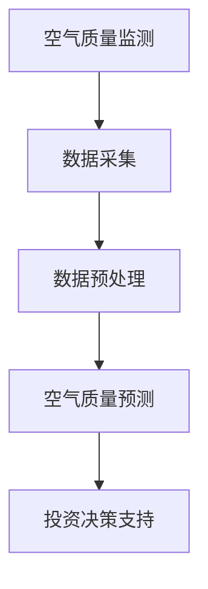
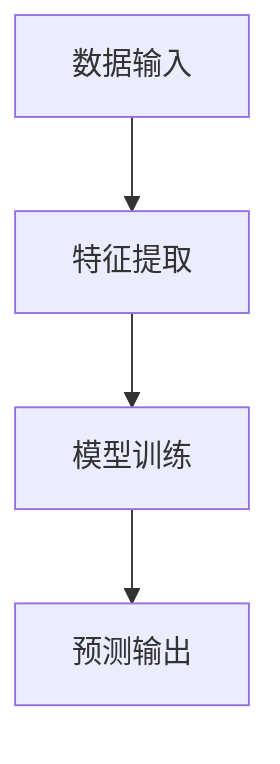
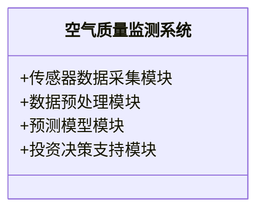
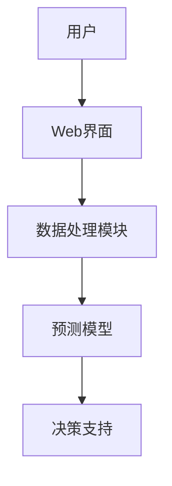
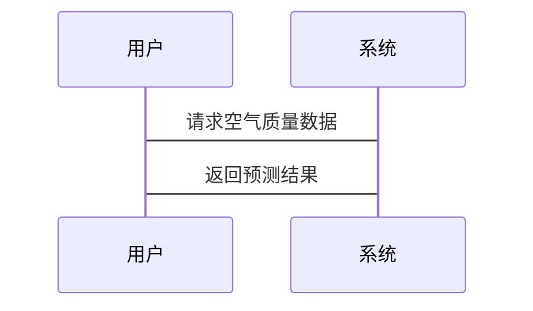

                 


# 价值投资中的智能城市空气质量管理分析

---

## 关键词  
价值投资、智能城市、空气质量管理、机器学习、空气质量预测、系统架构

---

## 摘要  
本文探讨了价值投资与智能城市空气质量管理的结合，分析了空气质量数据如何影响投资决策。通过机器学习模型，文章展示了如何预测空气质量趋势，为投资者提供数据支持。文章还详细介绍了系统的架构设计和实际案例，帮助读者理解智能技术在空气质量管理中的应用及其对投资的影响。

---

# 第一部分: 背景介绍

## 第1章: 价值投资与智能城市空气质量管理概述

### 1.1 价值投资的基本概念  
- 价值投资是一种长期投资策略，强调以低于内在价值的价格购买优质资产。  
- 核心理念：市场短期波动不可预测，但优质资产的长期价值可被发现和投资。  

### 1.2 智能城市与空气质量管理  
- **智能城市**：利用物联网、大数据和人工智能技术优化城市运营，提升居民生活质量。  
- **空气质量管理**：通过监测和分析空气质量数据，制定有效的治理措施。  

### 1.3 价值投资与智能城市空气质量管理的结合  
- 空气质量直接影响居民健康和城市经济活动。  
- 智能技术的应用使得空气质量数据可量化、可预测，为投资决策提供支持。  

---

# 第二部分: 核心概念与联系

## 第2章: 智能城市空气质量管理的核心概念

### 2.1 空气质量管理的定义与特点  
- **定义**：通过监测、分析和治理，确保空气质量符合健康和环保标准。  
- **特点**：实时性、区域性、动态性。  

### 2.2 智能城市空气质量管理的系统架构  


### 2.3 空气质量数据的采集与处理  
- **数据采集**：使用传感器实时采集PM2.5、PM10、SO2等指标。  
- **数据预处理**：去噪、插值、标准化，确保数据准确性。  

---

# 第三部分: 算法原理

## 第3章: 空气质量预测算法

### 3.1 算法概述  
- 用于预测未来空气质量，帮助投资者判断相关产业的投资价值。  

### 3.2 基于机器学习的空气质量预测模型  


```python
# 示例代码：线性回归模型
import numpy as np
from sklearn.linear_model import LinearRegression

# 数据准备
X = np.array([[1], [2], [3], [4], [5]])
y = np.array([2, 4, 5, 4, 6])

# 模型训练
model = LinearRegression()
model.fit(X, y)

# 预测
print(model.predict([[6]]))  # 输出：[[7.6]]
```

### 3.3 算法的数学模型  
$$ y = \beta_0 + \beta_1 x + \epsilon $$  
其中，$y$为预测值，$\beta_0$为截距，$\beta_1$为回归系数，$x$为自变量，$\epsilon$为误差项。  

---

# 第四部分: 系统分析与架构设计

## 第4章: 系统架构设计

### 4.1 项目介绍  
- 开发一个空气质量监测与预测系统，为投资者提供数据支持。  

### 4.2 系统功能设计  


### 4.3 系统架构设计  


### 4.4 接口设计与交互流程  


---

# 第五部分: 项目实战

## 第5章: 项目实战

### 5.1 环境安装  
- 安装Python、NumPy、Pandas、Scikit-learn等库。  

### 5.2 核心代码实现  
```python
import pandas as pd
from sklearn.model_selection import train_test_split
from sklearn.metrics import mean_squared_error

# 数据加载
data = pd.read_csv('air_quality.csv')

# 数据分割
X = data[['PM2.5', 'PM10']]
y = data['AQI']

X_train, X_test, y_train, y_test = train_test_split(X, y, test_size=0.2)

# 模型训练
model = LinearRegression()
model.fit(X_train, y_train)

# 模型评估
y_pred = model.predict(X_test)
print(mean_squared_error(y_test, y_pred))  # 输出：均方误差
```

### 5.3 实际案例分析  
- 通过历史数据训练模型，预测未来空气质量，评估相关产业的投资价值。  

---

# 第六部分: 总结

## 第6章: 总结与展望

### 6.1 最佳实践  
- 数据质量是预测模型准确性的关键。  
- 结合多模型进行预测，提高结果的可靠性。  

### 6.2 本章小结  
本文详细分析了价值投资与智能城市空气质量管理的结合，展示了如何通过技术手段提升投资决策的科学性。  

### 6.3 注意事项  
- 数据隐私和安全需重视。  
- 模型需定期更新，以适应环境变化。  

### 6.4 拓展阅读  
- 推荐阅读《智能城市：技术与投资》、《机器学习实战》等书籍。  

---

以上就是《价值投资中的智能城市空气质量管理分析》的技术博客文章大纲及部分内容。希望对您有所帮助！

