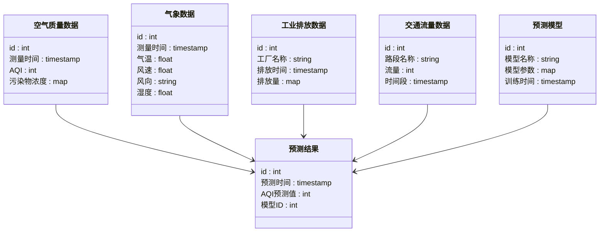
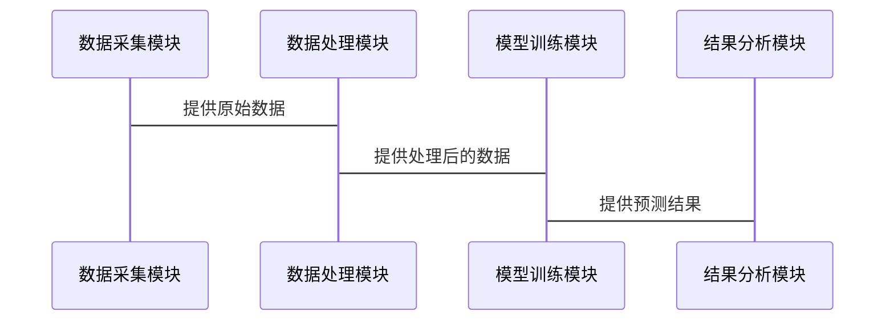

                 


# 价值投资中的智能城市空气质量预测系统分析

## 关键词
- 价值投资
- 智能城市
- 空气质量预测
- 时间序列分析
- 机器学习
- 系统架构

## 摘要
本文探讨了如何将价值投资的理念与智能城市中的空气质量预测系统相结合。通过分析空气质量数据，利用时间序列预测模型（如ARIMA）和机器学习算法，构建一个能够预测未来空气质量的智能系统。该系统不仅能够帮助投资者识别潜在的投资机会，还能为城市管理者提供决策支持，从而实现经济与环境的双重价值。

---

# 第一部分: 价值投资与智能城市空气质量预测的背景介绍

## 第1章: 价值投资的基本概念与应用领域

### 1.1 价值投资的核心理念
#### 1.1.1 价值投资的定义与起源
价值投资是一种以低于市场价值的价格购买优质资产的投资策略，起源于20世纪20年代，由本杰明·格雷厄姆和戴维·多德提出。其核心理念是寻找市场中的“烟屁股”——即被市场低估的优质资产。

#### 1.1.2 价值投资的核心原则
- 价格与价值分离：市场价格可能短期波动，但长期会回归其内在价值。
- 安全边际：买入价格应低于资产的内在价值，以降低投资风险。
- 长期持有：价值投资者倾向于长期持有优质资产，等待市场重新评估其价值。

#### 1.1.3 价值投资在现代金融中的应用
价值投资不仅适用于股票市场，还可扩展应用于房地产、基础设施等领域。在智能城市中，空气质量作为影响城市价值的重要因素，为价值投资提供了新的应用场景。

---

## 第2章: 智能城市与空气质量预测的背景

### 2.1 智能城市的定义与特征
#### 2.1.1 智能城市的定义
智能城市是通过物联网、大数据、人工智能等技术手段，将城市中的各个系统有机连接，实现智能化管理的城市形态。

#### 2.1.2 智能城市的核心特征
- 数字化：城市基础设施和服务的数字化。
- 智能化：通过数据分析和人工智能优化城市运行。
- 可持续性：注重环境保护和资源高效利用。

#### 2.1.3 智能城市与环境保护的关系
智能城市通过实时监测和优化资源配置，减少污染排放，改善城市环境质量。

### 2.2 空气质量预测的必要性与挑战
#### 2.2.1 空气质量预测的必要性
- 空气质量直接影响居民健康和生活质量。
- 空气质量与城市经济活动密切相关，例如工厂停工可能导致经济损失。
- 空气质量预测是城市环境管理的重要工具。

#### 2.2.2 空气质量预测的主要挑战
- 数据获取困难：空气质量数据需要实时监测，且数据可能存在缺失或偏差。
- 模型复杂性：空气质量受多种因素影响，例如气象条件、工业排放、交通流量等，模型需要考虑这些复杂因素。
- 数据更新频率：空气质量变化迅速，模型需要实时更新以保持预测准确性。

#### 2.2.3 智能城市中空气质量预测的应用场景
- 健康预警：为居民提供健康建议，减少因空气污染引发的健康问题。
- 经济决策：帮助企业优化生产计划，避免因空气质量问题导致的经济损失。
- 政策制定：为政府制定环保政策提供科学依据。

---

## 第3章: 价值投资与空气质量预测的结合

### 3.1 问题背景与问题描述
#### 3.1.1 空气质量对城市经济的影响
- 空气质量差可能导致房地产价值下降，因为人们更倾向于选择空气质量好的城市居住。
- 空气质量差可能导致企业生产成本增加，例如因污染超标被罚款。
- 空气质量改善通常伴随着城市升值，例如环保政策的实施可能提升城市形象和吸引力。

#### 3.1.2 空气质量预测在投资决策中的作用
- 通过预测未来空气质量，投资者可以提前布局，例如投资环保企业或污染治理项目。
- 空气质量预测可以帮助投资者评估城市经济的可持续性，从而做出更明智的投资决策。

#### 3.1.3 价值投资视角下的空气质量预测问题
- 问题背景：空气质量是影响城市价值的重要因素，但目前市场对空气质量的定价可能不充分。
- 问题描述：如何利用空气质量预测模型，识别那些因空气质量改善而被市场低估的城市或企业。

### 3.2 问题解决与边界条件
#### 3.2.1 空气质量预测的核心目标
- 提供未来一段时间内空气质量的预测结果，为投资决策提供数据支持。

#### 3.2.2 价值投资中的空气质量预测边界条件
- 数据范围：限于某个城市或区域的空气质量数据。
- 时间范围：预测未来7天至30天的空气质量指数（AQI）。
- 投资范围：限于与空气质量相关的行业，例如环保企业、房地产企业等。

#### 3.2.3 系统的输入输出与约束条件
- 输入：历史空气质量数据、气象数据、工业排放数据、交通流量数据等。
- 输出：未来一段时间内空气质量指数（AQI）的预测值。
- 约束条件：数据获取的时间窗口、模型的预测精度、系统的运行成本等。

### 3.3 概念结构与核心要素
#### 3.3.1 空气质量预测系统的组成要素
- 数据采集模块：收集空气质量、气象、工业排放等数据。
- 数据处理模块：清洗、整合和预处理数据。
- 模型训练模块：利用机器学习算法训练空气质量预测模型。
- 结果分析模块：对预测结果进行分析和可视化。

#### 3.3.2 价值投资中的关键指标
- 空气质量指数（AQI）：综合反映空气污染程度的指标。
- 空气质量敏感性：不同行业对空气质量的敏感程度。
- 空气质量改善潜力：城市空气质量改善的可行性分析。

#### 3.3.3 系统的核心功能与模块
- 数据采集与处理：确保数据的完整性和准确性。
- 模型训练与预测：利用机器学习算法进行高质量的空气质量预测。
- 结果分析与反馈：对预测结果进行分析，并根据实际情况调整模型参数。

---

# 第二部分: 智能城市空气质量预测系统的核心概念与联系

## 第4章: 核心概念的原理与特征

### 4.1 空气质量预测系统的原理
#### 4.1.1 数据采集与处理
- 数据来源：空气质量监测站、气象站、工业排放数据、交通流量数据等。
- 数据清洗：去除缺失值、异常值，确保数据的准确性。
- 数据预处理：归一化、标准化等处理，以便模型更好地训练。

#### 4.1.2 模型训练与预测
- 选择合适的算法：如ARIMA、LSTM等时间序列预测模型。
- 训练模型：利用历史数据训练模型，提取空气质量变化的规律。
- 预测结果：基于训练好的模型，预测未来一段时间内的空气质量指数。

#### 4.1.3 结果分析与反馈
- 对预测结果进行分析，评估模型的准确性和可靠性。
- 根据实际情况调整模型参数，优化预测效果。
- 将预测结果反馈给系统，为后续预测提供参考。

### 4.2 价值投资中的关键指标
#### 4.2.1 空气质量指数（AQI）的定义与计算
- AQI是一个综合指标，反映了空气污染程度。
- 计算公式：$AQI = \sum_{i=1}^{n} \left( \frac{\text{污染物浓度}_i}{\text{标准浓度}_i} \right) \times \text{权重}_i$
- AQI的范围通常为0-500，指数越高，空气污染越严重。

#### 4.2.2 空气质量对经济活动的影响
- 空气质量差可能导致工厂停工、员工健康问题，从而增加企业成本。
- 空气质量改善通常会提升城市形象，吸引更多投资和人才。

#### 4.2.3 投资决策中的空气质量因子
- 空气质量是影响房地产价值的重要因素。
- 空气质量改善通常伴随着环保企业的业绩增长。

---

## 第5章: 实体关系与系统架构

### 5.1 实体关系图（ER图）

```mermaid
erDiagram
    class 空气质量数据 {
        id int
        测量时间 timestamp
        AQI int
        污染物浓度 map
    }
    class 气象数据 {
        id int
        测量时间 timestamp
        气温 float
        风速 float
        风向 string
        湿度 float
    }
    class 工业排放数据 {
        id int
        工厂名称 string
        排放时间 timestamp
        排放量 map
    }
    class 交通流量数据 {
        id int
        路段名称 string
        流量 int
        时间段 timestamp
    }
    class 预测模型 {
        id int
        模型名称 string
        模型参数 map
        训练时间 timestamp
    }
    class 预测结果 {
        id int
        预测时间 timestamp
        AQI预测值 int
        模型ID int
    }
    空气质量数据 --> 预测结果 : 提供
    气象数据 --> 预测结果 : 提供
    工业排放数据 --> 预测结果 : 提供
    交通流量数据 --> 预测结果 : 提供
    预测模型 --> 预测结果 : 生成
```

### 5.2 系统架构设计


---

## 第6章: 价值投资中的空气质量预测系统架构

### 6.1 价值投资与空气质量预测的结合
- 通过空气质量预测系统，识别因空气质量改善而被市场低估的城市或企业。
- 利用空气质量指数（AQI）作为投资决策的重要参考。

### 6.2 价值投资视角下的系统架构


---

## 第7章: 系统分析与架构设计方案

### 7.1 问题场景介绍
- 城市化进程加速，空气污染问题日益严重。
- 空气质量直接影响城市价值和居民健康。
- 投资者需要更精准的工具来评估空气质量对投资的影响。

### 7.2 项目介绍
- 项目目标：构建一个能够预测未来空气质量的智能系统，为价值投资提供支持。
- 项目范围：限于某一个城市或区域，数据来源包括空气质量监测站、气象站、工业排放数据、交通流量数据等。

### 7.3 系统功能设计
#### 7.3.1 领域模型类图



### 7.4 系统架构设计


### 7.5 系统接口设计

#### 7.5.1 接口定义
- 数据采集接口：接收来自各个数据源的实时数据。
- 模型训练接口：接收数据处理层处理后的数据，训练预测模型。
- 结果查询接口：提供预测结果的查询服务。

#### 7.5.2 系统交互序列图



---

## 第8章: 项目实战

### 8.1 环境安装
- 安装Python和相关库（如pandas、numpy、scikit-learn、lstm等）。

### 8.2 系统核心实现源代码
#### 8.2.1 数据采集与处理
```python
import pandas as pd
import numpy as np

# 数据清洗
data = pd.read_csv('air_quality.csv')
data.dropna(inplace=True)
data.drop_duplicates(inplace=True)

# 数据预处理
from sklearn.preprocessing import MinMaxScaler
scaler = MinMaxScaler()
scaled_data = scaler.fit_transform(data)
```

#### 8.2.2 模型训练与预测
```python
from sklearn.metrics import mean_squared_error
from sklearn.model_selection import train_test_split
import numpy as np

# 时间序列预测
def create_sequences(data, window_size):
    X = []
    y = []
    for i in range(len(data) - window_size):
        X.append(data[i:i+window_size])
        y.append(data[i+window_size])
    return np.array(X), np.array(y)

window_size = 7
X, y = create_sequences(scaled_data, window_size)
X_train, X_test, y_train, y_test = train_test_split(X, y, test_size=0.2)

# LSTM模型训练
from keras.models import Sequential
from keras.layers import LSTM, Dense

model = Sequential()
model.add(LSTM(units=50, return_sequences=True, input_shape=(window_size, 1)))
model.add(Dense(1))
model.compile(optimizer='adam', loss='mean_squared_error')
model.fit(X_train, y_train, epochs=50, batch_size=32)
```

#### 8.2.3 结果分析与可视化
```python
import matplotlib.pyplot as plt

# 预测结果
y_pred = model.predict(X_test)
y_pred = scaler.inverse_transform(y_pred)
y_true = scaler.inverse_transform(y_test)

# 结果可视化
plt.plot(y_true, label='True AQI')
plt.plot(y_pred, label='Predicted AQI')
plt.xlabel('Time')
plt.ylabel('AQI')
plt.legend()
plt.show()
```

### 8.3 代码应用解读与分析
- 数据采集与处理部分：确保数据的完整性和准确性，为模型训练提供高质量的数据。
- 模型训练部分：利用LSTM模型进行时间序列预测，捕捉空气质量变化的复杂模式。
- 结果分析部分：对预测结果进行可视化，评估模型的预测精度。

### 8.4 实际案例分析
- 选择某城市的历史空气质量数据，训练模型，预测未来一周的空气质量指数。
- 分析预测结果，评估模型的准确性，并根据实际情况调整模型参数。

### 8.5 项目小结
- 通过实战项目，验证了空气质量预测系统的可行性和有效性。
- 提供了可扩展的代码框架，方便后续优化和功能扩展。

---

## 第9章: 最佳实践

### 9.1 小结
- 价值投资与智能城市空气质量预测系统的结合，为投资者提供了新的视角。
- 空气质量预测系统是实现这一目标的关键工具。

### 9.2 注意事项
- 数据质量是模型预测准确性的关键，需确保数据的完整性和准确性。
- 模型选择需根据实际情况，选择适合的时间序列预测算法。
- 系统的实时性和可扩展性是实际应用中的重要考虑因素。

### 9.3 拓展阅读
- 关于价值投资的经典书籍：《 Intelligent Investor》。
- 时间序列预测的经典文献：《 Forecasting: principles and practice》。

---

# 结语

通过本文的分析，我们探讨了如何将价值投资的理念应用于智能城市空气质量预测系统中。通过构建一个能够预测未来空气质量的智能系统，投资者可以更准确地评估城市和企业的价值，从而做出更明智的投资决策。同时，该系统也为城市管理者提供了科学依据，有助于实现可持续发展目标。

