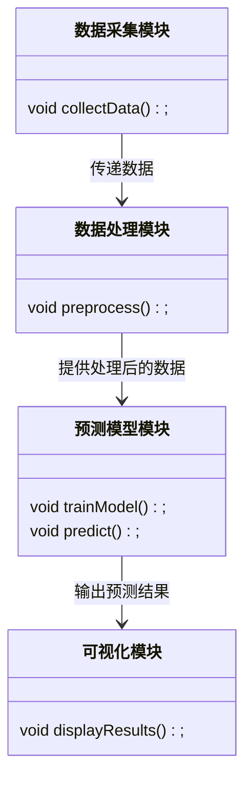
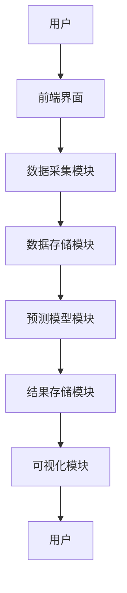
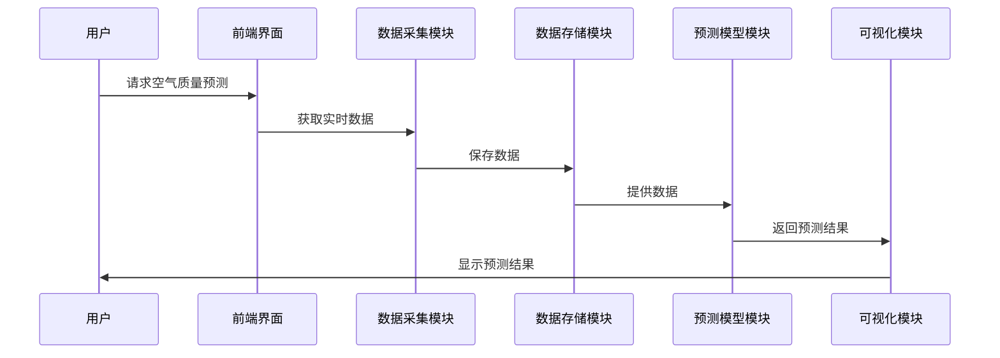

                 


# 价值投资中的智能城市空气质量预测系统分析

> 关键词：智能城市，空气质量预测，价值投资，时间序列分析，机器学习，系统架构

> 摘要：本文深入探讨了在智能城市背景下，利用空气质量预测系统进行价值投资的潜力与方法。通过分析空气质量预测系统的算法原理、系统架构及其实战应用，本文为投资者提供了一种基于技术驱动的决策支持工具，帮助其在价值投资中做出更明智的决策。

---

## 第1章 价值投资与智能城市空气质量预测系统概述

### 1.1 空气质量预测系统的背景与意义
#### 1.1.1 空气污染问题的全球现状
近年来，全球范围内空气污染问题日益严重，尤其是发展中国家的快速工业化和城市化进程，导致空气质量急剧恶化。世界卫生组织（WHO）数据显示，每年有超过700万人因空气污染导致的疾病而死亡。这一问题不仅威胁人类健康，还对经济发展和城市化进程构成了严峻挑战。

#### 1.1.2 智能城市发展的背景
智能城市是通过物联网、大数据、人工智能等技术手段，优化城市资源配置、提升居民生活质量的城市发展模式。随着技术的进步，智能城市的建设在全球范围内掀起热潮。空气质量作为城市环境的重要组成部分，其监测与预测成为智能城市建设中的关键环节。

#### 1.1.3 空气质量预测系统的重要性
空气质量预测系统通过实时监测和分析空气数据，提供未来一段时间内的空气质量预测结果。这对于城市居民的生活健康、企业的生产活动以及政府的环境管理都具有重要意义。在价值投资领域，空气质量预测系统可以为投资者提供关键的决策支持，帮助其评估相关企业的长期发展潜力。

---

### 1.2 价值投资的基本概念
#### 1.2.1 价值投资的定义与核心理念
价值投资是一种长期投资策略，其核心理念是通过深入分析企业的基本面，寻找市场价格低于其内在价值的投资标的。这种投资方式强调长期持有优质资产，而非短期价格波动。

#### 1.2.2 价值投资与智能城市的结合
随着智能城市的发展，越来越多的企业参与到城市环境优化和智能技术应用中。价值投资者可以通过分析这些企业的竞争优势、财务状况和市场前景，找到具有长期增长潜力的投资标的。

#### 1.2.3 空气质量预测系统在价值投资中的应用潜力
空气质量预测系统可以通过技术手段提供实时的空气质量数据，帮助投资者评估相关企业的经营环境和市场机会。例如，环保企业、能源企业和智能设备制造商的业绩可能与空气质量密切相关。

---

### 1.3 空气质量预测系统与价值投资的结合
#### 1.3.1 系统如何帮助投资者做出决策
空气质量预测系统可以为投资者提供以下帮助：
1. **识别投资机会**：通过分析空气质量数据，投资者可以发现哪些城市或行业可能因环境改善而受益。
2. **评估企业风险**：空气质量差可能导致企业生产成本增加或市场需求下降，投资者可以通过系统预测潜在风险。
3. **优化投资组合**：根据空气质量预测结果，投资者可以动态调整其投资组合，降低风险，提升收益。

#### 1.3.2 空气质量对城市经济的影响
空气质量直接影响居民健康、企业生产效率和城市形象。良好的空气质量可以提升城市的吸引力，吸引更多投资和人才，从而推动经济增长。相反，严重的空气污染可能导致企业利润下降，人才流失，进而影响城市的长期发展。

#### 1.3.3 系统预测的准确性与投资回报的关系
空气质量预测系统的准确性直接影响其对投资决策的支持能力。高精度的预测系统可以帮助投资者做出更明智的决策，从而提高投资回报率。因此，开发和优化空气质量预测系统对于价值投资具有重要意义。

---

## 第2章 空气质量预测系统的核心概念与联系

### 2.1 空气质量预测系统的基本原理
#### 2.1.1 数据采集与处理
空气质量预测系统需要收集多源数据，包括气象数据（温度、湿度、风速等）、污染源排放数据（工业排放、交通尾气等）以及历史空气质量数据。这些数据需要经过清洗、融合和预处理，以便后续分析。

#### 2.1.2 数据分析与建模
通过机器学习算法（如ARIMA、LSTM）和统计模型，对处理后的数据进行建模和预测。模型需要不断优化，以提高预测精度。

#### 2.1.3 预测结果的输出与可视化
系统将预测结果以直观的方式呈现给用户，例如生成空气质量指数（AQI）图表或预警信息。

---

### 2.2 价值投资中的系统特征
#### 2.2.1 数据的实时性与准确性
价值投资需要依赖高质量的数据支持，空气质量预测系统的数据必须实时更新且准确可靠。

#### 2.2.2 系统的可扩展性与可维护性
随着城市化进程的加快，空气质量数据量将急剧增加。系统需要具备良好的可扩展性和可维护性，以应对未来的数据增长和技术升级。

#### 2.2.3 系统的用户友好性与决策支持功能
投资者需要通过友好的用户界面快速获取预测结果，并根据系统提供的决策支持信息做出投资决策。

---

### 2.3 系统架构的ER实体关系图

```mermaid
erDiagram
    customer[投资者]
    city[城市]
    sensor[空气质量传感器]
    data_source[数据源]
    prediction_model[预测模型]
    result[预测结果]

    customer --> prediction_model : 使用预测结果进行投资决策
    city --> sensor : 部署空气质量传感器
    sensor --> data_source : 采集数据
    data_source --> prediction_model : 提供数据支持
    prediction_model --> result : 输出预测结果
```

---

## 第3章 空气质量预测系统的算法原理

### 3.1 时间序列分析方法
#### 3.1.1 ARIMA模型的原理与应用
ARIMA（自回归积分滑动平均）模型是一种常用的时间序列预测方法。它通过捕捉数据的自相关性和趋势特征，对未来值进行预测。

#### 3.1.2 LSTM模型的原理与优势
LSTM（长短期记忆网络）是一种基于循环神经网络的深度学习模型。它能够有效捕捉时间序列中的长期依赖关系，适合处理具有复杂模式的数据。

---

### 3.2 机器学习算法的应用
#### 3.2.1 支持向量回归（SVR）模型
SVR通过构建非线性回归模型，可以有效地处理空气质量数据中的非线性关系。

#### 3.2.2 随机森林模型
随机森林是一种基于决策树的集成学习方法，具有较强的鲁棒性和抗过拟合能力。

#### 3.2.3 神经网络模型的优化与调整
通过调整神经网络的层数、节点数和激活函数，可以进一步提升模型的预测精度。

---

### 3.3 算法实现的Python代码示例
```python
# 使用ARIMA模型进行空气质量预测
from statsmodels.tsa.arima.model import ARIMA

# 假设我们已经收集了历史空气质量数据
data = [75, 80, 78, 85, 90, 88, 95, 100, 95, 90]

# 模型训练
model = ARIMA(data, order=(1, 1, 1))
model_fit = model.fit()

# 预测未来一天的空气质量
forecast = model_fit.forecast(steps=1)
print(forecast)
```

---

## 第4章 系统分析与架构设计方案

### 4.1 问题场景介绍
空气质量预测系统需要满足以下需求：
1. 实时监测城市空气质量数据。
2. 提供未来72小时的空气质量预测。
3. 提供可视化界面，方便投资者查看和分析数据。

---

### 4.2 项目介绍
本项目旨在开发一个基于机器学习的空气质量预测系统，帮助投资者做出更明智的价值投资决策。

---

### 4.3 系统功能设计
#### 4.3.1 领域模型类图


---

### 4.4 系统架构设计
#### 4.4.1 系统架构图


---

### 4.5 接口设计与交互序列图
#### 4.5.1 接口设计
- 数据采集模块提供API接口，接收传感器数据。
- 预测模型模块提供API接口，返回预测结果。

#### 4.5.2 交互序列图


---

## 第5章 项目实战

### 5.1 环境安装
- 安装Python、Jupyter Notebook、NumPy、Pandas、Matplotlib、Scikit-learn、statsmodels等依赖库。

### 5.2 系统核心实现源代码
#### 5.2.1 数据采集模块
```python
import requests

def collect_data(api_key):
    url = f"http://api.airquality.com/?key={api_key}"
    response = requests.get(url)
    return response.json()
```

#### 5.2.2 数据处理模块
```python
import pandas as pd

def preprocess(data):
    df = pd.DataFrame(data)
    df['timestamp'] = pd.to_datetime(df['timestamp'])
    df.set_index('timestamp', inplace=True)
    return df
```

#### 5.2.3 预测模型模块
```python
from statsmodels.tsa.arima.model import ARIMA

def train_model(data, order):
    model = ARIMA(data, order=order)
    model_fit = model.fit()
    return model_fit
```

#### 5.2.4 可视化模块
```python
import matplotlib.pyplot as plt

def visualize_results(prediction):
    plt.figure(figsize=(10, 5))
    plt.plot(prediction, label='预测值')
    plt.xlabel('时间')
    plt.ylabel('空气质量指数')
    plt.legend()
    plt.show()
```

---

### 5.3 实际案例分析
以某城市为例，利用上述代码实现空气质量预测，并分析预测结果对价值投资的指导意义。

---

## 第6章 最佳实践与总结

### 6.1 小结
空气质量预测系统为价值投资提供了重要的决策支持工具。通过准确的空气质量预测，投资者可以更好地评估相关企业的经营环境和市场机会，从而做出更明智的投资决策。

### 6.2 注意事项
- 数据的准确性和实时性是系统的核心。
- 系统的可扩展性和可维护性需要充分考虑。
- 投资者需要结合其他因素进行综合分析，不能仅依赖空气质量预测系统。

### 6.3 未来展望
随着人工智能和大数据技术的不断发展，空气质量预测系统的预测精度和应用范围将进一步提升。未来，系统可以结合更多的环境数据和经济指标，为价值投资提供更全面的决策支持。

---

## 参考文献
1. 环境保护局（ EPA ）空气质量数据报告。
2. 世界卫生组织（ WHO ）空气污染与健康报告。
3. 相关学术论文和书籍。

---

通过本文的分析，我们可以看到，智能城市空气质量预测系统在价值投资中的应用前景广阔。投资者可以通过技术手段，更好地理解和把握市场机会，实现长期稳健的投资收益。

