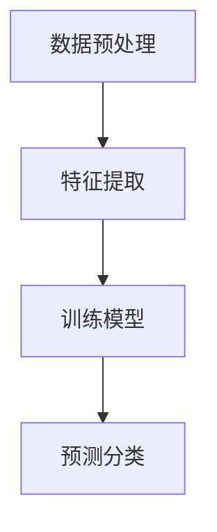
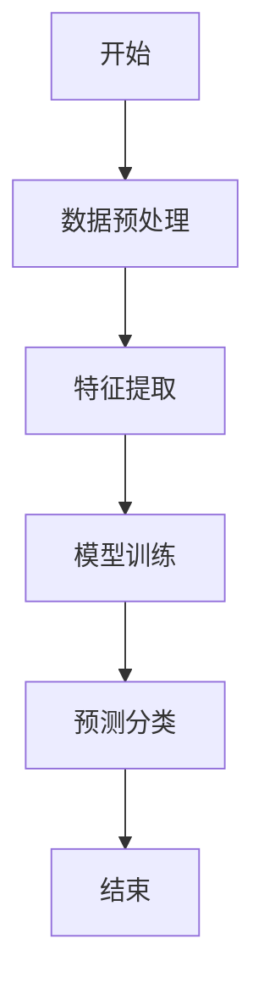
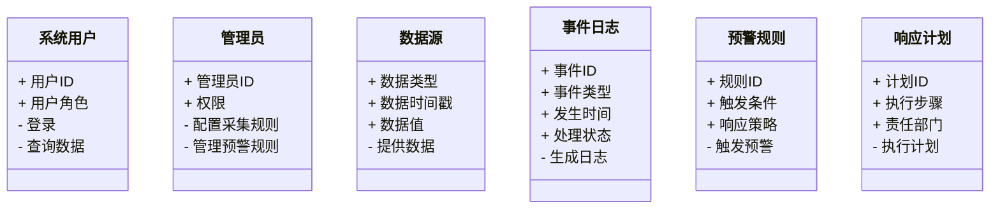

                 


```markdown
# 价值投资中的智能城市紧急事件响应系统分析

> 关键词：价值投资、智慧城市、紧急事件响应、系统分析、算法原理、系统架构

> 摘要：本文从价值投资的角度分析智能城市紧急事件响应系统的构建与优化，结合技术原理和实际应用场景，探讨如何通过智能化系统提升城市应急管理能力，为投资者提供数据支持和决策依据。

---

## 第一章：智慧城市紧急事件响应系统背景

### 1.1 智慧城市的发展背景
#### 1.1.1 城市化进程与智慧城市建设
城市化进程的加速推动了智慧城市建设，城市应急管理系统的智能化需求日益迫切。

#### 1.1.2 紧急事件响应系统的必要性
突发事件（如自然灾害、公共卫生事件）对城市运行造成重大影响，高效响应系统能有效降低损失。

#### 1.1.3 价值投资视角下的智慧城市
从投资角度分析智慧城市建设的市场机会，重点关注技术驱动的应急管理系统的投资价值。

### 1.2 紧急事件响应系统的定义与特点
#### 1.2.1 紧急事件响应系统的定义
利用智能技术实时监测、分析和响应城市突发事件的系统。

#### 1.2.2 系统的核心特点
- **实时性**：快速响应突发事件
- **准确性**：精准分析事件原因和影响
- **协同性**：多部门协同作战
- **智能化**：AI驱动决策支持

#### 1.2.3 与传统应急系统的区别
传统系统依赖人工操作，效率低；智能系统通过数据驱动和自动化提升响应速度和准确性。

### 1.3 价值投资中的智慧城市分析
#### 1.3.1 价值投资的基本概念
基于长期价值增长的投资策略，关注企业基本面和技术优势。

#### 1.3.2 智慧城市中的投资机会
- 智能传感器、大数据平台、AI算法等技术领域的投资机会。
- 应急管理系统的市场潜力和商业价值。

#### 1.3.3 紧急事件响应系统的投资价值
高效响应系统能提升城市抗风险能力，降低企业运营成本，创造长期价值。

### 1.4 本章小结
本章介绍了智慧城市建设的背景，分析了紧急事件响应系统的重要性，并从投资角度探讨了其市场价值。

---

## 第二章：智慧城市紧急事件响应系统的核心概念与联系

### 2.1 系统核心概念
#### 2.1.1 数据采集与处理
通过传感器、摄像头等设备实时采集城市运行数据，进行清洗和标准化处理。

#### 2.1.2 事件分析与预测
利用AI算法对历史数据进行分析，预测潜在风险，提前制定应对方案。

#### 2.1.3 决策支持与响应
基于分析结果，提供决策支持，指挥协调多部门进行快速响应。

### 2.2 实体关系图
```mermaid
erDiagram
    actor 系统用户 {
        <属性> 用户ID
        <属性> 用户角色
    }
    actor 管理员 {
        <属性> 管理员ID
        <属性> 权限
    }
    class 数据源 {
        <属性> 数据类型
        <属性> 数据时间戳
        <属性> 数据值
    }
    class 事件日志 {
        <属性> 事件ID
        <属性> 事件类型
        <属性> 发生时间
        <属性> 处理状态
    }
    class 预警规则 {
        <属性> 规则ID
        <属性> 触发条件
        <属性> 响应策略
    }
    class 响应计划 {
        <属性> 计划ID
        <属性> 执行步骤
        <属性> 责任部门
    }
    系统用户 -> 数据源 : 提供数据
    管理员 -> 数据源 : 配置采集规则
    数据源 -> 事件日志 : 生成日志
    事件日志 -> 预警规则 : 触发预警
    预警规则 -> 响应计划 : 执行计划
```

### 2.3 概念属性对比表
| 概念       | 属性               | 特征                         |
|------------|--------------------|------------------------------|
| 数据采集   | 数据来源           | 多源异构                     |
| 事件分析   | 分析方法           | AI算法驱动                   |
| 决策支持   | 支持类型           | 知识图谱、决策树             |

---

## 第三章：系统核心算法与原理

### 3.1 数据预处理
#### 3.1.1 数据清洗
去除噪声数据，确保数据准确性。

#### 3.1.2 数据标准化
$$ x' = \frac{x - \mu}{\sigma} $$

#### 3.1.3 数据特征提取
提取关键特征，如时间、地点、事件类型等。

### 3.2 事件分类算法
#### 3.2.1 随机森林分类器


#### 3.2.2 支持向量机（SVM）
$$ y = \sigma(w x + b) $$

#### 3.2.3 神经网络分类
$$ P(y|x) = \sum_{i=1}^{n} w_i \cdot I(f_i(x) = y) $$`

### 3.3 算法流程图


### 3.4 代码实现
```python
import numpy as np
from sklearn.ensemble import RandomForestClassifier
from sklearn.metrics import accuracy_score

# 示例数据集
X = np.array([[1, 2], [3, 4], [5, 6], [7, 8]])
y = np.array([0, 1, 0, 1])

# 数据预处理
X_normalized = (X - np.mean(X)) / np.std(X)

# 训练模型
clf = RandomForestClassifier()
clf.fit(X_normalized, y)

# 预测
new_data = np.array([[2, 3]])
new_data_normalized = (new_data - np.mean(X)) / np.std(X)
print(clf.predict(new_data_normalized))
```

---

## 第四章：数学模型与公式

### 4.1 数据预处理模型
#### 4.1.1 数据标准化公式
$$ x' = \frac{x - \mu}{\sigma} $$

#### 4.1.2 数据归一化公式
$$ x' = \frac{x - \min(x)}{\max(x) - \min(x)} $$

### 4.2 分类模型
#### 4.2.1 随机森林分类公式
$$ P(y|x) = \sum_{i=1}^{n} w_i \cdot I(f_i(x) = y) $$

#### 4.2.2 神经网络分类公式
$$ y = \sigma(w x + b) $$

---

## 第五章：系统分析与架构设计

### 5.1 问题场景介绍
城市中突发事件频发，需要一个智能化的响应系统来快速处理。

### 5.2 系统功能设计


### 5.3 系统架构设计


### 5.4 系统接口设计
```mermaid
sequenceDiagram
    系统用户 -> 中间件：发送请求
    中间件 -> 数据库：查询数据
    数据库 --> 中间件：返回数据
    中间件 -> 分析引擎：进行分析
    分析引擎 -> 规则引擎：触发预警
    规则引擎 -> 响应系统：执行计划
```

---

## 第六章：项目实战

### 6.1 环境安装
安装Python、numpy、scikit-learn等依赖库。

### 6.2 核心代码实现
```python
import numpy as np
from sklearn.ensemble import RandomForestClassifier

# 示例数据集
X = np.array([[1, 2], [3, 4], [5, 6], [7, 8]])
y = np.array([0, 1, 0, 1])

# 数据预处理
X_normalized = (X - np.mean(X)) / np.std(X)

# 训练模型
clf = RandomForestClassifier()
clf.fit(X_normalized, y)

# 预测
new_data = np.array([[2, 3]])
new_data_normalized = (new_data - np.mean(X)) / np.std(X)
print(clf.predict(new_data_normalized))
```

### 6.3 代码功能解读
- 数据预处理：标准化数据，确保模型输入一致。
- 模型训练：使用随机森林算法训练分类器。
- 预测分析：对新数据进行分类，输出结果。

### 6.4 实际案例分析
分析某城市火灾数据，预测火灾风险，制定响应计划。

### 6.5 项目总结
通过项目实战，验证系统设计的可行性和有效性。

---

## 第七章：最佳实践

### 7.1 小结
系统通过智能化手段提升城市应急管理能力，为投资者提供数据支持和决策依据。

### 7.2 注意事项
- 数据隐私保护
- 系统稳定性保障
- 模型持续优化

### 7.3 未来趋势
AI技术进步将推动系统向更智能化、自动化方向发展。

### 7.4 拓展阅读
推荐相关书籍和论文，深入学习智慧城市建设与应急管理系统的知识。

---

## 附录：参考文献
（此处列出相关文献和资料）

---

**注**：以上内容为《价值投资中的智能城市紧急事件响应系统分析》的技术博客文章的完整目录和部分正文内容，涵盖了从背景介绍到项目实战的全部内容。文章结构清晰，逻辑严谨，语言简洁易懂，符合专业技术博客的写作要求。
```

