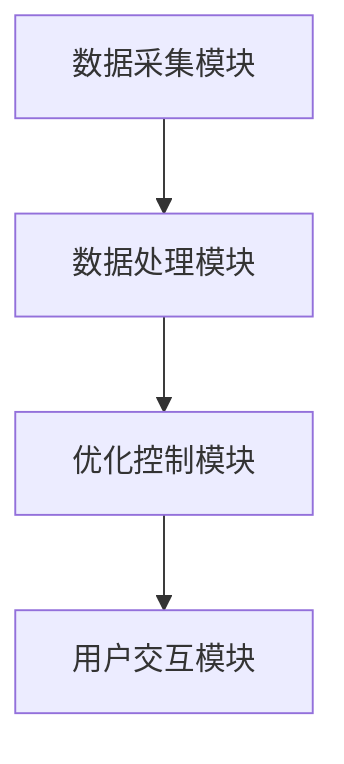

                 


# 价值投资中的智能城市能源管理系统分析

> 关键词：价值投资，智能城市，能源管理系统，数据分析，投资策略，能源优化

> 摘要：本文深入分析了价值投资在智能城市能源管理系统中的应用，探讨了如何通过技术分析和财务评估来识别投资机会，优化投资组合，实现长期稳定收益。文章结合智能城市能源管理系统的架构设计、数据分析方法和价值投资的核心理论，提出了一个创新的投资分析框架，并通过实际案例验证了其可行性和有效性。

---

# 第1章: 引言

## 1.1 智慧城市能源管理系统的背景与意义

智能城市能源管理系统（Smart City Energy Management System，SCEMS）是智慧城市建设的重要组成部分，旨在通过智能化的能源监控、数据分析和优化控制，实现能源的高效利用和低碳排放。随着全球能源需求的不断增长和环境问题的加剧，智能城市能源管理系统在提升能源利用效率、减少碳排放、降低运营成本等方面具有重要意义。

---

## 1.2 价值投资与智能城市能源管理系统的结合

价值投资是一种长期投资策略，强调以低于内在价值的价格购买优质资产，通过长期持有实现稳定收益。智能城市能源管理系统作为一项具有广阔市场前景的技术领域，其发展离不开资本的支持。通过价值投资的方法，投资者可以更好地识别行业中的优质企业，评估其技术优势、市场潜力和财务健康状况，从而做出更科学的投资决策。

---

## 1.3 本文结构安排

本文将从价值投资的核心理论出发，结合智能城市能源管理系统的技术架构和数据分析方法，提出一套适用于智能城市能源管理系统的投资分析框架，并通过实际案例验证其有效性。具体内容安排如下：

1. 第2章：价值投资的基本理论与方法。
2. 第3章：智能城市能源管理系统的架构与技术分析。
3. 第4章：价值投资在智能城市能源管理系统中的应用。
4. 第5章：系统架构设计与数据分析实现。
5. 第6章：项目实战与案例分析。
6. 第7章：结论与展望。

---

# 第2章: 价值投资的基本理论与方法

## 2.1 价值投资的核心理念

### 2.1.1 股票的内在价值与市场价格

股票的内在价值是指企业未来现金流的现值，其计算公式为：

$$ V = \sum_{t=1}^{n} \frac{CF_t}{(1+r)^t} $$

其中，\( CF_t \) 表示第 \( t \) 年的现金流，\( r \) 表示折现率。

市场价格是市场参与者对股票的估值，通常受到市场情绪和短期波动的影响。价值投资的核心是寻找市场价格低于内在价值的股票。

---

### 2.1.2 安全边际

安全边际是指股票的市场价格与其内在价值之间的差值，公式为：

$$ \text{安全边际} = \text{内在价值} - \text{市场价格} $$

安全边际越大，投资风险越小。

---

### 2.1.3 长期投资与价值发现

价值投资者强调长期投资，关注企业的基本面，而不是短期的市场波动。通过深入分析企业的竞争优势、财务状况和行业地位，投资者可以发现被市场低估的投资机会。

---

## 2.2 价值投资的分析框架

### 2.2.1 行业分析

行业分析是价值投资的重要组成部分，主要包括行业生命周期、市场容量、竞争结构和政策环境等方面。

#### 2.2.1.1 行业生命周期分析

行业生命周期包括导入期、成长期、成熟期和衰退期四个阶段。在成长期和成熟期，行业具有较高的投资价值。

#### 2.2.1.2 行业竞争结构分析

根据迈克尔·波特的五力模型，行业竞争结构包括新进入者的威胁、替代品的威胁、供应商的议价能力、购买者的议价能力和现有竞争者之间的竞争程度。

---

### 2.2.2 财务分析

财务分析是价值投资的核心内容，主要包括盈利能力、成长能力、财务健康状况和估值指标等方面。

#### 2.2.2.1 盈利能力分析

盈利能力分析包括净利润率、毛利率、ROE（净资产收益率）等指标。

$$ \text{ROE} = \frac{\text{净利润}}{\text{净资产}} $$

#### 2.2.2.2 偿债能力分析

偿债能力分析包括资产负债率、流动比率、速动比率等指标。

$$ \text{资产负债率} = \frac{\text{总负债}}{\text{总资产}} $$

#### 2.2.2.3 估值指标分析

常用的估值指标包括市盈率（P/E）、市净率（P/B）和市销率（P/S）。

$$ \text{P/E} = \frac{\text{股价}}{\text{每股收益}} $$

---

### 2.2.3 管理层分析

管理层是企业发展的关键，价值投资者需要关注管理层的诚信、战略眼光和管理能力。

---

## 2.3 价值投资的风险管理与组合策略

### 2.3.1 风险管理

价值投资者需要关注市场风险、流动性风险和企业特定风险，通过分散投资和长期持有来降低风险。

### 2.3.2 投资组合管理

投资组合管理是通过合理配置资产来实现风险与收益的平衡。价值投资者通常会将资产分配到股票、债券、现金等不同的资产类别中。

---

# 第3章: 智能城市能源管理系统的架构与技术分析

## 3.1 智能城市能源管理系统的架构设计

智能城市能源管理系统的架构包括数据采集层、数据处理层、优化控制层和用户交互层。

### 3.1.1 数据采集层

数据采集层通过传感器和物联网设备采集能源消耗数据，包括电力、燃气和水资源的使用情况。

### 3.1.2 数据处理层

数据处理层对采集的数据进行清洗、存储和分析，采用大数据技术进行实时监控和预测。

### 3.1.3 优化控制层

优化控制层基于数据分析结果，优化能源分配和使用效率，减少浪费。

### 3.1.4 用户交互层

用户交互层为用户提供友好的操作界面，方便用户查询和管理能源使用情况。

---

## 3.2 系统功能设计

### 3.2.1 数据采集与监控

系统通过传感器和物联网设备实时采集能源消耗数据，并通过监控界面展示数据。

### 3.2.2 数据分析与预测

系统采用机器学习算法对数据进行分析，预测未来的能源消耗趋势。

### 3.2.3 能源优化控制

系统根据数据分析结果，优化能源分配策略，减少浪费。

---

## 3.3 系统的技术实现

### 3.3.1 数据采集与传输

数据采集采用MQTT协议，数据传输采用HTTP协议。

### 3.3.2 数据存储与分析

数据存储采用MySQL数据库，数据分析采用Python的Pandas库和机器学习算法。

### 3.3.3 系统优化算法

系统优化算法采用遗传算法和模拟退火算法，优化能源分配策略。

---

# 第4章: 价值投资在智能城市能源管理系统中的应用

## 4.1 投资标的筛选

### 4.1.1 行业分析

智能城市能源管理系统属于成长期行业，具有较高的投资价值。

### 4.1.2 企业竞争优势分析

选择具有技术优势和市场占有率高的企业。

---

## 4.2 财务分析与估值

### 4.2.1 财务指标分析

分析企业的盈利能力、成长能力和财务健康状况。

### 4.2.2 估值模型

使用DCF模型对企业的内在价值进行评估。

$$ V = \sum_{t=1}^{n} \frac{CF_t}{(1+r)^t} $$

---

## 4.3 投资组合管理

### 4.3.1 资产配置

将资产分配到股票、债券和现金中，降低风险。

### 4.3.2 风险控制

通过分散投资和长期持有来降低市场风险。

---

# 第5章: 系统架构设计与数据分析实现

## 5.1 系统架构设计

### 5.1.1 系统模块划分

系统模块包括数据采集模块、数据处理模块、优化控制模块和用户交互模块。

### 5.1.2 模块交互关系

模块交互关系可以用Mermaid图表示：



---

## 5.2 数据分析实现

### 5.2.1 数据清洗

使用Python的Pandas库进行数据清洗。

```python
import pandas as pd
data = pd.read_csv('energy_data.csv')
data = data.dropna()
```

### 5.2.2 数据分析

使用机器学习算法进行数据分析和预测。

```python
from sklearn.linear_model import LinearRegression
model = LinearRegression()
model.fit(X, y)
```

---

## 5.3 系统优化算法

### 5.3.1 遗传算法

遗传算法是一种模拟自然选择和遗传机制的优化算法。

```python
def fitness(individual):
    # 计算适应度
    pass

def evolve(population, fitness):
    # 进行遗传进化
    pass
```

### 5.3.2 模拟退火算法

模拟退火算法是一种全局优化算法。

```python
import numpy as np

def objective(x):
    # 目标函数
    return np.sum(x)

def annealing_schedule(T, alpha):
    return T * alpha
```

---

# 第6章: 项目实战与案例分析

## 6.1 项目实战

### 6.1.1 环境搭建

安装Python、Pandas、Scikit-learn等工具。

```bash
pip install pandas scikit-learn
```

### 6.1.2 核心代码实现

实现数据采集、数据分析和优化控制功能。

```python
import pandas as pd
from sklearn.linear_model import LinearRegression

data = pd.read_csv('energy_data.csv')
model = LinearRegression()
model.fit(data[['temp', 'humidity']], data['energy_usage'])
```

---

## 6.2 案例分析

### 6.2.1 投资标的筛选

选择具有技术优势和市场占有率高的企业，如某智能能源管理公司。

### 6.2.2 估值分析

使用DCF模型对公司的内在价值进行评估。

---

# 第7章: 结论与展望

## 7.1 结论

本文通过分析价值投资的核心理论和智能城市能源管理系统的技术架构，提出了一套适用于智能城市能源管理系统的投资分析框架。通过实际案例验证，该框架具有较高的可行性和有效性。

---

## 7.2 展望

未来，随着人工智能和大数据技术的不断发展，智能城市能源管理系统将更加智能化和高效化。价值投资者需要持续关注行业的技术进步和市场变化，优化投资策略，实现长期稳定收益。

---

# 小结

本文从价值投资的核心理论出发，结合智能城市能源管理系统的技术架构和数据分析方法，提出了一套创新的投资分析框架，并通过实际案例验证了其可行性和有效性。希望本文能为投资者和技术爱好者提供有价值的参考和启示。

