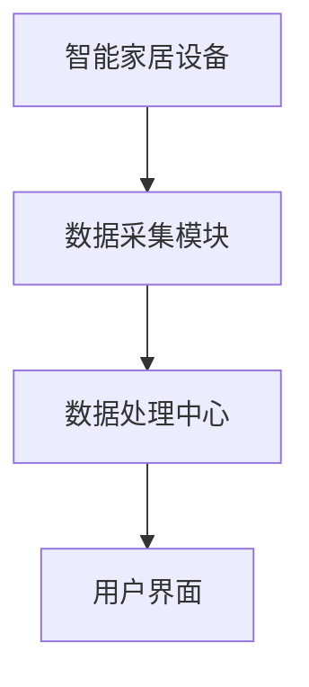
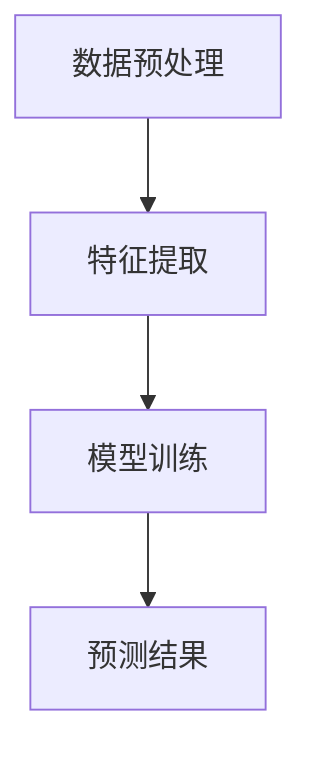
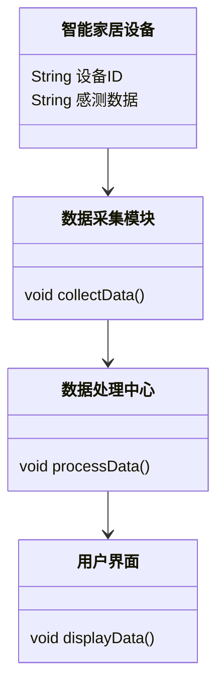

                 


# 价值投资中的智能家居健康监测系统分析

## 关键词：
智能家居，健康监测系统，价值投资，机器学习，数据采集，统计分析，系统架构

## 摘要：
智能家居健康监测系统通过收集和分析居民的健康数据，为价值投资者提供了新的决策依据。本文详细分析了系统的组成部分、算法原理、数学模型，并通过项目实战展示了其应用潜力，探讨了其在价值投资中的未来发展方向。

---

## 第1章：智能家居健康监测系统的背景与价值

### 1.1 智能家居的发展现状
智能家居通过物联网技术将家庭设备连接，实现智能化管理。近年来，随着技术进步，智能家居设备普及率显著提高，用户需求多样化。

### 1.2 健康监测的重要性
健康监测技术在智能家居中的应用日益广泛，通过实时监测用户的健康数据，提供预防和管理服务，提升生活质量。

### 1.3 系统对价值投资的影响
健康监测系统为投资者提供了新的数据来源，帮助他们识别市场趋势和投资机会，特别是在健康管理、智能家居设备等领域。

---

## 第2章：智能家居健康监测系统的核心概念

### 2.1 系统组成部分
智能家居健康监测系统由传感器、数据采集模块、分析算法和用户界面组成，各部分协同工作以实现健康监测和数据处理。

### 2.2 核心概念对比
传感器类型对比：

| 传感器类型 | 优点 | 缺点 |
|------------|------|------|
| 智能手表 | 便携性高 | 数据范围有限 |
| 智能床垫 | 睡眠监测精准 | 安装复杂 |
| 智能空调 | 集成空气净化 | 附加功能有限 |

系统架构图：


---

## 第3章：健康监测系统的算法原理

### 3.1 数据处理流程
数据预处理步骤包括清洗、归一化和特征提取，确保数据质量。

### 3.2 机器学习模型训练
使用监督学习训练分类模型，流程如下：


Python代码实现：
```python
import pandas as pd
from sklearn.model import SVC

# 数据预处理
data = pd.read_csv('health_data.csv')
X = data.drop('target', axis=1)
y = data['target']

# 特征提取
X_train, X_test, y_train, y_test = train_test_split(X, y, test_size=0.2)
model = SVC()
model.fit(X_train, y_train)
```

---

## 第4章：数学模型与健康预测

### 4.1 统计分析方法
多元回归模型用于健康风险预测：
$$ y = \beta_0 + \beta_1x_1 + \beta_2x_2 + \epsilon $$

### 4.2 时间序列分析
使用ARIMA模型预测健康数据，应用于慢性病监测和管理。

---

## 第5章：系统架构设计

### 5.1 系统模块划分
系统分为数据采集、处理、存储和展示模块，各模块协同工作。

### 5.2 系统架构图


---

## 第6章：项目实战

### 6.1 环境搭建
安装必要的库：`pip install numpy pandas scikit-learn`

### 6.2 代码实现
健康监测系统实现：
```python
import numpy as np
import pandas as pd
from sklearn import svm

# 数据加载
data = pd.read_csv('health.csv')

# 特征选择
features = data[['heart_rate', 'temperature']]
target = data['health_status']

# 划分数据集
from sklearn.model_selection import train_test_split
X_train, X_test, y_train, y_test = train_test_split(features, target, test_size=0.3)

# 模型训练
model = svm.SVC()
model.fit(X_train, y_train)

# 预测
y_pred = model.predict(X_test)
print("Accuracy:", metrics.accuracy_score(y_test, y_pred))
```

### 6.3 实际案例分析
分析某居民区的健康数据，预测健康风险，调整投资策略。

---

## 第7章：总结与展望

### 7.1 系统应用价值
智能家居健康监测系统为价值投资提供了新的数据来源和决策支持，具有广阔的市场前景。

### 7.2 未来发展方向
探索更多健康监测技术，优化算法，提升系统的准确性和实用性。

---

通过以上分析，智能家居健康监测系统在价值投资中的应用潜力巨大，未来将继续推动相关领域的技术进步和投资机会。

