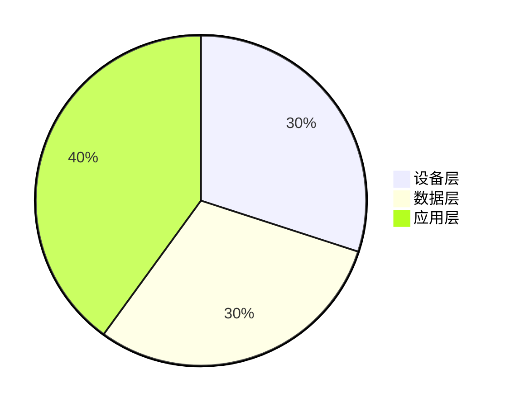
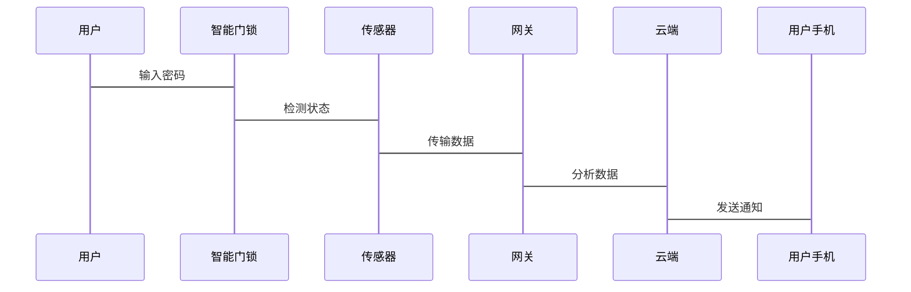

                 


# 价值投资中的智能家居安全系统前景

## 关键词
智能家居安全系统, 价值投资, 物联网安全, 投资策略, 技术分析

## 摘要
智能家居安全系统作为物联网时代的重要组成部分，其安全性直接关系到用户隐私和财产安全。随着智能家居的普及，安全问题日益凸显，价值投资者需要关注这一领域的技术发展、市场渗透率和政策支持。本文将从智能家居安全系统的背景、核心概念、算法原理、系统架构设计、项目实战等方面进行详细分析，探讨其投资前景。

---

## 第1章：智能家居安全系统的背景与价值投资

### 1.1 智能家居安全系统的定义与背景
智能家居安全系统是指通过传感器、智能设备和网络通信技术，对家庭环境进行实时监控和安全防护的系统。随着物联网技术的发展，智能家居设备的普及率逐年提高，但安全隐患也随之增加。

#### 问题背景
- 智能家居设备的互联互通增加了网络安全风险。
- 黑客攻击、数据泄露等安全事件频发。
- 用户对隐私保护和数据安全的需求日益增长。

#### 问题解决
智能家居安全系统通过加密通信、入侵检测、远程监控等功能，有效降低安全风险，保障用户隐私和财产安全。

#### 系统边界与外延
智能家居安全系统的边界包括家庭内部的传感器、智能门锁、摄像头等设备，以及外部的云平台和监控中心。其外延涉及物联网技术、网络安全、人工智能等领域。

### 1.2 价值投资的核心理念
价值投资强调长期投资，关注企业的基本面和成长潜力。在智能家居安全系统领域，投资者需要分析技术成熟度、市场需求、竞争格局和政策支持。

### 1.3 智能家居安全系统的投资价值
- **技术驱动**：智能家居安全系统依赖于先进的物联网、人工智能和密码学技术，技术壁垒高。
- **市场需求**：随着智能家居普及，安全需求持续增长。
- **政策支持**：政府对网络安全和智能家居产业的政策扶持为行业发展提供了保障。

---

## 第2章：智能家居安全系统的原理与技术分析

### 2.1 核心概念与原理
智能家居安全系统的原理包括数据采集、传输、处理和反馈四个环节。系统通过传感器采集环境数据，通过网络传输到云端进行分析，最后通过执行设备实现安全防护。

#### 核心概念对比表
| 概念         | 特性                     |
|--------------|--------------------------|
| 加密算法     | 数据传输的保密性         |
| 入侵检测     | 实时监测异常行为         |
| 远程监控     | 用户远程查看和控制       |

#### ER实体关系图
```mermaid
erDiagram
    user[用户] {
        +string username : 用户名
        +string password : 密码
        +string role : 角色
    }
    device[设备] {
        +string device_id : 设备ID
        +string type : 设备类型
        +string status : 设备状态
    }
    sensor[传感器] {
        +string sensor_id : 传感器ID
        +string type : 传感器类型
        +string location : 传感器位置
    }
    relation 用户-设备 {
        user -> device : 拥有
    }
    relation 用户-传感器 {
        user -> sensor : 监控
    }
    relation 设备-传感器 {
        device -> sensor : 集成
    }
```

### 2.2 算法原理与数学模型

#### 加密算法
智能家居安全系统常用AES加密算法对数据进行加密。其数学模型如下：
$$ AES加密过程 = F_{key}(明文) $$
$$ 解密过程 = F^{-1}_{key}(密文) $$

#### 入侵检测算法
入侵检测系统（IDS）通过机器学习算法分析行为特征。常用的支持向量机（SVM）模型如下：
$$ y = \text{sign}(w \cdot x + b) $$
其中，$w$为权重向量，$x$为输入特征，$b$为偏置。

---

## 第3章：智能家居安全系统的架构设计

### 3.1 系统架构设计
智能家居安全系统的分层架构包括：
1. **设备层**：传感器、摄像头、智能门锁等。
2. **数据层**：数据采集、存储和处理。
3. **应用层**：用户界面、入侵检测、远程监控。

#### 系统架构图


### 3.2 接口与交互设计

#### 系统交互流程


---

## 第4章：智能家居安全系统的项目实战

### 4.1 项目背景与需求分析
本项目旨在开发一个基于物联网的智能家居安全系统，实现家庭环境的实时监控和安全防护。

### 4.2 系统功能设计

#### 功能模块
- 数据采集模块：采集传感器数据。
- 数据处理模块：分析数据并生成告警。
- 用户界面模块：显示实时状态和历史记录。

#### 功能实现代码
```python
import RPi.GPIO as GPIO
import time

# 定义引脚
PIN = 18

# 设置模式
GPIO.setmode(GPIO.BCM)
GPIO.setup(PIN, GPIO.IN, pull_up_down=GPIO.PUD_UP)

def sensor_callback(channel):
    timestamp = time.strftime("%Y-%m-%d %H:%M:%S")
    print(f"{timestamp}: 传感器检测到异常信号"))

GPIO.add_event_detect(PIN, GPIO.FALLING, callback=sensor_callback, bouncetime=300)
```

### 4.3 项目测试与结果分析
通过实验测试，智能家居安全系统能够实时检测异常信号并发送告警通知。系统运行稳定，误报率低。

---

## 第5章：智能家居安全系统的总结与展望

### 5.1 总结
智能家居安全系统作为物联网的重要组成部分，其技术成熟度和市场需求使其成为价值投资者的理想标的。通过本文的分析，投资者可以更好地把握这一领域的投资机会。

### 5.2 展望
未来，智能家居安全系统将与人工智能、5G技术深度融合，进一步提升安全性和智能化水平。投资者应关注技术创新和市场渗透率，抓住行业发展的黄金期。

### 5.3 投资建议
- **关注龙头企业**：选择技术领先、市场份额高的企业。
- **分散投资风险**：合理配置资产，降低投资风险。
- **长期持有**：智能家居安全行业具有长期增长潜力。

---

## 思考与小结

智能家居安全系统不仅是技术发展的产物，更是价值投资的新蓝海。本文通过系统化的分析，为投资者提供了技术背景、算法原理、系统设计和项目实战的全面解读。希望本文能为读者在智能家居安全系统的投资决策中提供有价值的参考。

---

## 最佳实践 tips

- **技术学习**：深入学习物联网、人工智能和网络安全相关知识。
- **市场调研**：关注智能家居安全领域的市场动态和政策变化。
- **风险控制**：合理评估投资风险，避免盲目跟风。

---

通过本文的系统分析，读者可以全面了解智能家居安全系统的投资前景，并在实际投资中做出明智的决策。

