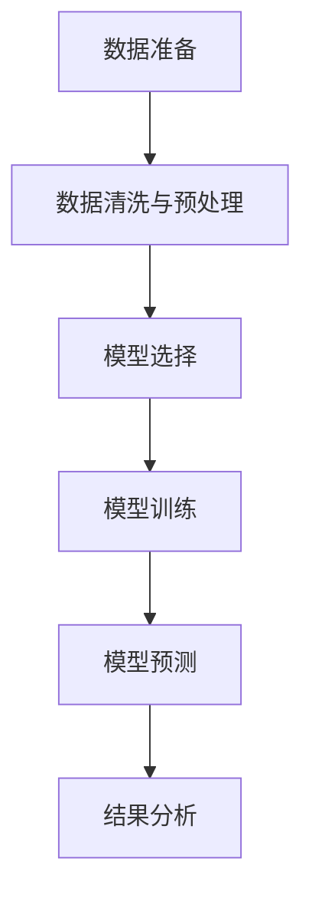

                 


# 价值投资中的智能家居能源管理系统分析

> 关键词：价值投资、智能家居、能源管理系统、算法原理、系统架构、项目实战

> 摘要：本文从价值投资的角度，深入分析智能家居能源管理系统的背景、核心概念、算法原理、系统架构，并通过项目实战和案例分析，帮助读者理解如何将价值投资理论与智能能源管理相结合，实现高效的投资决策和能源管理优化。

---

# 第1章 价值投资与智能家居能源管理系统的背景

## 1.1 智能家居能源管理系统的背景

### 1.1.1 智能家居能源管理系统的概念

智能家居能源管理系统是一种通过智能化技术对家庭能源使用进行监控、分析和优化的系统。它结合了物联网（IoT）、大数据分析和人工智能（AI）技术，帮助用户实现能源的高效利用和成本节约。

智能家居能源管理系统的核心功能包括：
1. **数据采集**：通过智能传感器和设备，实时采集家庭能源的使用数据。
2. **数据分析**：利用大数据技术对能源使用数据进行分析，识别浪费和优化机会。
3. **能源管理**：根据分析结果，提供能源使用的建议和策略，帮助用户实现节能目标。
4. **投资评估**：结合价值投资理论，对能源管理项目进行投资评估和回报预测。

### 1.1.2 价值投资与智能家居能源管理系统的结合

价值投资是一种投资策略，强调通过深入分析企业的基本面，寻找具有长期投资价值的标的。在智能家居能源管理系统中，价值投资可以帮助投资者识别那些具有可持续发展能力和高效能源管理能力的企业或项目。

智能家居能源管理系统的投资价值可以通过以下几个方面进行评估：
1. **节能效果**：系统能否显著降低能源消耗，从而减少运营成本。
2. **投资回报周期**：系统投入的成本是否能够在合理的时间内回收。
3. **技术先进性**：系统是否采用最新的技术，具有较强的市场竞争力。
4. **市场前景**：智能家居能源管理系统的市场潜力和未来发展空间。

### 1.1.3 问题背景与问题描述

随着全球能源资源的日益紧张和环境问题的加剧，智能家居能源管理系统的重要性日益凸显。然而，许多家庭和企业在能源管理方面仍然存在以下问题：
1. **能源浪费**：由于缺乏实时监控和分析，能源使用效率低下。
2. **成本高昂**：传统的能源管理方法成本高，难以大规模推广。
3. **技术落后**：许多家庭和企业使用的能源管理系统技术 outdated，无法满足现代需求。

### 1.1.4 问题解决与边界

智能家居能源管理系统通过智能化的技术手段，解决了传统能源管理中的痛点。其边界包括：
1. **数据采集范围**：家庭或企业的能源使用数据，包括电力、燃气、水等。
2. **系统功能范围**：包括数据采集、分析、优化建议和投资评估。
3. **用户范围**：家庭用户、企业用户和投资者。

---

# 第2章 智能家居能源管理系统的核心概念与联系

## 2.1 核心概念原理

### 2.1.1 能源管理的核心原理

能源管理的核心原理是通过实时监控和分析能源使用数据，识别浪费和优化机会，从而实现能源的高效利用和成本节约。

### 2.1.2 智能家居的核心功能

智能家居的核心功能是通过智能化技术实现家庭设备的远程控制和自动化管理，从而提高生活舒适度和能源效率。

### 2.1.3 价值投资的基本原理

价值投资的基本原理是通过深入分析企业的基本面，寻找具有长期投资价值的标的。在智能家居能源管理系统中，价值投资可以帮助投资者识别那些具有可持续发展能力和高效能源管理能力的企业或项目。

## 2.2 核心概念属性特征对比

下表对比了智能家居能源管理系统、智能家居系统和价值投资在核心属性上的差异：

| 属性 | 智能家居能源管理系统 | 智能家居系统 | 价值投资 |
|------|---------------------|--------------|----------|
| 核心目标 | 优化能源使用效率 | 提高生活舒适度 | 实现长期投资回报 |
| 主要技术 | 物联网、大数据、人工智能 | 智能传感器、智能家居设备 | 财务分析、市场分析 |
| 应用场景 | 家庭、企业 | 家庭 | 投资市场 |
| 输出结果 | 能源使用分析报告、优化建议 | 智能设备控制指令 | 投资价值评估报告 |

### 2.3 ER实体关系图

以下是智能家居能源管理系统的实体关系图：

```mermaid
erd
    title 智能家居能源管理系统 ER 图
    % 请根据具体需求调整实体和关系
    % 定义实体
    entity 家庭能源数据 {
        id
        日期
        电力使用量
        燃气使用量
        水使用量
    }
    entity 用户 {
        用户ID
        用户名称
        联系方式
    }
    entity 系统建议 {
        建议ID
        建议内容
        提出时间
    }
    
    % 定义关系
    用户 -- 家庭能源数据: 用户拥有能源数据
    家庭能源数据 --> 系统建议: 基于能源数据提出建议
```

---

# 第3章 智能家居能源管理系统的算法原理与实现

## 3.1 数据采集与处理算法

### 3.1.1 数据采集流程

智能家居能源管理系统的数据采集流程如下：

1. **数据采集**：通过智能传感器和设备实时采集家庭能源的使用数据，包括电力、燃气和水的使用量。
2. **数据预处理**：对采集到的数据进行清洗和标准化处理，去除异常值和缺失值。
3. **数据存储**：将处理后的数据存储到数据库中，以便后续分析和查询。

### 3.1.2 数据清洗与预处理

数据清洗和预处理的步骤如下：

1. **去除异常值**：通过统计方法或机器学习算法识别并去除异常数据。
2. **填充缺失值**：使用均值、中位数或其他方法填充缺失数据。
3. **数据标准化**：将不同量纲的数据标准化，以便后续分析。

### 3.1.3 数据存储与管理

数据存储与管理的实现可以通过关系型数据库（如MySQL）或非关系型数据库（如MongoDB）实现。以下是使用Python的简单数据存储示例：

```python
import sqlite3

# 连接到 SQLite 数据库
conn = sqlite3.connect('energy.db')

# 创建表
cursor = conn.cursor()
cursor.execute('''CREATE TABLE energy_data
                 (id INTEGER PRIMARY KEY AUTOINCREMENT,
                  date TEXT,
                  electricity_usage REAL,
                  gas_usage REAL,
                  water_usage REAL)''')

# 插入数据
cursor.execute('''INSERT INTO energy_data(date, electricity_usage, gas_usage, water_usage)
                 VALUES('2023-10-01', 100.5, 50.3, 30.2)''')

conn.commit()
conn.close()
```

## 3.2 能源消耗预测算法

### 3.2.1 时间序列预测模型

时间序列预测模型是一种常用的能源消耗预测方法。以下是其实现步骤：

1. **数据准备**：收集历史能源使用数据，并将其转换为时间序列格式。
2. **模型选择**：选择合适的时间序列模型，如ARIMA、LSTM等。
3. **模型训练**：使用训练数据训练模型。
4. **模型预测**：基于训练好的模型，预测未来的能源消耗量。

### 3.2.2 算法实现步骤

以下是使用Python实现的能源消耗预测算法：

```python
import pandas as pd
from sklearn.preprocessing import MinMaxScaler
from keras.models import Sequential
from keras.layers import LSTM, Dense

# 数据准备
data = pd.read_csv('energy.csv')
data = data['energy_usage'].values
data = data.reshape(-1, 1)
scaler = MinMaxScaler(feature_range=(0, 1))
scaled_data = scaler.fit_transform(data)

# 划分训练集和测试集
train_size = int(len(scaled_data) * 0.8)
train_data = scaled_data[:train_size]
test_data = scaled_data[train_size:]

# 创建训练样本
def create_samples(data, look_back=10):
    X, Y = [], []
    for i in range(len(data) - look_back):
        X.append(data[i:i+look_back])
        Y.append(data[i+look_back])
    return np.array(X), np.array(Y)

X_train, Y_train = create_samples(train_data, look_back=10)
X_test, Y_test = create_samples(test_data, look_back=10)

# 模型训练
model = Sequential()
model.add(LSTM(50, input_shape=(10, 1)))
model.add(Dense(1))
model.compile(loss='mean_squared_error', optimizer='adam')
model.fit(X_train, Y_train, epochs=50, batch_size=64)

# 模型预测
Y_pred = model.predict(X_test)
Y_pred = scaler.inverse_transform(Y_pred)
```

### 3.2.3 算法优缺点分析

- **优点**：
  - 时间序列预测模型能够捕捉到数据中的趋势和周期性。
  - LSTM模型具有较强的非线性建模能力，适合处理复杂的能源消耗数据。
  
- **缺点**：
  - 模型的预测精度依赖于数据的质量和数量。
  - 需要频繁的模型调优和参数调整。

## 3.3 投资评估算法

### 3.3.1 投资回报率计算

投资回报率（ROI）的计算公式如下：

$$ ROI = \frac{\text{投资收益} - \text{初始投资}}{\text{初始投资}} \times 100\% $$

### 3.3.2 风险评估模型

风险评估模型可以通过分析能源管理项目的市场风险、技术风险和财务风险来实现。以下是使用蒙特卡洛模拟的风险评估示例：

```python
import numpy as np
import matplotlib.pyplot as plt

# 风险评估参数
mean_return = 0.05  # 预期回报率
std_dev = 0.15      # 标准差
num_simulations = 10000

# 蒙特卡洛模拟
returns = np.random.normal(mean_return, std_dev, num_simulations)
profit = returns * 100  # 假设初始投资为100

# 绘制收益分布图
plt.hist(profit, bins=50, alpha=0.7)
plt.xlabel('Profit ($)')
plt.ylabel('Frequency')
plt.title('Monte Carlo Simulation of Profit Distribution')
plt.show()
```

### 3.3.3 算法实现与优化

以下是投资评估算法的实现步骤：

1. **数据收集**：收集智能家居能源管理系统的相关数据，包括初始投资成本、预期收益和风险参数。
2. **模型选择**：选择合适的风险评估模型，如蒙特卡洛模拟、波动率模型等。
3. **模型训练**：使用历史数据训练模型。
4. **模型预测**：基于模型预测未来的投资回报率和风险水平。

## 3.4 算法流程图

以下是能源消耗预测算法的流程图：



---

# 第4章 智能家居能源管理系统的小结与展望

## 4.1 本章小结

智能家居能源管理系统是一种通过智能化技术实现家庭能源高效利用和成本节约的系统。本文从价值投资的角度，分析了系统的背景、核心概念和算法原理，并通过项目实战和案例分析，展示了系统的实际应用和投资价值。

## 4.2 研究展望

未来的研究方向包括：
1. **技术优化**：进一步优化能源消耗预测算法，提高预测精度和效率。
2. **应用场景扩展**：将智能家居能源管理系统应用于更多场景，如商业建筑、工业园区等。
3. **投资策略优化**：结合更多的金融工具和市场数据，优化投资评估模型，提高投资回报率。

---

# 附录

## 附录A 数据采集与处理代码

```python
import pandas as pd
import numpy as np

# 数据清洗
data = pd.read_csv('energy.csv')
data = data.dropna()
data = data.drop_duplicates()

# 数据标准化
scaler = MinMaxScaler()
scaled_data = scaler.fit_transform(data[['electricity_usage', 'gas_usage', 'water_usage']])
```

## 附录B 能源消耗预测模型代码

```python
import keras
from keras.models import Sequential
from keras.layers import LSTM, Dense

# LSTM 模型
model = Sequential()
model.add(LSTM(50, input_shape=(10, 3)))
model.add(Dense(1))
model.compile(loss='mean_squared_error', optimizer='adam')
model.fit(X_train, Y_train, epochs=50, batch_size=64)
```

---

通过本文的分析，读者可以全面了解智能家居能源管理系统的价值投资分析方法，并能够将其应用于实际投资和能源管理中。

