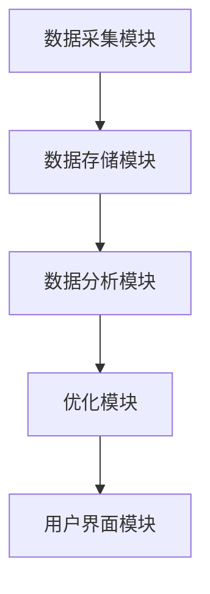

                 


# 价值投资中的智能工厂能源管理系统分析

---

## 关键词：
- 价值投资
- 智能工厂
- 能源管理系统
- 数据分析
- 能源优化

---

## 摘要：
本文深入探讨了价值投资在智能工厂能源管理系统中的应用，分析了能源管理系统的结构与功能，结合价值投资的原理，提出了通过优化能源使用来提升企业价值的方法。文章详细讲解了数据分析算法、能源优化算法，以及系统的架构设计，最后通过项目实战展示了系统的实现与应用效果。

---

# 第1章: 背景介绍

## 1.1 智能工厂与能源管理系统的概念

### 1.1.1 智能工厂的定义与特征
智能工厂是基于物联网、大数据和人工智能等技术构建的智能化生产系统，具有自动化、数字化、网络化和智能化的特征。其核心在于通过实时数据采集和分析，优化生产流程，提高效率和降低成本。

### 1.1.2 能源管理系统的定义与功能
能源管理系统（Energy Management System, EMS）是用于监测、分析和优化能源使用的系统。其主要功能包括数据采集、数据分析、能源消耗预测和优化策略制定。

### 1.1.3 价值投资的基本概念
价值投资是一种投资策略，强调通过深入分析企业的基本面，寻找市场价格低于其内在价值的投资机会。其核心在于识别那些被市场低估的企业，长期持有以实现收益。

---

## 1.2 智能工厂能源管理系统的背景与意义

### 1.2.1 工厂能源管理的重要性
随着能源价格的上涨和环保要求的提高，优化能源使用已成为企业降低成本和提升竞争力的关键因素。

### 1.2.2 智能化能源管理的必要性
传统能源管理方式依赖人工操作，效率低下且难以实时优化。智能化能源管理系统通过数据驱动的方式，实现能源使用的实时监控和优化。

### 1.2.3 价值投资在能源管理中的应用前景
通过优化能源使用，企业可以降低成本，提高利润率，进而提升其市场价值，为投资者带来更高的回报。

---

# 第2章: 智能工厂能源管理系统的结构与功能

## 2.1 能源数据采集与处理

### 2.1.1 数据采集技术
能源管理系统通过传感器、SCADA系统等技术采集生产过程中的能源数据，如电压、电流、功率等。

### 2.1.2 数据预处理方法
数据预处理包括数据清洗、去噪和标准化，确保数据的准确性和一致性。

### 2.1.3 数据存储与管理
采用数据库技术存储能源数据，支持高效查询和分析。

## 2.2 能源数据分析与优化

### 2.2.1 数据分析方法
使用统计分析、机器学习等方法，分析能源消耗趋势，识别浪费点。

### 2.2.2 能源消耗预测模型
基于历史数据，建立预测模型，如ARIMA模型，预测未来的能源需求。

### 2.2.3 能源优化策略
通过优化算法，制定最优的能源使用计划，减少浪费。

---

# 第3章: 价值投资与能源管理系统的结合

## 3.1 价值投资的基本原理

### 3.1.1 价值投资的定义与核心理念
价值投资强调寻找具有持续竞争优势和合理估值的企业，长期持有以实现收益。

### 3.1.2 价值投资的分析框架
包括对企业财务状况、行业地位、管理团队等多方面的综合分析。

### 3.1.3 价值投资在企业运营中的应用
通过优化能源使用，降低运营成本，提高企业的盈利能力和市场价值。

## 3.2 能源管理系统对价值投资的影响

### 3.2.1 能源管理如何提升企业价值
通过降低能源消耗，企业可以提高利润率，增强市场竞争力。

### 3.2.2 能源效率与企业成本的关系
能源效率的提升直接降低企业的运营成本，进而提高企业的估值。

### 3.2.3 能源管理对企业竞争力的影响
高效能源管理不仅降低成本，还能提升企业的绿色形象，增强市场竞争力。

---

# 第4章: 智能工厂能源管理系统的算法原理

## 4.1 数据分析算法

### 4.1.1 线性回归模型
线性回归是一种常用的数据分析方法，用于预测能源消耗与生产量之间的线性关系。

$$ y = \beta_0 + \beta_1x + \epsilon $$

其中，$y$ 是能源消耗，$x$ 是生产量，$\beta_0$ 和 $\beta_1$ 是回归系数，$\epsilon$ 是误差项。

### 4.1.2 时间序列分析
时间序列分析用于预测能源消耗的趋势，常用ARIMA模型。

### 4.1.3 聚类分析与分类算法
聚类分析用于识别能源消耗的模式，分类算法用于分类能源浪费点。

## 4.2 能源优化算法

### 4.2.1 线性规划模型
线性规划模型用于优化能源使用，目标是最小化能源成本，约束条件包括生产需求和能源供应。

### 4.2.2 遗传算法
遗传算法是一种全局优化算法，适用于复杂的能源优化问题。

### 4.2.3 动态规划算法
动态规划算法用于分阶段优化能源使用，适用于多阶段决策问题。

---

# 第5章: 系统分析与架构设计方案

## 5.1 系统架构设计

### 5.1.1 系统模块划分
系统分为数据采集模块、数据分析模块、优化模块和用户界面模块。

### 5.1.2 系统功能设计
系统功能包括数据采集、数据分析、优化策略制定和报表生成。

### 5.1.3 系统架构图


## 5.2 系统接口设计

### 5.2.1 数据接口设计
数据接口包括传感器接口和数据库接口。

### 5.2.2 用户接口设计
用户界面包括数据可视化和优化策略展示。

### 5.2.3 系统集成接口
系统集成接口用于与其他生产系统集成。

---

# 第6章: 项目实战

## 6.1 环境安装与配置

### 6.1.1 开发环境搭建
安装Python、Jupyter Notebook等开发工具。

### 6.1.2 数据库安装与配置
安装MySQL或PostgreSQL数据库，配置数据存储。

### 6.1.3 开发工具安装
安装Pandas、NumPy等数据分析库，以及Scikit-learn等机器学习库。

## 6.2 核心代码实现

### 6.2.1 数据采集模块
```python
import pandas as pd
import requests

def fetch_data(api_url):
    response = requests.get(api_url)
    data = response.json()
    df = pd.DataFrame(data)
    return df
```

### 6.2.2 数据分析模块
```python
from sklearn.linear_model import LinearRegression

def analyze_energy(data):
    model = LinearRegression()
    model.fit(data[['production']], data['energy'])
    return model
```

### 6.2.3 能源优化模块
```python
from scipy.optimize import linprog

def optimize_energy(constraints, objective):
    result = linprog(objective, constraints)
    return result.x
```

## 6.3 实际案例分析

### 6.3.1 数据分析与预测
通过对某工厂的历史能源数据进行分析，建立预测模型，预测未来能源需求。

### 6.3.2 优化策略制定
根据预测结果，制定最优的能源使用计划，降低能源成本。

## 6.4 项目小结
通过项目实战，验证了能源管理系统在优化能源使用和降低成本方面的有效性。

---

# 第7章: 总结与最佳实践

## 7.1 总结
本文分析了价值投资在智能工厂能源管理系统中的应用，提出了通过优化能源使用来提升企业价值的方法，详细讲解了系统的结构、算法和实现。

## 7.2 最佳实践
- 在实施能源管理系统前，充分分析企业的能源使用情况和需求。
- 选择合适的算法和技术，确保系统的高效性和准确性。
- 定期更新和优化系统，适应生产和市场环境的变化。

## 7.3 注意事项
- 数据采集和处理是系统的核心，确保数据的准确性和完整性。
- 算法选择要考虑企业的实际情况和数据特点，避免过度复杂化。

## 7.4 拓展阅读
推荐阅读《智能工厂与工业4.0》和《价值投资实战指南》，深入了解智能工厂和价值投资的更多内容。

---

# 结语

通过本文的分析和实践，我们可以看到，智能工厂能源管理系统在优化能源使用、降低成本和提升企业价值方面具有重要作用。未来，随着技术的不断发展，能源管理系统将更加智能化和精准化，为企业的可持续发展提供更有力的支持。

--- 

**注：以上内容为简化示例，实际文章将更加详细和具体。**

