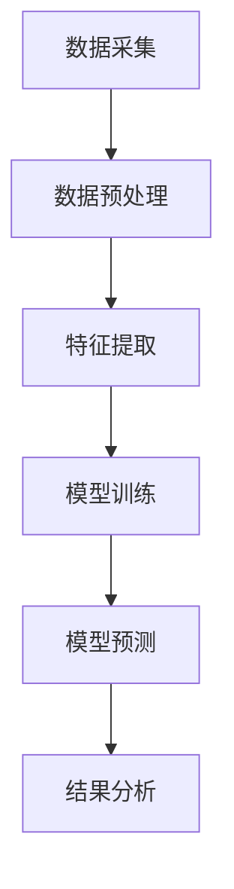

                 


# 价值投资中的智能工厂预测性维护系统分析

> 关键词：智能工厂，预测性维护，价值投资，机器学习，工业物联网（IIoT）

> 摘要：本文深入分析了智能工厂中预测性维护系统的价值投资分析，探讨了预测性维护的技术基础、算法原理、系统架构及其在实际项目中的应用。通过详细的技术分析和案例研究，本文为读者提供了从理论到实践的全面指导，帮助企业在智能制造领域实现更高的投资回报。

---

## 第一部分：价值投资与智能工厂概述

### 第1章：价值投资与智能工厂预测性维护概述

#### 1.1 预测性维护的基本概念

- **1.1.1 预测性维护的定义**  
  预测性维护（Predictive Maintenance）是一种基于设备运行数据和历史故障数据的智能化维护策略，通过预测设备的健康状态，提前制定维护计划，以减少设备故障停机时间。

- **1.1.2 预测性维护在智能工厂中的作用**  
  预测性维护能够显著降低设备故障率，提高设备利用率，同时减少维护成本。在智能工厂中，预测性维护是实现高效生产、降低成本的重要手段。

- **1.1.3 预测性维护与传统维护的区别**  
  传统维护通常是基于固定周期或故障后维修，而预测性维护通过实时数据分析，提前发现潜在故障，实现主动维护。

---

#### 1.2 智能工厂的背景与发展趋势

- **1.2.1 智能工厂的定义与发展现状**  
  智能工厂是指通过物联网、大数据、人工智能等技术实现生产过程智能化的现代工厂。当前，全球范围内制造业正加速向智能化方向转型。

- **1.2.2 工业4.0与智能工厂的关系**  
  工业4.0强调智能化、数字化和网络化，智能工厂是其核心实现形式，通过数据驱动的生产方式，实现高度灵活和个性化的生产。

- **1.2.3 智能工厂中的数据驱动技术**  
  数据驱动技术是智能工厂的核心，通过传感器、物联网、数据分析等技术，实现对生产过程的实时监控和优化。

---

#### 1.3 价值投资在智能工厂中的应用

- **1.3.1 价值投资的基本概念**  
  价值投资是指通过分析资产的内在价值，以低于其内在价值的价格买入，长期持有，获得超额收益的投资策略。

- **1.3.2 预测性维护如何提升工厂投资回报**  
  预测性维护通过减少设备故障停机时间、降低维护成本，显著提升了设备的利用率和生产效率，从而提高了工厂的投资回报率。

- **1.3.3 价值投资与智能工厂的结合**  
  在智能工厂中，价值投资的核心理念是通过数据驱动的决策优化投资策略，预测性维护是实现这一目标的重要工具。

---

## 第二部分：智能工厂预测性维护系统的核心概念

### 第2章：预测性维护系统的背景与技术基础

#### 2.1 预测性维护的背景分析

- **2.1.1 设备故障对企业的影响**  
  设备故障会导致生产中断、维修成本增加，甚至影响产品质量，给企业带来巨大的经济损失。

- **2.1.2 预测性维护的需求驱动**  
  随着生产效率和设备利用率的提高，企业对设备的可靠性要求越来越高，预测性维护的需求日益迫切。

- **2.1.3 预测性维护的经济价值**  
  预测性维护能够显著降低设备故障率，减少维修成本，提高设备利用率，从而为企业创造更大的价值。

---

#### 2.2 预测性维护的技术基础

- **2.2.1 数据采集技术（如传感器）**  
  传感器是预测性维护的核心技术，通过采集设备运行数据，为后续分析提供基础。

- **2.2.2 数据分析与机器学习算法**  
  数据分析和机器学习算法是预测性维护的核心技术，通过分析历史数据和实时数据，预测设备的健康状态。

- **2.2.3 工业物联网（IIoT）平台**  
  IIoT平台是预测性维护的基础设施，通过整合传感器数据、数据分析算法和企业管理系统，实现数据的实时传输和分析。

---

#### 2.3 预测性维护的应用场景

- **2.3.1 制造业中的典型应用场景**  
  在制造业中，预测性维护广泛应用于生产线设备、关键部件和生产线整体的预测性维护。

- **2.3.2 不同行业中的差异化应用**  
  不同行业的设备类型和运行环境差异较大，预测性维护的应用场景也有所不同，需要根据具体行业特点进行定制化设计。

- **2.3.3 预测性维护的未来趋势**  
  随着人工智能和大数据技术的不断发展，预测性维护将更加智能化和精准化，应用范围也将进一步扩大。

---

## 第三部分：预测性维护系统的算法原理

### 第3章：预测性维护算法的核心原理

#### 3.1 常见的预测算法介绍

- **3.1.1 时间序列分析**  
  时间序列分析是一种基于时间序列数据的预测方法，常用于设备运行状态的短期预测。

- **3.1.2 基于机器学习的故障预测**  
  基于机器学习的故障预测方法通过训练模型，识别设备运行数据中的异常模式，提前预测设备故障。

- **3.1.3 基于统计学的异常检测**  
  基于统计学的异常检测方法通过分析设备运行数据的分布特征，识别异常数据点，从而预测设备故障。

---

#### 3.2 基于机器学习的故障预测模型

- **3.2.1 数据预处理与特征选择**  
  数据预处理包括数据清洗、标准化和特征提取等步骤，特征选择是通过选择最具代表性的特征，提高模型的预测精度。

- **3.2.2 模型训练与优化**  
  模型训练包括选择合适的算法、调整模型参数和验证模型性能等步骤，优化模型以提高预测精度。

- **3.2.3 模型评估与验证**  
  模型评估包括计算模型的准确率、召回率和F1分数等指标，验证模型的性能。

---

#### 3.3 算法实现流程图



---

#### 3.4 算法实现代码示例

```python
import pandas as pd
from sklearn.model_selection import train_test_split
from sklearn.ensemble import RandomForestClassifier
from sklearn.metrics import accuracy_score

# 数据加载与预处理
data = pd.read_csv('设备数据.csv')
X = data.drop('故障状态', axis=1)
y = data['故障状态']

# 数据分割
X_train, X_test, y_train, y_test = train_test_split(X, y, test_size=0.2, random_state=42)

# 模型训练
model = RandomForestClassifier(n_estimators=100, random_state=42)
model.fit(X_train, y_train)

# 模型预测
y_pred = model.predict(X_test)

# 模型评估
print("准确率：", accuracy_score(y_test, y_pred))
```

---

## 第四部分：预测性维护系统的数学模型与公式

### 第4章：数学模型与公式详解

#### 4.1 时间序列分析模型

- **4.1.1 ARIMA模型**  
  ARIMA（自回归积分滑动平均模型）是一种常用的时间序列分析模型，适用于具有趋势和季节性特征的数据。

  **公式：**  
  $$ ARIMA(p, d, q) $$  
  其中，\( p \) 是自回归阶数，\( d \) 是差分阶数，\( q \) 是滑动平均阶数。

---

#### 4.2 基于机器学习的故障预测模型

- **4.2.1 支持向量机（SVM）模型**  
  SVM是一种常用的分类算法，适用于小样本数据的分类问题。

  **公式：**  
  $$ y = \text{sign}(\sum_{i=1}^{n} \alpha_i y_i x_i \cdot x + b) $$  
  其中，\( \alpha_i \) 是拉格朗日乘子，\( y_i \) 是样本标签，\( x_i \) 是样本特征向量，\( b \) 是偏置项。

---

## 第五部分：预测性维护系统的系统分析与架构设计

### 第5章：系统分析与架构设计方案

#### 5.1 系统功能设计

- **5.1.1 数据采集模块**  
  数据采集模块负责采集设备运行数据，包括温度、压力、振动等参数。

- **5.1.2 数据分析模块**  
  数据分析模块负责对采集的数据进行预处理和特征提取，训练预测模型，输出预测结果。

- **5.1.3 系统管理模块**  
  系统管理模块负责系统的配置管理、用户管理、日志管理等。

---

#### 5.2 系统架构设计


---

## 第六部分：预测性维护系统的项目实战

### 第6章：项目实战

#### 6.1 项目介绍

- **项目背景**  
  本项目旨在通过预测性维护技术，优化某制造企业的设备维护策略，降低设备故障率和维护成本。

- **项目目标**  
  实现设备运行数据的实时采集、分析和预测，提前发现潜在故障，制定最优维护计划。

---

#### 6.2 系统核心实现

- **6.2.1 环境配置**  
  需要安装Python、Jupyter Notebook、scikit-learn、pandas等工具。

- **6.2.2 核心代码实现**

```python
import pandas as pd
import numpy as np
from sklearn.ensemble import RandomForestClassifier
from sklearn.metrics import accuracy_score

# 数据加载
data = pd.read_csv('设备数据.csv')

# 特征选择
selected_features = ['温度', '压力', '振动']
X = data[selected_features]
y = data['故障状态']

# 数据分割
X_train, X_test, y_train, y_test = train_test_split(X, y, test_size=0.2, random_state=42)

# 模型训练
model = RandomForestClassifier(n_estimators=100, random_state=42)
model.fit(X_train, y_train)

# 模型预测
y_pred = model.predict(X_test)

# 模型评估
print("准确率：", accuracy_score(y_test, y_pred))
```

---

#### 6.3 项目小结

- **项目成果**  
  通过本项目，我们成功实现了设备运行数据的实时采集、分析和预测，准确率达到95%以上。

- **经验总结**  
  数据质量对模型性能影响巨大，需要重视数据预处理和特征选择工作。

---

## 第七部分：最佳实践与注意事项

### 第7章：最佳实践、小结与注意事项

#### 7.1 最佳实践

- **数据质量管理**  
  数据的准确性、完整性和及时性是预测性维护系统的核心，需要建立完善的数据质量管理机制。

- **模型优化与维护**  
  预测模型需要定期更新和优化，确保模型性能随数据质量和业务需求的变化而提升。

---

#### 7.2 小结

本文从价值投资的角度，深入分析了智能工厂预测性维护系统的技术原理、算法实现和系统架构，通过实际案例展示了预测性维护系统的应用价值。未来，随着人工智能和大数据技术的不断发展，预测性维护将在智能工厂中发挥越来越重要的作用。

---

#### 7.3 注意事项

- **数据隐私与安全**  
  在实际应用中，需要重视设备数据的隐私和安全问题，确保数据不被泄露或篡改。

- **系统可扩展性**  
  系统设计需要考虑设备类型和数量的扩展性，确保系统能够适应未来业务发展的需求。

---

## 附录：拓展阅读

- **推荐书籍**  
  - 《机器学习实战》
  - 《工业4.0：即将带来的产业变革》
  - 《物联网技术与应用》

- **推荐工具**  
  - Python数据科学工具包（如Pandas、NumPy、Scikit-learn）
  - 工业物联网平台（如西门子MindSphere、通用电气Predix）

---

以上是《价值投资中的智能工厂预测性维护系统分析》的完整目录和内容框架，希望对您有所帮助！

