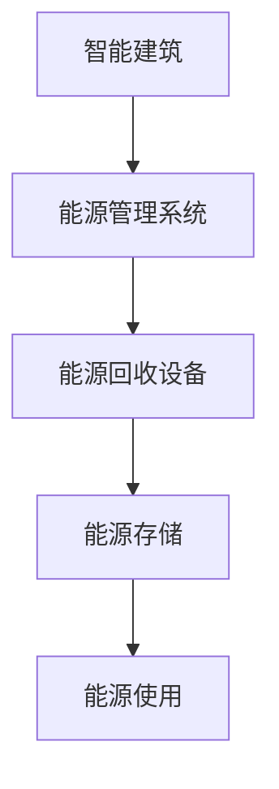
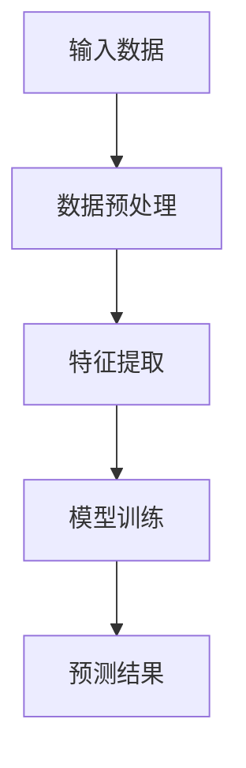
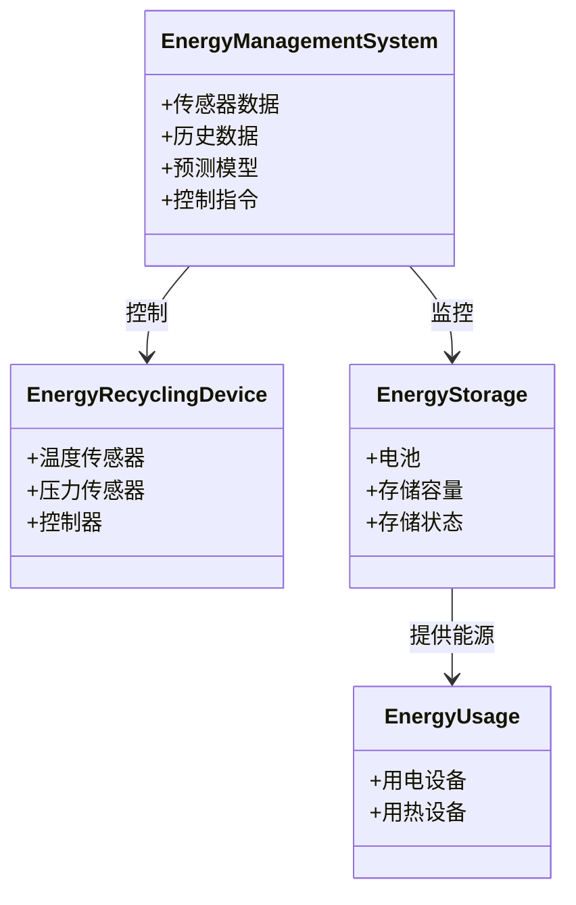
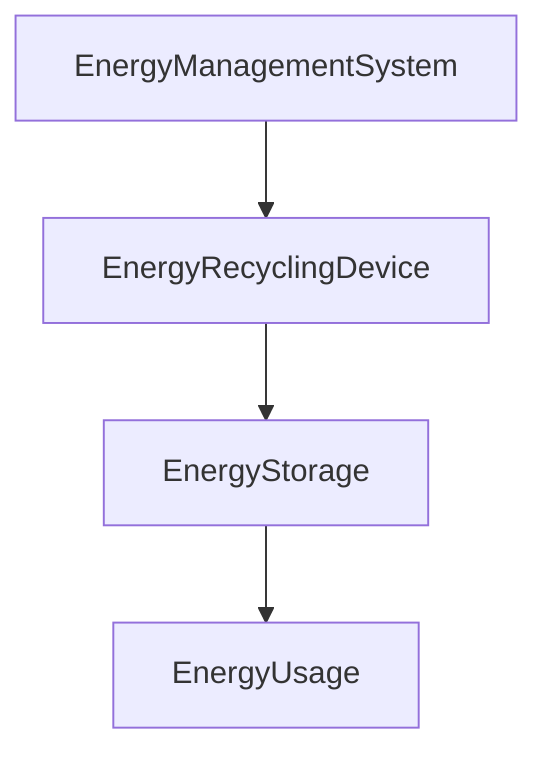

                 


# 价值投资中的智能建筑能源回收系统分析

## 关键词

智能建筑，能源回收系统，价值投资，能源管理，技术分析

## 摘要

随着全球能源需求的增加和环境问题的加剧，智能建筑能源回收系统成为实现可持续发展的重要技术。本文通过分析智能建筑能源回收系统的技术原理、价值评估方法，探讨其在价值投资中的潜力和应用策略。结合实际案例，本文提供系统的解决方案和投资建议，为投资者和技术人员提供参考。

---

# 第一部分: 智能建筑能源回收系统背景介绍

## 第1章: 智能建筑能源回收系统背景介绍

### 1.1 问题背景与描述

#### 1.1.1 能源危机与可持续发展
全球能源需求不断增长，传统能源的不可再生性和环境问题促使人类寻找可持续的能源解决方案。智能建筑通过能源回收技术，将建筑内的废热、废气等转化为可利用能源，减少对外部能源的依赖，降低碳排放。

#### 1.1.2 智能建筑在能源管理中的作用
智能建筑利用物联网、大数据和人工智能技术，实时监控和管理建筑内的能源使用情况，优化能源分配，提高能源利用效率。能源回收系统是智能建筑的重要组成部分，能够将建筑内的余热、余电等回收再利用。

#### 1.1.3 能源回收系统的核心目标
能源回收系统的核心目标是通过技术手段，将建筑内的废热、废气等转化为可利用的能源，减少能源浪费，降低建筑的能源消耗成本，同时减少对环境的影响。

### 1.2 问题解决与边界

#### 1.2.1 能源回收系统的技术实现
能源回收系统通过热交换器、余热回收设备等技术手段，将建筑内的废热回收并转化为可利用的热能或电能。同时，智能建筑通过传感器和自动化控制系统，实时监控能源使用情况，优化能源回收和分配。

#### 1.2.2 系统的边界与外延
能源回收系统作为一个子系统，其边界包括建筑内部的能源产生、传输和使用环节。外延则涉及能源的外部供应、存储和分配，以及与城市能源网络的连接。

#### 1.2.3 核心要素与组成结构
能源回收系统的组成结构包括能源产生设备（如锅炉、发电机）、能源传输设备（如管道、电缆）、能源存储设备（如电池）以及能源管理控制系统（如传感器、控制器）。

---

# 第二部分: 核心概念与联系

## 第2章: 智能建筑能源回收系统的核心概念

### 2.1 核心概念原理

#### 2.1.1 能源回收的基本原理
能源回收系统通过热交换、余热发电等技术，将建筑内的废热、废气等转化为可利用的能源。例如，余热回收技术可以将锅炉产生的废热回收，用于供暖或发电。

#### 2.1.2 智能建筑的定义与特征
智能建筑是指利用信息技术和自动化技术，实现建筑内部设备和系统的智能化管理。其特征包括智能化的能源管理、自动化控制、实时监控和优化运行。

#### 2.1.3 能源回收系统的组成部分
能源回收系统主要包括能源产生设备、能源传输设备、能源存储设备和能源管理控制系统。这些部分协同工作，实现能源的高效回收和利用。

### 2.2 核心概念对比表

#### 表2.1: 智能建筑与传统建筑的对比

| 特性                | 智能建筑              | 传统建筑              |
|---------------------|----------------------|----------------------|
| 能源管理            | 智能化、自动化        | 手动管理、效率低      |
| 设备控制            | 自动化、远程控制      | 手动操作、效率低      |
| 能源利用效率        | 高                    | 低                    |
| 环境影响            | 低                    | 高                    |

#### 表2.2: 不同能源回收技术的优劣势对比

| 技术                | 优点                  | 缺点                  |
|---------------------|----------------------|----------------------|
| 余热回收技术        | 节能效果显著，成本低  | 初期投资较高          |
| 光伏发电技术        | 可再生能源，环保      | 受天气影响，不稳定    |
| 风力发电技术        | 可再生能源，环保      | 噪音大，成本高        |

### 2.3 系统架构图



---

# 第三部分: 算法原理与数学模型

## 第3章: 能源回收效率预测算法

### 3.1 算法原理

#### 3.1.1 算法概述
能源回收效率预测算法通过对建筑内能源产生和消耗数据的分析，预测能源回收系统的效率。算法基于历史数据，利用回归分析或机器学习模型，预测未来能源回收的效率。

#### 3.1.2 算法流程图



### 3.2 数学模型

#### 3.2.1 回归模型
$$ y = \beta_0 + \beta_1x_1 + \beta_2x_2 + \epsilon $$
其中，\( y \) 是预测的能源回收效率，\( x_1 \) 和 \( x_2 \) 是输入特征，\( \beta_0 \) 是截距，\( \beta_1 \) 和 \( \beta_2 \) 是回归系数，\( \epsilon \) 是误差项。

#### 3.2.2 机器学习模型
$$ y = f(x) $$
其中，\( f \) 是机器学习模型（如随机森林或神经网络），\( x \) 是输入特征。

### 3.3 代码实现

```python
import numpy as np
from sklearn.linear_model import LinearRegression

# 示例数据
X = np.array([[1, 2], [3, 4], [5, 6], [7, 8]])
y = np.array([10, 20, 30, 40])

# 创建回归模型
model = LinearRegression()
model.fit(X, y)

# 预测
predictions = model.predict(X)
print("预测结果:", predictions)
```

---

# 第四部分: 系统分析与架构设计方案

## 第4章: 智能建筑能源回收系统架构设计

### 4.1 项目场景介绍

#### 4.1.1 问题场景
某商业建筑希望通过能源回收系统降低能源消耗成本，减少碳排放，提高能源利用效率。

### 4.2 系统功能设计

#### 4.2.1 领域模型



#### 4.2.2 系统架构图



---

## 第五章: 项目实战

### 5.1 环境安装

#### 5.1.1 Python环境安装
```bash
pip install numpy scikit-learn matplotlib
```

### 5.2 核心代码实现

#### 5.2.1 数据预处理
```python
import pandas as pd
data = pd.read_csv('energy_data.csv')
data.head()
```

#### 5.2.2 特征提取
```python
X = data[['温度', '湿度']]
y = data['能源消耗']
```

#### 5.2.3 模型训练与预测
```python
from sklearn.model_selection import train_test_split
from sklearn.linear_model import LinearRegression

X_train, X_test, y_train, y_test = train_test_split(X, y, test_size=0.2, random_state=42)
model = LinearRegression()
model.fit(X_train, y_train)
```

### 5.3 案例分析

#### 5.3.1 数据分析
通过分析历史能源消耗数据，发现能源浪费点，并优化能源管理策略。

#### 5.3.2 优化建议
建议采用余热回收技术，减少能源浪费，降低能源消耗成本。

---

## 第六章: 最佳实践与总结

### 6.1 最佳实践 tips

- 定期维护能源回收设备，确保其高效运行。
- 结合机器学习模型，实时优化能源管理策略。

### 6.2 小结
智能建筑能源回收系统通过技术手段，实现能源的高效回收和利用，降低能源消耗成本，减少碳排放，具有重要的经济和环境价值。

### 6.3 注意事项
- 初期投资较高，需考虑投资回报周期。
- 系统运行需要专业人员维护和管理。

### 6.4 拓展阅读
- 《智能建筑技术与应用》
- 《能源管理与优化策略》

---

通过以上分析，本文详细介绍了智能建筑能源回收系统的技术原理、价值评估方法和投资策略。结合实际案例和代码实现，为投资者和技术人员提供了系统的解决方案和实践指导。

