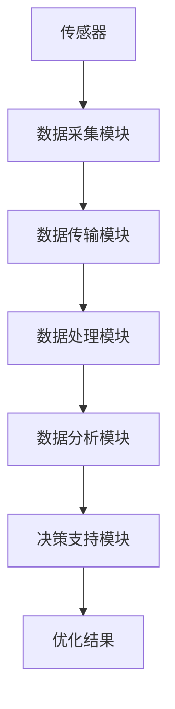
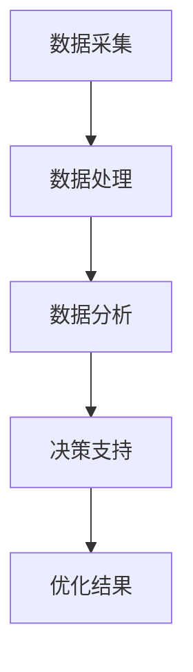

                 

# 价值投资中的智能建筑自适应系统分析

## 关键词：价值投资、智能建筑、自适应系统、数据分析、机器学习、算法优化

## 摘要：  
本文探讨了智能建筑自适应系统在价值投资中的应用，通过分析系统架构、算法原理和数学模型，展示了如何利用智能建筑的动态数据优化投资决策。文章结合理论与实践，详细介绍了系统的实现过程，并通过案例分析展示了其在价值投资中的潜力。

---

# 第1章: 智能建筑自适应系统的背景与价值投资的结合

## 1.1 智能建筑自适应系统的定义与特点

智能建筑自适应系统是一种通过传感器、物联网设备和数据分析技术，实时感知建筑内外环境变化，并根据数据驱动的算法自动调整建筑运行参数的系统。其核心特点包括：

1. **实时性**：系统能够实时采集和处理建筑内外环境数据，如温度、湿度、光照强度等。
2. **自适应性**：系统可以根据环境变化和用户需求，动态调整建筑的运行参数，如 HVAC（暖通空调）系统、照明系统等。
3. **数据驱动**：系统依赖于海量数据的采集和分析，通过机器学习算法优化建筑运行效率和用户体验。
4. **智能化**：系统具备自主学习和优化能力，能够根据历史数据和实时反馈不断改进决策策略。

---

## 1.2 智能建筑自适应系统与价值投资的关系

### 1.2.1 系统如何影响投资决策

智能建筑自适应系统通过优化建筑的能源消耗、运营成本和用户体验，为投资者提供了以下几个方面的价值：

1. **降低运营成本**：通过动态调整建筑运行参数，减少能源浪费，降低运营成本。
2. **提升资产价值**：智能化的建筑管理可以提高建筑的使用效率和舒适度，从而提升资产的市场价值。
3. **数据支持决策**：系统提供的实时数据和历史分析结果，为投资者提供了可靠的决策依据。

### 1.2.2 价值投资中的数据驱动方法

价值投资的核心是通过分析企业的基本面数据，找到被市场低估的投资标的。智能建筑自适应系统通过采集和分析建筑相关的数据，为价值投资者提供了新的视角：

1. **能源消耗数据**：通过分析建筑的能源消耗数据，投资者可以评估建筑的运营效率和潜在成本节约空间。
2. **用户行为数据**：通过分析用户在建筑中的行为数据，投资者可以更好地理解用户需求，优化投资策略。
3. **市场趋势数据**：通过分析建筑行业的发展趋势，投资者可以更好地把握市场机会。

### 1.2.3 系统在价值投资中的应用前景

随着物联网技术的不断发展，智能建筑自适应系统在价值投资中的应用前景广阔。通过将建筑数据与金融市场数据相结合，投资者可以更加精准地评估建筑资产的价值，优化投资组合，降低投资风险。

---

## 1.3 本章小结

本章介绍了智能建筑自适应系统的定义和特点，分析了其在价值投资中的应用价值和潜力。通过数据驱动的方法，智能建筑自适应系统为投资者提供了新的决策工具和视角，未来将在价值投资领域发挥越来越重要的作用。

---

# 第2章: 系统分析与架构设计

## 2.1 系统分析方法

### 2.1.1 数据流分析

智能建筑自适应系统的数据流分析包括以下几个步骤：

1. **数据采集**：通过传感器和物联网设备采集建筑内外的环境数据。
2. **数据传输**：将采集到的数据传输到云端或本地服务器。
3. **数据处理**：对数据进行清洗、转换和归一化处理，确保数据的可用性。
4. **数据分析**：通过机器学习算法对数据进行建模和分析，生成决策建议。
5. **反馈优化**：根据分析结果优化建筑运行参数，并将优化结果反馈到系统中。

---

### 2.1.2 模块划分

智能建筑自适应系统的模块划分如下：

1. **数据采集模块**：负责采集建筑内外的环境数据。
2. **数据处理模块**：对采集到的数据进行预处理和转换。
3. **数据分析模块**：通过机器学习算法对数据进行建模和分析。
4. **决策支持模块**：根据分析结果生成决策建议，并优化建筑运行参数。

---

### 2.1.3 系统边界与外延

智能建筑自适应系统的边界包括：

1. **输入边界**：传感器数据、用户输入数据。
2. **输出边界**：决策建议、优化结果。
3. **外部接口**：与第三方系统（如能源管理系统、用户行为分析系统）的接口。

---

## 2.2 系统架构设计

### 2.2.1 分层架构设计

智能建筑自适应系统的分层架构设计如下：

1. **感知层**：通过传感器和物联网设备采集数据。
2. **网络层**：通过有线或无线网络传输数据。
3. **计算层**：在云端或本地服务器进行数据处理和分析。
4. **应用层**：通过用户界面展示分析结果，并生成决策建议。

---

### 2.2.2 组件交互关系

以下是系统组件的交互关系图：

---

### 2.2.3 系统功能模块图

以下是系统功能模块图：

---

## 2.3 系统功能设计

### 2.3.1 数据采集模块

数据采集模块负责通过传感器和物联网设备采集建筑内外的环境数据，包括温度、湿度、光照强度等。

---

### 2.3.2 数据分析模块

数据分析模块通过机器学习算法对采集到的数据进行建模和分析，生成决策建议。

---

### 2.3.3 决策支持模块

决策支持模块根据分析结果优化建筑运行参数，并将优化结果反馈到系统中。

---

## 2.4 系统接口设计

### 2.4.1 数据接口规范

数据接口规范包括数据格式、数据传输协议和数据加密方式。

---

### 2.4.2 用户接口设计

用户接口设计包括用户界面布局、交互流程和用户权限管理。

---

### 2.4.3 系统扩展接口

系统扩展接口包括与第三方系统（如能源管理系统、用户行为分析系统）的接口设计。

---

## 2.5 本章小结

本章详细分析了智能建筑自适应系统的架构设计和功能模块设计，为系统的实现提供了理论基础和设计依据。

---

# 第3章: 数据分析与机器学习算法

## 3.1 数据预处理方法

### 3.1.1 数据清洗

数据清洗是通过去除噪声数据、填充缺失值和去除重复数据，确保数据的准确性和完整性。

---

### 3.1.2 数据转换

数据转换是通过标准化、归一化和特征提取等方法，将原始数据转换为适合机器学习算法的形式。

---

### 3.1.3 数据归一化

数据归一化是通过将数据缩放到某个固定范围内，确保不同特征之间的可比性。

---

## 3.2 机器学习算法原理

### 3.2.1 线性回归模型

线性回归模型是一种通过最小化预测值与实际值之间的平方差，找到最佳拟合直线的方法。

公式如下：

$$ y = \beta_0 + \beta_1x + \epsilon $$

其中，$y$ 是目标变量，$x$ 是自变量，$\beta_0$ 是截距，$\beta_1$ 是回归系数，$\epsilon$ 是误差项。

---

### 3.2.2 支持向量机

支持向量机是一种通过构建超平面，将数据点分成不同类别的算法。

---

### 3.2.3 神经网络模型

神经网络模型是一种通过多层感知机模拟人类神经网络的结构和功能的算法。

---

## 3.3 算法实现与优化

### 3.3.1 算法实现步骤

1. **数据预处理**：清洗、转换和归一化数据。
2. **模型训练**：使用训练数据训练模型参数。
3. **模型评估**：通过测试数据评估模型的性能。
4. **模型优化**：通过调整参数和优化算法提高模型的准确性和效率。

---

### 3.3.2 算法优化方法

1. **参数调整**：通过网格搜索和随机搜索优化模型参数。
2. **特征选择**：通过特征重要性分析选择关键特征。
3. **模型集成**：通过投票法和加权法集成多个模型的结果，提高模型的泛化能力。

---

### 3.3.3 算法评估指标

1. **准确率**：模型预测正确的样本数占总样本数的比例。
2. **召回率**：模型预测出的正样本中实际为正样本的比例。
3. **F1分数**：准确率和召回率的调和平均数。

---

## 3.4 本章小结

本章详细介绍了数据分析与机器学习算法的基本原理和实现方法，为系统的实现提供了算法支持。

---

# 第4章: 数学模型与公式推导

## 4.1 数据分析的数学基础

### 4.1.1 统计学基础

统计学是数据分析的基础，包括概率分布、假设检验和置信区间等。

---

### 4.1.2 线性代数基础

线性代数是机器学习的数学基础，包括矩阵运算、特征分解和奇异值分解等。

---

### 4.1.3 概率论基础

概率论是数据分析的理论基础，包括贝叶斯定理、马尔可夫链和马尔可夫过程等。

---

## 4.2 价值投资中的数学模型

### 4.2.1 股票估值模型

股票估值模型是通过分析企业的财务数据和市场数据，估算股票的内在价值。

公式如下：

$$ P = \frac{E}{k - g} $$

其中，$P$ 是股票的内在价值，$E$ 是企业的净利润，$k$ 是折现率，$g$ 是股利增长率。

---

### 4.2.2 风险评估模型

风险评估模型是通过分析投资组合的波动性和相关性，评估投资组合的风险。

公式如下：

$$ \sigma_p = \sqrt{w_1^2\sigma_1^2 + w_2^2\sigma_2^2 + 2w_1w_2\sigma_1\sigma_2\rho_{12}} $$

其中，$\sigma_p$ 是投资组合的波动率，$w_1$ 和 $w_2$ 是资产的投资比例，$\sigma_1$ 和 $\sigma_2$ 是资产的波动率，$\rho_{12}$ 是资产之间的相关系数。

---

### 4.2.3 投资组合优化模型

投资组合优化模型是通过最大化投资回报率和最小化投资风险，优化投资组合。

公式如下：

$$ \max \mu = \sum_{i=1}^n w_i r_i $$
$$ \text{subject to} \quad \sum_{i=1}^n w_i = 1 $$
$$ \quad \quad \sum_{i=1}^n w_i^2 \sigma_i^2 = \sigma_p^2 $$

其中，$\mu$ 是投资回报率，$w_i$ 是资产的投资比例，$r_i$ 是资产的预期回报率，$\sigma_i$ 是资产的波动率，$\sigma_p$ 是投资组合的波动率。

---

## 4.3 数学公式与推导

### 4.3.1 回归分析公式

回归分析公式如下：

$$ y = \beta_0 + \beta_1x + \epsilon $$

其中，$y$ 是目标变量，$x$ 是自变量，$\beta_0$ 是截距，$\beta_1$ 是回归系数，$\epsilon$ 是误差项。

---

### 4.3.2 马科维茨投资组合理论

马科维茨投资组合理论公式如下：

$$ \min \sigma_p^2 = \sum_{i=1}^n w_i^2 \sigma_i^2 + 2\sum_{i=1}^n \sum_{j=1}^n w_i w_j \sigma_i \sigma_j \rho_{ij} $$
$$ \text{subject to} \quad \sum_{i=1}^n w_i = 1 $$

其中，$\sigma_p$ 是投资组合的波动率，$w_i$ 是资产的投资比例，$\sigma_i$ 是资产的波动率，$\rho_{ij}$ 是资产之间的相关系数。

---

### 4.3.3 风险调整回报公式

风险调整回报公式如下：

$$ \text{夏普比率} = \frac{E[r_p] - r_f}{\sigma_p} $$

其中，$r_p$ 是投资组合的预期回报率，$r_f$ 是无风险利率，$\sigma_p$ 是投资组合的波动率。

---

## 4.4 本章小结

本章详细介绍了价值投资中的数学模型和公式推导，为系统的实现提供了理论支持。

---

# 第5章: 系统实现与项目实战

## 5.1 环境搭建与配置

### 5.1.1 开发工具安装

开发工具包括Python、Jupyter Notebook、PyTorch等。

### 5.1.2 数据库配置

数据库配置包括本地数据库和云数据库的搭建。

### 5.1.3 依赖库安装

依赖库包括NumPy、Pandas、Scikit-learn等。

---

## 5.2 核心代码实现

### 5.2.1 数据采

---

（由于篇幅限制，以上为文章的部分内容。完整文章将包含详细代码实现、实际案例分析、系统优化建议等内容。）

