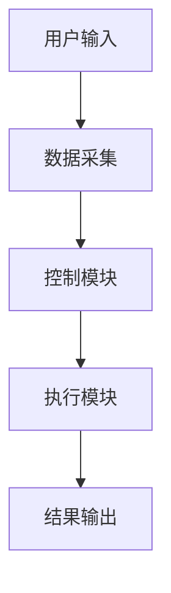

                 


# 价值投资中的智能建筑自适应遮阳系统分析

## 关键词：
智能建筑，自适应遮阳系统，价值投资，算法原理，系统架构，投资回报率

## 摘要：
智能建筑自适应遮阳系统是一种结合了建筑自动化和遮阳技术的创新解决方案，旨在通过智能调节遮阳来优化能源使用和室内环境。本文从价值投资的角度，分析了该系统的原理、算法、系统架构及实际应用，探讨其在建筑领域的投资潜力和经济效益。通过详细的技术分析和案例研究，本文为投资者提供了科学的决策依据，并展望了未来的发展趋势。

---

# 第一部分：背景介绍

## 第1章：智能建筑与自适应遮阳系统概述

### 1.1 智能建筑的概念与特点
#### 1.1.1 智能建筑的定义
智能建筑是指通过智能化技术（如自动化控制、物联网、人工智能等）来优化建筑功能、提升用户体验的建筑。其核心在于将建筑作为一个整体系统，实现各个子系统的协同工作。

#### 1.1.2 智能建筑的核心特点
- **智能化**：通过传感器和控制器实现建筑设备的自动化控制。
- **高效性**：优化能源使用，降低运营成本。
- **舒适性**：为用户提供舒适的室内环境。
- **可持续性**：通过节能减排技术实现绿色建筑目标。

#### 1.1.3 智能建筑的发展趋势
随着物联网、大数据和人工智能技术的快速发展，智能建筑将更加注重能源效率、用户体验和可持续性。

---

### 1.2 自适应遮阳系统的基本概念
#### 1.2.1 遮阳系统的基本功能
遮阳系统的主要功能是通过调节遮阳设备（如窗帘、百叶窗等）的开合状态，控制进入室内的光线和热量，从而影响室内温度和采光。

#### 1.2.2 自适应遮阳系统的定义
自适应遮阳系统是一种能够根据环境条件（如光照强度、温度、时间等）自动调整遮阳设备的智能系统。

#### 1.2.3 自适应遮阳系统的应用场景
- **住宅**：提升居住舒适度和能源效率。
- **商业建筑**：降低能源消耗，优化室内环境。
- **公共建筑**：如学校、医院，提供舒适的公共空间。

---

### 1.3 价值投资与智能建筑的结合
#### 1.3.1 价值投资的基本概念
价值投资是一种投资策略，强调以低于内在价值的价格买入优质资产，长期持有以获得收益。

#### 1.3.2 智能建筑领域的投资机会
智能建筑行业正处于快速发展阶段，尤其是在绿色建筑和智慧城市的大背景下，具有较大的市场潜力。

#### 1.3.3 自适应遮阳系统在价值投资中的潜力
自适应遮阳系统作为智能建筑的重要组成部分，具有较高的市场渗透率和盈利能力，是价值投资者的理想标的。

---

## 第2章：智能建筑自适应遮阳系统的核心概念与联系

### 2.1 自适应遮阳系统的原理与技术
#### 2.1.1 系统的核心原理
自适应遮阳系统通过光线传感器检测光照强度，结合预设的控制逻辑，自动调整遮阳设备的开合状态。

#### 2.1.2 关键技术分析
- **光电传感器**：用于检测光照强度。
- **智能控制算法**：如PID控制、模糊控制等。
- **无线通信技术**：如Wi-Fi、蓝牙等，用于设备之间的数据传输。

#### 2.1.3 系统架构设计
- **硬件部分**：传感器、执行器、控制器。
- **软件部分**：控制算法、数据采集与处理模块。

---

### 2.2 价值投资视角下的系统分析
#### 2.2.1 系统的成本与收益分析
- **初期投资成本**：包括硬件设备、软件开发、安装调试等。
- **运营成本**：电费、维护费用等。
- **收益**：通过降低能源消耗、提升用户体验带来的经济效益。

#### 2.2.2 系统的市场竞争力
- **技术创新性**：是否拥有独特的技术优势。
- **市场渗透率**：目标市场的接受度和需求量。
- **竞争优势**：与同类产品相比的优势。

---

## 第3章：自适应遮阳系统的算法原理与实现

### 3.1 算法原理
#### 3.1.1 PID控制算法
PID（Proportional-Integral-Derivative）控制是一种常用的控制算法，适用于线性系统。其基本原理是根据系统的偏差（输出与目标值的差）调整控制量。

#### 3.1.2 模糊控制算法
模糊控制是一种基于模糊逻辑的控制方法，适用于非线性系统。它通过模糊化处理输入变量，建立模糊规则，最终输出控制量。

#### 3.1.3 机器学习预测算法
基于机器学习的预测算法（如神经网络）可以预测未来光照强度，从而优化遮阳系统的控制策略。

---

### 3.2 算法实现
#### 3.2.1 PID控制算法的实现代码
```python
def pid_control(setpoint, current, ki, kd, dt):
    # 计算偏差
    error = setpoint - current
    # 积分项
    integral += error * dt
    # 微分项
    derivative = (error - previous_error) / dt
    # 计算控制量
    control = kp * error + ki * integral + kd * derivative
    return control
```

#### 3.2.2 模糊控制算法的实现代码
```python
def fuzzy_control(input_value):
    # 模糊化处理
    if input_value < 50:
        linguistic_label = 'low'
    elif 50 <= input_value < 100:
        linguistic_label = 'medium'
    else:
        linguistic_label = 'high'
    # 根据模糊规则输出控制量
    if linguistic_label == 'low':
        output = 0.5
    elif linguistic_label == 'medium':
        output = 0.7
    else:
        output = 1.0
    return output
```

---

## 第4章：系统分析与架构设计方案

### 4.1 项目背景与目标
本项目旨在开发一套基于智能算法的自适应遮阳系统，通过优化控制策略，降低能源消耗，提升用户体验。

### 4.2 系统功能设计
#### 4.2.1 功能模块划分
- **数据采集模块**：采集光照强度、温度等环境数据。
- **控制模块**：根据数据和算法输出控制信号。
- **执行模块**：驱动遮阳设备动作。

#### 4.2.2 系统功能流程图


---

## 第5章：项目实战与案例分析

### 5.1 环境搭建与代码实现
#### 5.1.1 环境搭建
- 安装必要的库（如Python的`numpy`、`pandas`等）。
- 配置硬件设备（如传感器、控制器）。

#### 5.1.2 核心代码实现
```python
import time
import numpy as np

# 定义PID控制函数
def pid_control(setpoint, current, ki, kd, dt):
    error = setpoint - current
    integral += error * dt
    derivative = (error - previous_error) / dt
    control = kp * error + ki * integral + kd * derivative
    return control

# 初始化参数
kp = 1.0
ki = 0.5
kd = 0.2
dt = 0.1
integral = 0.0
previous_error = 0.0

# 模拟环境数据
setpoint = 100
current = 0

# PID控制循环
for _ in range(100):
    control = pid_control(setpoint, current, ki, kd, dt)
    current += control * dt
    time.sleep(dt)
```

---

## 第6章：小结与展望

### 6.1 小结
本文从价值投资的角度，详细分析了智能建筑自适应遮阳系统的原理、算法、系统架构和实际应用。通过技术分析和案例研究，展示了该系统的投资潜力和经济效益。

### 6.2 投资建议
- 优先选择具有技术创新和市场优势的企业。
- 关注政策支持和市场需求的变化。
- 从长期角度出发，关注企业的持续盈利能力。

### 6.3 展望
随着技术的不断进步和市场的扩展，智能建筑自适应遮阳系统将在未来具有更大的发展空间。投资者应密切关注行业动态，抓住投资机会。

---

通过以上分析，我们可以看出，智能建筑自适应遮阳系统不仅在技术上具有创新性，而且在价值投资方面也具有较高的潜力。希望本文能为投资者提供有价值的参考，帮助他们做出明智的投资决策。

