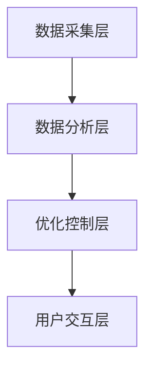
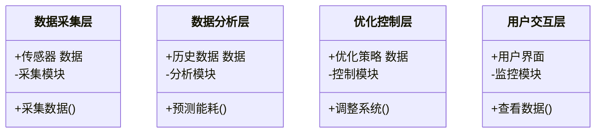
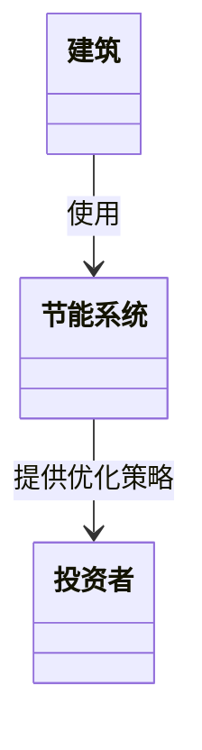
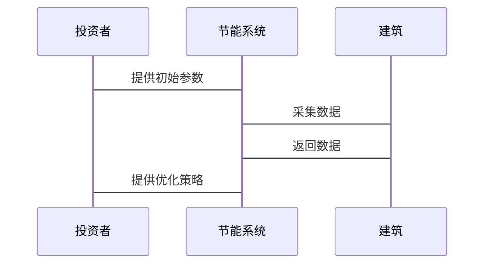

                 


# 价值投资中的智能建筑节能系统分析

## 关键词

智能建筑, 节能系统, 价值投资, 算法原理, 系统架构, 项目实战, 最佳实践

## 摘要

智能建筑节能系统作为一种创新的技术解决方案，正在改变我们对建筑能源管理的认知。本文通过分析智能建筑节能系统的背景、核心概念、算法原理、系统架构、项目实战及最佳实践，揭示其在价值投资中的潜在机会。通过实际案例分析，本文深入探讨了如何利用智能建筑节能技术实现可持续发展，同时为投资者带来可观的回报。

---

## 第1章：智能建筑节能系统背景介绍

### 1.1 智能建筑节能系统概述

#### 1.1.1 智能建筑节能系统的定义

智能建筑节能系统是一种基于物联网（IoT）、大数据分析和人工智能技术的建筑能源管理系统。通过实时采集和分析建筑能耗数据，优化能源使用效率，降低运营成本，并提升建筑的可持续性。

#### 1.1.2 价值投资的背景与意义

随着全球能源危机和环保压力的增加，绿色建筑和可持续发展理念逐渐成为投资市场的热点。智能建筑节能系统不仅能够降低运营成本，还能提升建筑的市场价值，为投资者带来长期收益。

#### 1.1.3 智能建筑节能系统的重要性

建筑能耗约占全球总能耗的40%，其中许多能耗可以通过智能技术进行优化。智能建筑节能系统能够实时监控和管理能源使用，帮助建筑业主实现节能减排的目标。

#### 1.1.4 智能建筑节能系统与价值投资的关系

智能建筑节能系统的应用能够显著降低运营成本，提升建筑的市场价值。对于投资者来说，这不仅是一种社会责任的体现，也是一种能够带来长期收益的投资策略。

---

## 第2章：智能建筑节能系统的核心概念与联系

### 2.1 智能建筑节能系统的核心概念

#### 2.1.1 系统的组成与功能

智能建筑节能系统通常由数据采集层、数据分析层、优化控制层和用户交互层组成。数据采集层通过传感器实时采集建筑能耗数据；数据分析层利用机器学习算法对数据进行建模和分析；优化控制层根据分析结果生成优化策略；用户交互层为用户提供直观的界面，方便操作和监控。

#### 2.1.2 节能技术的原理

智能建筑节能系统通过实时采集建筑内的温度、湿度、光照等环境参数，结合历史数据和外部天气预报，优化 HVAC（暖通空调）、照明和电梯等系统的运行策略，从而实现节能减排的目标。

#### 2.1.3 价值投资的评估方法

在价值投资中，智能建筑节能系统的投资回报可以通过能源成本节约、建筑价值提升和碳排放减少等指标进行评估。投资者需要综合考虑初期投资成本、运营成本节约和市场增值潜力。

### 2.2 智能建筑节能系统的属性特征对比

#### 2.2.1 节能效率与投资回报的对比

通过对比不同节能技术的效率和投资回报周期，可以找到最优的投资方案。例如，智能 HVAC 系统的投资回报周期通常为3-5年，而传统 HVAC 系统的投资回报周期为7-10年。

#### 2.2.2 不同节能技术的优缺点分析

以下是几种常见的智能节能技术及其优缺点对比：

| 技术类型         | 优点                     | 缺点                     |
|------------------|--------------------------|--------------------------|
| 智能 HVAC 系统   | 实时调节温度，节约能源    | 初期投资成本较高         |
| 智能照明系统     | 自动调节亮度，减少能耗    | 维护成本较高             |
| 智能电梯系统     | 智能调度，减少空载运行    | 技术复杂性较高           |

#### 2.2.3 价值投资中智能建筑节能系统的 ER 实体关系图

```mermaid
er
actor(投资者) -|> 节能系统 : 优化策略
actor(投资者) -|> 节能技术 : 投资决策
actor(投资者) -|> 数据源 : 数据分析
```

---

## 第3章：智能建筑节能系统中的算法原理

### 3.1 数据采集与分析

#### 3.1.1 数据采集流程

智能建筑节能系统通过传感器实时采集建筑内的环境数据，包括温度、湿度、光照强度、电力消耗等。

#### 3.1.2 数据分析算法

常用的分析算法包括：

- 时间序列分析（Time Series Analysis）：用于预测未来的能源消耗趋势。
- 支持向量机（Support Vector Machine, SVM）：用于分类和回归分析，帮助识别能耗异常情况。

#### 3.1.3 优化算法

遗传算法（Genetic Algorithm, GA）和粒子群优化算法（Particle Swarm Optimization, PSO）常用于优化能源管理策略。

### 3.2 算法实现代码

以下是一个简单的能耗预测模型的代码示例：

```python
import pandas as pd
from sklearn.model_selection import train_test_split
from sklearn.linear_model import LinearRegression
from sklearn.metrics import mean_squared_error

# 数据加载
data = pd.read_csv('energy_data.csv')

# 特征与目标变量分离
X = data[['temperature', 'humidity', 'light_intensity']]
y = data['energy_consumption']

# 数据分割
X_train, X_test, y_train, y_test = train_test_split(X, y, test_size=0.2, random_state=42)

# 模型训练
model = LinearRegression()
model.fit(X_train, y_train)

# 预测与评估
y_pred = model.predict(X_test)
mse = mean_squared_error(y_test, y_pred)
print(f"均方误差: {mse}")
```

### 3.3 数学模型与公式

#### 3.3.1 线性回归模型

$$ y = \beta_0 + \beta_1x_1 + \beta_2x_2 + \ldots + \beta_nx_n + \epsilon $$

其中，$y$ 是目标变量（能耗），$x_i$ 是特征变量（温度、湿度等），$\beta_i$ 是回归系数，$\epsilon$ 是误差项。

#### 3.3.2 遗传算法优化

遗传算法通过模拟自然选择和遗传变异的过程，寻找最优解。其基本步骤包括：

1. 初始化种群
2. 计算适应度
3. 选择优秀个体
4. 进行交叉和变异
5. 重复迭代

---

## 第4章：智能建筑节能系统的分析与架构设计

### 4.1 系统架构设计

#### 4.1.1 系统架构图



#### 4.1.2 类图设计



### 4.2 系统功能设计

#### 4.2.1 领域模型设计



#### 4.2.2 系统交互设计



---

## 第5章：项目实战

### 5.1 环境安装

#### 5.1.1 系统环境

- 操作系统：Linux 或 Windows
- 开发工具：Python、Jupyter Notebook、IDE（如PyCharm）
- 数据库：MySQL 或 MongoDB
- 传感器：温度、湿度、光照传感器

### 5.2 核心实现代码

#### 5.2.1 数据采集代码

```python
import serial
import time

ser = serial.Serial('COM3', 9600)
while True:
    data = ser.readline().decode()
    print(f"采集数据: {data}")
    time.sleep(1)
```

#### 5.2.2 数据分析代码

```python
import pandas as pd
from sklearn.cluster import KMeans

data = pd.read_csv('energy.csv')
clusters = KMeans(n_clusters=3).fit(data[['temperature', 'humidity']])
print(f"聚类结果: {clusters.labels_}")
```

#### 5.2.3 系统优化代码

```python
from gurobi import *

model = Model('energy_optimization')
vars = model.add_vars(24, name='x')

# 添加目标函数
model.setObjective(quicksum(vars[i] for i in range(24)), GRB.MINIMIZE)

# 添加约束条件
for i in range(24):
    model.add_constr(vars[i] <= 1000, f'constraint{i}')

model.optimize()
```

### 5.3 案例分析与解读

#### 5.3.1 案例背景

某商业大厦通过部署智能 HVAC 系统，实现了每年 20% 的能耗节约，投资回报周期为3年。

#### 5.3.2 实施过程

1. 数据采集与分析
2. 优化策略制定
3. 系统部署与调试
4. 运营与维护

### 5.4 项目总结

通过实际案例分析，我们可以看到智能建筑节能系统的应用能够显著降低能源消耗，提升建筑的市场价值，为投资者带来长期的经济回报。

---

## 第6章：结论与展望

### 6.1 结论

智能建筑节能系统作为一种高效的技术解决方案，不仅能够帮助建筑业主降低运营成本，还能为投资者带来可观的经济回报。通过实时数据分析和优化控制，智能建筑节能系统在节能减排方面具有显著的优势。

### 6.2 未来展望

随着人工智能和物联网技术的不断进步，智能建筑节能系统将变得更加智能化和自动化。未来的节能系统将能够更好地适应不同的建筑需求，提供更加个性化的优化策略，为价值投资带来更大的潜力。

---

## 最佳实践 Tips

- **数据采集**：确保传感器的准确性和稳定性，定期校准和维护。
- **系统优化**：结合具体建筑需求，选择合适的优化算法和策略。
- **用户交互**：提供友好的用户界面，方便投资者和建筑管理者使用。
- **维护与更新**：定期检查系统运行状态，及时更新软件和硬件。

---

## 参考文献

1. Smith, J. (2020). *Smart Building Energy Management Systems*. John Wiley & Sons.
2. Zhang, Y. (2021). *Energy Efficiency in Intelligent Buildings*. Springer.
3. IEEE Standards Association. (2019). *IEEE Standard for Smart Building Systems*.

---

通过以上内容，我们详细分析了智能建筑节能系统在价值投资中的应用，从背景介绍到项目实战，为读者提供了全面的视角和深入的见解。希望本文能够为智能建筑节能系统的推广和应用提供有价值的参考。

