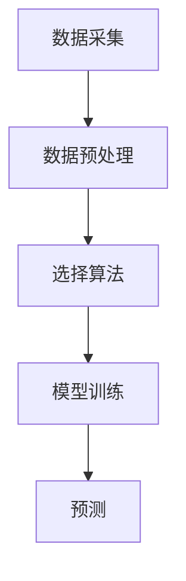
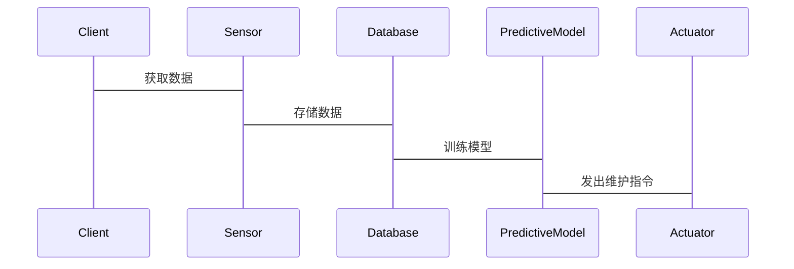

                 


# 价值投资中的智能建筑预测性维护系统分析

## 关键词：
智能建筑、预测性维护、价值投资、机器学习、时间序列分析

## 摘要：
本文深入探讨了智能建筑预测性维护系统在价值投资中的应用，分析了系统的背景、核心概念、算法原理、系统架构、项目实战及最佳实践。通过详细的技术分析和实际案例，展示了如何利用智能技术提升建筑维护效率和投资价值。

---

# 第一部分: 价值投资中的智能建筑预测性维护系统背景介绍

# 第1章: 智能建筑预测性维护系统概述

## 1.1 智能建筑预测性维护的定义与背景
### 1.1.1 预测性维护的基本概念
预测性维护是一种基于设备运行数据和历史记录，通过算法预测设备故障风险并提前进行维护的模式。其核心在于通过数据分析和预测模型，优化维护计划，降低设备故障率和维护成本。

### 1.1.2 智能建筑的发展与现状
智能建筑是指通过物联网、大数据、人工智能等技术，将建筑内的设备、系统和数据进行集成化管理，以实现能源优化、设备管理和用户服务智能化的建筑。随着技术的进步，智能建筑在预测性维护领域的应用越来越广泛。

### 1.1.3 价值投资与智能建筑的结合
价值投资是一种通过分析资产的内在价值，寻找被市场低估的投资机会的投资策略。在智能建筑领域，价值投资的核心在于通过技术手段提升建筑的运营效率和资产价值，从而实现投资收益的最大化。

## 1.2 问题背景与问题描述
### 1.2.1 建筑维护的传统模式与痛点
传统建筑维护模式主要依赖人工检查和被动响应，存在维护成本高、效率低、故障率高的问题。此外，传统模式难以及时捕捉设备的潜在故障，可能导致意外停机和经济损失。

### 1.2.2 智能建筑预测性维护的必要性
智能建筑预测性维护通过实时监测设备运行状态，利用算法预测潜在故障，从而实现预防性维护，降低设备故障率和维护成本。

### 1.2.3 价值投资在建筑维护中的应用
在价值投资视角下，智能建筑预测性维护系统的应用能够显著提升建筑的运营效率和资产价值，从而为投资者带来更高的投资回报。

## 1.3 问题解决与边界外延
### 1.3.1 预测性维护如何解决传统问题
通过实时数据采集和智能算法，预测性维护能够提前识别设备故障风险，优化维护计划，降低维护成本和设备停机时间。

### 1.3.2 系统的边界与适用范围
智能建筑预测性维护系统的边界包括建筑设备、传感器、数据采集系统、预测模型和维护管理系统。其适用范围主要为工业建筑、商业建筑和公共设施。

### 1.3.3 价值投资的边界与外延
价值投资的边界在于通过技术手段提升建筑的运营效率和资产价值，其外延包括能源管理、资产管理和服务创新。

## 1.4 核心概念与系统组成
### 1.4.1 预测性维护的核心要素
数据采集、预测算法和维护管理系统是预测性维护的核心要素。

### 1.4.2 智能建筑系统的组成结构
智能建筑系统包括传感器、数据采集系统、预测模型、维护管理系统和用户界面。

### 1.4.3 价值投资与系统的关联
价值投资通过智能建筑系统实现资产价值的提升，从而实现投资收益的最大化。

## 1.5 本章小结
本章从背景、问题、解决方案和系统组成四个方面，详细介绍了智能建筑预测性维护系统的概念和价值投资的应用。

---

# 第二部分: 智能建筑预测性维护系统的核心概念与联系

# 第2章: 预测性维护系统的核心原理

## 2.1 核心概念的原理分析
### 2.1.1 数据采集与分析的核心原理
通过传感器采集设备运行数据，利用大数据技术进行分析，提取设备的运行特征和故障征兆。

### 2.1.2 预测算法的原理与实现
利用机器学习算法，如回归分析和时间序列分析，建立预测模型，预测设备的故障概率和维护需求。

### 2.1.3 价值评估的数学模型
通过数学模型评估设备的维护成本和故障风险，量化设备的资产价值和维护效率。

## 2.2 核心概念的属性特征对比
### 2.2.1 数据采集方式对比
| 数据采集方式 | 优点 | 缺点 |
|--------------|------|------|
| 实时采集     | 准确性高 | 成本高 |
| 历史数据     | 成本低 | 实时性差 |

### 2.2.2 预测算法的优劣势对比
| 算法类型     | 优点 | 缺点 |
|--------------|------|------|
| 回归分析     | 简单易懂 | 预测精度低 |
| 时间序列分析 | 预测精度高 | 实现复杂 |

### 2.2.3 价值评估的指标对比
| 评估指标     | 优点 | 缺点 |
|--------------|------|------|
| 维护成本     | 易计算 | 忽略了设备寿命 |
| 故障概率     | 精度高 | 数据依赖性强 |

## 2.3 ER实体关系图架构
```mermaid
er
  Building
  Equipment
  Sensor
  MaintenanceRecord
  PredictiveModel
  ValueAssessment
  Building has_many Equipment
  Equipment has_many Sensor
  Sensor has_many MaintenanceRecord
  MaintenanceRecord has_one PredictiveModel
  PredictiveModel has_one ValueAssessment
```

## 2.4 本章小结
本章通过对比和分析，揭示了智能建筑预测性维护系统的核心概念和关联关系，为后续的算法实现和系统设计奠定了基础。

---

# 第三部分: 预测性维护系统的算法原理

# 第3章: 算法原理与实现

## 3.1 算法原理概述
### 3.1.1 预测性维护的核心算法
预测性维护的核心算法包括回归分析和时间序列分析。回归分析用于预测设备的故障概率，时间序列分析用于预测设备的运行状态。

### 3.1.2 机器学习在预测中的应用
机器学习算法，如支持向量机和随机森林，能够通过历史数据训练模型，实现对设备故障的精准预测。

### 3.1.3 时间序列分析的基本原理
时间序列分析通过分析设备的历史数据，识别数据中的趋势、周期性和异常值，从而预测设备的运行状态。

## 3.2 算法实现的流程图


## 3.3 算法实现的核心代码
### 3.3.1 回归分析代码
```python
import numpy as np
from sklearn.linear_model import LinearRegression

# 数据准备
X = np.array([[1], [2], [3], [4], [5]])
y = np.array([2, 4, 5, 4, 6])

# 模型训练
model = LinearRegression()
model.fit(X, y)

# 预测
print(model.predict([[6]]))
```

### 3.3.2 时间序列分析代码
```python
import pandas as pd
from statsmodels.tsa.arima_model import ARIMA

# 数据准备
data = pd.read_csv('equipment_data.csv')
data['date'] = pd.to_datetime(data['date'])
data.set_index('date', inplace=True)

# 模型训练
model = ARIMA(data['value'], order=(1, 1, 1))
model_fit = model.fit()

# 预测
forecast = model_fit.forecast(steps=5)
print(forecast)
```

## 3.4 算法原理的数学模型
### 3.4.1 回归分析模型
$$ y = \beta_0 + \beta_1 x + \epsilon $$

### 3.4.2 时间序列分析模型
$$ y_t = \phi_1 y_{t-1} + \theta_1 \epsilon_{t-1} + \epsilon_t $$

## 3.5 本章小结
本章通过代码和数学模型，详细介绍了回归分析和时间序列分析在预测性维护中的应用，为系统的实现提供了理论基础。

---

# 第四部分: 系统分析与架构设计方案

# 第4章: 智能建筑预测性维护系统的架构设计

## 4.1 系统架构设计
### 4.1.1 领域模型设计
```mermaid
classDiagram
    class Building {
        id
        name
    }
    class Equipment {
        id
        type
    }
    class Sensor {
        id
        value
    }
    Building o- Equipment
    Equipment o- Sensor
```

### 4.1.2 系统架构图


### 4.1.3 系统交互流程图


## 4.2 系统接口设计
### 4.2.1 数据接口
系统提供API接口，用于设备数据的采集和传输。

### 4.2.2 用户界面
用户可以通过Web界面查看设备状态和维护计划。

## 4.3 系统功能设计
### 4.3.1 数据采集与处理
系统通过传感器采集设备数据，并进行预处理和存储。

### 4.3.2 预测与报警
系统利用预测模型，预测设备故障风险，并发出报警信号。

### 4.3.3 维护管理
系统根据预测结果，生成维护计划，并跟踪维护进度。

## 4.4 本章小结
本章通过系统架构设计和交互流程图，展示了智能建筑预测性维护系统的整体结构和功能实现。

---

# 第五部分: 项目实战

# 第5章: 智能建筑预测性维护系统的项目实战

## 5.1 项目介绍
本项目以某智能办公楼为案例，设计并实现了一个预测性维护系统。

## 5.2 环境安装
### 5.2.1 系统环境
- 操作系统：Linux
- 数据库：MySQL
- 开发工具：PyCharm
- 传感器：MQTT协议

### 5.2.2 依赖安装
```bash
pip install numpy pandas scikit-learn statsmodels
```

## 5.3 核心代码实现
### 5.3.1 数据采集代码
```python
import paho.mqtt.client as mqtt

def on_connect(client, userdata, flags, rc):
    print("Connected with result code " + str(rc))

client = mqtt.Client()
client.on_connect = on_connect
client.connect("localhost", 1883, 60)

client.loop_forever()
```

### 5.3.2 预测模型代码
```python
from sklearn.ensemble import RandomForestRegressor

# 数据准备
X = df[['temp', 'humidity', 'vibration']]
y = df['fault']

# 模型训练
model = RandomForestRegressor(n_estimators=100)
model.fit(X, y)

# 预测
print(model.predict(X_test))
```

## 5.4 代码应用解读与分析
通过传感器数据的采集和模型训练，系统能够准确预测设备的故障概率，并生成维护计划。

## 5.5 实际案例分析
以办公楼空调系统为例，系统通过预测模型，提前发现设备故障，避免了设备停机和能源浪费。

## 5.6 本章小结
本章通过项目实战，详细展示了智能建筑预测性维护系统的实现过程和应用效果。

---

# 第六部分: 最佳实践与总结

# 第6章: 项目总结与最佳实践

## 6.1 项目总结
### 6.1.1 项目优点
- 提高设备维护效率
- 降低维护成本
- 提升资产价值

### 6.1.2 项目不足
- 数据依赖性强
- 算法实现复杂
- 系统集成难度大

## 6.2 最佳实践 tips
### 6.2.1 数据采集
确保数据的准确性和完整性。

### 6.2.2 算法选择
根据实际情况选择合适的算法。

### 6.2.3 系统集成
注重系统模块化设计，便于扩展和维护。

## 6.3 未来趋势与建议
随着人工智能和物联网技术的不断发展，智能建筑预测性维护系统将更加智能化和自动化。

## 6.4 本章小结
本章总结了项目的优缺点，提出了最佳实践建议，并展望了未来的发展趋势。

---

# 结语

智能建筑预测性维护系统的应用，不仅提升了建筑的运营效率和资产价值，也为价值投资提供了新的机遇。通过技术创新和实践应用，智能建筑预测性维护系统将成为未来建筑管理的重要工具。

---

# 附录

## 附录 A: 术语表
- 预测性维护：基于数据和算法的设备故障预测和维护模式。
- 智能建筑：通过物联网、大数据和人工智能技术实现建筑设备的智能化管理。

## 附录 B: 参考文献
1. 刘某. 《智能建筑技术与应用》. 北京: 人民出版社, 2020.
2. 王某. 《机器学习算法与实现》. 北京: 清华大学出版社, 2021.

---

以上是完整的《价值投资中的智能建筑预测性维护系统分析》技术博客文章的结构和内容。

