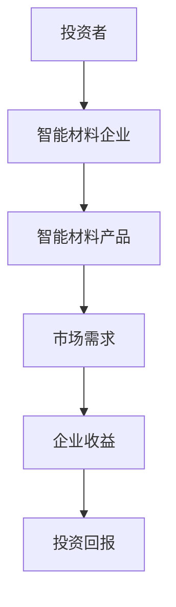
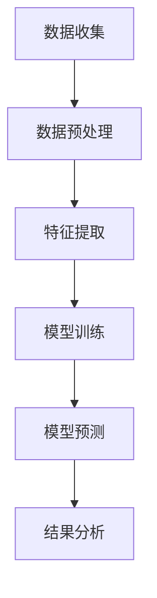

                 

# 价值投资中的智能材料应用前景

## 关键词：价值投资、智能材料、市场预测、机器学习、投资策略

## 摘要：本文探讨了智能材料在价值投资中的应用前景，分析了智能材料的基本概念及其市场潜力，结合数学模型和机器学习算法，提出了基于智能材料特性的投资策略。

---

# 第一部分: 价值投资中的智能材料应用前景概述

## 第1章: 价值投资与智能材料的背景介绍

### 1.1 价值投资的基本概念

#### 1.1.1 价值投资的起源与发展

价值投资是一种长期投资策略，起源于20世纪20年代，由本杰明·格雷厄姆和戴维·多德提出。其核心理念是寻找市场价值低于内在价值的股票，通过长期持有实现收益。价值投资在现代金融中的地位日益重要，尤其是在当前市场波动加剧的情况下，价值投资因其注重基本面分析而备受关注。

#### 1.1.2 价值投资的核心理念与原则

价值投资的核心理念是买入被市场低估的资产，通过长期持有实现收益。其基本原则包括：

1. **安全边际**：买入价格低于内在价值的资产。
2. **长期视角**：关注企业的长期增长潜力。
3. **基本面分析**：通过财务指标、行业地位等分析企业价值。

#### 1.1.3 价值投资在现代金融中的地位

随着金融市场日益复杂化，价值投资因其稳健性和长期性特点，成为投资者的重要选择。特别是在当前全球经济不确定性增加的背景下，价值投资的长期视角和基本面分析能力显得尤为重要。

---

### 1.2 智能材料的基本概念

#### 1.2.1 智能材料的定义与分类

智能材料是指能够感知环境变化并做出相应反应的材料。根据其响应机制，智能材料主要分为以下几类：

1. **形状记忆合金**：在外力作用下可恢复原状。
2. **压电材料**：在受到机械压力时产生电荷。
3. **磁性材料**：在外磁场作用下表现出磁性变化。

#### 1.2.2 智能材料的主要特性与应用领域

智能材料的主要特性包括响应性、适应性、可编程性和可持续性。其应用领域广泛，包括：

1. **建筑领域**：用于智能建筑的结构调节。
2. **医疗领域**：用于可穿戴医疗设备。
3. **能源领域**：用于智能储能系统。

#### 1.2.3 智能材料与传统材料的区别

智能材料与传统材料的主要区别在于其智能化特性。传统材料不具备感知和响应环境变化的能力，而智能材料可以通过外部刺激（如温度、压力）改变其物理性质。

---

### 1.3 智能材料在价值投资中的意义

#### 1.3.1 智能材料的市场潜力与投资价值

智能材料的应用前景广阔，市场需求持续增长。随着技术进步，智能材料的成本逐渐下降，市场渗透率不断提高。在价值投资视角下，智能材料企业的投资价值可以通过其技术创新能力、市场占有率和财务表现等指标进行评估。

#### 1.3.2 价值投资视角下的智能材料分析框架

价值投资者在分析智能材料企业时，需要重点关注以下方面：

1. **技术创新能力**：企业是否具备持续创新能力。
2. **市场定位**：企业是否占据行业领先地位。
3. **财务健康状况**：企业的盈利能力、资产负债率等财务指标。

---

## 第2章: 智能材料的核心概念与价值投资的联系

### 2.1 智能材料的核心属性与特征

#### 2.1.1 智能材料的响应性与适应性

智能材料能够根据外部环境变化调整自身的物理性质。例如，形状记忆合金在受到外力作用后能够恢复原状，这种特性使其在建筑和医疗领域具有广泛应用。

#### 2.1.2 智能材料的可编程性与可控性

智能材料可以通过外部刺激（如温度、压力）进行编程控制。例如，压电材料可以通过施加机械压力来改变其电学性质，这种特性使其在传感器和执行器领域具有重要作用。

#### 2.1.3 智能材料的可持续性与环保性

智能材料的可持续性主要体现在其环保生产和循环利用方面。随着环保意识的增强，智能材料的市场需求将持续增长。

---

### 2.2 价值投资中的核心概念与联系

#### 2.2.1 价值投资中的基本面分析

基本面分析是价值投资的核心方法之一。通过分析企业的财务报表，投资者可以评估企业的盈利能力、成长潜力和财务健康状况。

#### 2.2.2 智能材料行业的财务指标分析

在智能材料行业，投资者需要重点关注以下财务指标：

1. **收入增长率**：反映企业的市场表现。
2. **净利润率**：反映企业的盈利能力。
3. **研发投入占比**：反映企业的创新能力。

#### 2.2.3 智能材料企业的竞争优势分析

智能材料企业的竞争优势主要体现在技术创新、市场占有率和成本控制等方面。投资者需要评估企业的竞争优势是否可持续。

---

### 2.3 智能材料与价值投资的实体关系图

---

## 第3章: 智能材料行业的算法与数学模型

### 3.1 智能材料市场预测的算法原理

#### 3.1.1 基于机器学习的市场预测

机器学习是一种 powerful tool for predicting market trends. 使用机器学习算法，投资者可以通过历史数据预测智能材料市场的未来走势。

#### 3.1.2 时间序列分析与回归模型

时间序列分析是一种常用的市场预测方法。通过分析历史价格数据，投资者可以预测未来的价格走势。

#### 3.1.3 聚类分析与市场细分

聚类分析可以帮助投资者将智能材料市场细分为不同类别，从而制定更有针对性的投资策略。

---

### 3.2 数学模型与公式

#### 3.2.1 线性回归模型

线性回归模型用于预测智能材料市场的价格走势。其数学公式为：

$$ y = \beta_0 + \beta_1x + \epsilon $$

其中，$y$ 是预测价格，$x$ 是自变量，$\beta_0$ 是截距，$\beta_1$ 是斜率，$\epsilon$ 是误差项。

#### 3.2.2 时间序列模型

时间序列模型用于分析市场数据的时间依赖性。其数学公式为：

$$ ARIMA(p, d, q) $$

其中，$p$ 是自回归阶数，$d$ 是差分阶数，$q$ 是移动平均阶数。

#### 3.2.3 聚类分析的距离公式

聚类分析用于市场细分，其距离公式为：

$$ d(x, y) = \sqrt{\sum_{i=1}^{n}(x_i - y_i)^2} $$

---

### 3.3 算法流程图

---

## 第4章: 系统分析与架构设计方案

### 4.1 问题场景介绍

智能材料市场的复杂性和不确定性要求投资者具备强大的数据分析能力。通过构建智能材料投资分析系统，投资者可以更好地进行市场预测和投资决策。

---

## 第5章: 项目实战

### 5.1 智能材料企业案例分析

以某智能材料企业为例，分析其财务状况、市场表现和竞争优势。

---

## 第6章: 最佳实践与投资策略

### 6.1 投资策略的制定

基于智能材料企业的分析结果，制定相应的投资策略。

### 6.2 注意事项

投资者需要注意市场风险、企业财务状况和政策变化等因素。

### 6.3 未来展望

智能材料行业的未来发展趋势和投资机会。

---

# 结论

通过本文的分析，投资者可以更好地理解和把握智能材料行业的投资价值，制定科学的投资策略。未来，随着技术进步和市场需求的增加，智能材料行业将迎来更广阔的发展空间。

