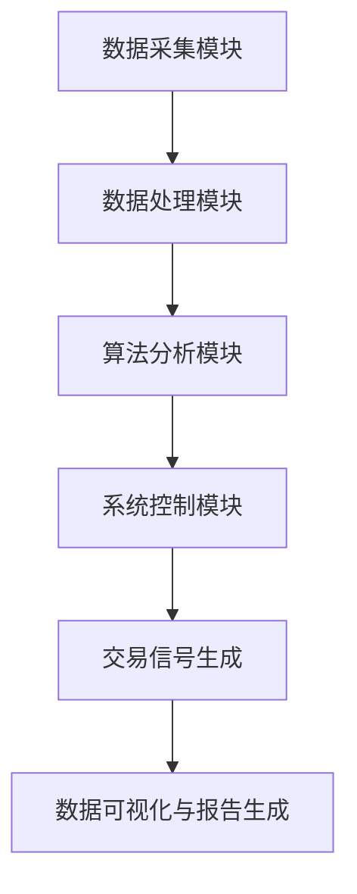

                 


# 价值投资中的智能水下机器人系统分析

> 关键词：价值投资，智能水下机器人，系统分析，技术分析，大数据

> 摘要：  
本文深入探讨了智能水下机器人技术在价值投资分析中的应用。通过分析智能水下机器人系统的组成、原理及其实现，结合大数据分析和算法优化，展示了如何利用智能水下机器人技术提升价值投资的效率和准确性。文章从背景介绍、核心概念、算法原理、系统架构设计到项目实战，层层展开，为读者提供了全面而深入的技术解析。

---

# 第一部分：价值投资与智能水下机器人系统概述

## 第1章：价值投资的基本概念与智能水下机器人技术

### 1.1 价值投资的核心理念

#### 1.1.1 价值投资的定义与历史发展
价值投资是一种以基本面分析为核心的长期投资策略，旨在通过识别市场中被低估的投资标的，实现长期稳定的收益。其核心理念是寻找市场价低于内在价值的资产。

#### 1.1.2 智能水下机器人技术的基本概念
智能水下机器人（UUV，Unmanned Underwater Vehicle）是一种能够在水下自主或遥控执行任务的机器人。它集成了传感器、通信、导航、数据处理等多种技术，能够完成水下探测、环境监测、数据采集等任务。

#### 1.1.3 价值投资与智能水下机器人技术的结合
智能水下机器人技术在金融领域的应用尚不常见，但其数据采集和处理能力为价值投资提供了新的思路。通过智能水下机器人技术，可以实时采集市场数据、分析公司基本面信息，从而辅助投资者做出更明智的决策。

### 1.2 智能水下机器人系统的组成与功能

#### 1.2.1 传感器与数据采集模块
智能水下机器人配备了多种传感器，包括深度传感器、温度传感器、压力传感器等，用于采集水下环境数据。这些传感器数据可以通过通信模块传输到上位机，进行进一步分析。

#### 1.2.2 通信与控制模块
通信模块负责机器人与地面控制站之间的数据传输，实现远程控制和实时监控。控制模块则负责根据接收的指令调整机器人的运动状态，如深度、方向等。

#### 1.2.3 数据处理与分析模块
数据处理模块对采集到的传感器数据进行清洗、融合和分析，提取有用的信息。分析模块可以通过机器学习算法对数据进行建模，预测市场趋势，辅助投资决策。

### 1.3 价值投资中的技术分析方法

#### 1.3.1 技术分析的基本原理
技术分析是一种通过分析历史价格和成交量数据，预测未来市场走势的方法。其核心假设是市场价格反映所有相关信息，并且价格走势具有一定的规律性。

#### 1.3.2 智能水下机器人在技术分析中的应用
智能水下机器人可以通过传感器实时采集市场数据，如股票价格、成交量等，并通过数据处理模块进行技术分析，生成交易信号。这种实时性使得投资者能够更快地捕捉市场机会。

#### 1.3.3 技术分析与价值投资的结合
价值投资注重基本面分析，而技术分析则提供了短期市场趋势的参考。通过结合两者，投资者可以在长期持有优质资产的同时，规避短期市场波动带来的风险。

---

## 第2章：智能水下机器人系统的原理与实现

### 2.1 智能水下机器人系统的组成

#### 2.1.1 传感器模块
传感器模块包括多种类型的传感器，如深度传感器、温度传感器、压力传感器等。这些传感器能够实时感知水下环境的变化，并将数据传输到主控模块。

#### 2.1.2 主控模块
主控模块是智能水下机器人的核心，负责协调各模块的工作。它接收传感器数据，执行控制算法，并通过通信模块与地面站进行数据交互。

#### 2.1.3 通信模块
通信模块负责机器人与地面站之间的数据传输。常用的通信方式包括声呐通信和无线电通信，其中声呐通信在水下环境中更为常用。

### 2.2 智能水下机器人的导航与定位

#### 2.2.1 惯性导航系统（INS）
惯性导航系统通过加速度计和陀螺仪测量机器人的运动状态，计算其位置和姿态。尽管INS在短时间内的精度较高，但长时间运行容易累积误差。

#### 2.2.2 声呐定位系统
声呐定位系统通过发送声波并接收回波，利用回波的时间差计算机器人与目标的距离和位置。声呐系统在水下环境中具有较强的抗干扰能力。

#### 2.2.3 组合导航技术
为了提高导航精度，通常将INS与声呐定位系统结合使用，通过融合算法对两种导航系统的数据进行优化，得到更准确的机器人位置。

### 2.3 智能水下机器人的数据处理与分析

#### 2.3.1 数据采集与预处理
数据采集模块实时采集传感器数据，包括温度、深度、压力等信息。预处理模块对数据进行滤波、插值等操作，消除噪声和异常值。

#### 2.3.2 数据融合与分析
数据融合模块将来自不同传感器的数据进行融合，提取有用的特征信息。分析模块利用机器学习算法对数据进行建模，预测市场趋势。

#### 2.3.3 数据可视化
数据可视化模块将分析结果以图形化的方式展示，帮助投资者更直观地理解市场动态。

---

## 第3章：智能水下机器人系统的算法优化

### 3.1 数据清洗与特征提取

#### 3.1.1 数据清洗
数据清洗是数据预处理的重要步骤，包括去除缺失值、异常值和重复数据。通过清洗数据，可以提高模型的训练效果。

#### 3.1.2 特征提取
特征提取是从原始数据中提取能够反映市场趋势的关键特征。常用的方法包括主成分分析（PCA）和特征选择算法。

### 3.2 算法实现与优化

#### 3.2.1 算法选择
在价值投资中，常用的技术分析算法包括移动平均线（MA）、相对强弱指数（RSI）和 MACD 等。机器学习算法如支持向量机（SVM）和随机森林（Random Forest）也可以用于市场预测。

#### 3.2.2 算法优化
算法优化包括参数调优和模型选择。通过交叉验证和网格搜索等方法，可以找到最优的模型参数，提高预测准确率。

#### 3.2.3 算法实现
以下是一个基于移动平均线的交易策略实现示例：

```python
import pandas as pd
import numpy as np

# 假设data是一个包含股票价格的DataFrame
data = pd.read_csv('stock_data.csv')

# 计算短期和长期移动平均线
short_window = 10
long_window = 20

data['short_ma'] = data['Close'].rolling(short_window).mean()
data['long_ma'] = data['Close'].rolling(long_window).mean()

# 生成交易信号
data['signal'] = 0
data.loc[data['short_ma'] > data['long_ma'], 'signal'] = 1
data.loc[data['short_ma'] < data['long_ma'], 'signal'] = -1

# 计算交易收益
data['returns'] = data['Close'].pct_change()
data['strategy_returns'] = data['signal'].shift(1) * data['returns']
```

### 3.3 算法效果评估

#### 3.3.1 回测与验证
通过回测验证算法的有效性，包括计算夏普比率、最大回撤等风险指标。

#### 3.3.2 模型优化与改进
根据回测结果，不断优化算法参数，改进交易策略，提高盈利能力。

---

## 第4章：智能水下机器人系统的系统架构设计

### 4.1 系统模块划分

#### 4.1.1 数据采集模块
负责实时采集市场数据，包括股票价格、成交量等。

#### 4.1.2 数据处理模块
对采集到的数据进行清洗、融合和特征提取。

#### 4.1.3 算法分析模块
利用机器学习算法对数据进行建模，生成交易信号。

#### 4.1.4 系统控制模块
协调各模块的工作，实现系统的整体运行。

### 4.2 系统功能设计

#### 4.2.1 数据采集与预处理
通过API接口实时获取市场数据，清洗数据，消除噪声。

#### 4.2.2 算法分析与交易信号生成
利用技术分析算法生成交易信号，指导投资决策。

#### 4.2.3 数据可视化与报告生成
将分析结果以图形化的方式展示，并生成投资报告。

### 4.3 系统架构设计

#### 4.3.1 系统架构图


#### 4.3.2 接口设计
系统各模块之间通过标准接口进行数据交互，确保系统的可扩展性和灵活性。

---

## 第5章：智能水下机器人系统的项目实战

### 5.1 项目背景与目标

#### 5.1.1 项目背景
随着人工智能技术的发展，智能水下机器人在金融领域的应用逐渐兴起。本项目旨在利用智能水下机器人技术，开发一个基于技术分析的价值投资系统。

#### 5.1.2 项目目标
开发一个能够实时采集市场数据、生成交易信号，并指导投资决策的智能水下机器人系统。

### 5.2 项目实现

#### 5.2.1 环境安装
安装必要的开发环境，包括Python、Jupyter Notebook、Pandas、NumPy等。

#### 5.2.2 数据采集与预处理
通过API接口获取市场数据，清洗数据，消除噪声。

#### 5.2.3 算法实现与优化
选择合适的算法，优化模型参数，提高预测准确率。

#### 5.2.4 系统集成与测试
将各模块集成到一起，进行系统测试，确保系统的稳定性和可靠性。

### 5.3 实际案例分析

#### 5.3.1 案例背景
以某只股票为例，展示系统在实际投资中的应用。

#### 5.3.2 数据分析与交易信号生成
通过系统分析，生成交易信号，并指导实际交易。

#### 5.3.3 投资收益分析
分析系统的交易收益，验证算法的有效性。

---

## 第6章：总结与展望

### 6.1 总结
本文深入探讨了智能水下机器人技术在价值投资中的应用，通过系统分析和算法优化，展示了如何利用智能水下机器人技术提升投资效率和准确性。

### 6.2 展望
未来，随着人工智能技术的不断发展，智能水下机器人在金融领域的应用将更加广泛。可以通过引入更复杂的算法、优化系统架构，进一步提升系统的智能化水平。

---

### 结语
价值投资与智能水下机器人系统的结合，为投资者提供了新的思路和工具。通过本文的分析，读者可以更好地理解如何利用智能技术提升投资决策的科学性和准确性。

