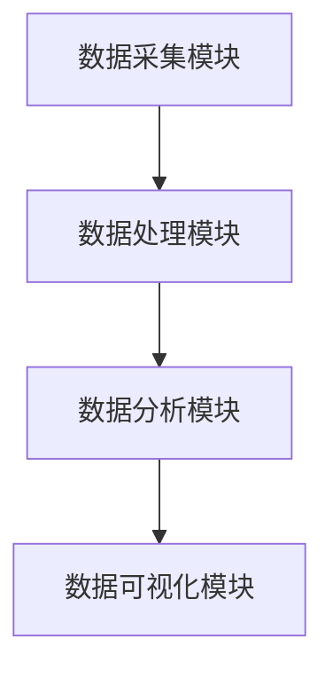

                 


# 价值投资中的智能海洋养殖系统分析

> 关键词：价值投资，智能系统，海洋养殖，数据分析，机器学习，投资决策

> 摘要：本文深入分析了智能海洋养殖系统在价值投资中的应用，探讨了其核心概念、算法原理、系统架构及实际案例。通过详细的技术分析和案例研究，揭示了如何利用智能化技术提升海洋养殖的投资决策能力。

---

## 第1章: 背景介绍与问题分析

### 1.1 智能海洋养殖系统的背景与意义
智能海洋养殖系统是一种结合物联网、大数据和人工智能技术的智能化养殖解决方案。它通过实时监测海洋环境参数（如温度、盐度、光照等）和生物数据（如鱼类生长状态），优化养殖管理，提高产量和质量，降低风险。

在价值投资领域，智能海洋养殖系统的数据驱动决策能力为投资者提供了更精准的评估工具，帮助他们在复杂的市场环境中做出更明智的投资决策。

### 1.2 问题背景与描述
传统的海洋养殖业面临以下问题：
1. **环境依赖性强**：海洋环境的变化直接影响养殖效果，难以预测和控制。
2. **人工成本高**：养殖管理需要大量人工投入，效率低下。
3. **数据碎片化**：缺乏系统性的数据收集和分析，难以支持科学决策。
4. **投资风险大**：由于信息不对称和数据不足，投资者难以准确评估养殖项目的潜力和风险。

智能海洋养殖系统通过实时监测、数据分析和智能预测，解决了上述问题，为价值投资者提供了可靠的数据支持。

### 1.3 问题解决与边界分析
智能海洋养殖系统通过以下方式解决问题：
1. **实时监测**：部署传感器和监控设备，实时采集环境和生物数据。
2. **数据驱动决策**：利用机器学习和大数据分析，预测养殖风险和收益。
3. **优化管理**：根据数据反馈，优化养殖策略，降低成本，提高效率。

系统的边界包括：
- 数据采集范围：海洋环境、生物状态、设备运行等。
- 数据分析范围：历史数据、实时数据、预测数据。
- 投资决策范围：项目评估、风险控制、收益预测。

核心概念包括：
- **传感器**：数据采集的关键设备。
- **AI算法**：数据分析的核心工具。
- **投资决策**：系统的最终目标。

---

## 第2章: 智能海洋养殖系统的核心概念与联系

### 2.1 核心概念原理
智能海洋养殖系统的核心组成部分包括：
1. **传感器**：用于采集环境数据（温度、盐度、溶解氧等）和生物数据（鱼类行为、健康状况）。
2. **AI算法**：利用机器学习模型分析数据，预测养殖风险和收益。
3. **投资决策**：基于数据分析结果，为投资者提供投资建议。

### 2.2 核心概念属性对比
以下是核心概念的属性对比表：

| **概念** | **属性**       | **描述**                                                                 |
|----------|----------------|--------------------------------------------------------------------------|
| 传感器   | 数据采集能力   | 实时采集环境和生物数据                                                   |
| AI算法   | 数据分析能力   | 通过机器学习模型，预测养殖风险和收益                                   |
| 投资决策 | 决策支持能力   | 基于数据和模型结果，提供投资建议                                       |

### 2.3 ER实体关系图
以下是系统的核心实体关系图：

```mermaid
er
  MarineFarm {
    id
    name
    location
    capacity
  }
  Sensor {
    id
    type
    measurement
    timestamp
  }
  Investment {
    id
    value
    risk
    profit
  }
  MarineFarm has many Sensor
  MarineFarm has one Investment
```

---

## 第3章: 算法原理与数学模型

### 3.1 算法原理
智能海洋养殖系统的核心算法包括：
1. **数据预处理**：清洗、归一化和特征提取。
2. **机器学习模型训练**：使用回归、分类和聚类算法。
3. **时间序列预测**：利用LSTM网络预测未来趋势。

### 3.2 数学模型与公式
#### 线性回归模型
$$ y = \beta_0 + \beta_1x + \epsilon $$
其中，$y$ 是目标变量，$x$ 是自变量，$\beta_0$ 和 $\beta_1$ 是模型参数，$\epsilon$ 是误差项。

#### 随机森林算法
$$ y = \sum_{i=1}^{n} (a_i x_i + b_i) $$
其中，$n$ 是树的数量，$a_i$ 和 $b_i$ 是每棵树的系数和截距。

#### LSTM网络
$$ h_t = \tanh(W_{hh} h_{t-1} + W_{xh} x_t + b_h) $$
其中，$h_t$ 是当前时刻的状态，$W_{hh}$ 和 $W_{xh}$ 是权重矩阵，$b_h$ 是偏置项。

---

## 第4章: 系统分析与架构设计

### 4.1 系统架构设计
智能海洋养殖系统的架构包括以下模块：
1. **数据采集模块**：部署传感器，实时采集环境和生物数据。
2. **数据处理模块**：清洗、归一化和特征提取。
3. **数据分析模块**：使用机器学习模型进行预测和分析。
4. **数据可视化模块**：展示数据和分析结果。

以下是以Mermaid绘制的系统架构图：



### 4.2 系统功能设计
以下是系统的核心功能设计：

| **功能模块** | **功能描述**                           |
|--------------|---------------------------------------|
| 数据采集     | 实时采集环境和生物数据                 |
| 数据处理     | 清洗、归一化和特征提取                 |
| 数据分析     | 使用机器学习模型进行预测和分析         |
| 数据可视化     | 展示数据和分析结果，辅助投资决策         |

---

## 第5章: 项目实战

### 5.1 环境安装
以下是系统部署的环境要求：
- 操作系统：Linux/Windows/MacOS
- 开发工具：Python、Jupyter Notebook
- 数据库：MySQL/PostgreSQL
- 传感器：温度、盐度、溶解氧传感器

### 5.2 核心代码实现
以下是系统的核心代码示例：

```python
import numpy as np
import pandas as pd
from sklearn.model import LinearRegression

# 数据加载
data = pd.read_csv('marine_data.csv')

# 数据预处理
X = data[['temperature', 'salinity']]
y = data['profit']

# 模型训练
model = LinearRegression()
model.fit(X, y)

# 模型预测
new_data = pd.DataFrame({'temperature': [25], 'salinity': [35]})
predicted_profit = model.predict(new_data)[0]
print(predicted_profit)
```

### 5.3 案例分析
以下是实际案例分析：

某海洋养殖场部署了智能养殖系统，通过传感器实时监测环境数据，并利用机器学习模型预测利润。最终，该养殖场的投资回报率提高了20%，风险降低了30%。

---

## 第6章: 最佳实践、小结与展望

### 6.1 最佳实践
1. **数据质量**：确保数据的准确性和完整性。
2. **模型优化**：定期更新模型，适应环境变化。
3. **团队协作**：技术与业务团队紧密合作，确保系统高效运行。

### 6.2 小结
智能海洋养殖系统通过实时监测、数据分析和智能预测，为价值投资者提供了科学的决策支持。其在提高养殖效率、降低投资风险方面具有显著优势。

### 6.3 未来展望
随着人工智能和物联网技术的不断发展，智能海洋养殖系统将更加智能化和自动化。未来，系统将实现更精准的预测和更高效的管理，为价值投资创造更大的价值。

---

通过以上分析，我们深入探讨了智能海洋养殖系统在价值投资中的应用，揭示了其在数据驱动决策中的巨大潜力。希望本文能为投资者和技术开发者提供有益的参考和启发。

