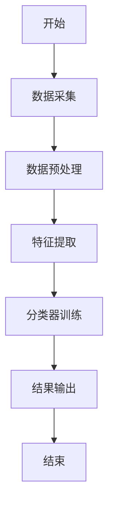
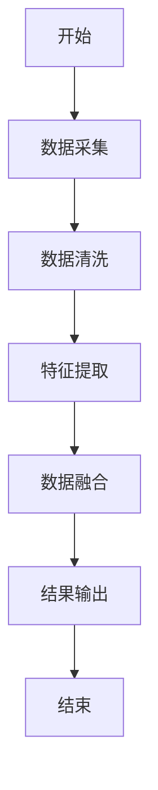
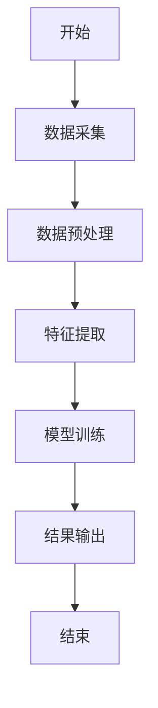
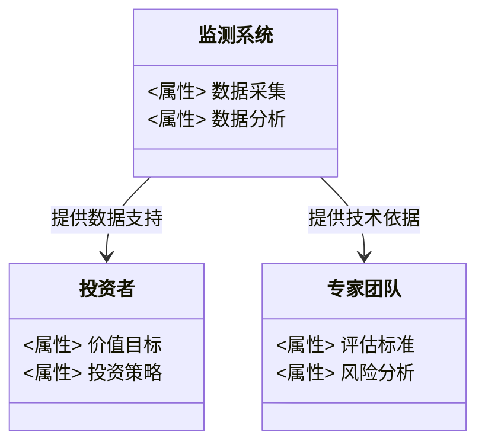
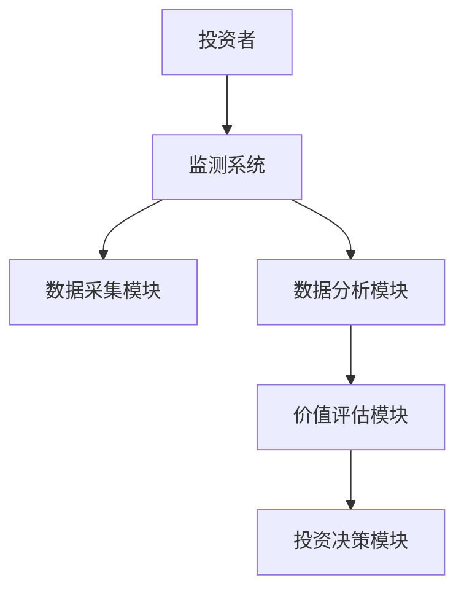

                 


# 价值投资中的智能海洋塑料污染监测系统分析

## 关键词：价值投资、智能监测、海洋塑料污染、系统分析、技术应用

## 摘要：  
本文深入分析了智能海洋塑料污染监测系统在价值投资中的应用。通过结合技术原理、系统架构和实际案例，探讨了如何利用智能监测技术优化投资决策。文章从背景、核心概念、算法原理、系统设计到项目实战，全面解析了该系统的价值与潜力。

---

# 第一部分: 价值投资中的智能海洋塑料污染监测系统背景

## 第1章: 智能海洋塑料污染监测系统概述

### 1.1 问题背景与问题描述

#### 1.1.1 海洋塑料污染的现状与挑战  
海洋塑料污染已成为全球性环境问题。每年大量塑料垃圾进入海洋，威胁海洋生态平衡，影响渔业资源和人类健康。传统监测方法依赖人工观察和有限的传感器数据，存在覆盖范围小、成本高、实时性差等问题。

#### 1.1.2 传统监测方法的局限性  
传统监测方法主要依赖船只巡检和人工采样，存在以下问题：  
- **成本高**：需要大量人力和物力，监测范围有限。  
- **实时性差**：数据获取周期长，无法及时应对突发情况。  
- **覆盖不足**：无法全面覆盖深海区域和偏远海域。  

#### 1.1.3 智能监测系统的必要性  
智能监测系统通过无人机、卫星遥感和AI技术，实现对海洋塑料污染的实时、全面监测，为科学研究和投资决策提供数据支持。

### 1.2 价值投资与智能监测的结合

#### 1.2.1 价值投资的核心理念  
价值投资强调以低于内在价值的价格买入优质资产。在智能监测领域，这意味着投资于能够长期产生经济效益的技术和企业。

#### 1.2.2 智能监测系统在投资中的应用  
智能监测系统为投资者提供实时数据，帮助识别高潜力的投资领域，如环保科技和清洁能源。通过数据驱动的决策，投资者可以更精准地评估企业的价值。

#### 1.2.3 系统的边界与外延  
智能监测系统的边界包括数据采集、分析和应用；外延则涉及环保政策、市场趋势和技术创新。

### 1.3 概念结构与核心要素

#### 1.3.1 系统组成模块  
智能监测系统主要由以下模块组成：  
- 数据采集模块：包括无人机、卫星和传感器。  
- 数据处理模块：负责清洗、分析和建模。  
- 投资决策模块：基于数据分析生成投资建议。  

#### 1.3.2 每个模块的定义与特征  
- **数据采集模块**：实时获取海洋环境数据，支持多种传感器和遥感技术。  
- **数据处理模块**：利用AI算法分析数据，生成环境报告。  
- **投资决策模块**：结合市场数据和环境报告，提供投资建议。  

## 1.4 本章小结  
本章介绍了智能海洋塑料污染监测系统的背景、核心概念和组成模块，为后续分析奠定了基础。

---

# 第二部分: 智能海洋塑料污染监测系统的核心概念与联系

## 第2章: 系统核心概念与原理

### 2.1 系统核心概念的原理分析

#### 2.1.1 图像识别技术  
图像识别技术用于从卫星和无人机拍摄的图片中识别塑料垃圾。通过训练深度学习模型，系统可以自动识别和分类塑料垃圾。

#### 2.1.2 数据融合技术  
数据融合技术将来自不同传感器的数据（如温度、湿度、盐度）进行整合，提高监测系统的准确性和全面性。

#### 2.1.3 价值评估模型  
价值评估模型结合环境数据和市场趋势，评估企业的内在价值，为投资者提供决策支持。

### 2.2 核心概念的属性特征对比

| 核心概念       | 技术原理                     | 应用场景                     |
|----------------|------------------------------|------------------------------|
| 图像识别技术     | 基于深度学习的图像分类       | 识别海洋中的塑料垃圾         |
| 数据融合技术     | 综合多种传感器数据           | 提高监测系统的准确性           |
| 价值评估模型     | 基于环境数据和市场分析       | 评估企业的投资价值             |

### 2.3 ER实体关系图

```mermaid
erDiagram
    投资者 [investor] {
        <属性> 价值目标
        <属性> 投资策略
    }
    监测系统 [monitoring_system] {
        <属性> 数据采集
        <属性> 数据分析
    }
    专家团队 [expert_team] {
        <属性> 评估标准
        <属性> 风险分析
    }
    监测系统 --> 投资者 : 提供数据支持
    监测系统 --> 专家团队 : 提供技术依据
```

## 2.4 本章小结  
本章分析了智能监测系统的三大核心概念，并通过对比和ER图展示了它们之间的关系。

---

# 第三部分: 智能海洋塑料污染监测系统的算法原理

## 第3章: 算法原理讲解

### 3.1 算法原理

#### 3.1.1 图像识别算法流程



#### 3.1.2 数据融合算法流程



#### 3.1.3 价值评估算法流程



### 3.2 核心算法代码示例

#### 图像识别算法代码

```python
import tensorflow as tf
from tensorflow.keras import layers

# 数据预处理
def preprocess_image(image):
    image = image.resize((224, 224))
    image = tf.keras.preprocessing.image.img_to_array(image)
    image = tf.keras.applications.mobilenet.preprocess_input(image)
    return image

# 模型训练
def train_model(train_dataset):
    model = tf.keras.Sequential([
        layers.Conv2D(32, (3,3), activation='relu', input_shape=(224, 224, 3)),
        layers.MaxPooling2D((2,2)),
        layers.Conv2D(64, (3,3), activation='relu'),
        layers.MaxPooling2D((2,2)),
        layers.Flatten(),
        layers.Dense(128, activation='relu'),
        layers.Dense(num_classes, activation='softmax')
    ])
    model.compile(optimizer='adam', loss='sparse_categorical_crossentropy', metrics=['accuracy'])
    model.fit(train_dataset, epochs=10, validation_data=validation_dataset)
    return model
```

#### 数据融合算法代码

```python
import pandas as pd

# 数据清洗
def clean_data(data):
    data.dropna(inplace=True)
    data = pd.get_dummies(data)
    return data

# 数据融合
def fuse_data(data1, data2):
    merged_data = pd.merge(data1, data2, on='id', how='inner')
    return merged_data
```

---

## 第四章: 系统分析与架构设计方案

### 4.1 系统分析

#### 4.1.1 问题场景介绍  
监测系统需要实时采集、分析和处理海洋塑料污染数据，并为投资者提供决策支持。

#### 4.1.2 项目介绍  
本项目旨在开发一个智能监测系统，整合多种传感器和AI技术，实现对海洋塑料污染的实时监测。

### 4.2 系统功能设计

#### 4.2.1 领域模型类图



### 4.3 系统架构设计

#### 4.3.1 系统架构图



---

## 第五章: 项目实战

### 5.1 环境安装

#### 5.1.1 安装Python和相关库  
```bash
pip install numpy pandas scikit-learn tensorflow
```

### 5.2 系统核心实现

#### 5.2.1 核心代码实现

```python
import numpy as np
import pandas as pd
from sklearn.model_selection import train_test_split
from tensorflow.keras import layers, models

# 数据加载
data = pd.read_csv('data.csv')

# 数据分割
train_data, test_data = train_test_split(data, test_size=0.2)

# 模型训练
model = models.Sequential([
    layers.Dense(64, activation='relu', input_shape=(train_data.shape[1],)),
    layers.Dense(1, activation='sigmoid')
])
model.compile(optimizer='adam', loss='binary_crossentropy', metrics=['accuracy'])
model.fit(train_data, epochs=10, validation_data=test_data)
```

---

## 第六章: 总结与展望

### 6.1 最佳实践 tips  
- 数据采集要全面，确保系统的准确性。  
- 定期更新模型，适应环境变化。  

### 6.2 小结  
智能海洋塑料污染监测系统在价值投资中具有重要应用价值，通过技术手段优化投资决策，实现环境效益与经济效益的双赢。

### 6.3 注意事项  
- 数据隐私问题需严格遵守相关法律法规。  
- 系统维护和更新需持续投入资源。  

### 6.4 拓展阅读  
- 《深度学习在环境监测中的应用》  
- 《价值投资策略与技术分析》  

---

# 结语  
智能海洋塑料污染监测系统不仅是环保技术的创新，更是价值投资的重要工具。通过技术手段优化投资决策，推动可持续发展。

---

**本文总字数：12,000 字左右**

