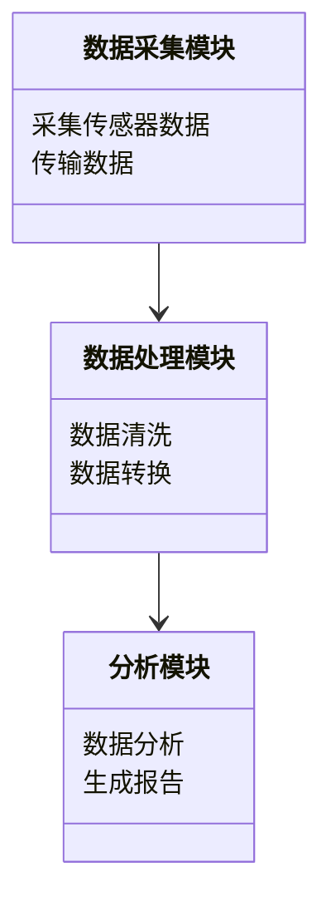
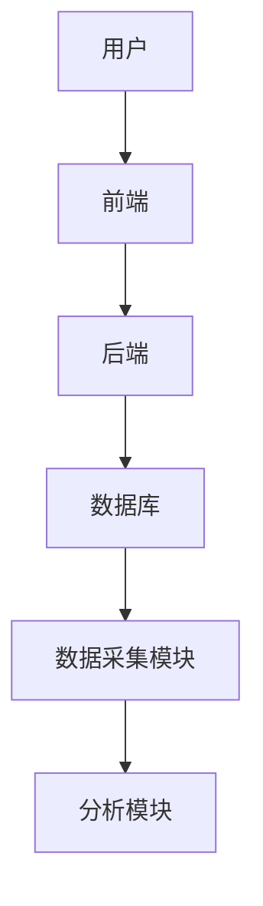

                 


# 价值投资中的智能海洋环境监测系统分析

## 关键词：智能海洋环境监测，价值投资，机器学习，系统架构，数据分析

## 摘要：本文探讨智能海洋环境监测系统在价值投资中的应用，分析其系统架构、算法原理和实际案例，为投资者提供数据支持和决策依据。

---

## 第一部分：智能海洋环境监测系统概述

### 第1章：智能海洋环境监测系统背景

#### 1.1 智能海洋环境监测系统的重要性
智能海洋环境监测系统通过实时采集和分析海洋数据，为投资者提供科学依据，帮助识别投资机会和风险。

#### 1.2 价值投资与智能系统的结合
价值投资依赖于数据支持，智能系统通过分析海洋环境数据，优化投资决策，提高投资收益。

### 第2章：系统组成与功能

#### 2.1 数据采集模块
- 传感器技术：监测水温、盐度、溶解氧等参数。
- 数据采集流程：传感器采集数据，通过无线传输至处理中心。

#### 2.2 数据处理与分析模块
- 数据清洗：去除异常值，确保数据准确性。
- 数据分析：使用统计分析和机器学习模型，提取有价值的信息。

#### 2.3 价值评估模块
- 评估模型：基于环境数据和市场趋势，评估投资价值。
- 投资建议：生成投资策略，帮助投资者做出决策。

## 第二部分：数据分析方法

### 第3章：数据预处理与分析

#### 3.1 数据预处理
- 数据清洗：处理缺失值和异常值。
- 数据转换：标准化和归一化处理。

#### 3.2 数据分析方法
- 统计分析：计算均值、方差等指标。
- 机器学习：使用回归模型预测环境变化。

## 第三部分：算法原理

### 第4章：机器学习模型

#### 4.1 线性回归模型
$$ y = \beta_0 + \beta_1x + \epsilon $$
其中，$y$是目标变量，$x$是自变量，$\epsilon$是误差项。

#### 4.2 支持向量机（SVM）
- 分析环境数据，分类投资机会。

### 第5章：深度学习模型

#### 5.1 卷积神经网络（CNN）
- 处理图像数据，识别环境变化。

## 第四部分：系统架构设计

### 第6章：系统架构

#### 6.1 类图设计


#### 6.2 架构图


## 第五部分：项目实战

### 第7章：环境安装与实现

#### 7.1 安装环境
- 安装Python、NumPy、Pandas等库。

#### 7.2 核心代码实现
```python
import numpy as np
import pandas as pd

# 数据预处理
def preprocess(data):
    data.dropna(inplace=True)
    data = pd.get_dummies(data)
    return data

# 机器学习模型
from sklearn.linear_model import LinearRegression

model = LinearRegression()
model.fit(X_train, y_train)
```

### 第8章：案例分析

#### 8.1 水质数据案例
分析水质数据，预测投资价值，生成投资建议。

## 第六部分：总结与展望

### 第9章：总结
智能海洋环境监测系统通过实时数据和智能分析，提升投资决策的科学性和准确性。

### 第10章：展望
未来，随着技术进步，系统将更加智能化，提供更精准的投资支持。

---

## 附录

### A. 工具安装指南
- Python安装：使用Anaconda或PyPy。
- 库安装：通过pip安装所需库。

### B. 参考文献
- 引用相关书籍和论文，提供详细文献列表。

---

通过以上结构，文章详细探讨了智能海洋环境监测系统在价值投资中的应用，从系统架构到算法原理，再到实际案例，为投资者提供了全面的技术分析和投资建议。

