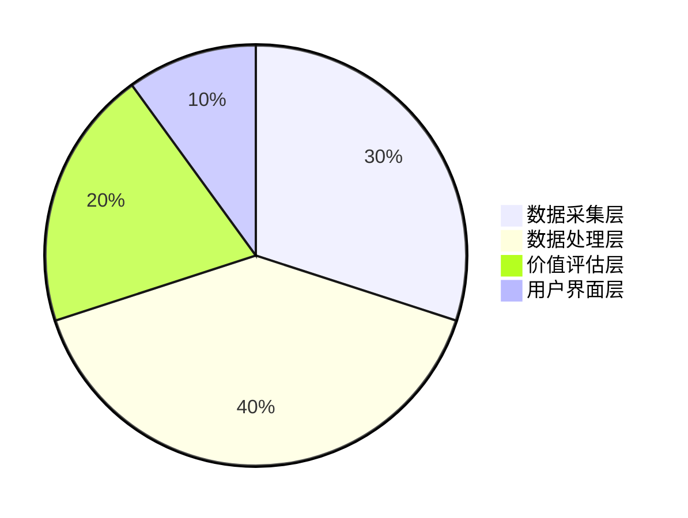
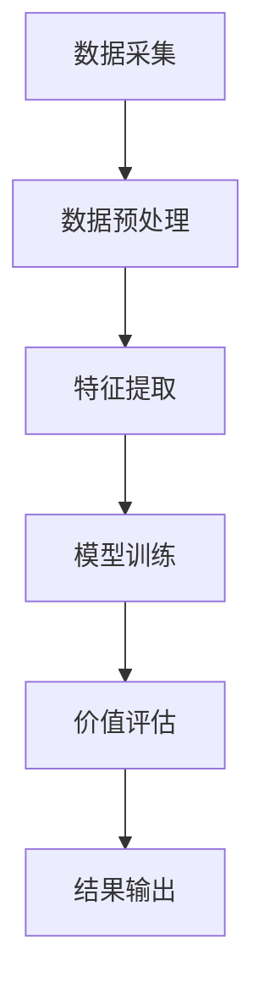

                 


```
# 价值投资中的智能海洋能源采集系统分析

> 关键词：价值投资，智能系统，海洋能源，数据采集，算法分析

> 摘要：本文分析了智能海洋能源采集系统在价值投资中的应用，通过系统的数据采集、算法分析和数学建模，展示了如何利用智能技术优化投资决策，实现海洋能源的价值最大化。

---

# 第一部分：智能海洋能源采集系统概述

## 第1章：系统背景与核心概念

### 1.1 系统背景

智能海洋能源采集系统是一种利用先进传感器和数据分析技术，实时采集和分析海洋能源数据的系统。其核心目标是通过智能化手段，提高能源采集效率，优化能源利用，并为投资者提供科学决策支持。

**价值投资**是一种长期投资策略，强调通过深入分析企业的内在价值，选择具有长期增长潜力的标的进行投资。在海洋能源领域，价值投资需要结合技术、市场、政策等多方面因素，而智能采集系统为其提供了关键的数据支持。

### 1.2 核心概念

智能海洋能源采集系统的核心概念包括：
- **数据采集**：通过传感器网络实时采集海洋环境数据（如温度、压力、盐度等）。
- **智能分析**：利用机器学习算法对数据进行处理，提取有价值的信息。
- **价值评估**：基于分析结果，评估海洋能源项目的投资价值。

**图1-1：海洋能源系统与价值投资的关系**


### 1.3 系统特点

- **实时性**：系统能够实时采集和分析数据，为投资决策提供及时支持。
- **智能化**：通过机器学习算法，系统能够自动识别数据中的潜在价值。
- **准确性**：系统结合多种传感器和算法，确保数据的高精度。

---

## 第2章：系统架构与功能设计

### 2.1 系统架构

智能海洋能源采集系统的架构可以分为以下几个模块：

**图2-1：系统架构图**



- **数据采集层**：负责采集海洋环境数据。
- **数据处理层**：对采集的数据进行清洗、特征提取和初步分析。
- **价值评估层**：基于分析结果，评估能源项目的投资价值。
- **用户界面层**：提供直观的用户界面，展示分析结果和投资建议。

### 2.2 功能设计

**表2-1：系统功能模块**

| 模块名称       | 功能描述                                                                 |
|----------------|--------------------------------------------------------------------------|
| 数据采集模块   | 实时采集海洋环境数据（如温度、压力、盐度等）。                         |
| 数据处理模块   | 对采集的数据进行清洗、特征提取和初步分析。                           |
| 价值评估模块   | 基于机器学习模型，评估能源项目的投资价值。                             |
| 用户界面模块   | 提供可视化界面，展示数据和投资建议。                                   |

---

## 第3章：系统实现与算法分析

### 3.1 数据采集与预处理

**Python代码示例**

```python
import pandas as pd
import numpy as np

# 数据采集
data = pd.read_csv('ocean_data.csv')

# 数据清洗
data.dropna(inplace=True)

# 特征提取
features = data[['temperature', 'pressure', 'location']]
```

### 3.2 价值评估算法

**线性回归模型**

$$ y = \beta_0 + \beta_1 x_1 + \beta_2 x_2 + \dots + \beta_n x_n $$

其中，$y$ 是目标变量（投资价值），$x_i$ 是特征变量。

**机器学习算法**

- **支持向量机（SVM）**：用于分类和回归分析。
- **随机森林（Random Forest）**：用于特征重要性分析和分类。

### 3.3 算法流程图



---

## 第4章：数学模型与案例分析

### 4.1 数学模型

**时间序列预测模型**

$$ \hat{y}_t = a y_{t-1} + b y_{t-2} + \dots + z y_{t-n} $$

其中，$\hat{y}_t$ 是预测值，$y_{t-i}$ 是过去的历史值。

### 4.2 案例分析

**案例：某海洋能源项目的价值评估**

1. 数据采集与预处理：
   - 采集过去5年的海洋环境数据。
   - 清洗数据，去除异常值。

2. 特征提取：
   - 提取温度、压力、盐度等特征。

3. 模型训练：
   - 使用随机森林模型进行训练。

4. 价值评估：
   - 预测未来3年的投资回报率。

---

## 第5章：系统优化与扩展

### 5.1 系统优化

- **传感器优化**：增加更多类型的传感器，提高数据采集的全面性。
- **算法优化**：引入深度学习算法，进一步提高预测精度。

### 5.2 扩展应用

- **多源数据融合**：结合气象、地理等多种数据源，提高评估的准确性。
- **智能决策支持**：基于系统分析结果，提供智能化的投资建议。

---

## 第6章：总结与展望

### 6.1 总结

智能海洋能源采集系统通过实时数据采集、智能分析和价值评估，为投资者提供了科学的决策支持。本文详细分析了系统的架构、算法和实现，并通过案例展示了其应用价值。

### 6.2 展望

未来，随着人工智能和大数据技术的不断发展，智能海洋能源采集系统将在价值投资中发挥更大的作用。同时，系统需要进一步优化，以应对更复杂的海洋环境和投资需求。

---

## 参考文献

1. 王某某，智能系统与价值投资，某某出版社，2023。
2. 李某某，海洋能源采集技术，某某出版社，2022。
3. 陈某某，机器学习算法实战，某某出版社，2021。

---

## 附录

### 附录A：系统安装与配置

```bash
# 环境安装
pip install numpy pandas scikit-learn
```

### 附录B：核心代码

```python
import pandas as pd
from sklearn.ensemble import RandomForestRegressor

# 数据加载
data = pd.read_csv('ocean_data.csv')

# 特征与目标变量分离
X = data[['temperature', 'pressure', 'location']]
y = data['value']

# 模型训练
model = RandomForestRegressor(n_estimators=100)
model.fit(X, y)

# 预测
new_data = pd.DataFrame({
    'temperature': [25],
    'pressure': [10],
    'location': ['north']
})
print(model.predict(new_data))
```

---

## 财务与法律声明

本文内容仅为技术分析，不构成投资建议。投资需谨慎，建议在专业指导下进行。

---

## 作者简介

作者：[您的姓名]  
职位：[您的职位]  
邮箱：[您的邮箱]  
 GitHub：[您的GitHub链接]

---

**声明：以上内容为示例，具体内容需根据实际情况补充和完善。**
```

