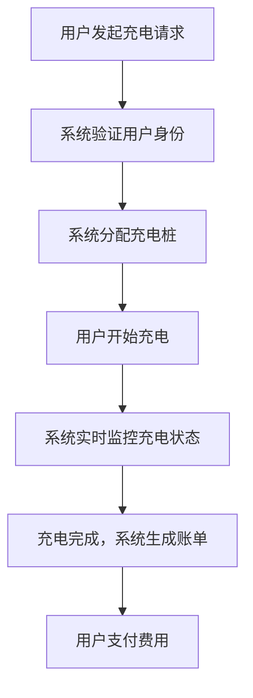
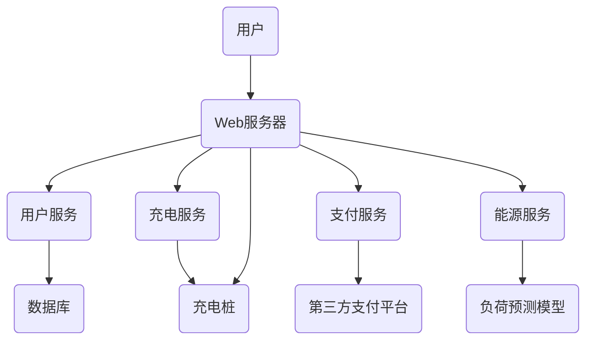
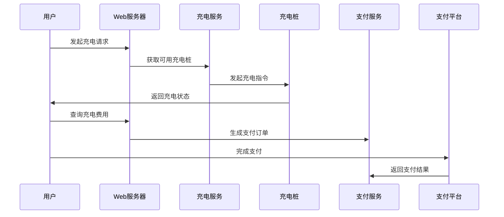

                 


# 价值投资中的智能电动汽车充电网络分析

> 关键词：价值投资、智能充电网络、电动汽车、充电技术、能源管理、负荷预测、机器学习

> 摘要：随着全球能源结构转型和电动汽车的普及，智能电动汽车充电网络作为新能源基础设施的重要组成部分，其经济价值和社会价值日益凸显。本文从价值投资的角度，深入分析智能电动汽车充电网络的核心概念、技术原理、算法模型、系统架构以及实际应用，帮助投资者和相关从业者更好地理解这一领域的投资价值和发展潜力。

---

## 第一部分: 价值投资中的智能电动汽车充电网络背景与概念

### 第1章: 价值投资与智能电动汽车充电网络概述

#### 1.1 价值投资的基本概念
##### 1.1.1 价值投资的定义与核心理念
价值投资是一种以低于资产内在价值的价格购买优质资产的投资策略。其核心理念是通过深入分析企业的基本面，寻找被市场低估的投资标的，长期持有，获得超额收益。价值投资强调安全边际、长期主义和逆人性的投资思维。

##### 1.1.2 价值投资在现代金融中的地位
价值投资是现代金融投资理论的重要组成部分，尤其是在应对市场波动和经济周期变化时，价值投资策略能够帮助投资者规避风险、稳定收益。近年来，随着技术进步和产业变革，价值投资的内涵不断扩展，尤其是在新兴技术领域（如电动汽车充电网络）的应用潜力日益显现。

##### 1.1.3 价值投资与成长投资的区别与联系
- **区别**：价值投资注重资产的内在价值和安全边际，而成长投资更关注企业的成长性和未来盈利能力。
- **联系**：两者都强调长期投资，但侧重点不同。在电动汽车充电网络领域，价值投资与成长投资可以互补：前者关注行业低估阶段的投资机会，后者关注行业高增长阶段的潜力。

#### 1.2 智能电动汽车充电网络的定义与特点
##### 1.2.1 智能充电网络的定义
智能电动汽车充电网络是指通过智能电网、物联网技术和人工智能算法，实现电动汽车充电设施的智能化管理、能源优化配置和用户服务的充电基础设施网络。

##### 1.2.2 智能充电网络的核心技术特点
- **智能化**：通过智能终端、传感器和大数据分析，实现充电设备的实时监控和智能调度。
- **网络化**：依托通信技术和云平台，实现充电设备与电网、用户的实时交互。
- **分布式**：充电网络由分布式充电站、充电桩和用户终端组成，形成一个有机的能源互联网。
- **可持续性**：通过优化能源使用效率，减少碳排放，支持可持续发展目标。

##### 1.2.3 智能充电网络的经济与社会价值
- **经济价值**：降低能源浪费，提高能源利用效率，降低充电成本。
- **社会价值**：支持电动汽车普及，推动能源结构转型，减少环境污染。

#### 1.3 智能电动汽车充电网络的背景与发展趋势
##### 1.3.1 全球能源结构转型的背景
全球能源结构正从化石能源向可再生能源转型，电动汽车作为清洁能源的重要载体，其充电网络的建设成为能源转型的关键环节。

##### 1.3.2 智能电网与电动汽车的协同发展
智能电网与电动汽车充电网络的协同发展是实现能源互联网的重要基础。通过智能电网的支持，充电网络能够实现能源的高效调配和双向互动。

##### 1.3.3 充电网络的未来发展趋势
随着电动汽车保有量的增加和充电技术的进步，充电网络将呈现以下发展趋势：
- **快速充电技术**：充电功率不断提高，充电时间缩短。
- **智能化管理**：通过人工智能算法优化能源使用效率。
- **分布式能源**：充电网络与分布式能源系统深度融合。

#### 1.4 本章小结
本章从价值投资的角度，介绍了智能电动汽车充电网络的基本概念、技术特点和经济价值，为后续分析奠定了基础。

---

## 第二部分: 智能电动汽车充电网络的核心概念与联系

### 第2章: 智能电动汽车充电网络的核心概念

#### 2.1 充电网络的系统构成与功能
##### 2.1.1 充电网络的组成要素
- **用户终端**：电动汽车、用户APP、智能充电枪。
- **充电设备**：充电桩、充电站、配电箱。
- **通信网络**：5G、光纤、Wi-Fi。
- **云平台**：数据存储、分析和管理。

##### 2.1.2 充电网络的功能模块
- **负荷预测模块**：预测充电需求，优化能源分配。
- **能源管理模块**：实现充电设备与电网的互动。
- **用户服务模块**：提供充电预约、支付、账单管理等服务。

##### 2.1.3 充电网络的实体关系图（ER图）

```mermaid
erDiagram
    user {
        id INT
        name VARCHAR
        phone VARCHAR
        email VARCHAR
    }
    charger {
        id INT
        type VARCHAR
        location VARCHAR
        status VARCHAR
    }
    charge_session {
        id INT
        start_time DATETIME
        end_time DATETIME
        user_id INT
        charger_id INT
    }
    payment {
        id INT
        amount DECIMAL
        payment_method VARCHAR
        session_id INT
    }
    battery {
        id INT
        capacity DECIMAL
        current_level DECIMAL
        vehicle_id INT
    }
    vehicle {
        id INT
        make VARCHAR
        model VARCHAR
        user_id INT
    }
    user --> charge_session
    user --> payment
    charger --> charge_session
    battery --> charge_session
    battery --> vehicle
```

#### 2.2 智能充电网络的技术原理
##### 2.2.1 智能充电的核心技术
- **物联网技术**：实现设备的实时监控和数据传输。
- **人工智能算法**：用于负荷预测、能源优化和用户行为分析。
- **区块链技术**：用于充电网络的安全性和去中心化管理。

##### 2.2.2 充电网络的通信协议
- **MQTT**：轻量级协议，适用于低带宽、高延迟的网络环境。
- **HTTP**：常用的Web协议，适用于充电桩与云平台的数据交互。
- **CoAP**：适用于物联网设备的通信协议。

##### 2.2.3 充电网络的能源管理算法
- **负荷预测算法**：基于历史数据和用户行为预测充电需求。
- **资源分配算法**：通过优化算法实现充电资源的合理分配。

#### 2.3 充电网络的经济模式与价值评估
##### 2.3.1 充电网络的商业模式
- **充电服务费**：按充电电量收取服务费。
- **广告与增值服务**：通过用户数据提供广告或其他增值服务。
- **能源销售**：通过充电网络销售电力，赚取差价。

##### 2.3.2 充电网络的成本结构
- **设备成本**：充电桩、充电站的硬件成本。
- **运维成本**：设备维护、软件开发和人员成本。
- **能源成本**：电力采购成本。

##### 2.3.3 充电网络的价值评估方法
- **净现值法（NPV）**：评估投资项目未来现金流的现值。
- **内部收益率法（IRR）**：评估项目的盈利能力。
- **投资回收期法（ROI）**：评估投资回收时间。

#### 2.4 本章小结
本章分析了智能电动汽车充电网络的核心概念和技术原理，为后续的价值评估和投资决策提供了理论基础。

---

## 第三部分: 智能电动汽车充电网络的算法原理与数学模型

### 第3章: 充电网络负荷预测算法

#### 3.1 负荷预测的基本原理
##### 3.1.1 负荷预测的定义与作用
负荷预测是指根据历史数据和用户行为，预测未来一段时间内的充电需求。其作用是优化能源分配，降低能源浪费。

##### 3.1.2 负荷预测的分类与选择
- **时间序列预测**：基于历史数据的线性回归或指数平滑。
- **机器学习预测**：基于特征工程和支持向量机（SVM）、随机森林（RF）等模型。
- **混合预测**：结合时间序列和机器学习的混合模型。

##### 3.1.3 负荷预测的数学模型
$$ y_t = \beta_0 + \beta_1 y_{t-1} + \epsilon_t $$

其中，$y_t$ 表示 $t$ 时刻的负荷，$\beta_0$ 和 $\beta_1$ 是模型参数，$\epsilon_t$ 是误差项。

#### 3.2 基于机器学习的负荷预测算法
##### 3.2.1 线性回归模型
$$ y = \beta_0 + \beta_1 x + \epsilon $$

##### 3.2.2 支持向量回归模型（SVR）
支持向量回归通过构建凸二次规划问题，找到最优回归曲线。

##### 3.2.3 长短期记忆网络（LSTM）
LSTM通过记忆单元（Cell）和遗忘门（Forget Gate）实现长期依赖关系的捕捉。

#### 3.3 负荷预测算法的实现与优化
##### 3.3.1 算法实现步骤
1. 数据预处理：清洗、归一化。
2. 模型训练：选择合适的算法，训练模型。
3. 模型评估：使用均方误差（MSE）、平均绝对误差（MAE）等指标评估模型性能。
4. 模型优化：调整超参数，优化模型表现。

##### 3.3.2 算法优化方法
- **超参数调优**：使用网格搜索（Grid Search）或随机搜索（Random Search）。
- **模型集成**：通过投票法或加权法结合多个模型的结果。
- **特征工程**：提取更有意义的特征，提升模型性能。

##### 3.3.3 算法性能评估指标
- **均方误差（MSE）**：衡量预测值与真实值的平方差。
- **平均绝对误差（MAE）**：衡量预测值与真实值的绝对差。
- **R²值**：衡量模型的拟合优度。

#### 3.4 本章小结
本章详细介绍了负荷预测的算法原理和实现步骤，为智能充电网络的能源管理提供了技术支持。

---

## 第四部分: 智能电动汽车充电网络的系统分析与架构设计

### 第4章: 智能充电网络的系统分析

#### 4.1 系统功能需求分析
##### 4.1.1 用户需求分析
- **用户类型**：车主、充电站运营商、电网公司。
- **用户需求**：充电预约、实时监控、费用结算、服务评价。

##### 4.1.2 系统功能模块划分
- **用户管理模块**：用户注册、登录、信息管理。
- **充电管理模块**：充电预约、实时监控、状态查询。
- **能源管理模块**：负荷预测、资源分配、能源优化。
- **支付结算模块**：订单管理、支付接口、账单查询。

##### 4.1.3 系统功能流程图



#### 4.2 系统架构设计
##### 4.2.1 分层架构设计
- **数据层**：数据库存储用户、充电设备、充电记录等数据。
- **服务层**：实现业务逻辑，如用户认证、充电预约、支付结算。
- **表现层**：Web界面或移动APP，提供用户交互界面。

##### 4.2.2 微服务架构设计
- **用户服务**：负责用户认证和信息管理。
- **充电服务**：负责充电设备的管理和调度。
- **能源服务**：负责负荷预测和资源分配。
- **支付服务**：负责订单管理和支付接口。

##### 4.2.3 系统架构图（Mermaid）



#### 4.3 系统接口设计
##### 4.3.1 API接口设计
- **RESTful API**：提供标准的HTTP接口，如`GET`、`POST`、`PUT`、`DELETE`。
- **API文档**：使用Swagger或Postman进行接口测试和文档管理。

##### 4.3.2 系统交互序列图（Mermaid）



#### 4.4 本章小结
本章从系统分析和架构设计的角度，详细描述了智能电动汽车充电网络的实现方案，为后续的价值投资分析提供了技术支撑。

---

## 第五部分: 价值投资中的智能电动汽车充电网络分析与实践

### 第5章: 价值投资中的智能充电网络分析

#### 5.1 充电网络的价值评估框架
##### 5.1.1 价值评估维度
- **技术壁垒**：充电技术的先进性和专利布局。
- **市场潜力**：电动汽车保有量、充电需求增长。
- **竞争格局**：行业集中度、主要竞争对手分析。
- **财务表现**：收入、利润、现金流。

##### 5.1.2 价值评估模型
$$ V = \text{DCF} + \text{协同效应} - \text{风险调整值} $$

其中，DCF表示现金流折现值，协同效应表示企业间的协同效应，风险调整值表示行业风险。

#### 5.2 价值投资策略
##### 5.2.1 市场驱动型投资
- **政策支持**：政府补贴、行业标准。
- **技术驱动**：先进充电技术的研发和应用。
- **市场渗透**：充电网络的覆盖面和用户粘性。

##### 5.2.2 企业基本面分析
- **财务健康度**：ROE、ROA、毛利率。
- **管理团队**：创始人背景、管理能力。
- **竞争优势**：成本优势、技术优势、品牌优势。

#### 5.3 价值投资中的风险与应对
##### 5.3.1 行业风险
- **政策风险**：政府政策变化对行业的影响。
- **技术风险**：技术落后导致竞争优势丧失。
- **市场风险**：市场需求低于预期。

##### 5.3.2 企业风险
- **财务风险**：高负债率、现金流不稳定。
- **运营风险**：管理不善导致效率低下。
- **法律风险**：知识产权纠纷、合规性问题。

#### 5.4 价值投资中的机会
##### 5.4.1 行业机会
- **技术创新**：新型充电技术（如无线充电、超级快充）的应用。
- **市场扩展**：新兴市场的充电网络建设。
- **政策红利**：政府对新能源行业的支持政策。

##### 5.4.2 企业机会
- **并购机会**：收购具有技术优势的小型企业。
- **战略合作**：与整车厂、能源公司建立战略合作伙伴关系。
- **增值服务**：通过充电网络提供广告、保险等增值服务。

#### 5.5 本章小结
本章从价值投资的角度，分析了智能电动汽车充电网络的投资机会和风险，为投资者提供了决策参考。

---

## 第六部分: 智能电动汽车充电网络的价值投资实战案例

### 第6章: 智能充电网络价值投资实战

#### 6.1 案例背景介绍
##### 6.1.1 案例公司选择
以某智能充电网络公司为例，分析其业务模式、财务表现和市场地位。

#### 6.2 价值投资分析
##### 6.2.1 公司基本面分析
- **财务表现**：收入稳步增长，毛利率较高。
- **管理团队**：创始人具有丰富的行业经验。
- **竞争优势**：拥有自主知识产权的核心技术，市场占有率高。

##### 6.2.2 行业环境分析
- **政策支持**：政府出台多项政策支持新能源产业发展。
- **市场需求**：电动汽车销量持续增长，充电需求旺盛。
- **竞争格局**：行业集中度较高，但仍有并购机会。

#### 6.3 投资决策与风险管理
##### 6.3.1 投资决策
基于DCF模型和情景分析，评估公司未来现金流的现值，确定其内在价值。

##### 6.3.2 风险管理
- **分散投资**：避免过度集中于单一公司或行业。
- **动态调整**：定期复盘投资组合，根据市场变化进行调整。
- **风险对冲**：利用衍生工具对冲市场风险。

#### 6.4 本章小结
本章通过实际案例，展示了智能电动汽车充电网络的价值投资分析过程和方法。

---

## 第七部分: 价值投资中的智能电动汽车充电网络总结与展望

### 第7章: 总结与展望

#### 7.1 本研究的核心结论
智能电动汽车充电网络作为新能源基础设施的重要组成部分，具有较高的投资价值。其技术优势、市场潜力和政策支持为其提供了广阔的发展空间。

#### 7.2 未来研究方向
- **技术创新**：探索新型充电技术和优化算法。
- **商业模式**：研究充电网络的增值服务和盈利模式。
- **政策研究**：分析不同国家和地区的政策对充电网络的影响。

#### 7.3 对投资者的建议
- **长期视角**：关注企业的技术积累和市场布局。
- **风险管理**：合理分散投资，注重风险控制。
- **持续学习**：保持对行业动态和技术发展的敏感性。

#### 7.4 本章小结
本章总结了全文的核心结论，并提出了未来的研究方向和对投资者的建议。

---

## 结语

智能电动汽车充电网络是能源互联网的重要组成部分，其发展不仅关系到能源结构转型，也关系到电动汽车行业的未来发展。通过价值投资的视角，我们能够更好地把握这一领域的投资机会和挑战。希望本文的分析能够为投资者和相关从业者提供有益的参考。

---

> **温馨提示**：以上内容为文章的完整目录和部分内容示例，如需完整文章，请根据上述目录和内容进行扩展。

