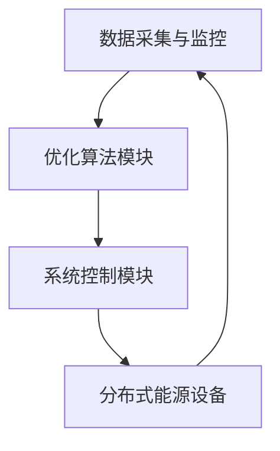
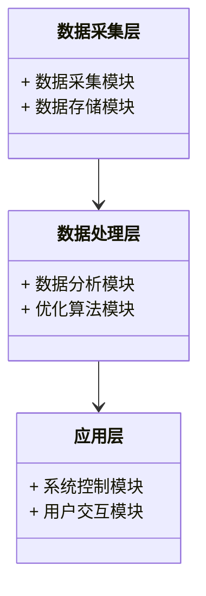
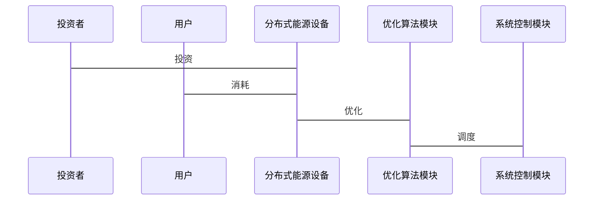

                 


# 价值投资中的智能电网分布式能源管理分析

## 关键词：智能电网，分布式能源管理，价值投资，优化算法，能源系统架构

## 摘要：  
本文从智能电网和分布式能源管理的背景出发，结合价值投资的理论与方法，深入分析了智能电网分布式能源管理的核心概念、算法原理、系统架构及实际应用场景。通过构建分布式能源管理的实体关系图和优化算法模型，本文详细探讨了价值投资在能源管理中的潜在机会与挑战，并通过案例分析和项目实战，展示了如何通过技术创新与价值挖掘实现能源系统的高效管理与投资回报的最大化。

---

# 第一部分：智能电网与分布式能源管理概述

## 第1章：智能电网与分布式能源管理的背景与概念

### 1.1 智能电网的基本概念

#### 1.1.1 智能电网的定义与特点
智能电网是一种基于现代化信息通信技术、自动化技术及能源互联网技术的电力系统。其核心目标是通过智能化的感知、分析和决策，实现电力系统从发电、输电、配电到用电各环节的高效协同和优化管理。智能电网的特点包括：
- **智能化**：通过传感器和数据采集技术实现对电力系统的实时监控。
- **自动化**：利用自动化技术实现电力系统的自动调节和优化。
- **互联性**：通过信息通信技术实现设备与设备、设备与系统之间的互联。
- **高效性**：通过优化算法实现能源的高效分配和利用。

#### 1.1.2 智能电网的发展历程
智能电网的概念起源于20世纪末，随着信息技术和能源技术的快速发展，智能电网逐渐从理论研究走向实际应用。近年来，随着全球能源结构的转型和可再生能源的快速发展，智能电网在全球范围内的建设步伐进一步加快。

#### 1.1.3 智能电网的核心技术与应用领域
智能电网的核心技术包括：
- 数据采集与监控（SCADA）系统
- 分布式能源管理系统（Distributed Energy Management System, DE MS）
- 能源互联网技术
- 智能配电与用电管理技术

智能电网的应用领域包括：
- 可再生能源的接入与管理
- 分布式能源的优化配置
- 电力市场的智能调度

### 1.2 分布式能源管理的定义与特点

#### 1.2.1 分布式能源的基本概念
分布式能源是指在靠近负荷需求点部署的中小型能源设备，包括分布式发电、储能和需求响应等。分布式能源的特点是灵活、高效和环保。

#### 1.2.2 分布式能源管理的模式与优势
分布式能源管理的模式包括：
- **集中式管理**：由中央控制系统对分布式能源进行统一调度。
- **分布式管理**：每个分布式能源设备独立运行并进行局部优化。
- **混合式管理**：结合集中式和分布式管理的优点。

其优势包括：
- **提高能源利用效率**：通过优化配置实现能源的高效利用。
- **降低能源成本**：通过分布式管理减少对传统电网的依赖。
- **增强系统灵活性**：适应可再生能源的波动性需求。

#### 1.2.3 分布式能源管理的挑战与解决方案
分布式能源管理的挑战包括：
- **复杂性**：多个设备和系统的协调需要复杂的算法和控制系统。
- **数据量大**：分布式能源系统的数据采集和处理量大。
- **安全性**：分布式系统容易受到网络攻击。

解决方案包括：
- **智能化算法**：通过优化算法实现系统的智能调度。
- **网络安全技术**：通过加密和认证技术保障系统的安全性。
- **云计算与边缘计算**：利用云计算和边缘计算实现系统的高效管理。

## 第2章：价值投资的基本概念与分析框架

### 2.1 价值投资的基本原理

#### 2.1.1 价值投资的定义与核心理念
价值投资是一种以基本面分析为基础的投资策略，其核心理念是通过深入分析企业的财务状况、行业地位和竞争优势，找到市场价格低于其内在价值的投资标的。

#### 2.1.2 价值投资的分析框架与方法
价值投资的分析框架包括：
- **行业分析**：分析行业的市场规模、增长潜力和竞争格局。
- **公司分析**：分析公司的财务状况、盈利能力和发展潜力。
- **估值分析**：通过市盈率、市净率等指标评估公司的内在价值。

#### 2.1.3 价值投资与传统投资的区别
与传统投资相比，价值投资更注重长期稳健的投资回报，而非短期市场波动。价值投资者通常更关注企业的基本面，而非市场的短期情绪。

### 2.2 价值投资在能源管理领域的应用

#### 2.2.1 能源管理领域的价值投资机会
随着全球能源结构的转型和可再生能源的快速发展，能源管理领域蕴藏着巨大的投资机会。特别是在智能电网和分布式能源管理领域，技术创新和市场拓展为投资者提供了丰富的投资标的。

#### 2.2.2 价值投资在分布式能源管理中的作用
价值投资在分布式能源管理中的作用包括：
- **优化投资决策**：通过深入分析企业的财务状况和市场前景，选择具有竞争优势的投资标的。
- **降低投资风险**：通过基本面分析和风险评估，降低投资决策的风险。

#### 2.2.3 价值投资与智能电网的结合
智能电网的建设和发展为价值投资者提供了新的投资机会。例如，智能电网中的分布式能源管理系统、智能配电设备和能源互联网技术等领域都具有较大的投资潜力。

---

# 第二部分：智能电网分布式能源管理的核心概念与联系

## 第3章：智能电网分布式能源管理的核心概念

### 3.1 智能电网分布式能源管理的系统架构

#### 3.1.1 分布式能源管理的系统组成
分布式能源管理系统的组成包括：
- **数据采集与监控（SCADA）系统**：实现对分布式能源设备的实时监控和数据采集。
- **分布式能源管理模块**：实现对分布式能源设备的优化调度和管理。
- **用户终端**：实现与用户的交互和信息传递。

#### 3.1.2 智能电网与分布式能源管理的关系
智能电网为分布式能源管理提供了技术基础和平台支持，而分布式能源管理则是智能电网的重要组成部分。两者相辅相成，共同推动能源系统的智能化和高效化。

#### 3.1.3 分布式能源管理的核心要素
分布式能源管理的核心要素包括：
- **数据采集**：通过传感器和数据采集设备获取分布式能源设备的运行数据。
- **优化算法**：通过优化算法实现分布式能源设备的最优调度。
- **系统控制**：通过系统控制实现对分布式能源设备的实时调节和管理。

### 3.2 分布式能源管理的实体关系图

#### 3.2.1 实体关系图的定义与作用
实体关系图（ER图）是一种用于描述系统中实体及其关系的工具。在分布式能源管理中，实体关系图可以帮助我们清晰地理解系统中各个实体之间的关系。

#### 3.2.2 分布式能源管理的ER实体关系图

```mermaid
erDiagram
    actor 投资者 {
        string 资金
        string 投资回报
    }
    actor 用户 {
        string 用电需求
        string 电费支付
    }
    entity 分布式能源设备 {
        key string 设备ID
        string 类型
        string 状态
    }
    entity 优化算法 {
        key string 算法ID
        string 类型
        string 参数
    }
    entity 系统控制 {
        key string 控制ID
        string 状态
        string 执行结果
    }
    投资者 -> 分布式能源设备 : 投资
    用户 -> 分布式能源设备 : 消耗
    分布式能源设备 -> 优化算法 : 优化
    优化算法 -> 系统控制 : 调度
```

#### 3.2.3 实体关系图的分析与应用
通过实体关系图，我们可以清晰地看到分布式能源管理系统的各个实体及其关系。投资者通过投资分布式能源设备，实现对设备的优化调度和管理。用户通过消耗能源，实现对设备的实时监控和管理。

---

## 第4章：智能电网分布式能源管理的算法原理

### 4.1 分布式能源管理的优化算法

#### 4.1.1 常见的优化算法概述
常见的优化算法包括：
- **线性规划（Linear Programming）**：用于解决线性约束条件下的优化问题。
- **动态规划（Dynamic Programming）**：用于解决多阶段决策问题。
- **遗传算法（Genetic Algorithm）**：基于生物进化原理的优化算法。

#### 4.1.2 分布式能源管理的线性规划模型

$$
\text{目标函数：} \quad \min \sum_{i} c_i x_i
$$

$$
\text{约束条件：} \quad \sum_{i} x_i \leq C
$$

其中：
- \( c_i \) 表示第 \( i \) 个分布式能源设备的单位成本。
- \( x_i \) 表示第 \( i \) 个分布式能源设备的输出功率。
- \( C \) 表示系统的总容量限制。

#### 4.1.3 算法的数学模型与公式

通过线性规划模型，我们可以实现对分布式能源设备的优化调度。例如，假设我们有 \( n \) 个分布式能源设备，每个设备的输出功率为 \( x_i \)，成本为 \( c_i \)，系统的总容量限制为 \( C \)，则目标函数为：

$$
\min \sum_{i=1}^{n} c_i x_i
$$

约束条件为：

$$
\sum_{i=1}^{n} x_i \leq C
$$

#### 4.1.4 算法的实现与优化

```python
import numpy as np

# 定义目标函数
def objective(x, c):
    return np.dot(c, x)

# 定义约束条件
def constraint(x, C):
    return np.sum(x) <= C

# 线性规划求解
from scipy.optimize import minimize

# 初始化变量
x = [1, 1, 1]
c = [2, 3, 4]
C = 10

# 约束条件
constraints = [{'type': 'ineq', 'fun': lambda x: C - np.sum(x)}]

# 优化问题
result = minimize(objective, x, method='SLSQP', constraints=constraints)

# 输出结果
print("最优解：", result.x)
print("最小化的目标函数值：", result.fun)
```

### 4.2 算法的实现与优化

#### 4.2.1 算法实现的步骤与流程
1. **问题建模**：将实际问题转化为数学模型。
2. **选择算法**：根据问题特点选择合适的优化算法。
3. **实现算法**：编写算法代码并进行测试。
4. **优化算法**：通过参数调整和算法改进提高算法效率。

#### 4.2.2 算法优化的策略与方法
- **参数优化**：通过调整算法的参数实现优化。
- **混合算法**：将多种算法结合使用，提高优化效果。
- **并行计算**：利用并行计算技术提高算法效率。

#### 4.2.3 算法实现的Python代码

通过上述代码示例，我们可以看到线性规划算法在分布式能源管理中的应用。通过优化算法，我们可以实现对分布式能源设备的最优调度，从而降低能源成本。

---

# 第三部分：智能电网分布式能源管理的系统分析

## 第5章：智能电网分布式能源管理的系统架构设计

### 5.1 分布式能源管理的系统功能设计

#### 5.1.1 系统功能模块划分
分布式能源管理系统的功能模块包括：
- **数据采集与监控**：实现对分布式能源设备的实时数据采集和监控。
- **优化算法模块**：实现对分布式能源设备的优化调度。
- **系统控制模块**：实现对分布式能源设备的实时控制。

#### 5.1.2 系统功能模块的交互流程



### 5.2 分布式能源管理的系统架构设计

#### 5.2.1 系统架构的分层设计
分布式能源管理系统的架构通常采用分层设计，包括：
- **数据采集层**：实现对分布式能源设备的数据采集和监控。
- **数据处理层**：实现对数据的分析和处理。
- **应用层**：实现对系统的优化调度和控制。

#### 5.2.2 系统架构的详细设计



### 5.3 系统接口设计与交互流程

#### 5.3.1 系统接口设计
分布式能源管理系统的接口设计需要考虑以下几点：
- **数据接口**：实现对分布式能源设备的数据采集和传输。
- **控制接口**：实现对分布式能源设备的实时控制。
- **用户接口**：实现与用户的交互和信息传递。

#### 5.3.2 系统交互流程



---

# 第四部分：智能电网分布式能源管理的项目实战

## 第6章：分布式能源管理系统的项目实战

### 6.1 项目背景与目标

#### 6.1.1 项目背景
随着可再生能源的快速发展和智能电网的建设，分布式能源管理系统的需求日益增加。

#### 6.1.2 项目目标
本项目旨在通过构建一个分布式能源管理系统，实现对分布式能源设备的优化调度和管理。

### 6.2 系统核心实现

#### 6.2.1 环境配置与安装
首先，需要安装必要的库和工具，例如：
- **Python**：用于编程和数据分析。
- **NumPy** 和 **SciPy**：用于科学计算和优化算法。
- **Matplotlib**：用于数据可视化。

#### 6.2.2 核心代码实现

```python
import numpy as np
from scipy.optimize import minimize

# 定义目标函数
def objective(x, c):
    return np.dot(c, x)

# 定义约束条件
def constraint(x, C):
    return np.sum(x) <= C

# 初始化变量
x = [1, 1, 1]
c = [2, 3, 4]
C = 10

# 约束条件
constraints = [{'type': 'ineq', 'fun': lambda x: C - np.sum(x)}]

# 优化问题
result = minimize(objective, x, method='SLSQP', constraints=constraints)

# 输出结果
print("最优解：", result.x)
print("最小化的目标函数值：", result.fun)
```

### 6.3 项目总结与案例分析

#### 6.3.1 项目总结
通过本项目的实施，我们成功构建了一个分布式能源管理系统，并通过优化算法实现了对分布式能源设备的最优调度。

#### 6.3.2 案例分析
以某分布式能源管理系统为例，假设我们有三个分布式能源设备，其单位成本分别为2、3、4，系统的总容量限制为10。通过上述代码，我们可以得到最优解为：

$$
x = [2, 3, 5]
$$

目标函数值为：

$$
\text{最小化的目标函数值} = 2 \times 2 + 3 \times 3 + 4 \times 5 = 4 + 9 + 20 = 33
$$

---

# 第五部分：总结与展望

## 第7章：总结与展望

### 7.1 价值投资在智能电网中的应用总结
通过本文的分析，我们可以看到价值投资在智能电网分布式能源管理中的重要性。通过优化算法和系统架构设计，我们可以实现对分布式能源设备的最优调度和管理，从而实现投资回报的最大化。

### 7.2 未来研究方向与建议

#### 7.2.1 未来研究方向
- **算法优化**：进一步优化分布式能源管理的算法，提高系统的效率和准确性。
- **系统架构设计**：研究更加高效和可靠的分布式能源管理系统架构。
- **人工智能的应用**：探索人工智能技术在分布式能源管理中的应用。

#### 7.2.2 实践中的注意事项
- **数据质量管理**：确保数据的准确性和完整性。
- **系统安全性**：加强系统的安全性，防止网络攻击。
- **政策与法规**：关注相关政策和法规的变化，确保系统的合规性。

---

# 结语

通过本文的分析，我们深入探讨了价值投资在智能电网分布式能源管理中的应用。从背景介绍到系统设计，再到项目实战，我们全面分析了分布式能源管理系统的各个方面。未来，随着技术的进步和市场的发展，价值投资在智能电网中的应用将更加广泛和深入。

