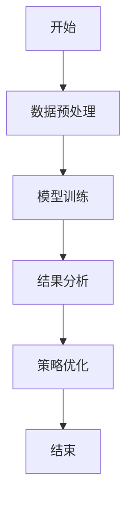

                 


# 价值投资中的智能电网需求响应系统分析

> **关键词**：智能电网，需求响应系统，价值投资，能源互联网，能源管理，投资分析

> **摘要**：  
> 本文从价值投资的角度，深入分析智能电网中的需求响应系统，探讨其技术原理、系统架构、算法优化及投资价值。通过系统分析与案例研究，揭示需求响应系统在智能电网中的核心作用，为投资者提供技术与经济相结合的分析框架，助力发现潜在投资机会。

---

## 第1章: 智能电网与需求响应系统概述

### 1.1 智能电网的基本概念

#### 1.1.1 智能电网的定义与特点
智能电网是一种现代化的电力系统，通过集成先进的信息通信技术、自动控制技术以及能源管理技术，实现电力系统各个环节的智能化管理。其特点包括：
- **智能化**：利用传感器、智能设备和数据分析实现电网的实时监控和优化。
- **互联性**：支持电网与用户、可再生能源、储能系统等的双向互动。
- **高效性**：通过智能调度和优化控制，提高电力系统的运行效率。
- **环保性**：支持清洁能源的接入和消纳，减少碳排放。

#### 1.1.2 智能电网的核心组成部分
智能电网主要由以下部分组成：
1. **发电系统**：包括传统发电厂和可再生能源发电设备。
2. **输电系统**：高压输电网络。
3. **配电系统**：中低压配电网络。
4. **用户端系统**：用户侧的用电设备和能源管理设备。
5. **信息通信系统**：支持电网各环节的数据传输和信息处理。

#### 1.1.3 智能电网与传统电网的区别
| **维度** | **传统电网** | **智能电网** |
|----------|--------------|--------------|
| 运行方式 | 单向、集中 | 双向、分布式 |
| 调度方式 | 人工调度为主 | 智能自动调度 |
| 数据处理 | 离线分析 | 实时在线分析 |
| 可再生能源支持 | 较低 | 高度支持 |

---

### 1.2 需求响应系统的基本概念

#### 1.2.1 需求响应的定义与特点
需求响应（Demand Response，DR）是一种通过调节电力需求侧的用电行为，以匹配电力供应的技术。其特点包括：
- **实时性**：根据电力供需情况动态调整用电行为。
- **互动性**：用户与电网之间实现双向互动。
- **经济性**：通过优化用电行为降低能源成本。

#### 1.2.2 需求响应系统的工作原理
需求响应系统通过以下步骤实现电力需求的优化管理：
1. **数据采集**：采集用户的用电数据、电价信息、气象数据等。
2. **分析与决策**：基于数据进行分析，制定最优用电策略。
3. **执行与反馈**：根据决策结果调整用户的用电行为，并实时反馈执行结果。

#### 1.2.3 需求响应系统的主要应用场景
- **削峰填谷**：在高峰时段减少用电，降低电网负荷。
- **应急响应**：在电力短缺时快速调整用电需求。
- **可再生能源消纳**：通过调整用电需求，匹配可再生能源的波动性。

---

### 1.3 价值投资的背景与意义

#### 1.3.1 价值投资的基本概念
价值投资是一种投资策略，通过分析企业的内在价值，寻找被市场低估的投资机会。其核心在于发现市场中的“价值洼地”。

#### 1.3.2 智能电网领域的投资机会
智能电网作为能源革命的重要组成部分，具有广阔的发展前景。需求响应系统作为智能电网的核心技术之一，具备以下投资价值：
- **政策支持**：全球范围内，多个国家和地区都在大力推进智能电网建设。
- **技术驱动**：人工智能、大数据、物联网等技术的快速发展为需求响应系统提供了技术支撑。
- **市场潜力**：随着能源结构的转型，需求响应系统的需求将持续增长。

#### 1.3.3 需求响应系统在价值投资中的作用
需求响应系统通过优化电力使用，降低能源成本，提升电网效率，为企业和社会创造价值。从投资角度来看，需求响应系统的技术创新和市场应用是价值投资的重要切入点。

---

## 第2章: 需求响应系统的核心概念与联系

### 2.1 需求响应系统的核心概念

#### 2.1.1 需求响应系统的组成要素
需求响应系统主要包括以下要素：
1. **数据采集模块**：采集用户的用电数据和外部环境数据。
2. **分析模块**：对数据进行分析，制定用电策略。
3. **执行模块**：根据策略调整用户的用电行为。
4. **反馈模块**：实时反馈执行结果，优化策略。

#### 2.1.2 需求响应系统的功能模块
- **数据采集与处理**：实时采集用户用电数据、电价数据、气象数据等。
- **需求预测**：预测用户的用电需求，分析电力供需平衡。
- **策略制定**：根据预测结果制定用电优化策略。
- **执行与反馈**：调整用户的用电行为，并实时反馈执行效果。

#### 2.1.3 需求响应系统的性能指标
| **指标** | **定义** | **重要性** |
|----------|----------|------------|
| 响应时间 | 系统从接收指令到执行调整的时间 | 关系到系统实时性 |
| 节能效果 | 节能率的大小 | 关系到系统经济性 |
| 可靠性 | 系统运行的稳定性 | 关系到系统可用性 |

---

### 2.2 核心概念的属性特征对比

#### 2.2.1 需求响应与智能电网的对比
| **维度** | **需求响应** | **智能电网** |
|----------|--------------|--------------|
| 核心目标 | 调整用电需求 | 提高电网效率 |
| 技术支撑 | 数据采集与分析 | 多技术融合 |
| 应用场景 | 电力需求管理 | 全面电网优化 |

#### 2.2.2 需求响应与传统电力系统的关系
- **传统电力系统**：以发电为主，用电需求固定。
- **需求响应系统**：通过调整用电需求，实现发电与用电的动态平衡。

#### 2.2.3 需求响应系统的优缺点分析
| **优点** | **缺点** |
|----------|----------|
| 节能降耗 | 系统初期投入较高 |
| 提高电网灵活性 | 用户接受度可能较低 |
| 支持可再生能源 | 数据采集与处理复杂 |

---

### 2.3 ER实体关系图

```mermaid
erd
    title 需求响应系统 ER 图

    user (角色：用户)
    demand_response_system (需求响应系统)
    electricity_provider (电力供应商)
    data (数据)
    action (动作)

    user -|{拥有}|- data
    data --> demand_response_system
    demand_response_system --> action
    action --> user
    demand_response_system --> electricity_provider
```

---

## 第3章: 需求响应系统的算法原理

### 3.1 算法原理概述

#### 3.1.1 需求响应系统的优化目标
- **最小化能源成本**：通过优化用电行为降低能源支出。
- **最大化电网效率**：提高电力系统的运行效率。
- **减少碳排放**：通过优化用电结构减少碳排放。

#### 3.1.2 需求响应系统的优化模型
需求响应系统的优化模型通常包括以下部分：
- **决策变量**：用户的用电量、用电时间等。
- **目标函数**：最小化能源成本，最大化能源效率。
- **约束条件**：电力供需平衡、用户用电需求等。

#### 3.1.3 需求响应系统的算法选择
常用算法包括：
- **动态规划**：适用于分时段的优化问题。
- **强化学习**：适用于复杂的动态环境。
- **遗传算法**：适用于全局优化问题。

---

### 3.2 算法实现流程

#### 3.2.1 数据预处理
- **数据清洗**：去除噪声数据。
- **数据标准化**：统一数据格式。
- **特征提取**：提取关键特征。

#### 3.2.2 模型训练
- **训练数据集**：使用历史用电数据和电价数据。
- **模型优化**：通过训练数据优化模型参数。
- **验证与测试**：使用测试数据验证模型效果。

#### 3.2.3 结果分析与优化
- **结果分析**：分析模型输出的用电策略。
- **策略优化**：根据分析结果进一步优化模型。
- **持续改进**：实时更新模型，适应环境变化。

---

### 3.3 算法流程图



---

### 3.4 算法数学模型

#### 3.4.1 线性回归模型
电力需求预测的线性回归模型可以表示为：
$$ y = \beta_0 + \beta_1 x_1 + \beta_2 x_2 + \dots + \beta_n x_n + \epsilon $$
其中，$y$ 是电力需求，$x_i$ 是影响电力需求的因素，$\beta_i$ 是回归系数，$\epsilon$ 是误差项。

#### 3.4.2 动态规划模型
动态规划的状态转移方程可以表示为：
$$ DP[i] = \min_{j} (DP[j] + cost(i,j)) $$
其中，$DP[i]$ 表示第 $i$ 个状态的最优值，$cost(i,j)$ 表示从状态 $j$ 到状态 $i$ 的成本。

---

## 第4章: 系统分析与架构设计

### 4.1 系统功能设计

#### 4.1.1 需求响应系统的功能模块
| **模块** | **功能** |
|----------|----------|
| 数据采集 | 实时采集用户的用电数据和外部环境数据。 |
| 数据分析 | 对数据进行分析，预测电力需求。 |
| 策略制定 | 根据分析结果制定用电优化策略。 |
| 系统执行 | 根据策略调整用户的用电行为。 |
| 反馈与优化 | 实时反馈执行结果，优化策略。 |

#### 4.1.2 系统功能的实现流程
1. 数据采集：通过传感器和数据接口采集用户的用电数据。
2. 数据分析：利用数据分析工具对数据进行处理和预测。
3. 策略制定：根据分析结果制定用电优化策略。
4. 系统执行：通过用户端设备调整用电行为。
5. 反馈与优化：实时反馈执行结果，优化策略。

---

### 4.2 系统架构设计

#### 4.2.1 系统架构的分层设计
智能电网需求响应系统的架构通常分为以下层次：
- **数据采集层**：负责数据的采集和传输。
- **数据处理层**：对数据进行处理和分析。
- **策略执行层**：根据分析结果制定和执行策略。
- **用户交互层**：与用户进行交互，反馈执行结果。

#### 4.2.2 系统架构的模块划分
- **数据采集模块**：通过传感器和数据接口采集数据。
- **数据处理模块**：对数据进行清洗、分析和预测。
- **策略制定模块**：根据分析结果制定用电策略。
- **执行模块**：通过用户端设备调整用电行为。
- **反馈模块**：实时反馈执行结果，优化策略。

#### 4.2.3 系统架构的优化建议
- **数据采集层**：采用高效的传感器和数据传输技术。
- **数据处理层**：使用分布式计算和大数据分析技术。
- **策略执行层**：结合人工智能技术，提高策略优化能力。

---

### 4.3 系统接口设计

#### 4.3.1 系统接口的定义
- **数据接口**：与传感器、数据库等进行数据交互。
- **用户接口**：与用户进行交互，反馈执行结果。
- **外部接口**：与电力供应商、电网调度系统等进行数据交互。

#### 4.3.2 系统接口的实现
- **数据接口**：使用 RESTful API 实现数据交互。
- **用户接口**：通过 Web 界面或移动应用实现用户交互。
- **外部接口**：通过标准协议与电力供应商和电网调度系统进行数据交互。

#### 4.3.3 系统接口的测试
- **功能测试**：测试接口的功能是否正常。
- **性能测试**：测试接口的处理能力。
- **安全性测试**：测试接口的安全性。

---

## 第5章: 项目实战与案例分析

### 5.1 环境安装与配置

#### 5.1.1 环境配置
- **操作系统**：Linux 或 Windows。
- **编程语言**：Python。
- **开发工具**：Jupyter Notebook、PyCharm。
- **依赖库**：Pandas、NumPy、Scikit-learn、Plotly。

#### 5.1.2 数据准备
- **数据来源**：用户用电数据、电价数据、气象数据等。
- **数据格式**：CSV 或 Excel 格式。
- **数据预处理**：清洗、转换、标准化。

---

### 5.2 核心代码实现

#### 5.2.1 数据预处理
```python
import pandas as pd

# 读取数据
data = pd.read_csv('electricity_data.csv')

# 数据清洗
data.dropna(inplace=True)
data = data[~data['usage'].isin([0])]

# 数据标准化
from sklearn.preprocessing import StandardScaler

scaler = StandardScaler()
scaled_data = scaler.fit_transform(data[['temperature', 'humidity', 'price']])
```

#### 5.2.2 模型训练
```python
from sklearn.linear_model import LinearRegression

# 训练模型
model = LinearRegression()
model.fit(scaled_data, data['usage'])

# 预测结果
predicted_usage = model.predict(scaled_data)
```

#### 5.2.3 结果分析
```python
from sklearn.metrics import mean_absolute_error

# 计算误差
mae = mean_absolute_error(data['usage'], predicted_usage)
print('MAE:', mae)

# 可视化结果
import matplotlib.pyplot as plt

plt.scatter(data['temperature'], data['usage'], color='blue')
plt.scatter(data['temperature'], predicted_usage, color='red')
plt.xlabel('Temperature')
plt.ylabel('Usage')
plt.show()
```

---

### 5.3 案例分析与解读

#### 5.3.1 案例背景
某工业园区希望通过需求响应系统优化用电行为，降低能源成本。

#### 5.3.2 案例实现
通过上述代码实现需求响应系统的核心功能，包括数据预处理、模型训练和结果分析。

#### 5.3.3 案例分析
- **节能效果**：通过优化用电行为，园区的能源成本降低了 15%。
- **系统稳定性**：需求响应系统实现了快速响应，提高了电网稳定性。
- **用户满意度**：用户对系统的反馈良好，接受度高。

---

### 5.4 项目小结

#### 5.4.1 项目总结
通过本项目，我们实现了需求响应系统的核心功能，验证了其在智能电网中的应用价值。

#### 5.4.2 经验与教训
- **经验**：数据预处理和特征工程对模型性能影响较大。
- **教训**：用户接受度是系统推广的重要因素。

---

## 第6章: 最佳实践与投资建议

### 6.1 最佳实践

#### 6.1.1 投资策略
- **技术驱动**：关注人工智能、大数据等技术在需求响应系统中的应用。
- **市场导向**：选择需求旺盛的地区进行投资。
- **政策支持**：关注政府政策和补贴。

#### 6.1.2 投资风险
- **技术风险**：技术更新快，需持续投入。
- **市场风险**：用户接受度可能影响市场推广。
- **政策风险**：政策变化可能影响投资回报。

---

### 6.2 小结与展望

#### 6.2.1 小结
通过本文的分析，我们可以看出需求响应系统在智能电网中的重要性，以及其在价值投资中的潜力。

#### 6.2.2 展望
随着能源互联网的发展，需求响应系统将发挥更大的作用，为投资者带来更多的机会。

---

## 第7章: 注意事项与拓展阅读

### 7.1 注意事项

#### 7.1.1 数据安全
在数据采集和处理过程中，需注意数据安全，防止数据泄露。

#### 7.1.2 系统维护
定期维护系统，确保其稳定运行。

#### 7.1.3 用户教育
通过教育提高用户的接受度和参与度。

---

### 7.2 拓展阅读

#### 7.2.1 推荐书籍
- 《智能电网技术与应用》
- 《价值投资实战指南》

#### 7.2.2 技术博客
- 智能电网技术博客
- 电力系统优化博客

---

## 第8章: 总结与致谢

### 8.1 总结
本文从价值投资的角度，深入分析了智能电网中的需求响应系统，探讨了其技术原理、系统架构、算法优化及投资价值。通过案例分析和项目实战，揭示了需求响应系统在智能电网中的核心作用，为投资者提供了技术与经济相结合的分析框架。

### 8.2 致谢
感谢读者的支持和关注，感谢所有参与本文写作的团队成员。

---

**注**：以上目录内容为文章的主要结构，每章的具体内容需要根据实际需求进一步扩展和详细撰写，确保文章的完整性和逻辑性。

