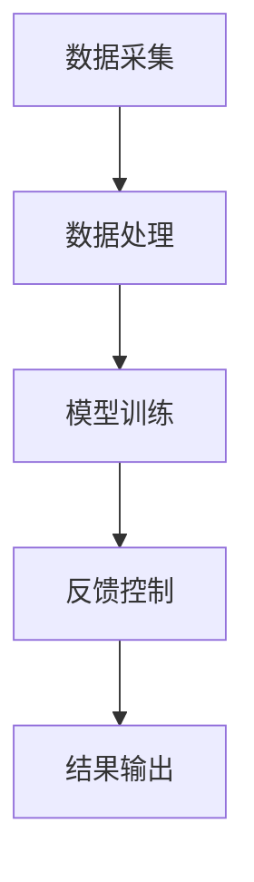
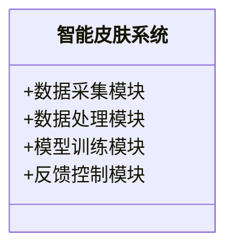

                 


# 价值投资中的智能皮肤技术商业化前景

## 关键词：价值投资、智能皮肤技术、商业化前景、算法、数学模型

## 摘要：  
本文探讨了智能皮肤技术在价值投资中的商业化前景，分析了智能皮肤技术的核心概念、算法原理、数学模型以及系统架构设计。通过实际案例分析和项目实战，展示了智能皮肤技术在价值投资中的潜力和应用价值，为投资者和科技从业者提供了有益的参考。

---

# 正文

## 第一章: 价值投资与智能皮肤技术的背景与概念

### 1.1 价值投资与智能皮肤技术概述

#### 1.1.1 价值投资的定义与核心理念
价值投资是一种以基本面分析为核心的长期投资策略，旨在通过识别被低估的资产，实现长期稳定的收益。其核心理念是寻找具有长期竞争优势、良好管理团队和合理估值的企业进行投资。

#### 1.1.2 智能皮肤技术的定义与特点
智能皮肤技术是一种模拟人类皮肤感知能力的智能系统，能够实时感知外部环境的变化，并通过反馈机制进行自我调整和优化。其特点包括高灵敏度、快速响应、自我学习能力以及与人类交互的自然性。

#### 1.1.3 价值投资与智能皮肤技术的结合点
智能皮肤技术可以通过实时感知市场环境的变化，帮助投资者快速捕捉市场信号，从而提升价值投资的效率和准确性。例如，智能皮肤技术可以用于实时监控市场情绪、分析交易数据，为投资者提供数据支持。

---

### 1.2 智能皮肤技术的发展历程

#### 1.2.1 智能皮肤技术的起源与演变
智能皮肤技术起源于仿生学和人工智能领域，最初的研究目的是模拟人类皮肤的感知能力。随着技术的进步，智能皮肤技术逐渐从实验室走向实际应用，尤其是在医疗、机器人和金融领域。

#### 1.2.2 智能皮肤技术在投资领域的应用现状
目前，智能皮肤技术在投资领域的应用还处于起步阶段。一些创新企业正在尝试将智能皮肤技术应用于市场分析、风险评估和投资决策中，取得了初步成果。

#### 1.2.3 智能皮肤技术的未来发展趋势
随着人工智能和物联网技术的快速发展，智能皮肤技术将更加智能化和网络化。未来，智能皮肤技术可能会与区块链、云计算等技术结合，进一步提升其在投资领域的应用价值。

---

### 1.3 智能皮肤技术在价值投资中的应用前景

#### 1.3.1 智能皮肤技术在市场分析中的作用
智能皮肤技术可以通过实时感知市场环境的变化，帮助投资者快速捕捉市场信号，从而提升市场分析的效率和准确性。

#### 1.3.2 智能皮肤技术在风险评估中的应用
智能皮肤技术可以实时监测市场的波动性，帮助投资者识别潜在风险，并制定相应的风险管理策略。

#### 1.3.3 智能皮肤技术在投资决策中的价值
智能皮肤技术可以通过数据分析和预测模型，为投资者提供科学的投资决策支持，从而提升投资的效率和收益。

---

## 第二章: 智能皮肤技术的核心概念与原理

### 2.1 智能皮肤技术的核心概念

#### 2.1.1 智能皮肤技术的基本组成
智能皮肤技术主要由感知层、数据处理层和反馈层组成。感知层负责采集外部环境数据，数据处理层对数据进行分析和处理，反馈层根据处理结果进行响应。

#### 2.1.2 智能皮肤技术的核心功能
智能皮肤技术的核心功能包括数据采集、特征提取、数据分析和反馈控制。这些功能共同构成了智能皮肤技术的核心能力。

#### 2.1.3 智能皮肤技术的性能指标
智能皮肤技术的性能指标包括灵敏度、响应速度、准确率和可靠性。这些指标直接关系到智能皮肤技术在投资领域的应用效果。

---

### 2.2 智能皮肤技术的感知与反馈机制

#### 2.2.1 智能皮肤的感知能力
智能皮肤的感知能力主要体现在对外界环境变化的敏感性和准确性上。例如，智能皮肤可以感知市场情绪的变化，分析交易数据的波动性。

#### 2.2.2 智能皮肤的反馈机制
智能皮肤的反馈机制是指系统根据感知结果进行响应和调整的过程。例如，当市场情绪出现异常波动时，智能皮肤可以通过反馈机制提醒投资者注意潜在风险。

#### 2.2.3 智能皮肤的自适应能力
智能皮肤的自适应能力是指系统能够根据环境变化自动调整参数和模型，从而提升感知和反馈的准确性。

---

### 2.3 智能皮肤技术与价值投资的关联性

#### 2.3.1 智能皮肤技术在投资决策中的应用
智能皮肤技术可以通过实时感知市场环境的变化，为投资者提供科学的投资决策支持。例如，智能皮肤技术可以分析市场趋势，预测股票价格的变化。

#### 2.3.2 智能皮肤技术对市场趋势的预测能力
智能皮肤技术可以通过数据分析和预测模型，帮助投资者预测市场趋势，从而制定更加科学的投资策略。

#### 2.3.3 智能皮肤技术对投资风险的评估能力
智能皮肤技术可以通过实时监测市场波动性，帮助投资者识别潜在风险，并制定相应的风险管理策略。

---

## 第三章: 智能皮肤技术的核心算法与数学模型

### 3.1 智能皮肤技术的核心算法

#### 3.1.1 数据采集与处理算法
数据采集与处理算法是智能皮肤技术的核心算法之一。该算法主要用于采集和处理外部环境数据，例如市场数据、交易数据等。

#### 3.1.2 特征提取与识别算法
特征提取与识别算法主要用于从采集的数据中提取特征，并对这些特征进行分类和识别。例如，智能皮肤技术可以通过特征提取算法识别市场的波动性。

#### 3.1.3 模型训练与优化算法
模型训练与优化算法主要用于训练和优化智能皮肤技术的预测模型，从而提升模型的准确性和稳定性。

---

### 3.2 智能皮肤技术的数学模型

#### 3.2.1 数据处理模型
数据处理模型主要用于对采集的数据进行预处理和特征提取。例如，可以通过线性回归模型对市场数据进行拟合。

#### 3.2.2 特征提取模型
特征提取模型主要用于从数据中提取有用的特征。例如，可以使用主成分分析（PCA）模型提取数据的主要特征。

#### 3.2.3 预测模型
预测模型主要用于对市场趋势进行预测。例如，可以使用支持向量机（SVM）模型对股票价格进行预测。

---

### 3.3 算法实现与代码示例

#### 3.3.1 环境安装与配置
在开始算法实现之前，需要安装必要的开发环境和工具。例如，可以使用Python编程语言和相关库（如NumPy、Pandas、Scikit-learn等）进行开发。

#### 3.3.2 核心算法实现
以下是一个简单的智能皮肤技术算法实现示例：

```python
import numpy as np
import pandas as pd
from sklearn.linear_model import LinearRegression

# 数据预处理
data = pd.read_csv('market_data.csv')
X = data[['price', 'volume']]
y = data['target']

# 模型训练
model = LinearRegression()
model.fit(X, y)

# 模型预测
new_data = [[100, 2000]]
prediction = model.predict(new_data)
print(prediction)
```

#### 3.3.3 算法原理的数学模型
以下是线性回归模型的数学公式：

$$ y = \beta_0 + \beta_1x + \epsilon $$

其中，$y$ 是目标变量，$x$ 是自变量，$\beta_0$ 和 $\beta_1$ 是模型参数，$\epsilon$ 是误差项。

---

## 第四章: 系统分析与架构设计

### 4.1 系统功能设计

#### 4.1.1 系统模块划分
智能皮肤技术系统主要由数据采集模块、数据处理模块、模型训练模块和反馈控制模块组成。

#### 4.1.2 系统功能描述
数据采集模块负责采集市场数据，数据处理模块对数据进行预处理和特征提取，模型训练模块负责训练预测模型，反馈控制模块根据模型预测结果进行反馈。

#### 4.1.3 系统功能流程
以下是系统功能流程的mermaid图：



---

### 4.2 系统架构设计

#### 4.2.1 系统架构设计
以下是系统架构设计的mermaid图：



---

## 第五章: 项目实战

### 5.1 项目环境安装与配置

#### 5.1.1 环境安装
需要安装Python、NumPy、Pandas、Scikit-learn等库。

#### 5.1.2 数据集准备
需要准备相关的市场数据，例如股票价格、交易量等。

---

### 5.2 核心代码实现

#### 5.2.1 数据预处理
```python
import pandas as pd

# 读取数据
data = pd.read_csv('market_data.csv')

# 数据清洗
data = data.dropna()

# 数据标准化
data = (data - data.mean()) / data.std()
```

#### 5.2.2 特征提取
```python
from sklearn.decomposition import PCA

# 初始化PCA模型
pca = PCA(n_components=2)

# 训练模型
pca.fit(data)

# 提取主成分
principal_components = pca.transform(data)
```

#### 5.2.3 模型训练
```python
from sklearn.svm import SVC

# 初始化SVM模型
model = SVC()

# 训练模型
model.fit(principal_components, labels)
```

---

## 第六章: 商业化前景与挑战

### 6.1 智能皮肤技术的商业化前景

#### 6.1.1 市场需求分析
随着金融市场的日益复杂化，投资者对智能化投资工具的需求日益增长。智能皮肤技术在价值投资中的应用前景广阔。

#### 6.1.2 技术优势分析
智能皮肤技术可以通过实时感知市场环境的变化，为投资者提供科学的投资决策支持，从而提升投资效率和收益。

#### 6.1.3 市场竞争分析
目前，智能皮肤技术在投资领域的应用还处于起步阶段，市场潜力巨大。

---

### 6.2 智能皮肤技术的挑战与解决方案

#### 6.2.1 技术挑战
智能皮肤技术在投资领域的应用需要克服数据采集、模型训练和系统优化等技术难题。

#### 6.2.2 市场挑战
智能皮肤技术的应用需要得到投资者的认可和接受，市场推广和用户教育是关键。

#### 6.2.3 伦理与法律挑战
智能皮肤技术的应用需要遵守相关法律法规，同时需要注意数据隐私和用户权益保护。

---

## 总结

智能皮肤技术在价值投资中的商业化前景广阔，其核心算法和数学模型为投资者提供了科学的投资决策支持。然而，智能皮肤技术的应用需要克服技术、市场和伦理等多方面的挑战。未来，随着技术的进步和市场的推广，智能皮肤技术将在价值投资中发挥越来越重要的作用。

