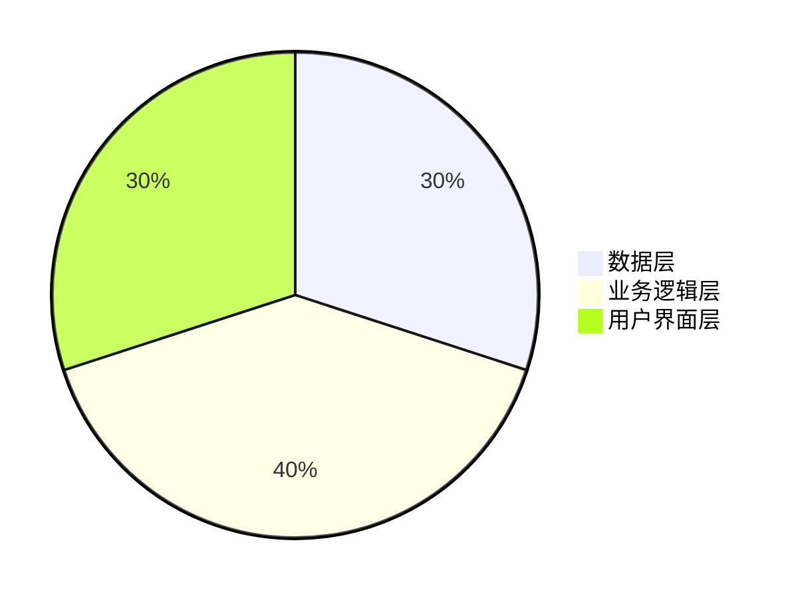

                 


```markdown
# 价值投资中的智能穿戴设备生态系统分析

## 关键词
智能穿戴设备，价值投资，数据分析，系统架构，投资策略

## 摘要
智能穿戴设备作为新兴的技术产品，通过收集用户的健康和行为数据，为价值投资提供了新的视角。本文分析了智能穿戴设备的生态系统，探讨了其在价值投资中的应用潜力，详细介绍了数据分析方法、系统架构设计以及实际案例，为投资者提供了数据驱动的决策支持。

---

# 第1章 智能穿戴设备的背景与价值投资的结合

## 1.1 智能穿戴设备的发展历程

### 1.1.1 智能穿戴设备的定义与分类
智能穿戴设备是指可以穿戴在身体上的智能设备，包括智能手表、健康手环、智能眼镜等。它们通过传感器和互联网技术，实时采集用户的健康数据和行为数据。

### 1.1.2 智能穿戴设备的技术发展历程
从2010年代初的简单计步器，到如今的多功能健康监测设备，智能穿戴设备经历了传感器技术、数据传输和人工智能算法的快速发展。

### 1.1.3 智能穿戴设备与价值投资的结合点
通过收集用户的健康数据，智能穿戴设备可以帮助投资者评估用户的健康风险，从而影响保险定价和健康管理投资。

## 1.2 价值投资的基本概念与方法

### 1.2.1 价值投资的定义与核心理念
价值投资是通过分析企业的基本面，寻找被市场低估的投资标的。其核心理念是寻找具有持续竞争优势和良好管理的公司。

### 1.2.2 价值投资的核心策略与分析框架
包括基本面分析、财务指标分析、行业分析和市场情绪分析。

### 1.2.3 智能穿戴设备行业的投资价值分析
通过分析行业趋势、市场需求和技术创新，评估智能穿戴设备行业的投资潜力。

## 1.3 本章小结

### 1.3.1 智能穿戴设备行业的现状与趋势
当前行业处于快速发展阶段，市场需求增长迅速，技术不断创新。

### 1.3.2 价值投资在智能穿戴设备领域的应用前景
数据驱动的投资决策将成为未来趋势，智能穿戴设备在健康管理、保险定价等方面具有重要应用价值。

### 1.3.3 本书的研究目标与意义
通过分析智能穿戴设备的数据，探索其在价值投资中的应用，为投资者提供数据支持。

---

# 第2章 智能穿戴设备生态系统的核心概念

## 2.1 智能穿戴设备生态系统组成与结构

### 2.1.1 系统组成模块的定义与功能
包括硬件设备、数据采集、数据传输、数据分析和用户界面。

### 2.1.2 系统核心要素的分析与对比
传感器精度、数据处理算法、用户界面友好性是核心要素。

### 2.1.3 系统边界与外延
定义系统的输入和输出，明确与其他系统的接口。

## 2.2 智能穿戴设备生态系统的核心原理

### 2.2.1 数据流的传递与处理机制
数据从设备采集到云端存储，再到用户终端的流动过程。

### 2.2.2 价值传递的路径与方式
通过数据分析，将数据转化为投资决策的价值。

### 2.2.3 系统各模块之间的关系与依赖
模块之间相互依赖，协同工作，实现数据到价值的转化。

## 2.3 核心概念的ER实体关系图

```mermaid
erDiagram
    user }{-- role : "用户"
    device }{-- sensor : "设备"
    data }{-- measurement : "数据"
    service }{-- analysis : "服务"
```

---

# 第3章 智能穿戴设备生态系统中的数据分析与建模

## 3.1 数据分析的核心算法与原理

### 3.1.1 数据预处理与特征提取
清洗数据，提取关键特征，如心率、步频、睡眠质量。

### 3.1.2 数据分析的常用算法介绍
回归分析、聚类分析、时间序列分析。

### 3.1.3 算法的数学模型与公式推导

#### 线性回归模型
$$ y = \beta_0 + \beta_1x + \epsilon $$

#### 聚类分析模型
$$ d(x, y) = \sqrt{(x_1 - y_1)^2 + (x_2 - y_2)^2} $$

## 3.2 数据分析的Python实现

### 3.2.1 环境安装与配置
安装Python、pandas、numpy、scikit-learn。

### 3.2.2 核心代码实现与解读
```python
import pandas as pd
from sklearn.linear_model import LinearRegression

# 数据加载
data = pd.read_csv('health_data.csv')

# 特征提取
X = data[['heart_rate', 'step_count']]
y = data['sleep_quality']

# 模型训练
model = LinearRegression()
model.fit(X, y)

# 预测结果
predictions = model.predict(X)
print('预测结果:', predictions)
```

### 3.2.3 代码运行结果的分析与优化
分析模型的拟合优度和预测精度，优化特征选择和模型参数。

## 3.3 数据分析的案例与应用

### 3.3.1 案例背景与数据来源
分析健康保险定价，使用智能手环收集的用户数据。

### 3.3.2 数据分析过程与结果展示
通过回归分析，发现心率和步频与睡眠质量的相关性。

### 3.3.3 分析结果对价值投资的启示
健康风险预测可以用于保险定价和健康管理投资决策。

---

# 第4章 智能穿戴设备生态系统的系统架构设计

## 4.1 系统功能设计

### 4.1.1 系统功能模块划分
数据采集、数据存储、数据分析、用户界面。

### 4.1.2 功能模块的交互流程
用户数据输入 -> 数据处理 -> 分析结果展示。

## 4.2 系统架构设计

### 4.2.1 系统架构的分层与模块化
数据层、业务逻辑层、用户界面层。

### 4.2.2 系统架构的可视化表示



### 4.2.3 系统接口设计
设备与云端接口，云端与用户接口。

## 4.3 系统交互设计

### 4.3.1 交互流程
用户登录 -> 数据上传 -> 分析结果展示。

### 4.3.2 交互界面设计
用户友好的界面，直观展示健康数据和投资建议。

---

# 第5章 项目实战

## 5.1 环境安装与配置
安装必要的Python库和工具。

## 5.2 核心代码实现

### 5.2.1 数据清洗与特征提取
```python
import pandas as pd
import numpy as np

data = pd.read_csv('health_data.csv')
data.dropna(inplace=True)
data['age'] = data['age'].astype(int)
```

### 5.2.2 建立预测模型
```python
from sklearn.tree import DecisionTreeRegressor

model = DecisionTreeRegressor()
model.fit(X, y)
```

## 5.3 案例分析与解读
分析用户健康数据，预测健康风险，制定投资策略。

## 5.4 项目小结
总结项目成果，分析不足，提出改进建议。

---

# 第6章 最佳实践、小结与注意事项

## 6.1 最佳实践
数据采集的准确性，模型选择的合理性，系统设计的模块化。

## 6.2 小结
全文总结，智能穿戴设备在价值投资中的潜力和应用前景。

## 6.3 注意事项
数据隐私保护，系统维护和优化。

---

# 第7章 拓展阅读

## 7.1 相关书籍
推荐《价值投资实战》、《智能穿戴设备技术》。

## 7.2 相关资源
建议学习数据挖掘、机器学习和投资分析的在线课程。

---

通过以上章节的详细分析，本文全面探讨了智能穿戴设备在价值投资中的应用，为投资者提供了数据驱动的决策支持。
```

