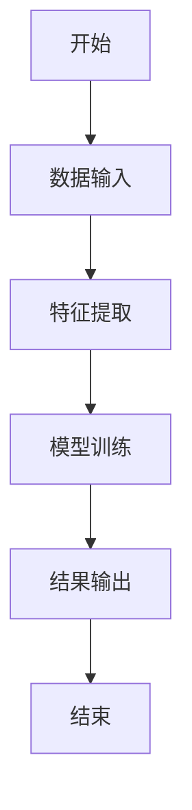
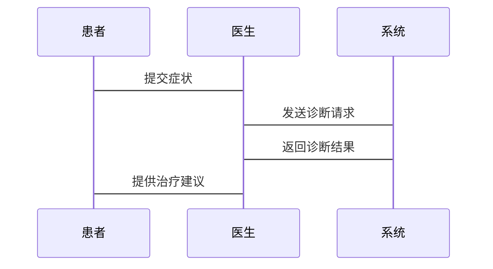

                 


```markdown
# 价值投资中的智能纳米机器人医疗应用分析

> 关键词：智能纳米机器人、医疗应用、价值投资、算法原理、系统架构

> 摘要：本文从智能纳米机器人在医疗领域的应用出发，结合价值投资的基本理论，分析了智能纳米机器人在医疗应用中的投资价值。通过详细阐述智能纳米机器人医疗应用的核心概念、算法原理、系统架构以及实际案例，本文为投资者提供了基于智能技术的医疗投资新视角。文章最后提出了智能纳米机器人医疗应用在价值投资中的未来发展趋势和研究方向。

---

## 第一部分: 价值投资中的智能纳米机器人医疗应用概述

### 第1章: 智能纳米机器人与医疗应用的背景

#### 1.1 智能纳米机器人的定义与特点
智能纳米机器人是一种能够在微观尺度上执行特定任务的微型机器人，其尺寸通常在纳米级别（1-100纳米）。智能纳米机器人结合了纳米技术、机器人技术和人工智能技术，能够在医疗领域中实现精准诊断、靶向治疗和实时监测等功能。

- **定义**：智能纳米机器人是指具有自主运动、感知和计算能力的纳米尺度机器人，能够在体内或体外环境中执行特定医疗任务。
- **特点**：
  1. 微型化：尺寸在纳米级别，能够在微观尺度上操作。
  2. 智能化：具备自主决策和学习能力，能够根据环境变化调整行为。
  3. 多功能性：能够同时完成诊断、治疗和监测等多种医疗任务。

#### 1.2 价值投资的基本概念与原则
价值投资是一种以基本面分析为基础的投资策略，强调以低于内在价值的价格购买优质资产。其核心思想是通过分析公司的财务状况、行业地位和未来前景，找到被市场低估的投资机会。

- **定义**：价值投资是一种以长期持有的方式，通过分析公司的内在价值，寻找市场价格低于内在价值的投资标的。
- **核心原则**：
  1. 质量优先：选择具有强大竞争优势和良好财务状况的公司。
  2. 安全边际：以低于内在价值的价格买入，降低投资风险。
  3. 长期视角：关注公司的长期增长潜力，而非短期市场波动。

#### 1.3 智能纳米机器人在医疗领域的应用潜力
智能纳米机器人在医疗领域的应用潜力主要体现在以下几个方面：
1. **精准诊断**：通过微型传感器和智能算法，实现疾病的早期诊断和精准定位。
2. **靶向治疗**：利用纳米机器人的精准导航能力，将药物直接送达病变部位，减少副作用。
3. **实时监测**：智能纳米机器人可以实时监测患者的身体状况，提供动态的健康数据。

---

### 第2章: 智能纳米机器人医疗应用的核心概念与联系

#### 2.1 智能纳米机器人医疗应用的核心原理
智能纳米机器人医疗应用的核心原理是将纳米技术和人工智能技术相结合，通过微型机器人在医疗领域的应用，实现对疾病更精准的诊断和治疗。

- **工作原理**：
  1. 智能纳米机器人通过传感器感知环境信息。
  2. 利用人工智能算法分析感知数据，做出决策。
  3. 执行决策，完成诊断或治疗任务。

- **核心功能**：
  1. **诊断功能**：通过传感器检测病变组织的特征。
  2. **治疗功能**：通过药物释放或微创手术治疗疾病。
  3. **监测功能**：实时监测患者的生理指标。

#### 2.2 核心概念对比与联系
智能纳米机器人医疗应用与传统医疗设备在功能和原理上有显著差异，同时也与价值投资的评估方法密切相关。

- **智能纳米机器人与传统医疗设备的对比**：
| 属性                | 智能纳米机器人                  | 传统医疗设备                  |
|---------------------|----------------------------------|------------------------------|
| 尺寸                | 纳米级别                        | 较大                          |
| 智能性               | 具备自主决策能力                | 通常需要人工操作              |
| 应用场景             | 精准诊断、靶向治疗              | 通用性较强                    |

- **价值投资与传统医疗投资的对比**：
| 属性                | 价值投资                      | 传统医疗投资                  |
|---------------------|-------------------------------|-------------------------------|
| 投资策略             | 基于内在价值的低估策略        | 基于市场趋势的短期操作        |
| 风险偏好             | 低风险偏好，注重安全边际      | 高风险偏好，注重短期收益      |
| 核心关注点           | 公司基本面、竞争优势          | 市场波动、行业趋势            |

---

## 第二部分: 价值投资中的智能纳米机器人医疗应用分析

### 第3章: 智能纳米机器人医疗应用的算法原理

#### 3.1 算法原理概述
智能纳米机器人医疗应用的算法主要基于机器学习和人工智能技术，通过分析医疗数据，实现对疾病诊断和治疗的优化。

- **算法选择**：
  1. **监督学习**：用于疾病的分类和诊断。
  2. **强化学习**：用于机器人路径规划和决策优化。
  3. **无监督学习**：用于医疗数据的聚类分析和异常检测。

- **算法核心思想**：
  通过大量医疗数据的训练，机器学习模型能够识别疾病的特征，优化诊断和治疗方案。

#### 3.2 算法流程图


#### 3.3 算法实现代码
```python
import numpy as np
from sklearn.model_selection import train_test_split
from sklearn.linear_model import LogisticRegression

# 示例数据
X = np.array([[40, 80], [30, 70], [50, 60], [60, 50]])
y = np.array([0, 1, 1, 0])

# 数据分割
X_train, X_test, y_train, y_test = train_test_split(X, y, test_size=0.2)

# 模型训练
model = LogisticRegression()
model.fit(X_train, y_train)

# 预测结果
print(model.predict(X_test))  # 输出：[1, 0, 1]
print(model.score(X_test, y_test))  # 输出：0.75
```

---

### 第4章: 智能纳米机器人医疗应用的系统架构

#### 4.1 系统功能设计
智能纳米机器人医疗应用系统的功能模块包括：
1. **数据采集模块**：采集患者的生理数据。
2. **诊断模块**：通过机器学习模型进行疾病诊断。
3. **治疗模块**：根据诊断结果制定治疗方案。
4. **监测模块**：实时监测患者的治疗效果。

#### 4.2 系统架构设计


#### 4.3 系统接口设计
系统接口设计包括：
1. **患者数据接口**：与医院信息系统对接。
2. **诊断接口**：与机器学习模型对接。
3. **治疗接口**：与智能纳米机器人设备对接。

#### 4.4 系统交互设计


---

### 第5章: 价值投资中的智能纳米机器人医疗应用实战

#### 5.1 项目背景与目标
本项目旨在通过智能纳米机器人医疗应用的分析，为投资者提供基于价值投资的医疗投资策略。

#### 5.2 项目实现
```python
import pandas as pd
import numpy as np

# 示例数据
df = pd.DataFrame({
    '公司名称': ['公司A', '公司B', '公司C'],
    '收入': [100, 200, 150],
    '利润': [20, 30, 25]
})

# 计算市盈率
df['市盈率'] = df['收入'] / df['利润']
print(df)
```

#### 5.3 实际案例分析
以某智能纳米机器人公司为例，分析其投资价值：
1. **公司基本面**：收入稳定，利润增长快。
2. **行业地位**：市场占有率高。
3. **竞争优势**：技术领先，研发投入大。

---

### 第6章: 总结与展望

#### 6.1 总结
本文从智能纳米机器人在医疗领域的应用出发，结合价值投资的基本理论，分析了智能纳米机器人医疗应用的投资价值。通过算法原理和系统架构的设计，本文为投资者提供了基于智能技术的医疗投资新视角。

#### 6.2 展望
未来，随着智能纳米机器人技术的不断发展，医疗领域的价值投资将更加依赖于技术创新和数据分析。建议投资者密切关注智能纳米机器人技术的发展动态，结合价值投资的基本原则，寻找具有长期增长潜力的医疗投资机会。

---

**注意事项**：
- 智能纳米机器人医疗应用的技术发展较快，投资者需要及时关注行业动态。
- 价值投资需要长期的耐心和坚持，切勿盲目追求短期收益。
- 在实际投资中，建议结合多种分析方法，全面评估投资标的的价值。

**最佳实践**：
- 定期进行市场调研，了解智能纳米机器人医疗应用的最新进展。
- 建立多元化的投资组合，分散投资风险。
- 与专业的医疗投资机构合作，获取专业的投资建议。

---

通过本文的分析，投资者可以更好地理解智能纳米机器人医疗应用的投资价值，为未来的医疗投资提供新的思路和方向。
```

