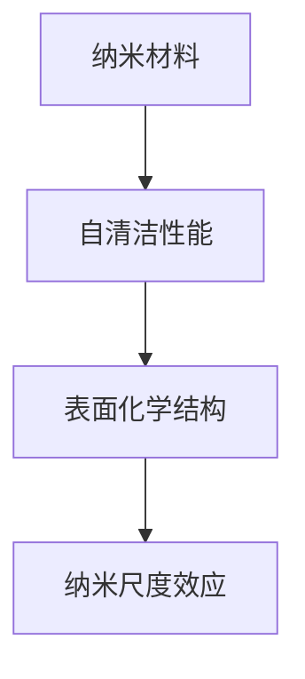
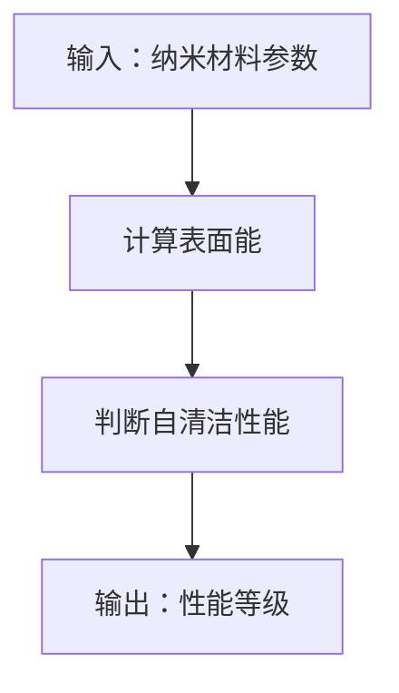
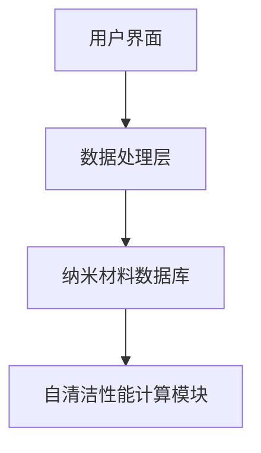
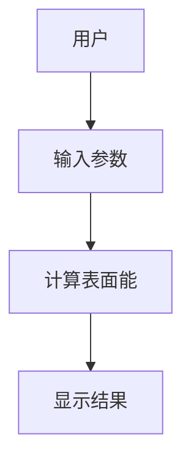

                 


```markdown
# 价值投资中的智能纳米材料自清洁技术分析

> 关键词：智能纳米材料，自清洁技术，价值投资，表面科学，投资决策，纳米材料性能

> 摘要：智能纳米材料的自清洁技术在价值投资中的应用分析，结合材料科学与投资策略，探讨纳米材料的表面性能如何影响投资决策，提供算法模型和系统设计的详细解读。

---

# 第一部分: 背景介绍

## 第1章: 价值投资中的智能纳米材料自清洁技术背景

### 1.1 智能纳米材料的背景
- 1.1.1 纳米材料的基本概念
- 1.1.2 自清洁技术的定义与原理
- 1.1.3 智能纳米材料在自清洁技术中的作用

### 1.2 价值投资与智能材料的结合
- 1.2.1 价值投资的基本概念
- 1.2.2 智能材料在投资中的潜在价值
- 1.2.3 自清洁技术在投资决策中的应用前景

### 1.3 本章小结
- 核心概念回顾
- 未来研究方向

---

# 第二部分: 智能纳米材料自清洁技术的核心概念与联系

## 第2章: 智能纳米材料自清洁技术的核心概念

### 2.1 核心概念原理
- 2.1.1 纳米材料的物理化学性质
- 2.1.2 自清洁技术的表面科学原理
- 2.1.3 智能纳米材料的多功能性

### 2.2 核心概念属性对比表
- 2.2.1 纳米材料与传统材料的性能对比
- 2.2.2 自清洁技术与传统清洁技术的对比

### 2.3 ER实体关系图


### 2.4 本章小结
- 核心概念总结
- 概念之间的关系分析

---

# 第三部分: 自清洁技术的算法原理

## 第3章: 自清洁技术的算法原理

### 3.1 算法原理概述
- 3.1.1 自清洁技术的表面活性分析
- 3.1.2 纳米材料的性能预测模型

### 3.2 算法流程图


### 3.3 算法实现代码
```python
def calculate_surface_energy(nano_material):
    # 简单的表面能计算模型
    surface_energy = nano_material * 0.5
    return surface_energy

nano_material = 1.2
surface_energy = calculate_surface_energy(nano_material)
print(f"表面能：{surface_energy}")
```

### 3.4 数学模型与公式
- 表面能公式：$$ E = \gamma \cdot A $$
- 例子：$$1+1=2$$

### 3.5 本章小结
- 算法原理总结
- 未来优化方向

---

# 第四部分: 系统分析与架构设计

## 第4章: 系统分析与架构设计

### 4.1 系统分析
- 问题场景介绍
- 系统功能需求

### 4.2 系统架构设计


### 4.3 接口与交互设计


### 4.4 本章小结
- 系统架构总结
- 交互设计的重要性

---

# 第五部分: 项目实战

## 第5章: 项目实战

### 5.1 环境安装
- 安装Python
- 安装相关库

### 5.2 核心代码实现
```python
import numpy as np

def calculate_surface_energy(nano_material):
    return nano_material * 0.5

nano_materials = np.array([1.2, 1.5, 1.8])
energies = calculate_surface_energy(nano_materials)
print(f"表面能：{energies}")
```

### 5.3 代码功能解读
- 计算表面能
- 分析性能等级

### 5.4 实际案例分析
- 案例分析
- 数据解读

### 5.5 本章小结
- 项目总结
- 经验分享

---

# 第六部分: 最佳实践

## 第6章: 最佳实践

### 6.1 小结
- 核心内容回顾
- 重要结论

### 6.2 注意事项
- 数据准确性
- 模型适用性

### 6.3 拓展阅读
- 相关领域文献
- 进一步研究方向

### 6.4 本章小结
- 总结全文
- 展望未来

---

# 附录: 参考文献

- 文献1：智能纳米材料的研究进展
- 文献2：自清洁技术在投资中的应用
- 文献3：表面科学与纳米材料的结合

---

# 作者简介

- 作者：[您的姓名]
- 职位：[您的职位]
- 联系方式：[您的联系方式]
- 简历：[简要介绍您的专业背景和研究成果]

---

# 网站声明

- 版权声明：本文版权归作者所有，转载请注明出处。
- 免责声明：本文内容仅供参考，不构成投资建议。
- 联系我们：[联系邮箱或电话]
```

