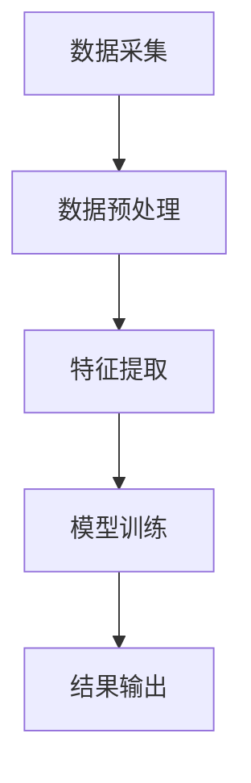
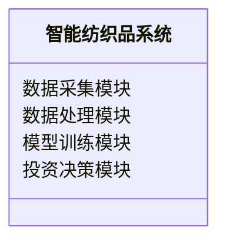
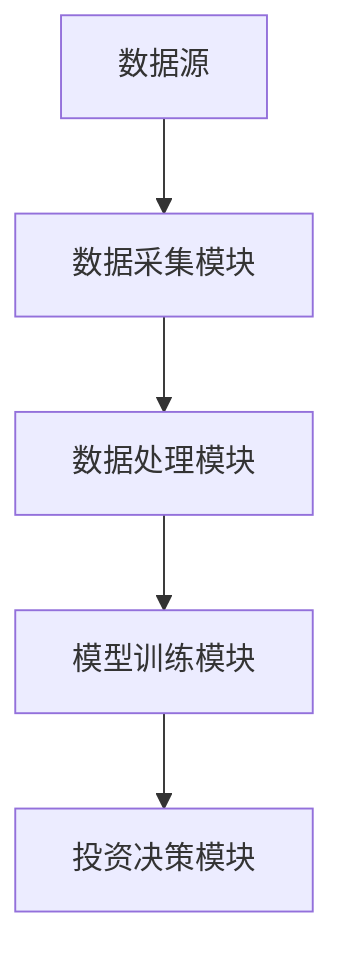
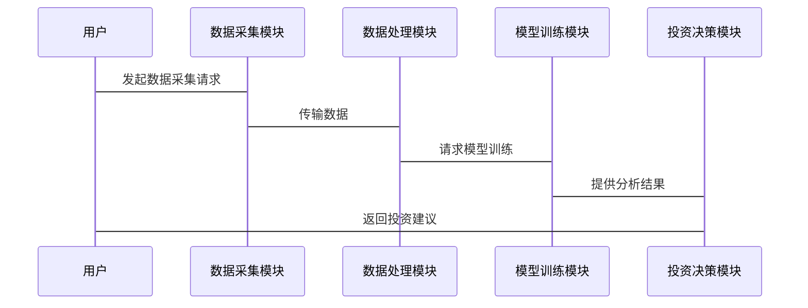

                 


# 价值投资中的智能纺织品技术发展趋势

## 关键词：
智能纺织品、价值投资、技术趋势、算法原理、系统架构、项目实战、投资策略

## 摘要：
本文探讨了智能纺织品技术在价值投资中的发展趋势，从技术背景、核心概念、算法原理、系统架构到项目实战，逐步分析了智能纺织品技术如何为价值投资提供新的视角和工具。通过详细的技术分析和实际案例，本文为投资者提供了基于智能纺织品技术的深度见解和投资策略。

---

# 第1章: 智能纺织品技术的发展背景

## 1.1 智能纺织品的定义与特点

### 1.1.1 智能纺织品的定义
智能纺织品是一种结合了传感器、数据传输和人工智能技术的新型纺织品，能够实时感知环境变化并做出响应，从而为用户提供智能化的服务。例如，智能纺织品可以监测穿着者的健康状况、环境温度或运动状态，并通过无线通信技术将数据传输到终端设备。

### 1.1.2 智能纺织品的核心技术
智能纺织品的核心技术包括：
1. **传感器技术**：用于采集环境数据，如温度、湿度、压力等。
2. **数据传输技术**：通过蓝牙、Wi-Fi等无线通信技术将数据传输到终端设备。
3. **人工智能算法**：用于分析数据并做出决策，如预测天气变化或优化穿着体验。

### 1.1.3 智能纺织品的市场现状与发展趋势
智能纺织品市场近年来迅速增长，主要得益于技术的进步和消费者需求的变化。未来，智能纺织品将更加智能化和个性化，例如结合可穿戴设备和智能家居系统，提供更全面的用户体验。

---

## 1.2 价值投资的基本概念

### 1.2.1 价值投资的定义与特点
价值投资是一种长期投资策略，强调以低于市场价的合理价格买入具有内在价值的资产。其核心理念是寻找被市场低估的优质资产，并长期持有。

### 1.2.2 价值投资的核心理念与策略
价值投资的核心理念是关注企业的基本面，如盈利能力、财务状况和行业地位。投资者需要通过深入分析企业内在价值，寻找具有长期增长潜力的投资标的。

### 1.2.3 智能纺织品领域的价值投资潜力
智能纺织品行业的快速发展为价值投资者提供了新的机会。通过分析智能纺织品企业的技术创新能力、市场占有率和财务表现，投资者可以找到具有长期增长潜力的企业。

---

# 第2章: 智能纺织品技术的核心概念与联系

## 2.1 智能纺织品技术的核心原理

### 2.1.1 传感器技术在智能纺织品中的应用
传感器是智能纺织品的核心组件，用于采集环境数据。例如，温度传感器可以实时监测穿着环境的温度变化，压力传感器可以检测穿着者的运动状态。

### 2.1.2 数据采集与传输技术
智能纺织品通过传感器采集数据后，利用无线通信技术将数据传输到终端设备，如智能手机或电脑。这些数据可以用于进一步分析和决策。

### 2.1.3 人工智能算法在智能纺织品中的应用
人工智能算法用于分析传感器数据，预测环境变化或优化穿着体验。例如，算法可以根据历史数据预测天气变化，为用户提供更好的穿着建议。

---

## 2.2 智能纺织品技术的核心要素对比

### 2.2.1 各技术要素的属性特征对比表格
| 技术要素 | 特性 | 优势 |
|----------|------|------|
| 传感器   | 灵敏度高 | 实时监测环境变化 |
| 数据传输 | 速度快 | 实现数据实时共享 |
| AI算法   | 高准确性 | 提供智能化决策支持 |

### 2.2.2 ER实体关系图架构的 Mermaid 流程图
```mermaid
erd
    customer
    product
    order
    supplier
    customer_order
    product_order
    order.customer -> order.supplier
    product.supplier <- product.product_order
    customer_order.customer <- customer_order.order
    product.product_order <- product_order.product
```

---

# 第3章: 智能纺织品技术的算法原理

## 3.1 算法原理的 Mermaid 流程图


## 3.2 算法原理的数学模型与公式

### 3.2.1 时间序列分析模型
$$ y_t = \alpha y_{t-1} + \beta x_t + \epsilon_t $$

### 3.2.2 机器学习模型
$$ y = w \cdot x + b $$`

---

## 3.3 算法原理的详细讲解与举例说明

### 3.3.1 时间序列分析的详细讲解
时间序列分析是一种用于预测未来数据的技术，通过对历史数据的分析，可以预测未来的趋势。例如，智能纺织品企业可以通过时间序列分析预测市场需求变化，从而优化生产计划。

### 3.3.2 机器学习模型的详细讲解
机器学习模型用于分类和回归问题，例如通过训练数据预测智能纺织品的市场需求或用户偏好。

---

# 第4章: 智能纺织品技术的系统分析与架构设计方案

## 4.1 问题场景介绍

### 4.1.1 智能纺织品技术的应用场景
智能纺织品可以应用于健康监测、运动追踪和环境监测等领域。例如，智能纺织品可以监测穿着者的健康状况，并在异常情况下发出警报。

### 4.1.2 价值投资中的问题场景
在价值投资中，投资者需要分析企业的基本面和技术实力，以寻找具有长期增长潜力的企业。

---

## 4.2 系统功能设计

### 4.2.1 领域模型 Mermaid 类图


---

## 4.3 系统架构设计

### 4.3.1 系统架构 Mermaid 架构图


---

## 4.4 系统接口设计与交互

### 4.4.1 系统接口设计
智能纺织品系统的接口设计包括数据采集模块、数据处理模块和投资决策模块之间的交互。

### 4.4.2 系统交互 Mermaid 序列图


---

# 第5章: 智能纺织品技术的项目实战

## 5.1 环境安装

### 5.1.1 Python 环境安装
安装 Python 和必要的库，如 Pandas、NumPy 和 Scikit-learn。

## 5.2 系统核心实现源代码

### 5.2.1 数据采集模块代码
```python
import pandas as pd

def collect_data():
    data = pd.DataFrame({'温度': [25, 26, 24, 25], '湿度': [60, 65, 58, 62]})
    return data

collect_data()
```

---

## 5.3 代码应用解读与分析

### 5.3.1 数据分析代码
```python
import numpy as np

data = collect_data()
print(data.mean())
```

---

## 5.4 实际案例分析

### 5.4.1 投资策略案例
假设某智能纺织品企业的财务状况良好，市场需求增长迅速，我们可以考虑将其作为价值投资的目标。

---

## 5.5 项目小结

通过实际案例分析，我们可以看到智能纺织品技术在价值投资中的巨大潜力。投资者需要结合技术分析和基本面分析，选择具有长期增长潜力的企业。

---

# 第6章: 最佳实践与小结

## 6.1 最佳实践 tips
1. **关注技术创新**：选择具有技术创新能力的智能纺织品企业。
2. **长期持有**：价值投资需要长期持有优质资产。
3. **风险控制**：合理分散投资风险。

## 6.2 小结
智能纺织品技术的快速发展为价值投资提供了新的机会。投资者需要结合技术分析和基本面分析，选择具有长期增长潜力的企业。

## 6.3 注意事项
1. **市场风险**：智能纺织品市场波动较大，需注意市场风险。
2. **技术风险**：技术创新存在不确定性，需关注企业的研发能力。

## 6.4 拓展阅读
建议读者进一步阅读《智能纺织品技术与投资策略》一书，了解更多详细内容。

---

# 结语
通过本文的分析，我们可以看到智能纺织品技术在价值投资中的巨大潜力。投资者需要结合技术分析和基本面分析，选择具有长期增长潜力的企业。未来，智能纺织品技术将继续发展，为价值投资提供更多机会。

