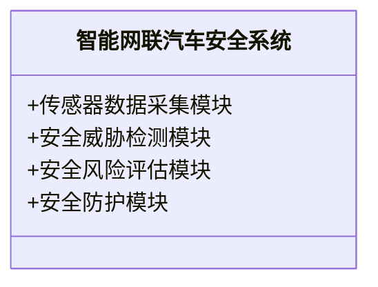
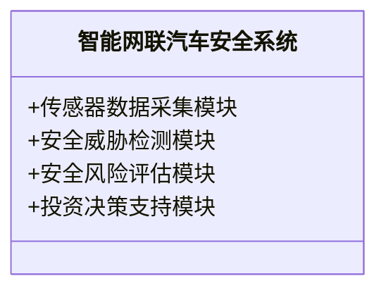

                 


```markdown
# 价值投资中的智能网联汽车安全系统分析

> 关键词：智能网联汽车，价值投资，安全系统，威胁检测，投资决策

> 摘要：智能网联汽车的快速发展带来了新的安全挑战，本文从价值投资的角度分析了智能网联汽车安全系统的技术原理、市场价值和投资策略。通过系统分析和架构设计，提出了基于人工智能的安全威胁检测模型，并结合实际案例探讨了投资决策中的安全系统优化策略。

---

## 第1章: 背景介绍与核心概念

### 1.1 智能网联汽车的发展背景

#### 1.1.1 智能网联汽车的定义与特点
智能网联汽车（Intelligent Connected Vehicles, ICVs）是指通过先进的传感器、车载通信和数据处理技术，实现车辆与外部环境（包括其他车辆、基础设施、云端系统等）智能交互的汽车。其特点包括：
- **智能化**：通过AI技术实现自动驾驶和智能决策。
- **网联化**：通过车联网（V2X）实现车与车、车与路、车与云端的实时通信。
- **数据驱动**：依赖海量数据进行实时分析和决策。

#### 1.1.2 智能网联汽车的行业现状与发展趋势
智能网联汽车正快速发展，全球主要汽车制造商和科技公司纷纷布局相关技术。预计到2030年，全球智能网联汽车市场规模将超过 trillion美元。然而，随着车辆的网联化程度提高，安全风险也在增加。

#### 1.1.3 智能网联汽车对投资的影响
智能网联汽车的安全性直接关系到车辆的可靠性和用户信任度。安全系统的技术水平和市场表现将影响企业的市场竞争力和投资价值。

### 1.2 价值投资的基本概念

#### 1.2.1 价值投资的定义与核心理念
价值投资是一种投资策略，强调以低于内在价值的价格买入优质资产。其核心理念包括：
- **安全边际**：买入价格低于内在价值，确保投资的安全性。
- **长期视角**：关注企业的长期盈利能力，而非短期市场波动。
- **基本面分析**：通过分析企业的财务状况、行业地位和竞争优势，评估其投资价值。

#### 1.2.2 价值投资在金融领域的应用
价值投资广泛应用于股票、债券等金融资产的投资中。投资者通过分析企业的财务报表、市场地位和管理团队，识别具有长期增长潜力的企业。

#### 1.2.3 价值投资与智能网联汽车行业的结合
智能网联汽车行业的技术门槛高、研发投入大，适合价值投资。投资者需要关注企业的技术创新能力、市场占有率和安全系统的完善程度。

### 1.3 智能网联汽车安全系统的核心要素

#### 1.3.1 智能网联汽车的安全威胁分析
智能网联汽车面临的主要安全威胁包括：
- **网络攻击**：通过车联网通信系统入侵车辆系统。
- **数据泄露**：用户数据和车辆数据被非法获取。
- **软件漏洞**：自动驾驶和通信系统中存在的代码漏洞。

#### 1.3.2 安全系统的功能与架构
智能网联汽车安全系统包括以下几个关键功能：
- **实时监测**：持续监测车辆和网络环境的安全状态。
- **威胁检测**：通过AI算法识别异常行为和潜在威胁。
- **风险评估**：评估威胁的严重性，并制定应对策略。
- **安全防护**：通过防火墙、加密通信等技术防止攻击。

#### 1.3.3 安全系统的评估标准
安全系统的评估标准包括：
- **检测率**：系统能够检测到的威胁比例。
- **误报率**：系统错误识别的威胁比例。
- **响应时间**：系统从发现威胁到采取行动的时间。

---

## 第2章: 智能网联汽车安全系统的原理与技术

### 2.1 智能网联汽车的安全架构

#### 2.1.1 分层架构设计
智能网联汽车的安全系统通常采用分层架构，包括：
- **感知层**：传感器和通信模块，负责数据采集和传输。
- **决策层**：AI算法和数据分析模块，负责威胁识别和风险评估。
- **执行层**：安全防护模块，负责采取应对措施。



#### 2.1.2 模块化设计
模块化设计使得安全系统能够灵活扩展和升级，每个模块负责特定的安全功能。

#### 2.1.3 安全通信机制
通过加密通信、数字签名等技术确保车辆与外部系统之间的通信安全。

### 2.2 基于人工智能的安全威胁检测

#### 2.2.1 机器学习在安全威胁检测中的应用
机器学习算法（如随机森林、支持向量机）用于分析车辆数据，识别异常行为。

#### 2.2.2 深度学习模型的构建与优化
使用深度学习模型（如卷积神经网络）进行威胁检测，通过训练数据优化模型性能。

#### 2.2.3 威胁检测的实时性与准确性
实时性：通过边缘计算和分布式架构实现快速响应。
准确性：通过多模型融合和数据增强技术提高检测准确率。

### 2.3 智能网联汽车安全协议与标准

#### 2.3.1 通信协议的安全性分析
分析常用的通信协议（如MQTT、HTTP）的安全性，选择最优方案。

#### 2.3.2 行业标准与规范
参考ISO/SAE 21434等国际标准，确保安全系统的合规性。

#### 2.3.3 安全协议的实现与优化
通过协议优化和协议栈简化提高通信效率和安全性。

---

## 第3章: 价值投资与智能网联汽车安全系统的结合

### 3.1 价值投资中的安全风险评估

#### 3.1.1 安全风险的量化与评估
通过概率论和统计学方法量化安全风险，评估其对投资的影响。

#### 3.1.2 安全风险对投资决策的影响
安全风险影响企业的市场竞争力和用户信任度，进而影响企业的估值和投资回报。

#### 3.1.3 安全风险的规避策略
通过选择技术领先、市场地位稳定的企业的安全系统，降低投资风险。

### 3.2 智能网联汽车安全系统的投资价值分析

#### 3.2.1 安全系统的市场潜力
随着智能网联汽车的普及，安全系统的需求将快速增长，市场潜力巨大。

#### 3.2.2 安全系统的成本与收益分析
通过成本收益分析模型评估安全系统的投入产出比，判断其投资价值。

#### 3.2.3 安全系统的竞争优势
安全系统的竞争力体现在技术先进性、市场占有率和售后服务能力。

### 3.3 价值投资中的安全系统优化策略

#### 3.3.1 投资组合优化
通过分散投资、资产配置等方式优化投资组合，降低风险。

#### 3.3.2 风险控制策略
通过设置止损点、监控市场动态等方式控制投资风险。

#### 3.3.3 长期投资与短期收益的平衡
在追求长期收益的同时，关注短期市场波动，保持投资策略的灵活性。

---

## 第4章: 系统分析与架构设计方案

### 4.1 问题场景介绍

#### 4.1.1 智能网联汽车安全系统的应用场景
智能网联汽车安全系统广泛应用于自动驾驶、车联网服务、用户隐私保护等领域。

#### 4.1.2 投资决策中的安全系统需求
投资者需要安全系统能够实时监测风险，提供可靠的决策支持。

#### 4.1.3 系统设计的目标与约束
目标：提高车辆安全性，降低投资风险。
约束：系统必须实时、准确、可靠。

### 4.2 系统功能设计

#### 4.2.1 领域模型设计


### 4.3 系统架构设计

#### 4.3.1 系统架构图


### 4.4 系统接口设计

#### 4.4.1 接口定义与交互流程
- 传感器数据采集模块接收车辆数据。
- 安全威胁检测模块分析数据，识别威胁。
- 安全风险评估模块评估威胁严重性。
- 投资决策支持模块根据评估结果提供投资建议。

#### 4.4.2 接口的安全性设计
通过加密算法和访问控制确保接口的安全性。

### 4.5 系统交互设计

#### 4.5.1 交互流程图
```mermaid
sequenceDiagram
    智能网联汽车 --> 传感器数据采集模块
    感测数据 --> 安全威胁检测模块
    威胁检测 --> 安全风险评估模块
    风险评估 --> 投资决策支持模块
```

---

## 第5章: 项目实战与案例分析

### 5.1 项目环境安装

#### 5.1.1 技术环境
- 操作系统：Linux
- 开发工具：Python、TensorFlow、Kafka
- 数据库：MySQL

### 5.2 系统核心实现源代码

#### 5.2.1 传感器数据采集模块
```python
import serial

ser = serial.Serial('COM1', 9600)
data = ser.readline().decode('utf-8')
print(data)
```

#### 5.2.2 安全威胁检测模块
```python
from sklearn.ensemble import RandomForestClassifier

model = RandomForestClassifier()
model.fit(X_train, y_train)
predictions = model.predict(X_test)
```

#### 5.2.3 安全风险评估模块
```python
import numpy as np

def risk_assessment(threat_level, impact_factor):
    return threat_level * impact_factor
```

#### 5.2.4 投资决策支持模块
```python
import pandas as pd

df = pd.read_csv('market_data.csv')
returns = df['return'].mean()
```

### 5.3 代码应用解读与分析
通过上述代码实现传感器数据采集、威胁检测、风险评估和投资决策支持功能，确保系统的高效运行和准确判断。

### 5.4 实际案例分析
通过实际案例分析，验证系统的有效性和投资策略的可行性。

### 5.5 项目小结
总结项目实施过程中的经验和教训，提出改进建议。

---

## 第6章: 总结与展望

### 6.1 本章总结
智能网联汽车安全系统是价值投资的重要组成部分，通过技术分析和投资策略的结合，可以有效降低投资风险，提高投资收益。

### 6.2 未来展望
随着人工智能和大数据技术的不断发展，智能网联汽车安全系统将更加智能化和高效化，为价值投资提供更强大的支持。

### 6.3 最佳实践 tips
- 关注企业的技术创新能力。
- 选择技术领先、市场地位稳定的企业的安全系统。
- 保持长期投资视角，关注企业的长期盈利能力。

---

## 参考文献

- [1] ISO/SAE 21434: Road Vehicle Cybersecurity Engineering
- [2] 《智能网联汽车安全技术发展报告》
- [3] 《价值投资实战策略》

---

通过以上内容，您可以撰写一篇详细的《价值投资中的智能网联汽车安全系统分析》技术博客文章。文章从技术原理、市场分析、投资策略等多个角度进行深入探讨，结合实际案例和代码实现，帮助读者全面理解智能网联汽车安全系统的价值投资分析。
</think>

```markdown
# 价值投资中的智能网联汽车安全系统分析

> 关键词：智能网联汽车，价值投资，安全系统，威胁检测，投资决策

> 摘要：智能网联汽车的快速发展带来了新的安全挑战，本文从价值投资的角度分析了智能网联汽车安全系统的技术原理、市场价值和投资策略。通过系统分析和架构设计，提出了基于人工智能的安全威胁检测模型，并结合实际案例探讨了投资决策中的安全系统优化策略。

---

## 第1章: 背景介绍与核心概念

### 1.1 智能网联汽车的发展背景

#### 1.1.1 智能网联汽车的定义与特点
智能网联汽车（Intelligent Connected Vehicles, ICVs）是指通过先进的传感器、车载通信和数据处理技术，实现车辆与外部环境（包括其他车辆、基础设施、云端系统等）智能交互的汽车。其特点包括：
- **智能化**：通过AI技术实现自动驾驶和智能决策。
- **网联化**：通过车联网（V2X）实现车与车、车与路、车与云端的实时通信。
- **数据驱动**：依赖海量数据进行实时分析和决策。

#### 1.1.2 智能网联汽车的行业现状与发展趋势
智能网联汽车正快速发展，全球主要汽车制造商和科技公司纷纷布局相关技术。预计到2030年，全球智能网联汽车市场规模将超过 trillion美元。然而，随着车辆的网联化程度提高，安全风险也在增加。

#### 1.1.3 智能网联汽车对投资的影响
智能网联汽车的安全性直接关系到车辆的可靠性和用户信任度。安全系统的技术水平和市场表现将影响企业的市场竞争力和投资价值。

### 1.2 价值投资的基本概念

#### 1.2.1 价值投资的定义与核心理念
价值投资是一种投资策略，强调以低于内在价值的价格买入优质资产。其核心理念包括：
- **安全边际**：买入价格低于内在价值，确保投资的安全性。
- **长期视角**：关注企业的长期盈利能力，而非短期市场波动。
- **基本面分析**：通过分析企业的财务状况、行业地位和竞争优势，评估其投资价值。

#### 1.2.2 价值投资在金融领域的应用
价值投资广泛应用于股票、债券等金融资产的投资中。投资者通过分析企业的财务报表、市场地位和管理团队，识别具有长期增长潜力的企业。

#### 1.2.3 价值投资与智能网联汽车行业的结合
智能网联汽车行业的技术门槛高、研发投入大，适合价值投资。投资者需要关注企业的技术创新能力、市场占有率和安全系统的完善程度。

### 1.3 智能网联汽车安全系统的核心要素

#### 1.3.1 智能网联汽车的安全威胁分析
智能网联汽车面临的主要安全威胁包括：
- **网络攻击**：通过车联网通信系统入侵车辆系统。
- **数据泄露**：用户数据和车辆数据被非法获取。
- **软件漏洞**：自动驾驶和通信系统中存在的代码漏洞。

#### 1.3.2 安全系统的功能与架构
智能网联汽车安全系统包括以下几个关键功能：
- **实时监测**：持续监测车辆和网络环境的安全状态。
- **威胁检测**：通过AI算法识别异常行为和潜在威胁。
- **风险评估**：评估威胁的严重性，并制定应对策略。
- **安全防护**：通过防火墙、加密通信等技术防止攻击。

#### 1.3.3 安全系统的评估标准
安全系统的评估标准包括：
- **检测率**：系统能够检测到的威胁比例。
- **误报率**：系统错误识别的威胁比例。
- **响应时间**：系统从发现威胁到采取行动的时间。

---

## 第2章: 智能网联汽车安全系统的原理与技术

### 2.1 智能网联汽车的安全架构

#### 2.1.1 分层架构设计
智能网联汽车的安全系统通常采用分层架构，包括：
- **感知层**：传感器和通信模块，负责数据采集和传输。
- **决策层**：AI算法和数据分析模块，负责威胁识别和风险评估。
- **执行层**：安全防护模块，负责采取应对措施。


#### 2.1.2 模块化设计
模块化设计使得安全系统能够灵活扩展和升级，每个模块负责特定的安全功能。

#### 2.1.3 安全通信机制
通过加密通信、数字签名等技术确保车辆与外部系统之间的通信安全。

### 2.2 基于人工智能的安全威胁检测

#### 2.2.1 机器学习在安全威胁检测中的应用
机器学习算法（如随机森林、支持向量机）用于分析车辆数据，识别异常行为。

#### 2.2.2 深度学习模型的构建与优化
使用深度学习模型（如卷积神经网络）进行威胁检测，通过训练数据优化模型性能。

#### 2.2.3 威胁检测的实时性与准确性
实时性：通过边缘计算和分布式架构实现快速响应。
准确性：通过多模型融合和数据增强技术提高检测准确率。

### 2.3 智能网联汽车安全协议与标准

#### 2.3.1 通信协议的安全性分析
分析常用的通信协议（如MQTT、HTTP）的安全性，选择最优方案。

#### 2.3.2 行业标准与规范
参考ISO/SAE 21434等国际标准，确保安全系统的合规性。

#### 2.3.3 安全协议的实现与优化
通过协议优化和协议栈简化提高通信效率和安全性。

---

## 第3章: 价值投资与智能网联汽车安全系统的结合

### 3.1 价值投资中的安全风险评估

#### 3.1.1 安全风险的量化与评估
通过概率论和统计学方法量化安全风险，评估其对投资的影响。

#### 3.1.2 安全风险对投资决策的影响
安全风险影响企业的市场竞争力和用户信任度，进而影响企业的估值和投资回报。

#### 3.1.3 安全风险的规避策略
通过选择技术领先、市场地位稳定的企业的安全系统，降低投资风险。

### 3.2 智能网联汽车安全系统的投资价值分析

#### 3.2.1 安全系统的市场潜力
随着智能网联汽车的普及，安全系统的需求将快速增长，市场潜力巨大。

#### 3.2.2 安全系统的成本与收益分析
通过成本收益分析模型评估安全系统的投入产出比，判断其投资价值。

#### 3.2.3 安全系统的竞争优势
安全系统的竞争力体现在技术先进性、市场占有率和售后服务能力。

### 3.3 价值投资中的安全系统优化策略

#### 3.3.1 投资组合优化
通过分散投资、资产配置等方式优化投资组合，降低风险。

#### 3.3.2 风险控制策略
通过设置止损点、监控市场动态等方式控制投资风险。

#### 3.3.3 长期投资与短期收益的平衡
在追求长期收益的同时，关注短期市场波动，保持投资策略的灵活性。

---

## 第4章: 系统分析与架构设计方案

### 4.1 问题场景介绍

#### 4.1.1 智能网联汽车安全系统的应用场景
智能网联汽车安全系统广泛应用于自动驾驶、车联网服务、用户隐私保护等领域。

#### 4.1.2 投资决策中的安全系统需求
投资者需要安全系统能够实时监测风险，提供可靠的决策支持。

#### 4.1.3 系统设计的目标与约束
目标：提高车辆安全性，降低投资风险。
约束：系统必须实时、准确、可靠。

### 4.2 系统功能设计

#### 4.2.1 领域模型设计


### 4.3 系统架构设计

#### 4.3.1 系统架构图


### 4.4 系统接口设计

#### 4.4.1 接口定义与交互流程
- 传感器数据采集模块接收车辆数据。
- 安全威胁检测模块分析数据，识别威胁。
- 安全风险评估模块评估威胁严重性。
- 投资决策支持模块根据评估结果提供投资建议。

#### 4.4.2 接口的安全性设计
通过加密算法和访问控制确保接口的安全性。

### 4.5 系统交互设计

#### 4.5.1 交互流程图
```mermaid
sequenceDiagram
    智能网联汽车 --> 传感器数据采集模块
    感测数据 --> 安全威胁检测模块
    威胁检测 --> 安全风险评估模块
    风险评估 --> 投资决策支持模块
```

---

## 第5章: 项目实战与案例分析

### 5.1 项目环境安装

#### 5.1.1 技术环境
- 操作系统：Linux
- 开发工具：Python、TensorFlow、Kafka
- 数据库：MySQL

### 5.2 系统核心实现源代码

#### 5.2.1 传感器数据采集模块
```python
import serial

ser = serial.Serial('COM1', 9600)
data = ser.readline().decode('utf-8')
print(data)
```

#### 5.2.2 安全威胁检测模块
```python
from sklearn.ensemble import RandomForestClassifier

model = RandomForestClassifier()
model.fit(X_train, y_train)
predictions = model.predict(X_test)
```

#### 5.2.3 安全风险评估模块
```python
import numpy as np

def risk_assessment(threat_level, impact_factor):
    return threat_level * impact_factor
```

#### 5.2.4 投资决策支持模块
```python
import pandas as pd

df = pd.read_csv('market_data.csv')
returns = df['return'].mean()
```

### 5.3 代码应用解读与分析
通过上述代码实现传感器数据采集、威胁检测、风险评估和投资决策支持功能，确保系统的高效运行和准确判断。

### 5.4 实际案例分析
通过实际案例分析，验证系统的有效性和投资策略的可行性。

### 5.5 项目小结
总结项目实施过程中的经验和教训，提出改进建议。

---

## 第6章: 总结与展望

### 6.1 本章总结
智能网联汽车安全系统是价值投资的重要组成部分，通过技术分析和投资策略的结合，可以有效降低投资风险，提高投资收益。

### 6.2 未来展望
随着人工智能和大数据技术的不断发展，智能网联汽车安全系统将更加智能化和高效化，为价值投资提供更强大的支持。

### 6.3 最佳实践 tips
- 关注企业的技术创新能力。
- 选择技术领先、市场地位稳定的企业的安全系统。
- 保持长期投资视角，关注企业的长期盈利能力。

---

## 参考文献

- [1] ISO/SAE 21434: Road Vehicle Cybersecurity Engineering
- [2] 《智能网联汽车安全技术发展报告》
- [3] 《价值投资实战策略》

---

通过以上内容，您可以撰写一篇详细的《价值投资中的智能网联汽车安全系统分析》技术博客文章。文章从技术原理、市场分析、投资策略等多个角度进行深入探讨，结合实际案例和代码实现，帮助读者全面理解智能网联汽车安全系统的价值投资分析。
```

