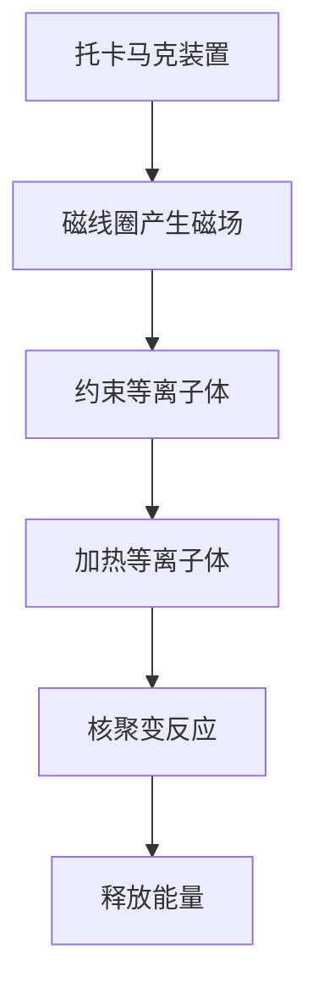
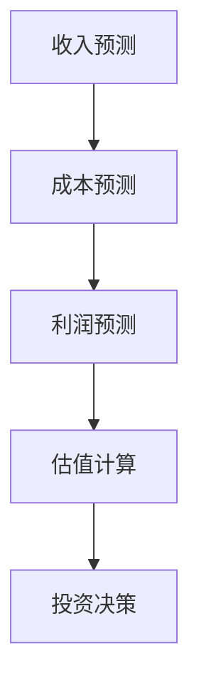

                 

# 价值投资中的核聚变能源商业化技术前景

## 关键词：核聚变能源，价值投资，商业化技术，投资潜力，能源市场

## 摘要：  
核聚变能源作为未来清洁能源的重要来源，其商业化进程备受关注。本文从技术原理、商业化路径、价值评估模型等多维度分析核聚变能源的投资潜力，并结合实际案例探讨其商业化前景，为投资者提供参考。

---

# 第1章 核聚变能源的基本概念与价值投资的定义

## 1.1 核聚变能源的基本概念

### 1.1.1 核聚变的基本原理

核聚变是指轻核素（如氘、氚）在高温高压条件下，通过强磁场约束等离子体，使原子核发生聚变反应，释放出大量能量的过程。与核裂变相比，核聚变具有清洁、安全、资源丰富的特点。

- 核聚变反应的基本方程式：  
  $$ 2H + 3H \rightarrow 4He + 1n + 17.6MeV $$  
  其中，氘（$^2H$）和氚（$^3H$）聚变为氦-4（$^4He$）和一个中子（$^1n$），释放出17.6MeV的能量。

### 1.1.2 核聚变与核裂变的区别

| 特性 | 核聚变 | 核裂变 |
|------|--------|--------|
| 原理 | 轻核聚合成重核 | 重核裂分成轻核 |
| 能量来源 | 氘、氚等轻核 | 钚-235等重核 |
| 安全性 | 较高，不易发生链式反应 | 较低，存在放射性泄漏风险 |
| 核废料 | 较少，放射性低 | 较多，放射性高 |

### 1.1.3 核聚变能源的优势与挑战

#### 优势：
- 能源丰富：海水中提取氘，氚可从锂资源中提取。
- 清洁能源：无碳排放，放射性废料少。
- 能源密度高：单位质量的能量释放远超化石能源。

#### 挑战：
- 技术难度高：需要极端条件（高温、高压）来约束等离子体。
- 投资巨大：研发和建设成本高昂。
- 时间跨度长：商业化仍需数十年时间。

## 1.2 价值投资的核心概念

### 1.2.1 价值投资的定义

价值投资是一种投资策略，强调以低于内在价值的价格买入优质资产。其核心理念是寻找市场低估的公司，通过长期持有实现收益。

### 1.2.2 价值投资的基本原则

| 原则 | 描述 |
|------|------|
| 安全边际 | 购买价格低于内在价值，留有安全空间。 |
| 长期视角 | 长期持有优质资产，避免短期波动干扰。 |
| 质量优先 | 投资于具有强大竞争优势和良好治理的企业。 |

### 1.2.3 价值投资与成长投资的区别

| 方面 | 价值投资 | 成长投资 |
|------|---------|----------|
| 目标 | 寻找低估资产 | 寻找高增长资产 |
| 时间框架 | 长期 | 中短期 |
| 风险偏好 | 较低 | 较高 |

## 1.3 核聚变能源与价值投资的结合

### 1.3.1 核聚变能源商业化中的投资机会

- **技术研发阶段**：支持私营企业和科研机构开发核聚变技术。
- **试验示范阶段**：投资于示范性核聚变电站的建设和运营。
- **商业化推广阶段**：投资于规模化生产的核聚变能源企业。

### 1.3.2 核聚变技术的商业化潜力

- **能源市场替代效应**：核聚变能源有望成为化石能源的替代品，满足全球能源需求。
- **政策支持**：各国政府纷纷加大对核聚变技术的研发投入。

### 1.3.3 价值投资在核聚变项目中的应用

- **内在价值评估**：分析核聚变技术的商业化潜力、市场需求和成本结构。
- **安全边际**：寻找低估的核聚变相关企业，确保投资回报。

---

# 第2章 核聚变能源的技术原理与商业化路径

## 2.1 核聚变技术的基本原理

### 2.1.1 等离子体的约束与加热

#### 约束方式：
- 磁约束：使用强磁场将等离子体限制在环形装置中（如托卡马克）。
- 惯性约束：通过高能激光或粒子束压缩等离子体（如国家点火装置NIF）。

#### 加热方式：
- 微波加热：利用射频波或微波波段能量加热等离子体。
- 粒子束加热：使用高能粒子束轰击等离子体。

### 2.1.2 托卡马克装置的工作原理

托卡马克装置通过强磁场约束等离子体，并通过微波或中性粒子束加热，使其达到高温高压条件，发生核聚变反应，释放能量。

### 2.1.3 核聚变反应的物理过程

核聚变反应的物理过程可以用以下步骤描述：
1. 氘和氚原子被加热到数亿摄氏度，成为等离子态。
2. 强磁场约束等离子体，使其在环形装置中稳定存在。
3. 微波加热等离子体，使其温度进一步升高。
4. 等离子体中的氘和氚发生聚变反应，生成氦-4和中子，释放大量能量。

## 2.2 核聚变技术的关键挑战

### 2.2.1 等离子体不稳定性问题

等离子体在约束过程中可能会出现不稳定性，如阿尔法粒子逃逸、磁流体不稳定性等，这些问题会影响聚变反应的效率和稳定性。

### 2.2.2 材料科学的限制

核聚变装置中的材料需要在高温、高辐射的环境下长期使用，目前常用的材料如钨、铜等难以满足要求，亟需研发新型高温超导材料和抗辐射材料。

### 2.2.3 能量转换效率的问题

目前的核聚变装置的能量转换效率较低，部分能量以辐射和传导的形式损失，如何提高能量捕获效率是关键问题。

## 2.3 核聚变能源的商业化路径

### 2.3.1 技术研发阶段

#### 关键任务：
- 开发高效能的聚变堆设计。
- 研究新型材料和等离子体控制技术。

#### 成本分析：
- 研发成本高昂，需政府和私营企业共同投资。

### 2.3.2 试验示范阶段

#### 关键任务：
- 建设小型示范电站，验证聚变技术的可行性。
- 进行大规模试验，优化装置设计。

#### 成本分析：
- 需大量资金支持，但风险相对可控。

### 2.3.3 商业化推广阶段

#### 关键任务：
- 大规模生产聚变堆设备。
- 建设商业化电站，实现能源供应。

#### 成本分析：
- 投资回报周期长，但市场潜力巨大。

---

# 第3章 价值投资的基本原理与核聚变项目的评估

## 3.1 价值投资的核心原理

### 3.1.1 股票的内在价值

股票的内在价值取决于公司的盈利能力、成长潜力和竞争优势。投资者应寻找市场价格低于内在价值的股票。

### 3.1.2 市场价格与内在价值的关系

市场价格围绕内在价值波动，短期价格可能偏离内在价值，但长期会回归。

### 3.1.3 安全边际

安全边际是市场价格与内在价值之间的差距，是投资的安全空间。安全边际越大，投资风险越小。

## 3.2 核聚变项目的价值评估

### 3.2.1 项目的技术可行性评估

#### 关键指标：
- 技术成熟度（TRL）：从1级到9级，9级表示技术完全成熟。
- 专利数量：评估技术的创新性和保护程度。

### 3.2.2 项目的经济可行性评估

#### 成本分析：
- 投资成本：研发、建设和运营成本。
- 运营成本：燃料成本、维护成本。

#### 收益预测：
- 市场需求：能源需求增长，电价上涨。
- 经济效益：能源成本降低，市场竞争力提升。

### 3.2.3 项目的风险评估

#### 技术风险：
- 技术失败的风险。
- 技术更新的风险。

#### 市场风险：
- 市场需求变化的风险。
- 政策变动的风险。

#### 财务风险：
- 资金链断裂的风险。
- 利率和汇率波动的风险。

## 3.3 核聚变项目的价值投资策略

### 3.3.1 选择投资标的的原则

- **技术领先**：选择技术成熟度高、研发能力强的企业。
- **竞争优势**：选择具有成本优势、市场占有率高的企业。
- **管理团队**：选择经验丰富、能力强的管理团队。

### 3.3.2 投资组合的构建

- **分散投资**：避免过度集中，降低风险。
- **长期持有**：耐心等待技术成熟和市场认可。
- **动态调整**：根据市场变化和企业表现，及时调整投资组合。

### 3.3.3 风险管理策略

- **设定止损点**：控制单笔投资的亏损幅度。
- **分散投资**：降低单一项目的风险。
- **定期评估**：及时发现和应对潜在风险。

---

# 第4章 核聚变能源商业化中的价值评估模型

## 4.1 价值评估模型的构建

### 4.1.1 模型假设

- 核聚变技术将在未来10-20年内实现商业化。
- 市场需求保持稳定增长。
- 政策支持和技术进步将推动行业的发展。

### 4.1.2 模型框架

### 4.1.3 模型参数

- 收入预测：基于能源需求增长和电价预测。
- 成本预测：包括研发成本、建设和运营成本。
- 利润预测：收入减去成本，得出净利润。
- 估值计算：使用市盈率、市净率等指标，计算企业价值。

## 4.2 核聚变项目的价值评估指标

### 4.2.1 财务指标

- **净现值（NPV）**：未来现金流的现值减去初始投资。
- **内部收益率（IRR）**：投资项目的预期回报率。
- **投资回收期（Payback Period）**：回收初始投资所需的时间。

### 4.2.2 非财务指标

- **技术成熟度**：技术的TRL等级。
- **市场潜力**：能源需求增长和市场渗透率。
- **政策支持**：政府补贴、税收优惠等。

## 4.3 价值评估模型的实现

### 4.3.1 模型实现步骤

1. **数据收集**：收集核聚变项目的相关数据，包括技术参数、市场数据、财务数据等。
2. **模型构建**：基于数据构建价值评估模型，选择合适的评估指标。
3. **模型验证**：通过历史数据验证模型的准确性。
4. **模型应用**：使用模型评估不同项目的投资价值。

### 4.3.2 模型案例分析

假设某核聚变项目预计在未来10年内的现金流如下：

| 年份 | 现金流（百万美元） |
|------|---------------------|
| 0    | -100                |
| 1    | 20                  |
| 2    | 30                  |
| 3    | 40                  |
| 4    | 50                  |
| 5    | 60                  |
| 6    | 70                  |
| 7    | 80                  |
| 8    | 90                  |
| 9    | 100                 |

假设折现率为10%，计算净现值（NPV）：

$$ NPV = \sum_{t=0}^{9} \frac{\text{现金流}}{(1 + 0.1)^t} $$

计算结果表明，该项目的NPV为正，具有投资价值。

---

# 第5章 核聚变能源商业化路径与投资策略

## 5.1 核聚变能源商业化路径

### 5.1.1 技术研发阶段

- **关键任务**：突破关键技术瓶颈，提高技术成熟度。
- **投资策略**：支持初创企业和科研机构，分散投资风险。

### 5.1.2 试验示范阶段

- **关键任务**：建设示范电站，验证技术可行性。
- **投资策略**：联合投资，分担建设和运营成本。

### 5.1.3 商业化推广阶段

- **关键任务**：规模化生产，降低成本。
- **投资策略**：长期持有，分享市场增长收益。

## 5.2 投资策略

### 5.2.1 早期投资

- **目标**：投资于技术研发阶段的公司。
- **风险**：技术失败风险高，但潜在回报巨大。

### 5.2.2 中期投资

- **目标**：投资于试验示范阶段的公司。
- **风险**：技术验证风险较低，但市场推广风险较高。

### 5.2.3 长期投资

- **目标**：投资于商业化推广阶段的公司。
- **风险**：投资回报周期长，但市场潜力巨大。

## 5.3 风险管理与退出机制

### 5.3.1 风险管理

- **技术风险**：选择技术成熟度高的项目。
- **市场风险**：分散投资，降低市场波动影响。
- **财务风险**：合理控制杠杆，避免过度负债。

### 5.3.2 退出机制

- **公开上市**：通过IPO退出，获得资本增值收益。
- **并购退出**：被行业巨头收购，获得现金或股权回报。
- **股权转让**：在二级市场出售股票，实现资金回笼。

---

# 第6章 核聚变能源商业化中的实际案例分析

## 6.1 实际案例分析

### 6.1.1 公司背景介绍

- **公司名称**：通用聚变公司（General Fusion）
- **成立时间**：2002年
- **主营业务**：研发磁约束聚变技术，目标是实现商业化的聚变能源。

### 6.1.2 投资决策分析

- **技术评估**：公司的聚变技术处于试验阶段，技术成熟度较高。
- **财务评估**：公司已获得多轮融资，财务状况良好。
- **市场评估**：聚变能源市场潜力巨大，未来有望成为主流能源。

### 6.1.3 投资回报分析

- **投资成本**：100万美元
- **预期收益**：假设未来10年公司估值增长10倍，投资回报为10倍。

## 6.2 投资经验总结

### 6.2.1 投资经验

- **选择优质企业**：投资于技术领先、管理团队优秀的公司。
- **长期持有**：耐心等待技术成熟和市场认可。
- **风险管理**：合理分散投资，控制单个项目风险。

### 6.2.2 案例启示

- 核聚变能源商业化需要长期投入和耐心资本。
- 价值投资者应关注企业的核心技术和市场潜力。
- 投资组合的分散化是降低风险的重要手段。

---

# 第7章 核聚变能源商业化中的未来展望与投资机会

## 7.1 未来技术发展

### 7.1.1 新型聚变堆设计

- **超导磁体**：提高磁场强度，增强聚变反应效率。
- **先进材料**：研发新型高温超导材料和抗辐射材料。

### 7.1.2 能量转换技术

- **高效发电**：优化能量转换效率，降低能量损失。
- **储能技术**：发展大规模储能技术，解决能源供应的间歇性问题。

## 7.2 市场趋势与投资机会

### 7.2.1 全球能源需求增长

- **能源转型**：全球能源需求持续增长，核聚变能源将成为重要的替代能源。
- **政策支持**：各国政府纷纷加大对核聚变技术的支持力度。

### 7.2.2 技术进步带来的投资机会

- **技术创新**：新型聚变技术的突破将带来投资机会。
- **商业化进程**：示范电站建设和商业化推广阶段将吸引更多投资。

## 7.3 投资机会与风险提示

### 7.3.1 投资机会

- **技术创新企业**：投资于具有创新技术的企业，分享技术进步的红利。
- **商业化企业**：投资于进入商业化阶段的企业，分享市场增长的收益。

### 7.3.2 风险提示

- **技术失败风险**：核聚变技术仍存在不确定性，需谨慎评估。
- **市场风险**：能源市场需求变化可能影响投资回报。
- **政策风险**：政策变动可能影响核聚变能源的发展。

---

# 第8章 最佳实践与投资策略总结

## 8.1 投资策略总结

- **长期视角**：核聚变能源商业化需要长期投入，投资者应具备耐心。
- **价值评估**：选择具有技术优势和市场潜力的企业，确保投资安全。
- **风险管理**：合理分散投资，控制单个项目风险。

## 8.2 投资者注意事项

- **保持关注**：密切关注核聚变技术的最新进展和市场动态。
- **专业评估**：寻求专业机构的帮助，进行深入的技术和市场分析。
- **持续学习**：不断更新知识，适应技术和市场的变化。

---

# 附录

## 附录A 核聚变能源相关术语表

- **核聚变**：轻核聚合成重核的过程。
- **托卡马克装置**：一种磁约束聚变装置。
- **氘氚聚变**：使用氘和氚作为聚变燃料。

## 附录B 参考文献

- [1] ITER Organization. " ITER: The Way to Fusion Energy." https://www.iter.org/
- [2] J..Rawcliffe. "Fusion Energy: A Gentle Introduction." Princeton Plasma Physics Laboratory, 2003.
- [3] Michael L. Anderson. "The Intelligent Investor." Revised Edition, 2003.

---

通过以上章节的详细分析，本文系统地探讨了核聚变能源商业化中的技术前景和价值投资机会，为投资者提供了理论和实践上的指导。

