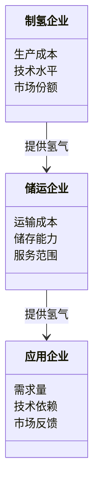

                 


# 价值投资中的氢能源产业链分析

## 关键词：
价值投资，氢能源，产业链分析，财务模型，投资策略

## 摘要：
本文深入分析氢能源产业链的各个关键环节，结合价值投资的核心理念，探讨如何在氢能源产业中发现投资机会。通过建立经济模型和分析产业链协同效应，为投资者提供科学的投资决策支持。

---

## 第1章: 氢能源的基本概念与产业链结构

### 1.1 氢能源的定义与特点

#### 1.1.1 氢能的定义与基本属性
氢能是一种通过氢气（H₂）燃烧释放能量的清洁能源，其化学能可以转化为热能、电能或其他形式的能量。氢能的优势在于零碳排放和高效性，是实现能源结构转型的重要途径。

#### 1.1.2 氢能的优势与挑战
氢能在环保性和可持续性方面具有显著优势，但同时也面临制备成本高、储存难度大、运输效率低等挑战。

#### 1.1.3 氢能在全球能源结构中的地位
随着全球对可再生能源的需求增加，氢能在能源结构中的地位日益重要，被认为是实现碳中和目标的关键技术之一。

### 1.2 氢能源产业链的构成

#### 1.2.1 制氢技术与成本分析
制氢是氢能源产业链的起点，主要分为灰氢（传统化石燃料制氢）、蓝氢（碳捕获制氢）和绿氢（可再生能源电解水制氢）。制氢技术的选择直接影响成本和环境影响。

| 制氢技术 | 成本（$/kg） | 环境影响 |
|----------|--------------|----------|
| 灰氢     | 0.5-1.0       | 高       |
| 蓝氢     | 1.0-1.5       | 中       |
| 绿氢     | 1.5-2.5       | 低       |

#### 1.2.2 储氢与运氢的解决方案
储氢技术包括高压气态储氢、低温液态储氢和固态储氢，其中液态储氢技术更为成熟，但成本较高。运氢则主要依赖于液氢罐车和管道运输，运输效率和成本是关键因素。

#### 1.2.3 加氢站的建设与运营模式
加氢站是氢能源应用的关键基础设施，其建设和运营成本较高，但随着氢燃料电池汽车的推广，加氢站的需求将显著增加。

#### 1.2.4 氢能应用的下游场景
下游应用包括氢燃料电池汽车、工业生产和 residential uses。其中，交通领域是当前氢能源应用的主要市场。

---

## 第2章: 价值投资的基本原理与氢能源投资价值分析

### 2.1 价值投资的核心理念

#### 2.1.1 价值投资的定义与核心要素
价值投资强调长期视角和基本面分析，关注企业的内在价值和竞争优势。在氢能源领域，需要评估企业的技术优势、成本控制和市场前景。

#### 2.1.2 价值投资与氢能源产业的契合点
氢能源产业处于快速发展阶段，具有较高的成长性和投资潜力。价值投资者可以通过分析产业链各环节的经济模型，寻找被低估的投资机会。

#### 2.1.3 氢能源产业链中的投资机会
制氢技术的进步、储氢技术的突破、加氢站的建设和燃料电池技术的升级，都是价值投资者关注的重点。

### 2.2 氢能源产业链的价值评估模型

#### 2.2.1 产业链各环节的价值分布
产业链各环节的价值取决于技术成熟度、成本和市场需求。例如，制氢环节的技术创新可能带来更高的利润，而储氢环节的成本降低则能提升企业的竞争力。

#### 2.2.2 投资价值的关键影响因素
- 市场需求：氢能源的需求增长速度。
- 技术创新：制氢和储氢技术的突破。
- 政策支持：政府对氢能源产业的补贴和激励政策。

#### 2.2.3 产业链协同效应的评估方法
通过分析产业链上下游的协同效应，评估企业的综合竞争力和抗风险能力。例如，一家拥有制氢技术和加氢站网络的企业可能具有更强的市场优势。

---

## 第3章: 氢能产业链的实体关系分析

### 3.1 产业链各环节的实体关系

#### 3.1.1 上游制氢企业的角色与责任
制氢企业是产业链的核心，负责氢气的生产。其盈利能力和成本控制直接影响整个产业链的价值。

#### 3.1.2 中游储运企业的功能与作用
储运企业负责氢气的储存和运输，确保氢气能够高效、安全地输送到下游应用环节。

#### 3.1.3 下游应用企业的需求与影响
下游应用企业包括燃料电池制造商和氢能源汽车企业，其需求驱动整个产业链的发展。

### 3.2 氢能产业链的ER实体关系图

```mermaid
erDiagram
    actor 投资者 {
        <属性> 投资金额
        <属性> 投资期限
        <属性> 投资收益预期
    }
    actor 制氢企业 {
        <属性> 生产成本
        <属性> 技术水平
        <属性> 市场份额
    }
    actor 储运企业 {
        <属性> 运输成本
        <属性> 储存能力
        <属性> 服务范围
    }
    actor 应用企业 {
        <属性> 需求量
        <属性> 技术依赖
        <属性> 市场反馈
    }
    制氢企业 --> 储运企业 : 提供氢气
    储运企业 --> 应用企业 : 提供氢气
    投资者 --> 制氢企业 : 投资
    投资者 --> 储运企业 : 投资
    投资者 --> 应用企业 : 投资
```

---

## 第4章: 氢能源产业链的价值评估算法

### 4.1 价值评估模型的数学公式

#### 4.1.1 净现值（NPV）计算
$$ NPV = \sum_{t=0}^{n} \frac{C_t}{(1+r)^t} $$
其中，\( C_t \) 是第 \( t \) 年的现金流，\( r \) 是贴现率。

#### 4.1.2 内部收益率（IRR）计算
IRR是使净现值为零的贴现率，可以通过试算法或公式计算。

### 4.2 算法实现

```python
def calculate_npv(cash_flows, discount_rate):
    npv = sum(c / (1 + discount_rate) ** t for t, c in enumerate(cash_flows))
    return npv

cash_flows = [ -100, 50, 60, 70 ]  # 初始投资和后续现金流
discount_rate = 0.10
npv = calculate_npv(cash_flows, discount_rate)
print(f"净现值为：{npv}")
```

---

## 第5章: 系统分析与架构设计方案

### 5.1 系统功能设计

#### 5.1.1 领域模型


### 5.2 系统架构设计


---

## 第6章: 项目实战

### 6.1 案例分析：某氢能源公司的价值评估

#### 6.1.1 财务状况分析
分析某氢能源公司的收入、成本和利润情况，评估其财务健康状况。

#### 6.1.2 投资价值评估
使用NPV和IRR模型，评估该公司的投资价值。

### 6.2 代码实现

```python
import numpy as np

def calculate_irr(cash_flows):
    try:
        return np.irr(cash_flows)
    except:
        return 0.0

cash_flows = [ -100, 50, 60, 70 ]
irr = calculate_irr(cash_flows)
print(f"内部收益率为：{irr}")
```

---

## 第7章: 最佳实践与总结

### 7.1 投资关键点
- 关注制氢技术的突破和成本下降。
- 评估储运企业的服务能力和成本优势。
- 研究下游应用企业的市场需求和技术创新。

### 7.2 小结
氢能源产业链的投资机会丰富，但需要结合技术、成本和市场需求进行综合评估。价值投资者应注重长期视角和基本面分析，寻找具有竞争优势的企业。

### 7.3 注意事项
- 谨慎评估政策风险和市场波动。
- 关注企业的财务健康状况和管理能力。
- 定期跟踪企业的经营状况和行业动态。

### 7.4 拓展阅读
建议阅读相关行业报告和学术论文，深入了解氢能源技术的发展和市场动态。

---

通过以上分析，我们可以看到氢能源产业链的投资机会和挑战。价值投资者需要结合技术和市场因素，做出明智的投资决策。

