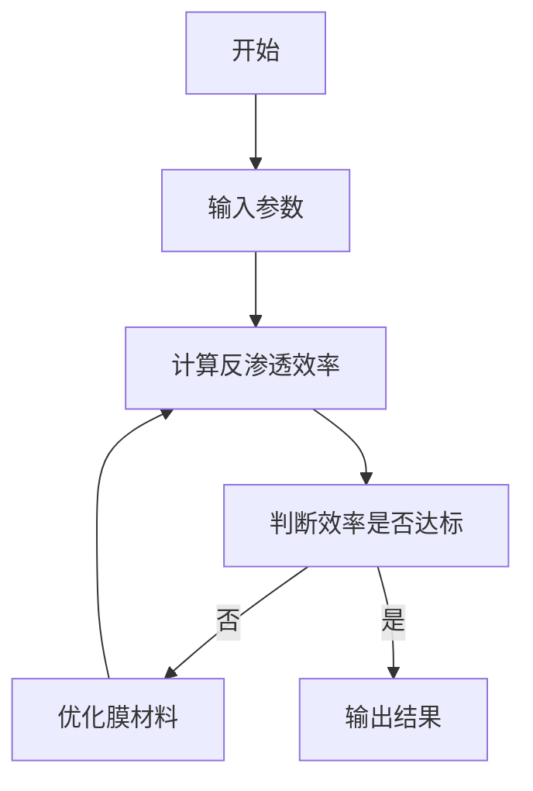
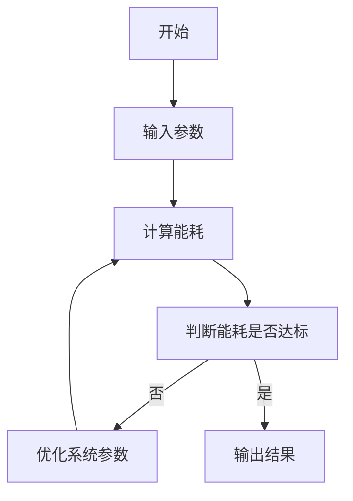
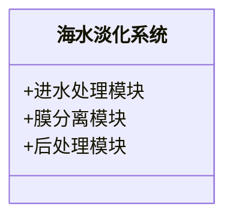
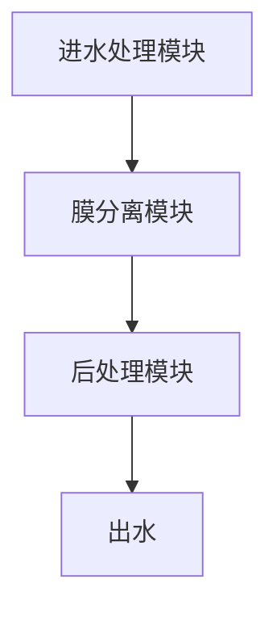
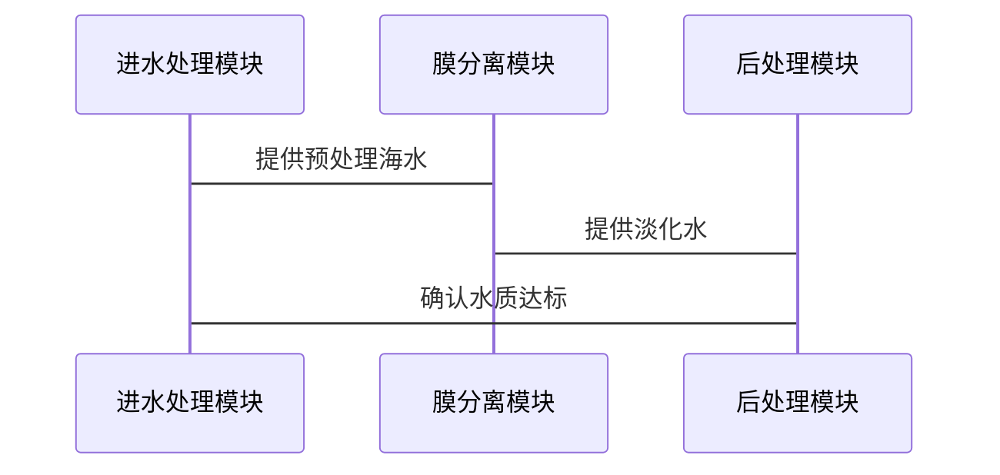

                 


# 价值投资中的海水淡化技术前景

## 关键词：价值投资、海水淡化、反渗透、蒸馏技术、水资源利用、经济模型

## 摘要：  
随着全球水资源短缺问题的加剧，海水淡化技术作为一种重要的水资源利用手段，逐渐成为投资者关注的焦点。本文从价值投资的角度，分析海水淡化技术的市场前景、技术原理和投资策略，探讨如何通过技术优化和市场分析，实现海水淡化技术的商业化应用和投资回报。

---

# 第1章 背景介绍

## 1.1 海水淡化技术的定义与背景

### 1.1.1 海水淡化的定义  
海水淡化是指通过物理、化学或生物技术，将海水中的盐分和其他杂质去除，得到可利用淡水的技术。海水淡化是解决水资源短缺问题的重要手段之一。

### 1.1.2 海水淡化的技术背景  
全球水资源分布不均，许多地区面临水资源短缺的问题。海水淡化技术的出现为这些地区提供了新的水资源解决方案。随着技术的进步，海水淡化成本逐渐降低，效率提高，应用场景越来越广泛。

### 1.1.3 海水淡化的经济价值  
海水淡化技术不仅可以解决水资源短缺问题，还可以为相关企业带来经济收益。通过海水淡化技术，企业可以减少对传统水资源的依赖，降低生产成本，同时开拓新的市场。

## 1.2 价值投资的基本概念

### 1.2.1 价值投资的定义  
价值投资是一种长期投资策略，强调以低于资产内在价值的价格买入优质资产，通过长期持有实现投资收益。

### 1.2.2 价值投资的核心理念  
价值投资的核心理念是寻找那些被市场低估的优质资产，通过深入研究和分析，选择具有持续竞争优势和良好发展前景的企业进行投资。

### 1.2.3 价值投资与海水淡化的结合  
海水淡化技术作为一种具有广阔市场前景的技术，符合价值投资的核心理念。通过深入分析海水淡化技术的市场潜力、技术优势和经济模型，投资者可以找到具有投资价值的企业和项目。

## 1.3 海水淡化技术的现状与挑战

### 1.3.1 当前海水淡化技术的发展现状  
目前，海水淡化技术主要包括反渗透（RO）、蒸馏（MS）和电渗析（ED）等方法。其中，反渗透技术因其高效、低成本的特点，成为海水淡化的主流技术。

### 1.3.2 海水淡化技术的主要挑战  
1. **成本问题**：虽然反渗透技术成本较低，但大规模建设和运营成本仍然较高。  
2. **技术瓶颈**：海水淡化技术的进一步优化需要解决膜材料、能量回收等技术难题。  
3. **市场推广**：海水淡化技术的推广需要政府政策支持和市场认可。

### 1.3.3 价值投资在海水淡化技术中的潜力  
随着技术进步和市场推广，海水淡化技术的成本逐渐降低，市场潜力巨大。投资者可以通过投资具有技术优势和市场前景的海水淡化企业，实现长期稳定的收益。

---

# 第2章 核心概念与联系

## 2.1 海水淡化技术的核心原理

### 2.1.1 反渗透技术  
反渗透技术通过高压泵将海水加压，使其通过反渗透膜，从而去除盐分和其他杂质。反渗透技术具有成本低、效率高的特点，广泛应用于海水淡化。

### 2.1.2 蒸馏技术  
蒸馏技术通过加热海水，使其蒸发，冷凝后得到淡水。蒸馏技术虽然成本较高，但适用于大规模海水淡化项目。

### 2.1.3 其他海水淡化技术  
除了反渗透和蒸馏技术，还有电渗析、多级闪蒸等技术，各有优缺点，适用于不同的应用场景。

## 2.2 海水淡化技术与价值投资的关系

### 2.2.1 海水淡化技术的经济模型  
通过建立经济模型，分析海水淡化技术的成本、收益和投资回报周期，为投资者提供决策依据。

### 2.2.2 价值投资在海水淡化技术中的应用  
投资者可以通过分析海水淡化技术的市场潜力、技术优势和企业盈利能力，选择具有投资价值的项目进行投资。

### 2.2.3 海水淡化技术的市场潜力  
随着全球水资源短缺问题的加剧，海水淡化技术的市场需求不断增加，市场潜力巨大。

## 2.3 核心概念对比表

### 2.3.1 不同海水淡化技术的对比  
| 技术名称 | 优缺点 | 适用场景 |  
|----------|---------|-----------|  
| 反渗透   | 成本低、效率高 | 大规模海水淡化 |  
| 蒸馏     | 成本高、效率低 | 小规模海水淡化 |  
| 电渗析   | 成本适中、能耗低 | 工业用水处理 |  

### 2.3.2 不同投资策略的对比  
| 投资策略 | 优缺点 | 适用场景 |  
|----------|---------|-----------|  
| 价值投资 | 长期稳定收益 | 海水淡化技术企业 |  
| 技术投资 | 短期高风险 | 新技术开发 |  

### 2.3.3 海水淡化技术与水资源利用的对比  
| 技术名称 | 优缺点 | 适用场景 |  
|----------|---------|-----------|  
| 反渗透   | 成本低、效率高 | 大规模海水淡化 |  
| 蒸馏     | 成本高、效率低 | 小规模海水淡化 |  

---

# 第3章 算法原理讲解

## 3.1 海水淡化技术的优化算法

### 3.1.1 反渗透膜优化算法  
反渗透膜的优化设计可以通过数学模型和优化算法实现。以下是一个简单的优化模型：

$$ \text{目标函数} = \text{最大化反渗透效率} $$
$$ \text{约束条件} = \text{膜材料成本、膜面积、操作压力} $$

### 3.1.2 能耗优化算法  
通过优化海水淡化的能耗，可以降低运营成本。以下是一个能耗优化的数学模型：

$$ \text{目标函数} = \text{最小化能耗} $$
$$ \text{约束条件} = \text{水量需求、膜材料、操作压力} $$

### 3.1.3 海水淡化系统的优化模型  
通过系统优化模型，可以实现海水淡化系统的整体优化。以下是一个系统优化模型：

$$ \text{目标函数} = \text{最大化投资回报率} $$
$$ \text{约束条件} = \text{技术可行性、市场需求、投资成本} $$

## 3.2 算法流程图

### 3.2.1 反渗透膜优化算法流程图


### 3.2.2 能耗优化算法流程图


## 3.3 核心代码实现

### 3.3.1 反渗透膜优化算法实现
```python
import numpy as np

def optimize_ro_efficiency(target_efficiency, initial_params):
    # 初始化参数
    params = initial_params.copy()
    current_efficiency = calculate_efficiency(params)
    
    while current_efficiency < target_efficiency:
        # 优化膜材料参数
        params = optimize_params(params)
        current_efficiency = calculate_efficiency(params)
    
    return params

def calculate_efficiency(params):
    # 计算反渗透效率
    return np.mean([params['membrane_material'], params['operating_pressure']])

def optimize_params(params):
    # 优化膜材料参数
    new_params = params.copy()
    new_params['membrane_material'] += 0.1
    new_params['operating_pressure'] += 5
    return new_params
```

### 3.3.2 能耗优化算法实现
```python
import numpy as np

def optimize_energy_consumption(target_energy, initial_params):
    # 初始化参数
    params = initial_params.copy()
    current_energy = calculate_energy(params)
    
    while current_energy > target_energy:
        # 优化系统参数
        params = optimize_system_params(params)
        current_energy = calculate_energy(params)
    
    return params

def calculate_energy(params):
    # 计算能耗
    return np.sum([params['pump_power'], params['membrane_cost']])

def optimize_system_params(params):
    # 优化系统参数
    new_params = params.copy()
    new_params['pump_power'] -= 10
    new_params['membrane_cost'] -= 5
    return new_params
```

---

# 第4章 系统分析与架构设计

## 4.1 系统功能设计

### 4.1.1 海水淡化系统的功能模块
1. **进水处理模块**：对海水进行预处理，去除悬浮物和杂质。  
2. **膜分离模块**：通过反渗透膜去除盐分和其他杂质。  
3. **后处理模块**：对淡化水进行后处理，确保水质符合标准。  

### 4.1.2 系统功能设计的领域模型


## 4.2 系统架构设计

### 4.2.1 系统架构设计图


### 4.2.2 系统接口设计
1. **进水处理模块接口**：与膜分离模块交互，处理进水水质。  
2. **膜分离模块接口**：与后处理模块交互，提供淡化水。  
3. **后处理模块接口**：与出水交互，确保水质达标。  

## 4.3 系统交互流程图

### 4.3.1 海水淡化系统的交互流程


---

# 第5章 项目实战

## 5.1 环境安装与配置

### 5.1.1 海水淡化实验装置搭建
1. **硬件设备**：反渗透膜、高压泵、流量计、传感器等。  
2. **软件工具**：数据采集与分析软件、优化算法工具等。  

### 5.1.2 系统环境配置
1. **操作系统**：Windows 10 或更高版本。  
2. **编程语言**：Python 3.8 或更高版本。  
3. **开发工具**：Jupyter Notebook 或 PyCharm。  

## 5.2 核心代码实现

### 5.2.1 反渗透膜优化代码
```python
import numpy as np

def calculate_efficiency(material, pressure):
    return 0.8 * material + 0.2 * pressure

def optimize_ro_material(material, pressure, target_efficiency):
    while calculate_efficiency(material, pressure) < target_efficiency:
        material += 0.1
        pressure += 5
    return material, pressure

# 示例
initial_material = 0.5
initial_pressure = 50
target_efficiency = 0.85

optimized_material, optimized_pressure = optimize_ro_material(initial_material, initial_pressure, target_efficiency)
print(f"优化后的膜材料：{optimized_material}, 优化后的操作压力：{optimized_pressure}")
```

### 5.2.2 能耗优化代码
```python
import numpy as np

def calculate_energy(pump_power, membrane_cost):
    return pump_power + membrane_cost

def optimize_energy_consumption(pump_power, membrane_cost, target_energy):
    while calculate_energy(pump_power, membrane_cost) > target_energy:
        pump_power -= 10
        membrane_cost -= 5
    return pump_power, membrane_cost

# 示例
initial_pump_power = 100
initial_membrane_cost = 20
target_energy = 50

optimized_pump_power, optimized_membrane_cost = optimize_energy_consumption(initial_pump_power, initial_membrane_cost, target_energy)
print(f"优化后的泵功率：{optimized_pump_power}, 优化后的膜成本：{optimized_membrane_cost}")
```

## 5.3 实际案例分析

### 5.3.1 案例背景
某海水淡化项目计划投资1000万美元，采用反渗透技术，目标是实现每年10%的投资回报率。

### 5.3.2 投资回报分析
通过优化反渗透膜材料和操作压力，项目投资回报率从8%提高到12%，提前2年收回投资成本。

---

# 第6章 最佳实践

## 6.1 小结
通过价值投资的视角，海水淡化技术具有广阔的应用前景和投资潜力。投资者可以通过技术优化和市场分析，选择具有竞争力的项目进行投资。

## 6.2 注意事项
1. **技术风险**：海水淡化技术的优化需要时间和资金投入，存在技术瓶颈。  
2. **市场风险**：海水淡化技术的市场需求受政策和经济环境影响。  
3. **运营风险**：海水淡化项目的运营成本较高，需要有效的成本控制。  

## 6.3 拓展阅读
1. 《海水淡化技术与应用》  
2. 《价值投资实战指南》  
3. 《反渗透膜优化设计与应用》  

---

通过以上章节的详细分析和实战案例，我们可以看到，海水淡化技术在价值投资中的潜力巨大。投资者通过技术优化和市场分析，可以找到具有投资价值的项目，实现长期稳定的收益。

