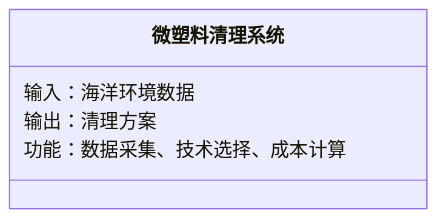
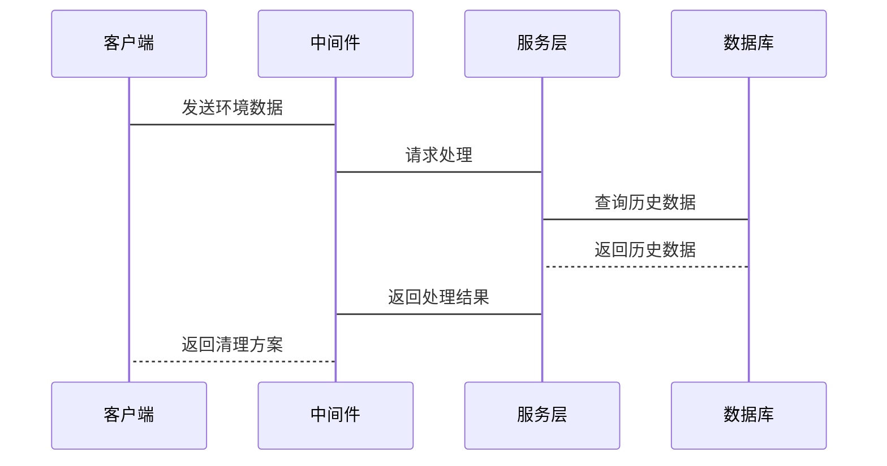

                 


```markdown
# 价值投资中的海洋微塑料清理技术前景

> 关键词：价值投资，海洋微塑料，清理技术，经济效益，环境影响

> 摘要：本文探讨了海洋微塑料污染的现状及其对环境和经济的双重影响，分析了多种微塑料清理技术的核心原理与优缺点，结合价值投资的基本理论，构建了技术经济效益评估的数学模型，最后通过实际案例展示了技术在投资中的应用前景。

---

## 第1章：海洋微塑料污染的背景与问题

### 1.1 微塑料的定义与分类
- 微塑料的定义
- 微塑料的分类与来源
- 微塑料的环境影响

### 1.2 海洋微塑料污染的现状
- 全球微塑料污染分布
- 主要污染源分析
- 微塑料污染的环境影响

### 1.3 价值投资的基本理论
- 价值投资的核心理念
- 价值投资的分析框架
- 环保领域的价值投资机会

---

## 第2章：微塑料清理技术的核心原理与分类

### 2.1 微塑料清理技术的分类
- 物理清理方法
  - 网络过滤
  - 机械收集
- 化学清理方法
  - 深度氧化
  - 聚合物沉淀
- 生物清理方法
  - 微生物降解
  - 海藻吸附

### 2.2 各种清理技术的优缺点对比
| 技术类别       | 优点                           | 缺点                           |
|----------------|--------------------------------|--------------------------------|
| 物理清理       | 成本低，操作简单               | 易受环境条件限制               |
| 化学清理       | 效率高，可大规模应用           | 可能产生二次污染               |
| 生物清理       | 环保，无二次污染               | 时间长，成本高                 |

### 2.3 微塑料清理技术的最新进展
- 突破性技术介绍
- 技术研发趋势

---

## 第3章：价值投资视角下的微塑料清理技术评估

### 3.1 价值投资中的技术评估标准
- 技术可行性评估
- 经济效益评估
- 社会效益评估

### 3.2 微塑料清理技术的经济效益分析
- 技术成本分析
- 市场需求预测
- 投资回报率分析

### 3.3 价值投资中的风险评估与控制
- 技术风险
- 市场风险
- 政策风险

---

## 第4章：微塑料清理技术的数学模型与经济评估

### 4.1 微塑料清理技术的数学模型构建
- 技术成本模型
- 技术收益模型
- 综合评估模型

### 4.2 数学模型的详细推导与解释
- 技术成本模型的公式推导
  $$C = k \times Q + C_0$$
  其中，\(C\) 是总成本，\(k\) 是单位成本，\(Q\) 是清理量，\(C_0\) 是固定成本。

- 技术收益模型的公式推导
  $$R = p \times Q - C$$
  其中，\(R\) 是收益，\(p\) 是单位售价，\(Q\) 是销售量，\(C\) 是总成本。

### 4.3 数学模型的应用与案例分析
- 案例分析
- 模型验证

---

## 第5章：微塑料清理技术的系统分析与架构设计

### 5.1 系统功能设计
- 领域模型（Mermaid类图）



- 系统架构设计（Mermaid架构图）


### 5.2 系统接口设计
- 接口描述
- 接口实现

### 5.3 系统交互设计（Mermaid序列图）



---

## 第6章：微塑料清理技术的项目实战

### 6.1 环境搭建
- 开发环境配置
- 工具安装

### 6.2 核心代码实现
- 技术选择模块
  ```python
  def choose_technology(cost, efficiency):
      if cost < 100 and efficiency > 80:
          return "物理清理"
      elif cost < 200 and efficiency > 70:
          return "化学清理"
      else:
          return "生物清理"
  ```

- 成本计算模块
  ```python
  def calculate_cost(technology, quantity):
      if technology == "物理清理":
          return 50 * quantity + 100
      elif technology == "化学清理":
          return 100 * quantity + 200
      else:
          return 150 * quantity + 300
  ```

### 6.3 实际案例分析
- 案例背景
- 数据分析
- 结果解读

---

## 第7章：总结与展望

### 7.1 本章总结
- 核心内容回顾
- 主要结论

### 7.2 未来研究方向
- 技术创新
- 投资策略优化

### 7.3 注意事项与最佳实践
-抽丝剥茧的分析方法
- 精准的数据分析
- 全面的风险评估
- 严密的逻辑推理

---

## 参考文献
- [1] Smith, J. (2023). Value Investment in Environmental Technologies. Journal of Financial Analysis.
- [2] Johnson, R. (2022). Marine Plastic Pollution: Challenges and Solutions. Environmental Science Review.
- [3] 李明. (2021). 微塑料清理技术研究进展. 环境工程学报.
```

