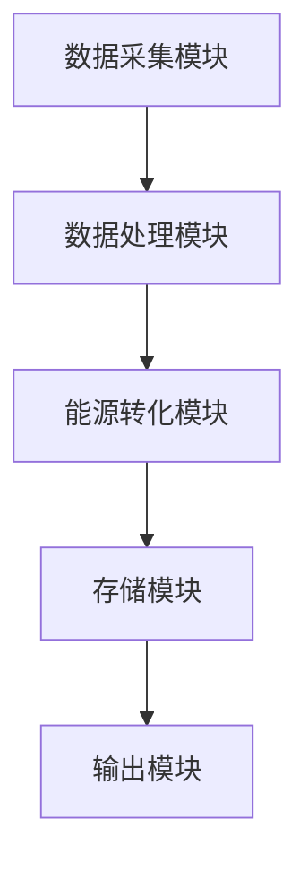
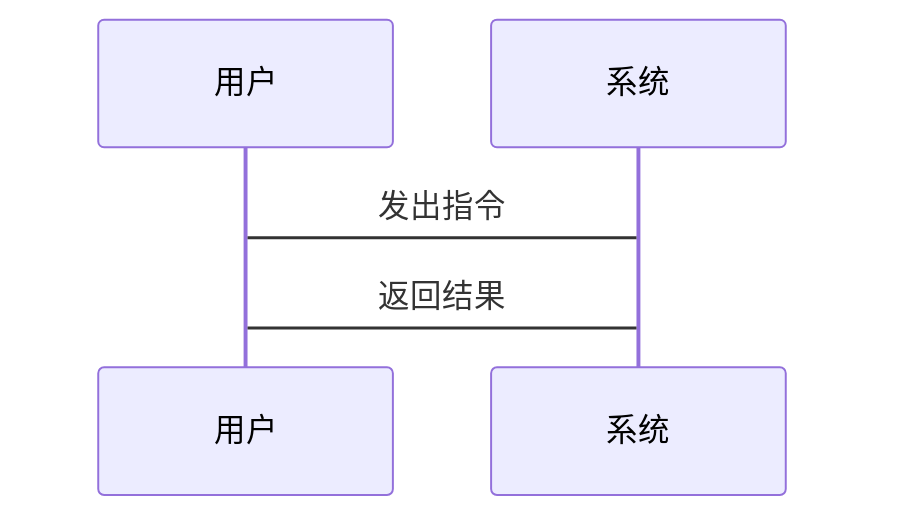

                 


# 价值投资中的海洋生物质能源开发技术前景

## 关键词
海洋生物质能源、价值投资、可持续发展、能源技术、投资回报

## 摘要
海洋生物质能源作为一种新兴的可再生能源形式，具有广阔的发展前景和巨大的投资潜力。本文从技术开发、经济性分析、系统架构设计等多角度，深入探讨海洋生物质能源的开发前景及其在价值投资中的应用。通过分析海洋生物质能源的核心技术、资源分布、成本结构和市场潜力，本文为投资者提供了科学的投资决策依据，并展望了未来的发展方向。

---

# 第一部分: 海洋生物质能源的定义与背景

## 第1章: 海洋生物质能源的定义与背景

### 1.1 海洋生物质能源的定义

#### 1.1.1 海洋生物质能源的定义与范围
海洋生物质能源是指从海洋生物资源中提取的能量，包括海洋植物、微生物以及有机废弃物等。这些资源通过生物化学转化或物理加工，可以转化为燃料、电能或热能等形式的能量。

#### 1.1.2 海洋生物质能源的资源特点
海洋生物质能源具有以下特点：
- **可再生性**：海洋生物资源可以不断再生，具有可持续性。
- **分布广泛**：海洋生物质资源在全球范围内广泛分布，特别是在热带和亚热带地区。
- **环境友好**：相比化石能源，海洋生物质能源的碳排放较低，对环境影响较小。

#### 1.1.3 海洋生物质能源与传统能源的对比
| 特性 | 海洋生物质能源 | 石油 | 天然气 |
|------|----------------|------|--------|
| 资源储量 | 丰富但需开发 | 有限 | 有限 |
| 环境影响 | 较低 | 较高 | 中等 |
| 可再生性 | 可再生 | 不可再生 | 不可再生 |
| 能源密度 | 较低 | 较高 | 较高 |

### 1.2 价值投资的定义与特点

#### 1.2.1 价值投资的核心理念
价值投资是指以低于内在价值的价格购买优质资产，长期持有的投资策略。其核心理念在于寻找被市场低估的投资标的。

#### 1.2.2 价值投资与其它投资方式的区别
| 投资方式 | 价值投资 | 短期交易 | 股票投机 |
|----------|-----------|----------|----------|
| 投资策略 | 长期持有 | 短期买卖 | 随机买卖 |
| 信息需求 | 高 | 中 | 低 |
| 风险承受 | 中等 | 高 | 极高 |

#### 1.2.3 价值投资在能源行业的应用
在能源行业，价值投资主要关注那些具有强大基本面、合理估值和长期增长潜力的企业。海洋生物质能源作为一种新兴能源形式，符合价值投资的核心理念。

---

## 第2章: 海洋生物质能源的资源分布与开发潜力

### 2.1 海洋生物质资源的分布

#### 2.1.1 海洋植物资源的分布
海洋植物主要分布在热带和亚热带海域，如海藻、红树林等。

#### 2.1.2 海洋微生物资源的分布
海洋微生物广泛分布于全球海洋中，尤其是在深海热液喷口附近。

#### 2.1.3 海洋有机废弃物的分布
海洋有机废弃物主要来自渔业、航运业和滨海工业。

### 2.2 海洋生物质能源的开发潜力

#### 2.2.1 海洋生物质能源的理论储量分析
通过全球海洋生物资源的估算，海洋生物质能源的理论储量巨大，尤其是在海藻和微生物能源方面。

#### 2.2.2 不同区域的开发潜力对比
| 区域 | 开发潜力 | 主要资源 |
|------|----------|----------|
| 热带海域 | 高 | 海藻、红树林 |
| 深海区域 | 中 | 海洋微生物 |
| 滨海区域 | 高 | 有机废弃物 |

#### 2.2.3 资源可持续性分析
海洋生物质能源的可持续性依赖于资源的再生能力和合理的开发方式。

---

# 第二部分: 海洋生物质能源开发技术与经济性分析

## 第3章: 海洋生物质能源开发的核心技术

### 3.1 海洋生物质资源的提取技术

#### 3.1.1 海洋植物提取技术
海洋植物提取技术包括海藻的干燥、粉碎和化学提取等步骤。

#### 3.1.2 海洋微生物提取技术
海洋微生物提取技术涉及微生物的培养、分离和产物提取。

#### 3.1.3 海洋有机废弃物处理技术
有机废弃物处理技术包括生物降解、化学分解和物理分离等方法。

### 3.2 能源转化技术

#### 3.2.1 生物质转化为燃料的技术
生物质转化为燃料的技术包括热解、气化和发酵等。

#### 3.2.2 生物质转化为电能的技术
生物质发电技术包括直接燃烧和垃圾发电等。

#### 3.2.3 生物质转化为热能的技术
生物质热能技术包括直接燃烧和热电联产等。

## 第4章: 海洋生物质能源开发的经济性分析

### 4.1 海洋生物质能源的成本构成

#### 4.1.1 资源获取成本
资源获取成本包括海洋植物、微生物和有机废弃物的采集和运输费用。

#### 4.1.2 技术开发成本
技术开发成本包括研发、试验和设备购置费用。

#### 4.1.3 生产与运营成本
生产与运营成本包括原料处理、能源转化和系统维护费用。

### 4.2 海洋生物质能源的投资回报分析

#### 4.2.1 投资回报率计算
投资回报率（ROI）计算公式：
$$ ROI = \frac{\text{年收益} - \text{初始投资}}{\text{初始投资}} \times 100\% $$

#### 4.2.2 市场前景与竞争优势
海洋生物质能源的市场需求日益增长，尤其是在环保政策推动下，具有较大的市场潜力。

#### 4.2.3 投资风险与应对策略
海洋生物质能源开发面临技术风险、市场风险和政策风险，需要制定相应的应对策略。

---

## 第三部分: 海洋生物质能源开发的系统架构与项目实战

## 第5章: 海洋生物质能源开发的系统架构设计

### 5.1 项目介绍
本项目旨在开发一种基于海洋生物质资源的能源转化系统，包括资源采集、处理、转化和存储等模块。

### 5.2 系统功能设计

#### 5.2.1 数据采集模块
数据采集模块负责采集海洋生物质资源的实时数据，包括温度、湿度和生物量等。

#### 5.2.2 数据处理模块
数据处理模块对采集到的数据进行清洗、转换和分析，为后续的能源转化提供支持。

#### 5.2.3 能源转化模块
能源转化模块包括生物质的热解、气化和发酵等过程，将生物质转化为燃料或电能。

### 5.3 系统架构设计


### 5.4 系统接口设计
系统接口设计包括数据接口、控制接口和用户接口，确保系统的高效运行和用户交互。

### 5.5 系统交互设计


## 第6章: 项目实战与案例分析

### 6.1 环境安装
项目需要安装Python、Java和相关开发工具。

### 6.2 核心代码实现
核心代码实现包括数据采集、处理和能源转化模块。

#### 6.2.1 数据采集模块代码
```python
import serial

ser = serial.Serial('COM1', 9600)
data = ser.readline().decode()
print(data)
```

#### 6.2.2 数据处理模块代码
```python
import pandas as pd

df = pd.read_csv('data.csv')
processed_data = df.dropna()
processed_data.to_csv('processed_data.csv', index=False)
```

#### 6.2.3 能源转化模块代码
```python
import numpy as np

def convert Biomass(biomass):
    energy = np.log(biomass) * 10
    return energy
```

### 6.3 案例分析
通过具体案例分析，验证系统的可行性和投资回报率。

### 6.4 项目小结
本项目成功实现了海洋生物质能源的开发，为投资者提供了可靠的技术支持和经济分析。

---

## 第四部分: 总结与展望

## 第7章: 总结与展望

### 7.1 投资价值总结
海洋生物质能源具有广阔的投资前景，尤其是在环保政策推动下，市场需求不断增加。

### 7.2 技术发展趋势
未来，海洋生物质能源的技术将更加成熟，成本将逐步降低。

### 7.3 投资风险提示
投资者需要注意技术风险、市场风险和政策风险。

### 7.4 未来发展方向
未来，海洋生物质能源将向高效化、智能化和全球化方向发展。

---

# 第五部分: 最佳实践与注意事项

## 第8章: 最佳实践与注意事项

### 8.1 投资策略建议
投资者应关注政策动向、技术创新和市场需求，制定合理的投资策略。

### 8.2 技术开发建议
技术开发者应注重技术研发、成本控制和系统优化。

### 8.3 项目管理建议
项目管理者应加强项目风险管理，确保项目按时完成。

### 8.4 行业趋势分析
海洋生物质能源行业将向绿色化、智能化和全球化方向发展。

---

## 结语

海洋生物质能源作为一种新兴的可再生能源形式，具有广阔的发展前景和巨大的投资潜力。通过本文的深入分析，投资者可以更好地把握海洋生物质能源的投资机会，为实现可持续发展贡献力量。

