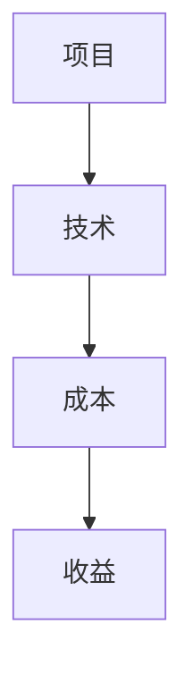
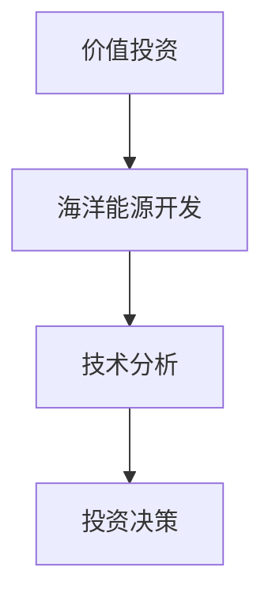
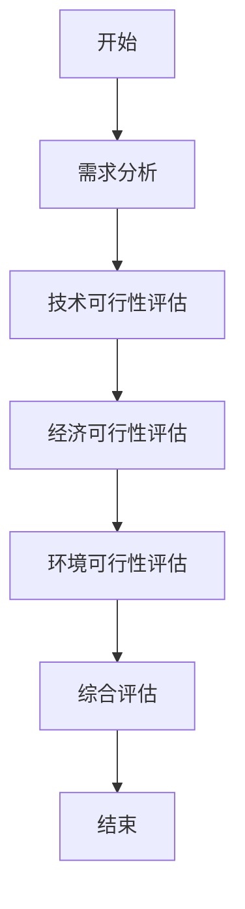
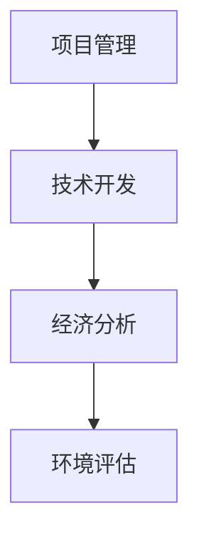
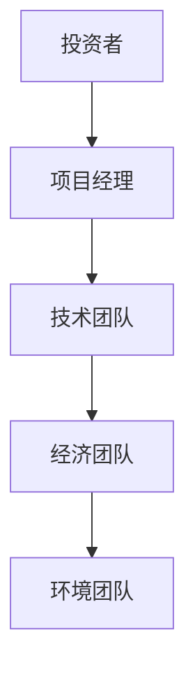

                 


# 价值投资中的海洋能源开发技术前景

## 关键词：价值投资、海洋能源、技术前景、投资分析、技术经济性、投资策略

## 摘要：  
本文探讨了海洋能源开发技术在价值投资中的潜力与前景。通过分析海洋能源开发的技术特点、市场潜力及投资价值，结合实际案例，本文揭示了如何在海洋能源开发领域运用价值投资策略，帮助投资者识别高潜力项目并实现长期收益。文章内容涵盖背景介绍、技术分析、算法原理、系统设计、项目实战及最佳实践，为投资者提供了全面的指导。

---

# 第一部分: 背景介绍

# 第1章: 价值投资与海洋能源开发的背景

## 1.1 价值投资的基本概念

### 1.1.1 价值投资的定义与核心理念

价值投资是一种以基本面分析为基础的投资策略，核心理念是寻找市场低估的资产，通过长期持有实现收益。其核心在于分析企业的内在价值，寻找价格低于内在价值的投资标的。

### 1.1.2 价值投资与传统投资的区别

与传统投资（如趋势投资或投机）不同，价值投资注重企业的财务状况、行业地位和竞争优势，强调长期持有的理念。其主要区别如下：

| **方面** | **价值投资** | **传统投资** |
|----------|--------------|---------------|
| 投资依据 | 公司基本面    | 市场趋势      |
| 投资期限 | 长期          | 短期          |
| 风险控制 | 低风险        | 高风险        |

### 1.1.3 价值投资在能源行业的应用

在能源行业，价值投资关注具有强大竞争优势、稳定现金流和合理估值的企业。海洋能源作为新兴领域，其技术创新和成本优势为价值投资者提供了新的机会。

---

## 1.2 海洋能源开发的背景与现状

### 1.2.1 海洋能源的定义与分类

海洋能源是指从海洋中获取的能量，主要包括潮汐能、波浪能、海流能、温差能和盐差能等。不同类型的海洋能源具有不同的技术特点和开发难度。

### 1.2.2 全球海洋能源开发的现状

全球范围内，海洋能源开发尚处于起步阶段，但随着技术进步和能源需求的增长，其潜力逐渐显现。以下是一些典型国家的开发现状：

| **国家** | **海洋能源开发现状** |
|----------|----------------------|
| 英国     | 全球领先的潮汐能开发 |
| 美国     | 波浪能技术研究领先 |
| 中国     | 温差能和盐差能研究活跃 |

### 1.2.3 海洋能源开发的技术挑战

海洋能源开发面临技术复杂、成本高、环境适应性差等挑战。例如，潮汐能发电设备需要承受巨大的海洋环境压力，而波浪能转换效率较低。

---

## 1.3 价值投资与海洋能源开发的结合

### 1.3.1 海洋能源开发的技术前景

海洋能源开发技术正在快速发展，尤其是潮汐能和海流能领域。例如，英国的潮汐能发电站已实现商业化运营。

### 1.3.2 价值投资在海洋能源开发中的作用

价值投资者可以通过分析海洋能源企业的技术优势、成本结构和市场定位，发现被市场低估的投资机会。

### 1.3.3 未来海洋能源开发的市场潜力

随着全球能源需求的增长和可再生能源的重要性提升，海洋能源市场潜力巨大。预计到2030年，全球海洋能源装机容量将大幅增长。

---

## 1.4 本章小结

本章介绍了价值投资的基本概念、海洋能源开发的背景与现状，以及两者结合的潜力。通过分析，我们可以看到海洋能源开发技术的前景广阔，而价值投资为投资者提供了识别优质项目的机会。

---

# 第二部分: 核心概念与联系

# 第2章: 海洋能源开发技术的核心概念

## 2.1 海洋能源开发技术的原理

### 2.1.1 潮汐能的开发原理

潮汐能通过潮汐水位差驱动涡轮机发电。其核心原理是将海洋潮汐的动能转化为电能。

### 2.1.2 波浪能的开发原理

波浪能利用海洋波浪的运动能量发电，主要通过波能转换装置实现。

### 2.1.3 海流能的开发原理

海流能利用海洋 currents 的能量发电，类似于水力发电，但其流动更为稳定。

## 2.2 海洋能源开发技术的属性特征对比

### 2.2.1 不同海洋能源的技术特点对比表格

| **能源类型** | **技术特点**       | **优劣势分析**             |
|--------------|--------------------|-----------------------------|
| 潮汐能       | 依赖潮汐周期       | 优势：稳定；劣势：受地理位置限制 |
| 波浪能       | 利用波浪运动       | 优势：分布广泛；劣势：效率低 |
| 海流能       | 利用水流能         | 优势：持续性强；劣势：技术复杂 |

### 2.2.2 海洋能源开发技术的优劣势分析

潮汐能和海流能技术较为成熟，但波浪能技术尚处于试验阶段。总体来看，海洋能源开发技术具有较高的技术门槛和研发成本。

## 2.3 海洋能源开发技术的ER实体关系图

### 2.3.1 海洋能源开发项目的实体关系图



### 2.3.2 价值投资与海洋能源开发的关系图



---

## 2.4 本章小结

本章分析了海洋能源开发技术的核心原理和技术特点，通过对比不同能源类型的技术优劣势，帮助投资者更好地理解海洋能源开发的复杂性。

---

# 第三部分: 算法原理讲解

# 第3章: 海洋能源开发项目的可行性评估算法

## 3.1 项目可行性评估的算法流程

### 3.1.1 算法流程图（Mermaid）



### 3.1.2 算法实现代码示例

```python
def project_feasibility_assessment(technical_risk, economic_profit, environmental_impact):
    if technical_risk < 0.3 and economic_profit > 0.5 and environmental_impact < 0.4:
        return "可行"
    else:
        return "不可行"
```

## 3.2 算法原理的数学模型

### 3.2.1 净现值计算公式

$$ NPV = \sum_{t=1}^{n} \frac{CF_t}{(1 + r)^t} $$

其中，$CF_t$ 是第 t 年的现金流，$r$ 是贴现率。

### 3.2.2 内部收益率公式

$$ IRR = r \text{ 使得 } NPV = 0 $$

---

## 3.3 实际案例分析

假设某海洋能源项目的技术风险为 0.2，经济利润为 0.6，环境影响为 0.3，代入算法：

$$ \text{项目可行性} = \text{可行} $$

---

## 3.4 本章小结

本章通过算法流程图和代码示例，展示了如何评估海洋能源开发项目的可行性。通过净现值和内部收益率的计算，投资者可以更好地做出决策。

---

# 第四部分: 系统分析与架构设计

# 第4章: 海洋能源开发项目的系统分析与架构设计

## 4.1 项目管理流程

### 4.1.1 需求分析

明确项目目标、技术需求和经济目标。

### 4.1.2 系统设计

包括功能模块设计和系统架构设计。

## 4.2 系统架构设计

### 4.2.1 系统架构图（Mermaid）



### 4.2.2 系统交互图（Mermaid）



---

## 4.3 本章小结

本章通过系统架构设计和项目管理流程，展示了如何从系统角度分析海洋能源开发项目。

---

# 第五部分: 项目实战

# 第5章: 海洋能源开发项目的价值投资实战

## 5.1 环境安装与技术实现

### 5.1.1 环境安装

安装必要的开发工具和数据集，包括Python、Jupyter Notebook 和相关数据分析库。

### 5.1.2 核心代码实现

```python
def value_investment_analysis(price, intrinsic_value):
    if price < intrinsic_value:
        return "投资机会"
    else:
        return "无投资机会"
```

## 5.2 案例分析与解读

### 5.2.1 案例背景

某潮汐能发电站项目，初始投资为 $100 million，预计年收益为 $20 million，贴现率为 8%。

### 5.2.2 投资分析

计算净现值：

$$ NPV = \frac{20}{(1 + 0.08)^1} + \frac{20}{(1 + 0.08)^2} + \dots + \frac{20}{(1 + 0.08)^n} $$

---

## 5.3 本章小结

本章通过具体案例展示了如何在海洋能源开发项目中应用价值投资策略，帮助投资者识别投资机会。

---

# 第六部分: 最佳实践

# 第6章: 价值投资中的最佳实践

## 6.1 小结

海洋能源开发技术前景广阔，但投资需谨慎。投资者应结合技术分析和市场研究，选择具有竞争优势的项目。

## 6.2 注意事项

- 关注政策支持和市场环境
- 评估技术可行性
- 控制投资风险

## 6.3 扩展阅读

- 《价值投资：原理与实践》
- 《海洋能源开发技术》

---

# 附录: 关键术语解释

- **价值投资**：寻找市场低估资产的投资策略。
- **海洋能源**：从海洋中获取的能量，包括潮汐能、波浪能等。
- **净现值（NPV）**：投资项目的收益现值与成本现值的差额。

---

# 结语

通过本文的分析，我们可以看到海洋能源开发技术的前景广阔，而价值投资为投资者提供了识别优质项目的机会。希望本文的内容能够为投资者提供有价值的参考。

---

