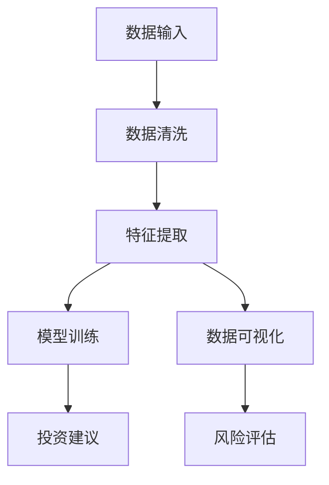

                 


# 《价值投资中的消费升级趋势捕捉》

---

## 关键词：
- 价值投资
- 消费升级
- 投资趋势
- 数据分析
- 消费者行为

---

## 摘要：
本文探讨了在价值投资框架下捕捉消费升级趋势的方法，结合数据分析、消费者行为分析和投资策略，提供了一套系统化的分析框架和实战指导。通过数学模型、算法和系统架构的设计，帮助投资者在消费升级浪潮中识别投资机会，优化投资组合。

---

# 第3章: 价值投资策略与方法

## 3.1 价值投资的核心原理
### 3.1.1 价值投资的基本原理
价值投资的核心在于寻找市场价格低于其内在价值的资产。内在价值是基于公司基本面分析得出的未来现金流的现值。

### 3.1.2 价值投资的三大支柱
1. 安全边际：投资的价格应低于其内在价值。
2. 知识圈：投资者必须在自己熟悉的企业中进行投资。
3. 长期视角：价值投资强调长期持有优质资产。

### 3.1.3 股票估值方法
- 市盈率（P/E）：当前股价与每股收益的比率。
- 市净率（P/B）：当前股价与每股净资产的比率。
- 现金流折现模型（DCF）：通过现金流预测企业未来价值。

---

## 3.2 消费升级趋势下的投资策略
### 3.2.1 高质量消费产品识别
- 品牌力：知名品牌具有更高的市场溢价能力。
- 产品创新：持续创新的产品能够满足消费升级需求。
- 市场份额：龙头企业在消费升级中更具竞争优势。

### 3.2.2 价值投资中的风险管理
- 分散投资：通过投资不同行业和公司的股票降低风险。
- 安全边际：确保买入价格低于内在价值。
- 定期复评：根据市场变化和公司基本面调整投资组合。

---

## 3.3 数据驱动的价值投资方法
### 3.3.1 数据分析工具与方法
- 数据可视化工具：Tableau、Power BI。
- 数据挖掘算法：回归分析、聚类分析。
- 时间序列分析：预测未来消费趋势。

### 3.3.2 企业基本面分析
- 财务指标分析：收入增长、利润率、资产负债率。
- 经营效率分析：ROE（净资产收益率）、ROA（资产回报率）。
- 现金流分析：自由现金流预测企业未来价值。

---

## 3.4 系统架构与投资模型
### 3.4.1 投资模型设计
1. 数据输入：收集消费行业相关数据（如股价、收入、利润）。
2. 数据处理：清洗数据，去除异常值。
3. 模型训练：使用机器学习算法预测消费趋势。
4. 结果输出：生成投资建议和风险评估。

### 3.4.2 投资模型的数学公式
- 现金流折现模型（DCF）：
  $$
  \text{企业价值} = \sum_{t=1}^{n} \frac{\text{现金流}_t}{(1 + r)^t} + \text{终值}
  $$
  其中，\( r \) 是折现率，\( \text{终值} \) 是未来现金流的终值。

### 3.4.3 系统架构图（Mermaid）


---

# 第4章: 结合消费升级趋势的价值投资实战

## 4.1 消费升级趋势下的行业分析
### 4.1.1 食品饮料行业
- 高端化趋势：消费者更倾向于购买高质量、健康食品。
- 品牌集中度提升：龙头企业市场份额扩大。

### 4.1.2 家电行业
- 智能化趋势：智能家居设备需求增长。
- 更新换代需求：家电消费升级推动市场增长。

### 4.1.3 休闲娱乐行业
- 文化消费升级：电影、旅游等休闲娱乐需求增加。
- 健康娱乐：运动健身、养生旅游成为新趋势。

---

## 4.2 价值投资实战步骤
### 4.2.1 确定投资目标
- 明确投资范围：选择消费行业中的龙头公司。
- 设定投资目标：如长期收益目标、风险承受能力。

### 4.2.2 数据分析与筛选
- 数据收集：收集目标公司的财务数据、行业数据。
- 数据分析：使用数据分析工具进行趋势分析。
- 筛选公司：根据估值指标筛选出潜在投资标的。

### 4.2.3 投资组合构建
- 资产配置：根据风险偏好分配资金到不同行业。
- 分散投资：避免过度集中于单一行业或公司。
- 定期调整：根据市场变化和公司基本面调整投资组合。

---

## 4.3 项目实战：消费行业投资组合构建

### 4.3.1 数据收集与处理
- 数据来源：股票价格、财务报表、行业报告。
- 数据清洗：去除缺失值和异常值。
- 特征提取：提取关键指标如市盈率、市净率、ROE。

### 4.3.2 投资组合优化
- 使用Python进行数据分析：
  ```python
  import pandas as pd
  import numpy as np
  from sklearn.cluster import KMeans

  # 示例数据
  data = {'股票': ['A', 'B', 'C', 'D'], 
          'PE': [15, 20, 12, 18], 
          'PB': [2, 3, 1.5, 2.5]}
  df = pd.DataFrame(data)
  ```

- 使用聚类分析筛选低估股票：
  ```python
  features = df[['PE', 'PB']].values
  kmeans = KMeans(n_clusters=3)
  kmeans.fit(features)
  clusters = kmeans.predict(features)
  ```

### 4.3.3 投资组合优化结果
- 根据聚类结果，选择PE和PB均低于行业平均水平的股票。
- 构建投资组合，分散投资风险。

---

## 4.4 实战总结
通过数据分析和模型构建，投资者可以在消费升级趋势中识别优质投资标的，优化投资组合，实现长期稳定收益。

---

# 第5章: 总结与展望

## 5.1 本文总结
本文系统地探讨了价值投资与消费升级趋势的结合，通过数据分析、模型构建和实战案例，为投资者提供了捕捉消费升级机会的方法。

## 5.2 未来展望
- 更多行业分析：进一步扩展到更多消费领域。
- 算法优化：引入更多机器学习算法提高预测精度。
- 实时监控：建立实时监控系统跟踪市场变化。

---

## 5.3 投资小贴士
- **长期视角**：消费升级是一个长期趋势，投资者应保持耐心。
- **分散投资**：避免集中投资，降低风险。
- **持续学习**：关注市场变化，提升分析能力。

---

# 结语

通过本文的系统分析和实战指导，投资者可以在消费升级的趋势中找到优质投资标的，实现价值投资的长期目标。希望本文能为投资者提供有益的参考和启发。

