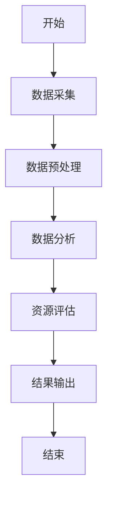

                 


# 第3章: 深海热液生态系统开发的数学模型与算法原理

## 3.1 深海热液生态系统资源潜力评估模型

### 3.1.1 模型的输入变量
深海热液生态系统资源潜力评估模型的输入变量包括以下几个方面：

1. **地理位置**：包括经纬度、海底地形等。
2. **地质特征**：包括岩石类型、断层分布等。
3. **水文条件**：包括水温、盐度、流速等。
4. **生物特征**：包括生物种类、生物密度等。
5. **历史数据**：包括以往的资源勘探数据、开采记录等。

### 3.1.2 模型的输出结果
模型的输出结果包括以下几个方面：

1. **资源潜力评分**：根据输入变量的综合评分，给出资源潜力的等级（如高、中、低）。
2. **资源分布预测**：预测资源在海底的具体分布位置。
3. **资源开发建议**：根据评估结果，提出资源开发的具体建议。

### 3.1.3 模型的数学公式
深海热液生态系统资源潜力评估模型可以表示为一个加权评分模型，如下所示：

$$
P = \sum_{i=1}^{n} w_i \cdot x_i
$$

其中：
- $P$ 是资源潜力评分。
- $w_i$ 是第 $i$ 个变量的权重。
- $x_i$ 是第 $i$ 个变量的数值。

权重 $w_i$ 可以根据专家经验或数据训练得出，通常通过主成分分析（PCA）或层次分析法（AHP）确定。

---

## 3.2 价值投资中的数学模型

### 3.2.1 股票估值公式
股票估值是价值投资的核心内容之一。常用的股票估值公式包括：

1. **市盈率法（P/E）**：
$$
P = E \cdot \frac{1}{P/E}
$$

其中：
- $P$ 是股票价格。
- $E$ 是每股收益（EPS）。
- $P/E$ 是市盈率。

2. **股息折现模型（DDM）**：
$$
P = \frac{D}{k - g}
$$

其中：
- $D$ 是预期股息。
- $k$ 是折现率。
- $g$ 是股息增长率。

### 3.2.2 投资组合优化公式
投资组合优化的目标是在风险可控的前提下，最大化投资回报。常用的优化公式如下：

$$
\text{Maximize } \mu - \lambda \sigma
$$

其中：
- $\mu$ 是投资组合的期望收益。
- $\sigma$ 是投资组合的收益波动率。
- $\lambda$ 是风险厌恶系数。

---

## 3.3 算法原理

### 3.3.1 深海热液生态系统资源勘探算法

深海热液生态系统资源勘探算法是一种基于多源数据融合的算法，用于预测资源分布。以下是该算法的流程：

1. 数据采集：通过卫星遥感、海洋探测器等手段获取深海热液生态系统的多源数据。
2. 数据预处理：对数据进行清洗、归一化处理。
3. 数据分析：利用机器学习算法（如随机森林、支持向量机）进行特征提取和模型训练。
4. 资源评估：根据模型预测结果，生成资源分布图和潜力评分。
5. 结果输出：输出资源勘探报告和开发建议。

流程图如下：



### 3.3.2 价值投资中的算法实现

价值投资中的算法实现主要涉及股票筛选和投资组合优化。以下是具体的实现步骤：

1. 数据获取：获取目标股票的历史价格、财务数据等。
2. 数据清洗：处理缺失值、异常值。
3. 股票筛选：根据估值指标（如市盈率、股息率）筛选出具有投资价值的股票。
4. 投资组合优化：根据风险偏好构建最优投资组合。
5. 结果输出：输出投资组合的预期收益和风险。

代码实现如下：

```python
import pandas as pd
import numpy as np
from sklearn.ensemble import RandomForestClassifier

# 数据获取与清洗
data = pd.read_csv('stocks.csv')
data.dropna(inplace=True)

# 股票筛选
def value_stock(data, p_e, d_y):
    data['value_score'] = (data['PE'] < p_e) & (data['Div_Yield'] > d_y)
    return data[data['value_score']]

selected_stocks = value_stock(data, 15, 2)

# 投资组合优化
def optimize_portfolio(selected_stocks, risk_aversion=0.05):
    returns = selected_stocks['Return'].values
    weights = np.random.dirichlet(np.ones(len(returns)), 1)
    portfolio_return = np.dot(weights, returns)
    portfolio_risk = np.sqrt(np.dot(weights, np.dot(np.diag(returns), weights.T)))
    value = portfolio_return - risk_aversion * portfolio_risk
    return value.max()

max_value = optimize_portfolio(selected_stocks)
print(f"最大投资价值为：{max_value}")
```

---

## 3.4 本章小结

本章详细介绍了深海热液生态系统开发的数学模型与算法原理。首先，我们提出了资源潜力评估模型，并通过加权评分公式进行了详细推导。接着，我们介绍了价值投资中的股票估值公式和投资组合优化公式，并通过具体的数学表达式进行了说明。最后，我们通过机器学习算法和随机权重优化算法，详细阐述了资源勘探和投资组合优化的实现过程。这些模型和算法为我们后续的系统设计和项目实施提供了理论基础和方法论支持。

