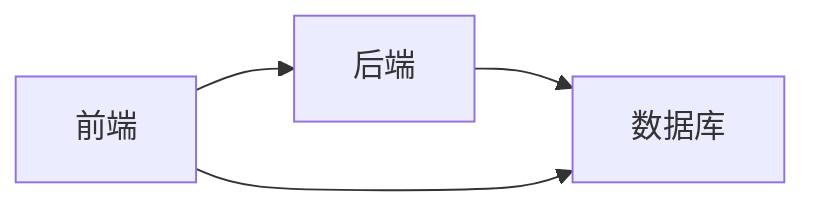

                 


# 价值投资中的深海采矿环境监测技术前景

> 关键词：深海采矿、环境监测技术、价值投资、传感器技术、数据处理算法、系统架构设计

> 摘要：本文探讨了深海采矿环境监测技术在价值投资中的前景，分析了环境监测技术的核心原理、系统架构设计以及实际应用场景。通过详细的技术分析和案例研究，揭示了环境监测技术对投资决策的重要影响，为投资者提供了科学的技术支持。

---

## 第1章: 深海采矿与环境监测技术概述

### 1.1 深海采矿的定义与特点
深海采矿是指在海洋深处进行矿产资源开采的活动，其特点包括：

#### 1.1.1 深海采矿的定义
深海采矿是指在深度超过200米的海洋区域进行矿产资源的开采活动，主要目标是海底多金属结核、多金属硫化物和多金属氧化物等矿物资源。

#### 1.1.2 深海采矿的核心特点
- **资源丰富性**：海底矿产资源储量巨大，尤其是多金属结核和多金属硫化物矿床。
- **技术复杂性**：深海环境恶劣，技术要求高，涉及水深、高压、复杂地形等多种挑战。
- **环境敏感性**：深海采矿可能对海洋生态系统造成破坏，引发环境问题。

#### 1.1.3 深海采矿与传统采矿的对比
| 对比维度 | 深海采矿 | 陆地采矿 |
|----------|----------|----------|
| 资源储量 | 丰富，但开发难度大 | 相对丰富，开发相对容易 |
| 环境影响 | 高，需严格监测 | 较高，但技术相对成熟 |
| 技术难度 | 极高，涉及复杂技术 | 较高，技术相对成熟 |

### 1.2 环境监测技术的定义与特点
环境监测技术是指通过传感器、数据采集和分析等手段，对环境参数进行实时监测和评估的技术。

#### 1.2.1 环境监测技术的定义
环境监测技术是指通过传感器、数据采集和分析等手段，对环境参数进行实时监测和评估的技术，广泛应用于大气、水体、土壤等环境监测领域。

#### 1.2.2 环境监测技术的核心特点
- **实时性**：能够实时采集环境数据，快速反馈监测结果。
- **准确性**：通过高精度传感器和数据处理算法，确保监测结果的准确性。
- **多样性**：支持多种环境参数监测，如温度、湿度、pH值、溶解氧等。

#### 1.2.3 深海采矿与环境监测技术的关联
深海采矿活动对海洋环境的影响需要通过环境监测技术进行实时评估和预测，以确保采矿活动的可持续性和环境友好性。

### 1.3 价值投资与深海采矿的关联
价值投资是通过分析企业或项目的长期价值，进行投资决策的一种方法。

#### 1.3.1 价值投资的定义
价值投资是指通过分析企业的基本面，寻找市场价格低于其内在价值的投资机会，从而实现长期收益。

#### 1.3.2 深海采矿行业的投资价值
深海采矿行业具有较高的资源潜力和市场前景，但同时也面临着技术和环境的巨大挑战，因此需要投资者进行深入的技术和环境评估。

#### 1.3.3 环境监测技术对投资决策的影响
环境监测技术能够为投资者提供准确的环境数据，评估深海采矿活动对环境的影响，从而为投资决策提供科学依据。

---

## 第2章: 深海采矿环境监测技术的核心概念

### 2.1 深海采矿环境监测技术的原理
环境监测技术在深海采矿中的应用原理包括以下几个方面：

#### 2.1.1 深海环境的基本特征
深海环境具有高压、低温、黑暗和缺氧等特点，这些特点对环境监测技术提出了更高的要求。

#### 2.1.2 环境监测技术的基本原理
环境监测技术通过传感器采集环境数据，经过数据处理和分析，评估环境状况及其对深海采矿活动的影响。

#### 2.1.3 深海采矿对环境的影响
深海采矿可能对海洋生态系统造成破坏，包括海底地形改变、水体污染、生物多样性减少等。

### 2.2 环境监测技术的关键指标
环境监测技术的核心指标包括：

#### 2.2.1 水质监测指标
- 水温
- 水压
- 溶解氧
- pH值

#### 2.2.2 底质监测指标
- 海底地形
- 底泥成分
- 沉积物厚度

#### 2.2.3 生物监测指标
- 生物多样性
- 生物量
- 生态系统稳定性

### 2.3 环境监测技术的核心要素
环境监测技术的核心要素包括传感器、数据采集与传输、数据分析与评估。

#### 2.3.1 传感器技术
传感器是环境监测技术的核心部件，用于采集环境参数数据。

#### 2.3.2 数据采集与传输技术
数据采集与传输技术负责将传感器采集的数据进行处理和传输，确保数据的准确性和实时性。

#### 2.3.3 数据分析与评估技术
数据分析与评估技术通过对采集到的数据进行分析，评估环境状况及其对深海采矿活动的影响。

---

## 第3章: 深海采矿环境监测技术的算法原理

### 3.1 数据采集与处理算法
数据采集与处理算法是环境监测技术的核心算法之一。

#### 3.1.1 数据采集流程
- 传感器数据采集
- 数据预处理
- 数据特征提取

#### 3.1.2 数据预处理方法
- 去噪处理
- 数据归一化
- 异常数据剔除

#### 3.1.3 数据特征提取
- 时间序列分析
- 主成分分析
- 小波变换

### 3.2 环境影响评估模型
环境影响评估模型是通过数据驱动的方法，评估深海采矿活动对环境的影响。

#### 3.2.1 模型构建方法
- 线性回归
- 支持向量机
- 神经网络

#### 3.2.2 模型训练与优化
- 数据集划分
- 模型训练
- 模型优化

#### 3.2.3 模型评估与验证
- 评估指标：准确率、召回率、F1值
- 交叉验证
- 独立测试

### 3.3 价值评估算法
价值评估算法是通过分析环境监测数据，评估深海采矿项目的投资价值。

#### 3.3.1 投资价值评估指标
- 环境风险
- 技术可行性
- 经济效益

#### 3.3.2 评估模型的数学公式
$$ 投资价值 = \alpha \cdot 环境影响 + \beta \cdot 技术可行性 + \gamma \cdot 经济效益 $$

#### 3.3.3 案例分析与结果解读
通过实际案例分析，展示环境监测技术对投资决策的影响。

---

## 第4章: 系统分析与架构设计

### 4.1 项目背景与目标
本项目旨在通过环境监测技术，评估深海采矿活动对环境的影响，为投资者提供科学的投资决策依据。

#### 4.1.1 项目背景
- 深海采矿资源丰富，但环境风险高。
- 环境监测技术是评估环境影响的核心手段。

#### 4.1.2 项目目标
- 实时监测深海环境参数
- 评估深海采矿活动的环境影响
- 提供投资决策支持

### 4.2 系统功能设计
系统功能设计包括数据采集、数据处理和环境评估三个模块。

#### 4.2.1 数据采集模块
- 负责采集环境参数数据
- 传感器类型：温度、压力、溶解氧等传感器
- 数据采集频率：实时采集

#### 4.2.2 数据处理模块
- 数据预处理：去噪、归一化
- 数据分析：特征提取、模型训练
- 数据存储：数据库存储

#### 4.2.3 环境评估模块
- 环境影响评估：模型预测
- 投资价值评估：综合评估
- 结果展示：可视化界面

### 4.3 系统架构设计
系统架构设计包括前端、后端和数据库三个部分。

#### 4.3.1 系统架构图


#### 4.3.2 模块交互流程


#### 4.3.3 系统接口设计
- 前端接口：RESTful API
- 后端接口：数据库接口
- 数据接口：传感器数据接口

---

## 第5章: 项目实战与案例分析

### 5.1 环境监测系统安装与配置
环境监测系统的安装与配置步骤如下：

#### 5.1.1 系统环境要求
- 操作系统：Linux
- 硬件要求：传感器、数据采集卡、服务器
- 软件要求：Python、数据库、数据分析工具

#### 5.1.2 系统安装步骤
1. 安装传感器驱动
2. 配置数据采集卡
3. 安装数据库和数据分析工具
4. 配置系统参数

#### 5.1.3 系统配置参数
- 采集频率：10Hz
- 数据存储路径：/data/environment
- 系统日志路径：/log/system

### 5.2 系统核心实现代码
以下是系统核心实现代码示例：

#### 5.2.1 数据采集代码
```python
import serial

ser = serial.Serial('COM1', 9600)
while True:
    data = ser.readline()
    print(data)
```

#### 5.2.2 数据处理代码
```python
import numpy as np

data = np.array([1, 2, 3, 4, 5])
processed_data = (data - np.mean(data)) / np.std(data)
print(processed_data)
```

#### 5.2.3 环境评估代码
```python
import joblib

model = joblib.load('environment_model.pkl')
result = model.predict([[1, 2, 3]])
print(result)
```

### 5.3 案例分析与结果解读
#### 5.3.1 案例背景介绍
某深海采矿项目计划在海底进行多金属硫化物矿床的开采，需通过环境监测技术评估环境影响。

#### 5.3.2 数据分析过程
- 数据采集：温度、压力、溶解氧等参数
- 数据处理：去噪、归一化
- 模型训练：支持向量机模型

#### 5.3.3 评估结果与投资建议
- 环境风险：中等
- 技术可行性：高
- 经济效益：良好
- 投资建议：谨慎投资，加强环境监测和风险管理。

---

## 第6章: 总结与展望

### 6.1 最佳实践 tips
- 环境监测技术是深海采矿投资决策的重要工具
- 数据采集和处理是环境监测技术的核心
- 投资者应加强环境监测技术的研究和应用

### 6.2 小结
本文通过分析深海采矿环境监测技术的核心概念、算法原理和系统架构设计，揭示了环境监测技术对投资决策的重要影响。

### 6.3 注意事项
- 环境监测技术的应用需结合实际情况
- 数据采集和处理需确保准确性和实时性
- 投资者需加强环境监测技术的研究和应用

### 6.4 拓展阅读
- 《深海采矿技术与环境影响》
- 《环境监测技术在投资决策中的应用》
- 《支持向量机算法在环境评估中的应用》

---

以上是《价值投资中的深海采矿环境监测技术前景》的完整目录和内容框架。

