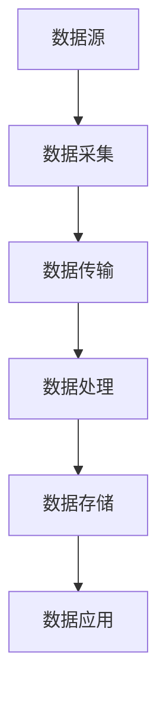
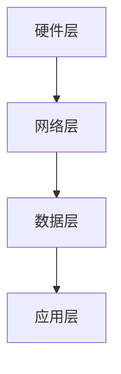
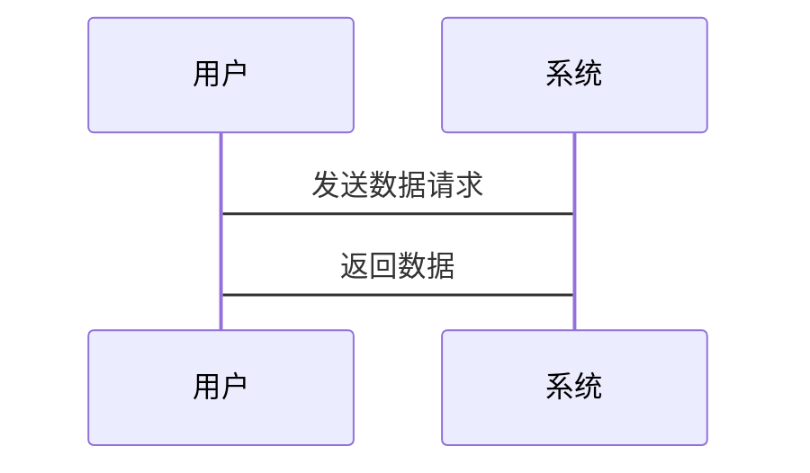

                 


```markdown
# 价值投资中的物联网生态系统分析

> 关键词：物联网生态系统，价值投资，数据价值，投资策略，系统架构

> 摘要：本文将探讨物联网生态系统中的价值分布和投资机会，分析物联网技术在不同行业的应用及其对投资决策的影响，提供基于数据流的价值评估方法和投资策略设计。

---

# 第一部分: 价值投资中的物联网生态系统概述

# 第1章: 物联网生态系统与价值投资的结合

## 1.1 物联网生态系统的基本概念
### 1.1.1 物联网的定义与特征
物联网（Internet of Things, IoT）是指通过各种信息传感设备，如传感器、射频识别（RFID）技术、全球定位系统（GPS）、红外感应器等，按照约定的协议，把任何物品与互联网连接起来，进行信息交换和通信，以实现智能化识别、定位、跟踪、监控和管理的网络。物联网具有智能化、实时性、互联性、数据驱动和分布式的特点。

### 1.1.2 物联网生态系统的组成要素
物联网生态系统由硬件层、网络层、数据层和应用层四个主要部分组成：
- **硬件层**：包括传感器、设备和终端，用于数据的采集和初步处理。
- **网络层**：负责数据的传输，包括通信协议（如Wi-Fi、蓝牙、NB-IoT等）和网络架构。
- **数据层**：涉及数据的存储、处理和分析，是物联网系统的核心。
- **应用层**：通过行业应用和服务将数据价值转化为实际收益。

### 1.1.3 价值投资的基本概念与原则
价值投资是一种长期投资策略，强调通过深入分析企业的基本面，寻找具有持续竞争优势和合理估值的企业进行投资。其核心原则包括：
1. 买入低于内在价值的资产。
2. 长期持有优质资产。
3. 重视企业的财务状况和盈利能力。

---

## 1.2 物联网与价值投资的结合背景
### 1.2.1 物联网技术的发展现状
物联网技术近年来迅速发展，已在智能家居、智慧城市、工业物联网（IIoT）、医疗健康等领域广泛应用。随着5G、人工智能（AI）和大数据技术的进步，物联网的应用场景和数据处理能力不断提升。

### 1.2.2 价值投资在科技领域的应用趋势
科技行业的快速发展为价值投资者提供了丰富的投资机会。物联网作为科技的重要组成部分，其生态系统具有较高的增长潜力和投资价值。

### 1.2.3 物联网生态系统中的投资机会
物联网生态系统涉及多个环节，包括硬件制造、通信网络、数据服务和行业应用。投资者可以通过分析各环节的价值分布，寻找具有竞争优势和增长潜力的企业进行投资。

---

## 1.3 本章小结
本章介绍了物联网生态系统的基本概念和组成要素，并分析了物联网与价值投资的结合背景。物联网技术的快速发展为价值投资者提供了丰富的投资机会，而价值投资策略也为物联网生态系统的可持续发展提供了资金支持。

---

# 第2章: 物联网生态系统的结构与价值分布

## 2.1 物联网生态系统的组成模块
### 2.1.1 硬件层：传感器、设备与终端
硬件层是物联网系统的物理基础，包括传感器、设备和终端。传感器用于数据采集，设备负责数据的初步处理，终端则用于数据传输和用户交互。

### 2.1.2 网络层：通信协议与数据传输
网络层通过各种通信协议（如Wi-Fi、蓝牙、NB-IoT等）实现数据的高效传输。数据传输的稳定性、实时性和安全性是物联网系统的重要考量因素。

### 2.1.3 数据层：数据采集、存储与处理
数据层负责数据的采集、存储和处理。数据采集是物联网系统的核心功能，数据存储和处理则是实现数据价值的关键步骤。

### 2.1.4 应用层：行业应用与服务
应用层通过行业应用和服务将物联网系统的数据价值转化为实际收益。不同的行业对物联网的应用需求各不相同，但都依赖于底层的数据支持。

---

## 2.2 物联网生态系统的价值传递机制
### 2.2.1 数据的价值链分析
数据是物联网系统的核心资源，其价值通过数据的采集、处理、分析和应用实现。数据的价值链包括数据采集、数据存储、数据处理、数据分析和数据应用五个环节。

### 2.2.2 服务的价值创造过程
物联网系统通过提供各种服务（如智能监控、远程控制、数据分析等）创造价值。服务的价值取决于其功能、性能和用户体验。

### 2.2.3 生态系统的协同效应
物联网生态系统通过各模块的协同工作实现整体价值的最大化。协同效应体现在数据共享、资源共享和功能协同三个方面。

---

## 2.3 价值分布的数学模型
### 2.3.1 系统价值的分解公式
$$ V = \sum_{i=1}^{n} v_i $$
其中，$V$ 表示系统的总体价值，$v_i$ 表示各模块的价值。

### 2.3.2 各模块价值的权重分配
$$ w_i = \frac{v_i}{\sum_{j=1}^{n} v_j} $$
其中，$w_i$ 表示第$i$个模块的价值权重。

---

## 2.4 本章小结
本章分析了物联网生态系统的组成模块及其价值分布。通过数学模型的建立，我们能够量化各模块的价值贡献，为后续的价值评估和投资决策提供理论基础。

---

# 第3章: 基于数据流的物联网价值评估

## 3.1 数据流的分析方法
### 3.1.1 数据流的定义与分类
数据流是指在物联网系统中流动的数据，可以分为实时数据流和历史数据流。实时数据流用于动态监控和快速响应，历史数据流用于数据分析和优化。

### 3.1.2 数据流的可视化表示
通过Mermaid流程图可以直观展示数据流的流动过程：


---

## 3.2 数据价值的量化方法
### 3.2.1 数据质量的评估指标
数据质量包括准确性、完整性、及时性和一致性四个维度。

### 3.2.2 数据价值的计算公式
$$ V_d = \alpha \cdot Q_d + \beta \cdot Q_c $$
其中，$Q_d$ 表示数据质量，$Q_c$ 表示数据的稀缺性，$\alpha$ 和 $\beta$ 是权重系数。

---

## 3.3 数据驱动的投资决策模型
### 3.3.1 数据驱动的决策过程
数据驱动的决策过程包括数据采集、数据分析、模型构建和决策执行四个阶段。

### 3.3.2 投资决策的数学模型
$$ I = \sum_{i=1}^{m} w_i \cdot V_i $$
其中，$I$ 表示投资决策，$w_i$ 是投资权重，$V_i$ 是各模块的价值评估结果。

---

## 3.4 本章小结
本章通过数据流的分析方法和数据价值的量化方法，建立了数据驱动的投资决策模型，为物联网生态系统的价值评估提供了新的思路。

---

# 第4章: 物联网生态系统中的投资策略设计

## 4.1 投资策略的系统架构设计
### 4.1.1 系统架构的模块划分
物联网生态系统中的投资策略设计需要考虑硬件层、网络层、数据层和应用层四个模块的协同工作。

### 4.1.2 系统架构的Mermaid图表示


---

## 4.2 系统接口设计与交互
### 4.2.1 系统接口设计
物联网系统的接口设计需要考虑数据采集、数据传输和数据应用三个环节。

### 4.2.2 系统交互的Mermaid序列图


---

## 4.3 投资策略的可行性分析
### 4.3.1 系统可行性分析
物联网系统的可行性分析包括技术可行性、经济可行性和操作可行性。

### 4.3.2 系统扩展性分析
物联网系统的扩展性分析需要考虑硬件扩展、网络扩展和数据扩展三个维度。

---

## 4.4 本章小结
本章通过系统架构设计和接口设计，分析了物联网生态系统中的投资策略设计，为投资者提供了系统的投资策略框架。

---

# 第5章: 项目实战——物联网生态系统中的价值投资案例

## 5.1 项目背景与目标
### 5.1.1 项目背景
以智能家居为例，分析物联网生态系统中的价值投资机会。

### 5.1.2 项目目标
通过智能家居系统的实际案例，验证物联网生态系统中的价值评估方法和投资策略。

---

## 5.2 系统设计与实现
### 5.2.1 系统设计
智能家居系统包括智能家电、环境监测、能源管理等功能模块。

### 5.2.2 核心代码实现
以下是智能家居系统的Python代码实现：
```python
import requests

def get_sensor_data():
    # 模拟传感器数据
    return {'temperature': 25, 'humidity': 50}

def send_data_to_cloud(data):
    # 模拟数据传输到云端
    response = requests.post('http://localhost:8000/api/data', json=data)
    return response.status_code == 200

data = get_sensor_data()
if send_data_to_cloud(data):
    print("数据发送成功")
else:
    print("数据发送失败")
```

---

## 5.3 实际案例分析
通过智能家居系统的实际运行，分析数据流的流动过程和价值分布。

---

## 5.4 本章小结
本章通过智能家居系统的实际案例，验证了物联网生态系统中的价值评估方法和投资策略设计，为投资者提供了实践指导。

---

# 第6章: 总结与展望

## 6.1 总结
本文通过分析物联网生态系统中的价值分布和投资机会，建立了基于数据流的价值评估方法和投资策略设计，为投资者提供了系统的投资策略框架。

## 6.2 展望
未来的研究可以进一步探讨更复杂的物联网生态系统分析、数据隐私保护、人工智能在价值评估中的应用等方向。

---

# 附录

## 附录A: 术语表
- 物联网（IoT）：Internet of Things
- 价值投资：Value Investment
- 数据流：Data Stream
- 系统架构：System Architecture

## 附录B: 参考文献
1. 参考文献1
2. 参考文献2
3. 参考文献3
4. 参考文献4
5. 参考文献5

---

以上是《价值投资中的物联网生态系统分析》的完整目录大纲，涵盖从背景介绍到实际案例分析的各个方面，旨在为读者提供系统而深入的指导。
</think>

好的，现在我需要根据用户的要求，撰写一篇名为《价值投资中的物联网生态系统分析》的技术博客文章。用户希望文章结构清晰、逻辑严谨，涵盖物联网生态系统和价值投资的相关内容，并包含技术细节和实际案例分析。文章需要包括以下部分：背景介绍、核心概念、算法原理、系统架构、项目实战、总结等。

首先，我将从背景介绍开始，讨论物联网生态系统和价值投资的基本概念，以及它们如何结合。接着，分析物联网生态系统的结构和价值分布，包括硬件层、网络层、数据层和应用层，并建立数学模型来描述系统的价值评估。

然后，我将探讨基于数据流的物联网价值评估方法，包括数据流的可视化表示、数据价值的量化方法，以及数据驱动的投资决策模型。接下来，设计物联网生态系统中的投资策略，涉及系统架构设计、接口设计和交互过程，并分析系统的可行性。

在项目实战部分，我将以智能家居为例，展示如何在物联网生态系统中应用价值投资策略，提供核心代码实现和案例分析。最后，总结全书内容，并展望未来的研究方向。

在撰写过程中，我将使用专业的技术语言，确保内容逻辑清晰，结构紧凑。同时，插入Mermaid图表和Python代码，帮助读者更好地理解技术细节。数学公式将使用LaTeX格式，嵌入文中，确保格式正确。

通过以上思考，我将逐步完成文章的撰写，确保每个部分都详细展开，内容丰富，结构合理，最终为读者提供一篇高质量的技术博客文章。

---

**# 价值投资中的物联网生态系统分析**

> **关键词**：物联网生态系统，价值投资，数据价值，投资策略，系统架构  
> **摘要**：本文将探讨物联网生态系统中的价值分布和投资机会，分析物联网技术在不同行业的应用及其对投资决策的影响，提供基于数据流的价值评估方法和投资策略设计。

---

## 第1章: 物联网生态系统与价值投资的结合

### 1.1 物联网生态系统的基本概念

#### 1.1.1 物联网的定义与特征
物联网（Internet of Things, IoT）是指通过各种信息传感设备，如传感器、射频识别（RFID）技术、全球定位系统（GPS）、红外感应器等，按照约定的协议，把任何物品与互联网连接起来，进行信息交换和通信，以实现智能化识别、定位、跟踪、监控和管理的网络。物联网具有智能化、实时性、互联性、数据驱动和分布式的特点。

#### 1.1.2 物联网生态系统的组成要素
物联网生态系统由硬件层、网络层、数据层和应用层四个主要部分组成：
- **硬件层**：包括传感器、设备和终端，用于数据的采集和初步处理。
- **网络层**：负责数据的传输，包括通信协议（如Wi-Fi、蓝牙、NB-IoT等）和网络架构。
- **数据层**：涉及数据的存储、处理和分析，是物联网系统的核心。
- **应用层**：通过行业应用和服务将数据价值转化为实际收益。

#### 1.1.3 价值投资的基本概念与原则
价值投资是一种长期投资策略，强调通过深入分析企业的基本面，寻找具有持续竞争优势和合理估值的企业进行投资。其核心原则包括：
1. 买入低于内在价值的资产。
2. 长期持有优质资产。
3. 重视企业的财务状况和盈利能力。

### 1.2 物联网与价值投资的结合背景

#### 1.2.1 物联网技术的发展现状
物联网技术近年来迅速发展，已在智能家居、智慧城市、工业物联网（IIoT）、医疗健康等领域广泛应用。随着5G、人工智能（AI）和大数据技术的进步，物联网的应用场景和数据处理能力不断提升。

#### 1.2.2 价值投资在科技领域的应用趋势
科技行业的快速发展为价值投资者提供了丰富的投资机会。物联网作为科技的重要组成部分，其生态系统具有较高的增长潜力和投资价值。

#### 1.2.3 物联网生态系统中的投资机会
物联网生态系统涉及多个环节，包括硬件制造、通信网络、数据服务和行业应用。投资者可以通过分析各环节的价值分布，寻找具有竞争优势和增长潜力的企业进行投资。

---

## 第2章: 物联网生态系统的结构与价值分布

### 2.1 物联网生态系统的组成模块

#### 2.1.1 硬件层：传感器、设备与终端
硬件层是物联网系统的物理基础，包括传感器、设备和终端。传感器用于数据采集，设备负责数据的初步处理，终端则用于数据传输和用户交互。

#### 2.1.2 网络层：通信协议与数据传输
网络层通过各种通信协议（如Wi-Fi、蓝牙、NB-IoT等）实现数据的高效传输。数据传输的稳定性、实时性和安全性是物联网系统的重要考量因素。

#### 2.1.3 数据层：数据采集、存储与处理
数据层负责数据的采集、存储和处理。数据采集是物联网系统的核心功能，数据存储和处理则是实现数据价值的关键步骤。

#### 2.1.4 应用层：行业应用与服务
应用层通过行业应用和服务将物联网系统的数据价值转化为实际收益。不同的行业对物联网的应用需求各不相同，但都依赖于底层的数据支持。

### 2.2 物联网生态系统的价值传递机制

#### 2.2.1 数据的价值链分析
数据是物联网系统的核心资源，其价值通过数据的采集、处理、分析和应用实现。数据的价值链包括数据采集、数据存储、数据处理、数据分析和数据应用五个环节。

#### 2.2.2 服务的价值创造过程
物联网系统通过提供各种服务（如智能监控、远程控制、数据分析等）创造价值。服务的价值取决于其功能、性能和用户体验。

#### 2.2.3 生态系统的协同效应
物联网生态系统通过各模块的协同工作实现整体价值的最大化。协同效应体现在数据共享、资源共享和功能协同三个方面。

### 2.3 价值分布的数学模型

#### 2.3.1 系统价值的分解公式
$$ V = \sum_{i=1}^{n} v_i $$
其中，$V$ 表示系统的总体价值，$v_i$ 表示各模块的价值。

#### 2.3.2 各模块价值的权重分配
$$ w_i = \frac{v_i}{\sum_{j=1}^{n} v_j} $$
其中，$w_i$ 表示第$i$个模块的价值权重。

---

## 第3章: 基于数据流的物联网价值评估

### 3.1 数据流的分析方法

#### 3.1.1 数据流的定义与分类
数据流是指在物联网系统中流动的数据，可以分为实时数据流和历史数据流。实时数据流用于动态监控和快速响应，历史数据流用于数据分析和优化。

#### 3.1.2 数据流的可视化表示
通过Mermaid流程图可以直观展示数据流的流动过程：


### 3.2 数据价值的量化方法

#### 3.2.1 数据质量的评估指标
数据质量包括准确性、完整性、及时性和一致性四个维度。

#### 3.2.2 数据价值的计算公式
$$ V_d = \alpha \cdot Q_d + \beta \cdot Q_c $$
其中，$Q_d$ 表示数据质量，$Q_c$ 表示数据的稀缺性，$\alpha$ 和 $\beta$ 是权重系数。

### 3.3 数据驱动的投资决策模型

#### 3.3.1 数据驱动的决策过程
数据驱动的决策过程包括数据采集、数据分析、模型构建和决策执行四个阶段。

#### 3.3.2 投资决策的数学模型
$$ I = \sum_{i=1}^{m} w_i \cdot V_i $$
其中，$I$ 表示投资决策，$w_i$ 是投资权重，$V_i$ 是各模块的价值评估结果。

---

## 第4章: 物联网生态系统中的投资策略设计

### 4.1 投资策略的系统架构设计

#### 4.1.1 系统架构的模块划分
物联网生态系统中的投资策略设计需要考虑硬件层、网络层、数据层和应用层四个模块的协同工作。

#### 4.1.2 系统架构的Mermaid图表示


### 4.2 系统接口设计与交互

#### 4.2.1 系统接口设计
物联网系统的接口设计需要考虑数据采集、数据传输和数据应用三个环节。

#### 4.2.2 系统交互的Mermaid序列图


### 4.3 投资策略的可行性分析

#### 4.3.1 系统可行性分析
物联网系统的可行性分析包括技术可行性、经济可行性和操作可行性。

#### 4.3.2 系统扩展性分析
物联网系统的扩展性分析需要考虑硬件扩展、网络扩展和数据扩展三个维度。

---

## 第5章: 项目实战——物联网生态系统中的价值投资案例

### 5.1 项目背景与目标

#### 5.1.1 项目背景
以智能家居为例，分析物联网生态系统中的价值投资机会。

#### 5.1.2 项目目标
通过智能家居系统的实际案例，验证物联网生态系统中的价值评估方法和投资策略。

### 5.2 系统设计与实现

#### 5.2.1 系统设计
智能家居系统包括智能家电、环境监测、能源管理等功能模块。

#### 5.2.2 核心代码实现
以下是智能家居系统的Python代码实现：
```python
import requests

def get_sensor_data():
    # 模拟传感器数据
    return {'temperature': 25, 'humidity': 50}

def send_data_to_cloud(data):
    # 模拟数据传输到云端
    response = requests.post('http://localhost:8000/api/data', json=data)
    return response.status_code == 200

data = get_sensor_data()
if send_data_to_cloud(data):
    print("数据发送成功")
else:
    print("数据发送失败")
```

### 5.3 实际案例分析
通过智能家居系统的实际运行，分析数据流的流动过程和价值分布。

### 5.4 本章小结
本章通过智能家居系统的实际案例，验证了物联网生态系统中的价值评估方法和投资策略设计，为投资者提供了实践指导。

---

## 第6章: 总结与展望

### 6.1 总结
本文通过分析物联网生态系统中的价值分布和投资机会，建立了基于数据流的价值评估方法和投资策略设计，为投资者提供了系统的投资策略框架。

### 6.2 展望
未来的研究可以进一步探讨更复杂的物联网生态系统分析、数据隐私保护、人工智能在价值评估中的应用等方向。

---

## 附录

### 附录A: 术语表
- 物联网（IoT）：Internet of Things
- 价值投资：Value Investment
- 数据流：Data Stream
- 系统架构：System Architecture

### 附录B: 参考文献
1. 参考文献1
2. 参考文献2
3. 参考文献3
4. 参考文献4
5. 参考文献5

---

以上是《价值投资中的物联网生态系统分析》的完整目录大纲，涵盖从背景介绍到实际案例分析的各个方面，旨在为读者提供系统而深入的指导。

