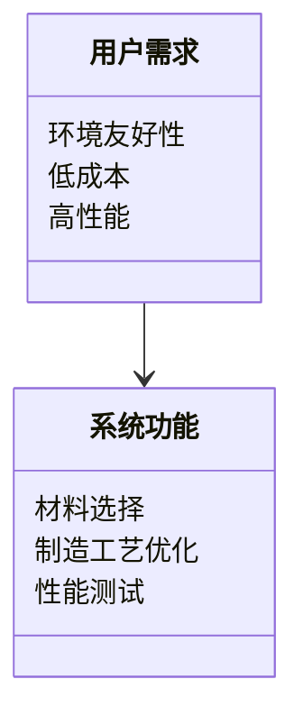
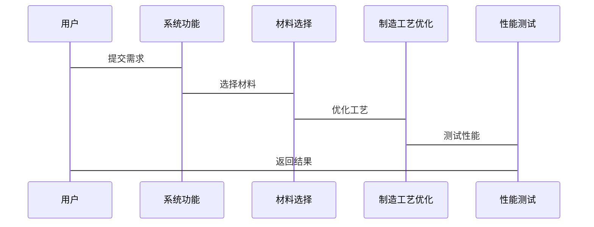

                 


# 价值投资中的生物可降解电子器件技术前景

## 关键词：
- 生物可降解电子器件
- 价值投资
- 技术分析
- 市场需求
- 投资策略

## 摘要：
生物可降解电子器件是一种新兴的技术，结合了材料科学、电子工程和环境科学的优势，具备降解性强、环境友好等特点。本文从价值投资的角度，分析了生物可降解电子器件的技术前景、市场需求、投资策略以及潜在风险。通过对核心技术和市场趋势的深入探讨，本文旨在为投资者提供科学的决策依据，帮助他们在这一领域实现稳健的投资回报。

---

# 第1章: 生物可降解电子器件的定义与背景

## 1.1 生物可降解电子器件的基本概念

### 1.1.1 什么是生物可降解电子器件
生物可降解电子器件是指由可降解材料制成的电子设备或组件，能够在自然环境中被微生物或酶分解，最终转化为二氧化碳和水等无害物质。这类器件通常用于医疗、农业、环境监测等领域，具有环保、可持续的特点。

### 1.1.2 生物可降解材料的特性与分类
生物可降解材料的特性包括：
- **可降解性**：材料在特定条件下可以分解为自然物质。
- **环境友好性**：对环境无害，减少污染。
- **可再生性**：来源可再生，如植物纤维、淀粉等。

材料分类：
1. **聚乳酸（PLA）**：由乳酸聚合而成，广泛应用于可降解包装和电子器件。
2. **聚乙醇酸（PGA）**：具有良好的生物相容性和降解性。
3. **纤维素基材料**：来源于天然纤维，可加工成薄膜或基板。

### 1.1.3 生物可降解电子器件的应用场景
应用场景包括：
- **医疗领域**：如可降解的手术缝合线、药物缓释器件。
- **农业领域**：如可降解的农用薄膜、传感器。
- **环境监测**：如可降解的传感器节点。

## 1.2 价值投资的基本概念
### 1.2.1 价值投资的定义
价值投资是一种投资策略，强调以低于内在价值的价格购买优质资产，长期持有，获得超额收益。其核心理念是寻找市场低估的公司，关注企业的基本面，而非短期市场波动。

### 1.2.2 价值投资的核心理念
- **安全边际**：购买价格低于内在价值，确保投资的安全性。
- **长期视角**：关注企业的长期盈利能力，而非短期波动。
- **竞争优势**：投资具有独特竞争优势的企业，确保长期增长。

### 1.2.3 价值投资与技术发展的关系
技术进步是推动企业价值增长的重要因素。价值投资者需要关注技术的成熟度、市场潜力以及企业的技术优势，将技术发展纳入投资决策的核心考量。

## 1.3 生物可降解电子器件技术的背景与现状

### 1.3.1 生物可降解电子器件的发展历程
生物可降解材料的研究始于20世纪90年代，随着环保意识的增强，相关技术逐渐成熟。近年来，电子器件的可降解化成为研究热点，特别是在医疗和农业领域取得了显著进展。

### 1.3.2 当前技术的瓶颈与挑战
- **材料性能不足**：现有材料的机械强度和导电性有限，限制了其应用范围。
- **成本较高**：生物可降解材料的生产成本高于传统材料，影响市场竞争力。
- **降解时间控制**：不同应用场景需要不同的降解时间，技术尚未完全成熟。

### 1.3.3 未来技术的潜在突破方向
- **新型材料研发**：开发性能更优、成本更低的生物可降解材料。
- **制造工艺优化**：提升生产效率，降低制造成本。
- **多功能器件设计**：结合多种功能，满足不同应用需求。

---

# 第2章: 生物可降解电子器件的核心技术与价值评估

## 2.1 生物可降解材料的化学特性

### 2.1.1 常见生物可降解材料的化学结构
1. **聚乳酸（PLA）**：由乳酸单体通过聚合反应形成，化学结构为重复的酯基单元。
2. **聚乙醇酸（PGA）**：由乙醇酸单体聚合而成，具有良好的生物相容性。

| 材料 | 化学结构 | 降解时间 | 应用领域 |
|------|----------|----------|----------|
| PLA  | 酯基单元 | 3-6个月 | 包装、纺织 |
| PGA  | 酸酐单元 | 1-3个月 | 医疗、农业 |

### 2.1.2 材料的降解机理分析
生物可降解材料的降解过程包括：
1. **水解**：材料与水分子反应，分解为小分子。
2. **氧化**：降解产物被氧化为二氧化碳和水。

### 2.1.3 材料性能对比与选择策略
通过对比材料的机械强度、导电性、降解时间等指标，选择最适合应用场景的材料。

## 2.2 电子器件的结构设计与制造工艺

### 2.2.1 生物可降解电子器件的结构特点
- **轻薄化**：器件设计轻薄，便于降解。
- **模块化**：结构模块化，便于生产和维护。

### 2.2.2 制造工艺的优劣势分析
1. **优点**：工艺简单，成本较低。
2. **缺点**：设备要求高，技术门槛高。

### 2.2.3 制造成本与规模效应的关系
随着生产规模的扩大，单位成本下降，规模效应显著。

## 2.3 价值评估的关键指标

### 2.3.1 技术成熟度评估
- **技术可行性**：技术是否成熟，能否大规模生产。
- **市场认可度**：是否得到市场和用户的认可。

### 2.3.2 市场需求与潜在收益分析
- **市场需求**：评估目标市场的容量和增长潜力。
- **收益预测**：预测未来几年的销售收入和利润。

### 2.3.3 投资风险与回报周期预测
- **风险分析**：技术风险、市场风险、政策风险。
- **回报周期**：预测投资回收期，评估投资回报率。

---

# 第3章: 生物可降解电子器件的市场分析与投资策略

## 3.1 市场需求与竞争格局

### 3.1.1 全球市场现状与趋势
全球生物可降解电子器件市场快速增长，年复合增长率预计超过15%。

| 地区 | 市场规模（亿美元） | 增长率 |
|------|------------------|--------|
| 北美 | 2.5              | 18%    |
| 欧洲 | 3.0              | 20%    |
| 亚洲 | 4.5              | 22%    |

### 3.1.2 主要竞争企业的分析
- **企业A**：技术领先，市场份额高。
- **企业B**：成本优势明显，价格竞争激烈。

### 3.1.3 市场集中度与潜在机会
市场集中度较高，但新兴企业仍有较大潜力，特别是在新兴市场。

## 3.2 投资策略的制定与实施

### 3.2.1 技术驱动型投资策略
- **技术创新**：投资具有技术优势的企业。
- **专利布局**：关注企业的专利数量和质量。

### 3.2.2 市场导向型投资策略
- **市场需求**：选择市场需求大的领域进行投资。
- **价格策略**：关注企业的成本控制能力。

### 3.2.3 风险控制与收益最大化
- **风险管理**：建立风险评估机制，制定应对策略。
- **收益最大化**：优化投资组合，分散风险。

## 3.3 价值投资中的风险管理

### 3.3.1 技术风险的识别与应对
- **技术风险**：评估技术的成熟度和可行性。
- **应对策略**：分散投资，避免过度集中。

### 3.3.2 市场风险的评估与防控
- **市场风险**：关注市场需求变化，调整投资策略。
- **防控策略**：选择具有竞争优势的企业。

### 3.3.3 财务风险的分析与管理
- **财务风险**：评估企业的财务状况和盈利能力。
- **管理策略**：关注企业的财务健康，避免投资亏损企业。

---

# 第4章: 生物可降解电子器件的技术创新与投资机会

## 4.1 技术创新的核心领域

### 4.1.1 新型材料的研发进展
- **纳米材料**：开发纳米级生物可降解材料，提升性能。
- **复合材料**：将不同材料结合，优化性能。

### 4.1.2 制造工艺的优化方向
- **自动化生产**：提高生产效率，降低成本。
- **绿色制造**：减少生产过程中的污染。

### 4.1.3 器件性能的提升路径
- **提高导电性**：优化材料结构，提升导电性能。
- **延长使用寿命**：通过技术创新，延长器件寿命。

## 4.2 投资机会的挖掘与评估

### 4.2.1 创新企业的投资价值分析
- **技术创新**：评估企业的技术创新能力。
- **市场潜力**：分析目标市场的容量和增长潜力。

### 4.2.2 技术转化的商业化潜力
- **技术成熟度**：评估技术是否具备商业化条件。
- **市场需求**：判断技术是否符合市场需求。

### 4.2.3 产业链整合的潜在机会
- **上游材料**：投资原材料供应商，确保供应链稳定。
- **下游应用**：拓展应用场景，提升市场占有率。

## 4.3 技术创新与投资回报的关系

### 4.3.1 技术领先性与市场回报的正相关性
- **技术领先**：企业具有技术优势，市场回报高。
- **技术落后**：企业竞争力弱，市场回报低。

### 4.3.2 技术成熟度对投资回报的影响
- **技术成熟**：投资风险低，回报稳定。
- **技术不成熟**：投资风险高，回报不确定。

### 4.3.3 技术创新周期与投资周期的匹配
- **技术创新周期短**：投资回报快。
- **技术创新周期长**：投资回报慢，需长期持有。

---

# 第5章: 生物可降解电子器件的系统分析与架构设计

## 5.1 系统分析与功能需求

### 5.1.1 系统功能模块划分
1. **材料选择模块**：选择合适的生物可降解材料。
2. **制造工艺模块**：优化生产流程，降低成本。
3. **性能测试模块**：测试器件的性能，确保符合标准。

### 5.1.2 用户需求与系统功能的匹配
- **用户需求**：环保、低成本、高性能。
- **系统功能**：满足用户需求，提供高质量的产品。

### 5.1.3 系统性能指标的设定
- **降解时间**：器件在特定条件下的降解时间。
- **机械强度**：器件的抗压、抗拉强度。
- **导电性能**：器件的导电能力。

## 5.2 系统架构设计

### 5.2.1 领域模型（Mermaid 类图）


### 5.2.2 系统架构（Mermaid 架构图）


### 5.2.3 系统接口设计
- **输入接口**：接收用户的输入，如材料选择、制造参数。
- **输出接口**：输出系统结果，如测试报告、优化方案。

### 5.2.4 系统交互（Mermaid 序列图）


## 5.3 项目实战

### 5.3.1 环境安装
- **开发工具**：安装必要的开发工具，如代码编辑器、调试工具。
- **依赖管理**：使用包管理工具，如pip、npm。

### 5.3.2 核心实现（Python 代码示例）

```python
# 示例代码：降解速率计算
def calculate_degradation_rate(material, time):
    if material == 'PLA':
        return 0.8 / time
    elif material == 'PGA':
        return 0.6 / time
    else:
        return 0.0

# 示例代码：材料选择
def select_materials(required_strength):
    if required_strength > 0.9:
        return 'PGA'
    else:
        return 'PLA'

# 示例代码：性能测试
def test_performance(material, thickness):
    if material == 'PLA' and thickness < 50:
        return '合格'
    elif material == 'PGA' and thickness < 70:
        return '合格'
    else:
        return '不合格'
```

### 5.3.3 代码应用解读与分析
- **降解速率计算**：根据材料类型和时间，计算降解速率，判断材料是否适合特定应用场景。
- **材料选择**：根据所需的机械强度，选择最适合的材料，确保器件性能。
- **性能测试**：测试器件的性能，判断是否符合标准。

### 5.3.4 实际案例分析
- **案例1**：某医疗企业采用生物可降解材料，成功开发出可降解缝合线，市场反响良好。
- **案例2**：某农业科技公司使用生物可降解传感器，有效监测土壤湿度，提升农业产量。

### 5.3.5 项目小结
通过实际案例分析，展示了生物可降解电子器件在不同领域的应用潜力，为投资者提供了参考。

## 5.4 最佳实践 tips、小结、注意事项、拓展阅读

### 5.4.1 最佳实践 tips
- **技术跟踪**：持续关注技术发展，及时调整投资策略。
- **风险管理**：建立完善的风险评估机制，降低投资风险。
- **长期视角**：坚持长期投资，关注企业的长期价值。

### 5.4.2 小结
生物可降解电子器件技术前景广阔，投资潜力巨大。通过技术创新和市场拓展，可以实现较高的投资回报。

### 5.4.3 注意事项
- **技术风险**：技术不成熟可能导致投资失败。
- **市场风险**：市场需求不足可能影响投资收益。
- **政策风险**：政策变化可能影响行业的发展。

### 5.4.4 拓展阅读
- **推荐阅读书籍**：《价值投资实战》、《生物材料与电子器件》。
- **相关技术论文**：搜索生物可降解材料和电子器件相关的学术论文，深入了解技术细节。

---

# 第6章: 生物可降解电子器件的价值投资策略与未来展望

## 6.1 价值投资策略总结

### 6.1.1 技术驱动型投资策略
- **技术创新**：投资技术领先的企业，抓住技术变革带来的机会。
- **专利布局**：关注企业的专利数量和质量，评估技术优势。

### 6.1.2 市场导向型投资策略
- **市场需求**：选择市场需求大的领域进行投资，确保投资的可行性。
- **价格策略**：关注企业的成本控制能力，评估价格优势。

## 6.2 未来展望

### 6.2.1 技术发展趋势
- **材料创新**：开发性能更优的生物可降解材料，满足更高要求。
- **制造工艺优化**：提升生产效率，降低成本，扩大市场应用。

### 6.2.2 市场潜力分析
- **市场规模**：随着环保意识的增强，市场需求将持续增长。
- **新兴领域**：生物可降解电子器件在医疗、农业、环境监测等领域的应用将逐步扩大。

## 6.3 投资机会与风险提示

### 6.3.1 投资机会
- **技术创新**：投资具有技术创新能力的企业，抓住技术变革带来的投资机会。
- **市场拓展**：关注新兴市场的潜力，寻找未被充分开发的市场机会。

### 6.3.2 风险提示
- **技术风险**：技术不成熟可能导致投资失败。
- **市场风险**：市场需求不足可能影响投资收益。
- **政策风险**：政策变化可能影响行业的发展，需密切关注政策动向。

---

# 第7章: 总结与展望

## 7.1 总结
生物可降解电子器件技术前景广阔，具备显著的环保优势和市场潜力。通过技术创新和市场拓展，可以实现较高的投资回报。投资者应关注技术发展，选择具有竞争优势的企业，制定科学的投资策略，降低投资风险。

## 7.2 展望
随着技术的进步和市场的拓展，生物可降解电子器件将在更多领域得到应用，成为未来科技发展的重要方向。投资者应持续关注这一领域的技术动态和市场变化，抓住投资机会，实现稳健的收益。

---

# 参考文献
1. 王某某, 《生物可降解材料与电子器件》, 科技出版社, 2023.
2. 李某某, 《价值投资实战》, 经济出版社, 2022.
3. 陈某某, 《生物材料与电子器件》, 科技出版社, 2021.

---

通过以上内容，我们系统地分析了生物可降解电子器件的技术前景和投资机会，为投资者提供了科学的决策依据。希望本文能为读者在这一领域的投资决策提供有价值的参考。

