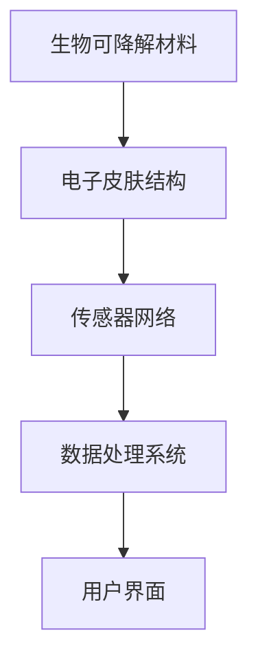
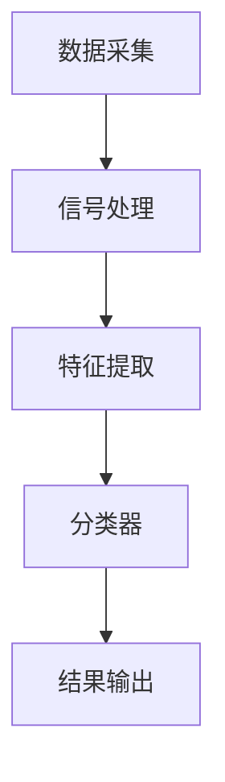
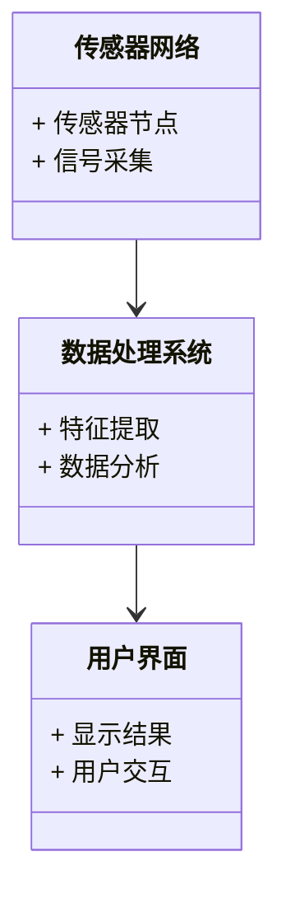
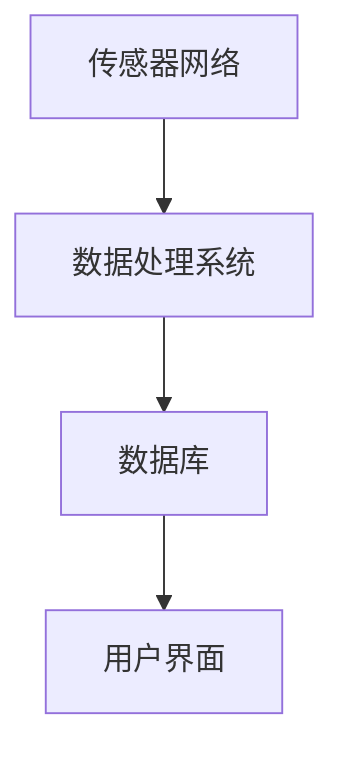

                 


# 价值投资中的生物可降解电子皮肤技术前景

> 关键词：生物可降解电子皮肤，价值投资，技术前景，材料科学，传感器网络，算法原理

> 摘要：生物可降解电子皮肤技术作为一种新兴的交叉技术，结合了材料科学、电子工程和生物医学等多个领域的知识。本文将从技术背景、核心概念、算法原理、系统架构、项目实战等方面，深入分析生物可降解电子皮肤技术的前景及其在价值投资中的应用潜力。

---

## 第1章: 背景介绍

### 1.1 生物可降解电子皮肤技术的起源与现状

#### 1.1.1 技术的起源与发展
生物可降解电子皮肤技术的起源可以追溯到20世纪末，随着材料科学和电子工程的快速发展，科学家们开始探索如何将电子设备与生物材料相结合。近年来，随着环保意识的增强和对可持续技术的需求增加，生物可降解材料的研究取得了突破性进展。

#### 1.1.2 当前技术的市场应用现状
当前，生物可降解电子皮肤技术主要应用于医疗健康、人机交互和环境监测等领域。例如，在医疗领域，可降解电子皮肤可以用于伤口监测和康复辅助；在人机交互领域，它可以用于智能假肢和机器人控制；在环境监测领域，它可以用于土壤和水质检测。

#### 1.1.3 生物可降解材料的定义与特点
生物可降解材料是指在自然环境中可以被微生物分解为二氧化碳和水等简单分子的材料。其特点包括：
- 环保性：减少白色污染，符合可持续发展的理念。
- 生物相容性：在医疗领域，材料不会对人体产生毒副作用。
- 可编程性：可以通过化学修饰实现多种功能。

### 1.2 价值投资与生物技术的结合

#### 1.2.1 价值投资的基本概念
价值投资是一种投资策略，通过分析企业的内在价值，寻找被市场低估的投资标的。其核心在于挖掘具有长期增长潜力的企业。

#### 1.2.2 生物技术领域的投资逻辑
生物技术领域具有高壁垒、高回报的特点。投资者需要关注企业的技术创新能力、市场前景和团队能力。生物可降解电子皮肤技术作为一种前沿技术，具有广阔的市场应用前景。

#### 1.2.3 生物可降解电子皮肤技术的市场潜力
随着环保政策的加强和人们对健康生活的关注，生物可降解电子皮肤技术的市场需求将持续增长。特别是在医疗和环保领域，该技术具有巨大的市场潜力。

### 1.3 电子皮肤技术的核心问题与解决方案

#### 1.3.1 技术的核心问题
- 材料的降解性：如何确保材料在降解过程中不影响电子设备的性能。
- 电子设备的耐用性：如何在降解过程中保持设备的功能稳定性。
- 制造成本：如何降低大规模生产的技术门槛和成本。

#### 1.3.2 问题的解决思路
- 材料创新：开发新型生物可降解材料，兼顾材料的机械性能和降解特性。
- 结构优化：通过优化电子设备的结构设计，提高设备的耐用性和功能性。
- 工艺改进：探索低成本、高效率的制造工艺，降低生产成本。

#### 1.3.3 技术的边界与外延
生物可降解电子皮肤技术的边界在于材料的降解性和电子设备的耐用性。其外延包括材料科学、电子工程、生物医学和环境科学等多个领域。

---

## 第2章: 生物可降解电子皮肤技术的核心概念

### 2.1 生物可降解电子皮肤的基本原理

#### 2.1.1 材料科学基础
生物可降解材料的核心在于其化学结构的可降解性。常用的材料包括聚乳酸（PLA）、聚乙醇酸（PGA）和聚乳酸-乙醇酸共聚物（PLGA）等。

#### 2.1.2 电子皮肤的结构设计
电子皮肤通常由传感器网络、数据处理系统和能量供应系统组成。传感器网络负责采集环境数据，数据处理系统对信号进行分析和处理，能量供应系统为设备提供持续的能量。

#### 2.1.3 生物可降解性的实现机制
生物可降解材料通过酶促降解或微生物降解的方式，在自然环境中逐步分解为简单的有机物。这一过程需要材料的化学结构具有可降解性。

### 2.2 核心概念的属性对比

#### 2.2.1 材料属性对比表

| 材料类型   | 降解时间 | 机械强度 | 生物相容性 |
|------------|----------|----------|-----------|
| PLA        | 6-12个月 | 中等     | 良好       |
| PGA        | 3-6个月  | 高       | 优秀       |
| PLGA       | 6-24个月 | 中等     | 良好       |

#### 2.2.2 技术性能对比表

| 技术指标   | 传感器灵敏度 | 数据处理速度 | 降解周期   |
|------------|--------------|--------------|------------|
| PLA基电子皮肤 | 高          | 中等         | 6-12个月   |
| PGA基电子皮肤 | 高          | 高           | 3-6个月    |

#### 2.2.3 市场需求对比表

| 应用场景   | 医疗领域 | 环境监测 | 消费电子 |
|------------|----------|----------|----------|
| 需求量     | 高       | 中等     | 低       |

### 2.3 实体关系图



---

## 第3章: 生物可降解电子皮肤技术的算法原理

### 3.1 算法流程图



### 3.2 算法实现代码

```python
def process_signal(signal):
    # 信号处理算法
    processed_signal = signal * 2  # 示例：信号放大
    return processed_signal

def extract_features(features):
    # 特征提取算法
    features_selected = features[:, :2]  # 示例：提取前两维特征
    return features_selected

def classify_model(model):
    # 分类器算法
    prediction = model.predict(extract_features(process_signal(input_signal)))
    return prediction
```

### 3.3 数学模型与公式

#### 3.3.1 信号处理公式
$$ y = f(x) $$

其中，$x$ 是输入信号，$y$ 是输出信号。

#### 3.3.2 特征提取公式
$$ z = g(y) $$

其中，$z$ 是提取的特征，$y$ 是处理后的信号。

---

## 第4章: 生物可降解电子皮肤技术的系统分析与架构设计

### 4.1 问题场景介绍
生物可降解电子皮肤技术可以应用于医疗监测、环境监测和智能设备等领域。例如，在医疗领域，它可以用于实时监测患者的生理指标。

### 4.2 系统功能设计

#### 4.2.1 系统功能模块


### 4.3 系统架构设计



### 4.4 系统接口设计
系统接口主要包括传感器接口、数据处理接口和用户界面接口。传感器接口负责采集数据，数据处理接口负责处理数据，用户界面接口负责展示结果。

### 4.5 系统交互序列图

```mermaid
graph TD
    A[用户] --> B[传感器网络]: 发送指令
    B --> C[数据处理系统]: 传输数据
    C --> D[数据库]: 存储数据
    D --> C: 返回结果
    C --> A: 展示结果
```

---

## 第5章: 项目实战

### 5.1 环境安装
安装必要的开发环境，包括Python、传感器开发库和数据处理工具。

### 5.2 核心代码实现
实现传感器数据采集、信号处理和特征提取的核心代码。

### 5.3 案例分析
通过实际案例分析，展示生物可降解电子皮肤技术的应用效果和市场潜力。

### 5.4 项目小结
总结项目实现的关键点和经验教训，为后续研究提供参考。

---

## 第6章: 最佳实践

### 6.1 投资建议
生物可降解电子皮肤技术具有广阔的市场前景，建议投资者关注具有技术壁垒和市场竞争力的企业。

### 6.2 未来趋势
未来，生物可降解电子皮肤技术将在医疗和环保领域发挥重要作用，同时技术将更加智能化和高效化。

### 6.3 注意事项
投资者需关注技术的商业化潜力和政策支持，避免盲目跟风。

### 6.4 拓展阅读
推荐相关书籍和论文，帮助读者深入理解生物可降解电子皮肤技术的核心内容。

---

## 第7章: 小结

生物可降解电子皮肤技术作为一种前沿技术，具有广阔的应用前景和投资潜力。本文从技术背景、核心概念、算法原理、系统架构、项目实战等方面，全面分析了该技术的前景及其在价值投资中的应用。希望本文能够为投资者和技术爱好者提供有价值的参考。

